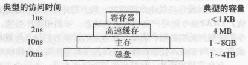
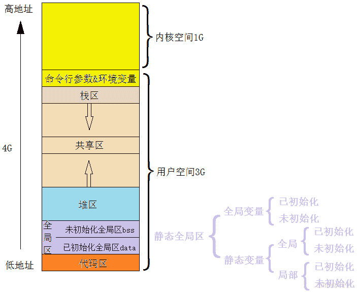

# 第二章 第 2 节 C++操作系统-2

> 原文：[`www.nowcoder.com/tutorial/10069/ce0f430880d14f03a7cf934ff3ec86b8`](https://www.nowcoder.com/tutorial/10069/ce0f430880d14f03a7cf934ff3ec86b8)

### 2.9 说说进程调度算法有哪些？

**参考回答**

1.  先来先服务调度算法
2.  短作业(进程)优先调度算法
3.  高优先级优先调度算法
4.  时间片轮转法
5.  多级反馈队列调度算法

**答案解析**

1.  先来先服务调度算法：每次调度都是从后备作业（进程）队列中选择一个或多个最先进入该队列的作业（进程），将它们调入内存，为它们分配资源、创建进程，然后放入就绪队列。
2.  短作业(进程)优先调度算法：短作业优先(SJF)的调度算法是从后备队列中选择一个或若干个估计运行时间最短的作业（进程），将它们调入内存运行。
3.  高优先级优先调度算法：当把该算法用于作业调度时，系统将从后备队列中选择若干个优先权最高的作业装入内存。当用于进程调度时，该算法是把处理机分配给就绪队列中优先权最高的进程
4.  时间片轮转法：每次调度时，把 CPU 分配给队首进程，并令其执行一个时间片。时间片的大小从几 ms 到几百 ms。当执行的时间片用完时，由一个计时器发出时钟中断请求，调度程序便据此信号来停止该进程的执行，并将它送往就绪队列的末尾；然后，再把处理机分配给就绪队列中新的队首进程，同时也让它执行一个时间片。
5.  多级反馈队列调度算法：综合前面多种调度算法。

在这些调度算法中，有抢占式和非抢占式的区别。

1.  非抢占式优先权算法
    在这种方式下，系统一旦把处理机分配给就绪队列中优先权最高的进程后，该进程便一直执行下去，直至完成；或因发生某事件使该进程放弃处理机时，系统方可再将处理机重新分配给另一优先权最高的进程。这种调度算法主要用于批处理系统中；也可用于某些对实时性要求不严的实时系统中。
2.  抢占式优先权调度算法
    在这种方式下，系统同样是把处理机分配给优先权最高的进程，使之执行。但在其执行期间，只要又出现了另一个其优先权更高的进程，进程调度程序就立即停止当前进程(原优先权最高的进程)的执行，重新将处理机分配给新到的优先权最高的进程。因此，在采用这种调度算法时，是每当系统中出现一个新的就绪进程 i 时，就将其优先权 Pi 与正在执行的进程 j 的优先权 Pj 进行比较。如果 Pi≤Pj，原进程 Pj 便继续执行；但如果是 Pi>Pj，则立即停止 Pj 的执行，做进程切换，使 i 进程投入执行。显然，这种抢占式的优先权调度算法能更好地满足紧迫作业的要求，故而常用于要求比较严格的实时系统中，以及对性能要求较高的批处理和分时系统中。

区别：

非抢占式（Nonpreemptive）：让进程运行直到结束或阻塞的调度方式，容易实现，适合专用系统，不适合通用系统。
抢占式（Preemptive）：允许将逻辑上可继续运行的在运行过程暂停的调度方式可防止单一进程长时间独占，CPU 系统开销大（降低途径：硬件实现进程切换，或扩充主存以贮存大部分程序）

### 2.10 简述操作系统如何申请以及管理内存的？

**参考回答**

**操作系统如何管理内存：**

1.  **物理内存**：物理内存有四个层次，分别是寄存器、高速缓存、主存、磁盘。

    寄存器：速度最快、量少、价格贵。

    高速缓存：次之。

    主存：再次之。

    磁盘：速度最慢、量多、价格便宜。

    

    操作系统会对物理内存进行管理，有一个部分称为**内存管理器(memory manager)**，它的主要工作是有效的管理内存，记录哪些内存是正在使用的，在进程需要时分配内存以及在进程完成时回收内存。

2.  **虚拟内存**：操作系统为每一个进程分配一个独立的地址空间，但是虚拟内存。虚拟内存与物理内存存在映射关系，通过页表寻址完成虚拟地址和物理地址的转换。

**操作系统如何申请内存：**

从操作系统角度来看，进程分配内存有两种方式，分别由两个系统调用完成：**brk 和 mmap*

### 2.11 简述 Linux 系统态与用户态，什么时候会进入系统态？

**参考回答**

1.  **内核态与用户态**：**内核态**（系统态）与**用户态**是操作系统的两种运行级别。内核态拥有最高权限，可以访问所有系统指令；用户态则只能访问一部分指令。

2.  **什么时候进入内核态**：共有三种方式：a、**系统调用**。b、**异常**。c、**设备中断**。其中，系统调用是主动的，另外两种是被动的。

3.  **为什么区分内核态与用户态**：在 CPU 的所有指令中，有一些指令是非常危险的，如果错用，将导致整个系统崩溃。比如：清内存、设置时钟等。所以区分内核态与用户态主要是出于安全的考虑。

### 2.12 简述 LRU 算法及其实现方式。

**参考回答**

1.  **LRU 算法**：LRU 算法用于缓存淘汰。思路是将缓存中最近最少使用的对象删除掉

2.  **实现方式**：利用**链表和 hashmap**。

    当需要插入新的数据项的时候，如果新数据项在链表中存在（一般称为命中），则把该节点移到链表头部，如果不存在，则新建一个节点，放到链表头部，若缓存满了，则把链表最后一个节点删除即可。

    在访问数据的时候，如果数据项在链表中存在，则把该节点移到链表头部，否则返回-1。这样一来在链表尾部的节点就是最近最久未访问的数据项。

**答案解析**

给出 C++实现的代码

```cpp
class LRUCache {
    list<pair<int, int>> cache;//创建双向链表
    unordered_map<int, list<pair<int, int>>::iterator> map;//创建哈希表
    int cap;
public:
    LRUCache(int capacity) {
        cap = capacity;
    }

    int get(int key) {
        if (map.count(key) > 0){
            auto temp = *map[key];
            cache.erase(map[key]);
            map.erase(key);
            cache.push_front(temp);
            map[key] = cache.begin();//映射头部
            return temp.second;
        }
        return -1;
    }

    void put(int key, int value) {
        if (map.count(key) > 0){
            cache.erase(map[key]);
            map.erase(key);
        }
        else if (cap == cache.size()){
            auto temp = cache.back();
            map.erase(temp.first);
            cache.pop_back();
        }
        cache.push_front(pair<int, int>(key, value));
        map[key] = cache.begin();//映射头部
    }
};

/**
 * Your LRUCache object will be instantiated and called as such:
 * LRUCache* obj = new LRUCache(capacity);
 * int param_1 = obj->get(key);
 * obj->put(key,value);
 */
```

### 2.13 一个线程占多大内存？

**参考回答**

一个 linux 的线程大概占 8M 内存。

**答案解析**

linux 的栈是通过缺页来分配内存的，不是所有栈地址空间都分配了内存。因此，8M 是最大消耗，实际的内存消耗只会略大于实际需要的内存(内部损耗，每个在 4k 以内)。

### 2.14 什么是页表，为什么要有？

**参考回答**

页表是虚拟内存的概念。**操作系统虚拟内存到物理内存的映射表，就被称为页表。**

**原因**：不可能每一个虚拟内存的 Byte 都对应到物理内存的地址。这张表将大得真正的物理地址也放不下，于是操作系统引入了页（Page）的概念。进行分页，这样可以减小虚拟内存页对应物理内存页的映射表大小。

**答案解析**

如果将每一个虚拟内存的 Byte 都对应到物理内存的地址，每个条目最少需要 8 字节（32 位虚拟地址->32 位物理地址），在 4G 内存的情况下，就需要 32GB 的空间来存放对照表，那么这张表就大得真正的物理地址也放不下了，于是操作系统引入了页（Page）的概念。

在系统启动时，操作系统将整个物理内存以 4K 为单位，划分为各个页。之后进行内存分配时，都以页为单位，那么虚拟内存页对应物理内存页的映射表就大大减小了，4G 内存，只需要 8M 的映射表即可，一些进程没有使用到的虚拟内存，也并不需要保存映射关系，而且 Linux 还为大内存设计了多级页表，可以进一页减少了内存消耗。

### 2.15 简述操作系统中的缺页中断。

**参考回答**

1.  **缺页异常**：malloc 和 mmap 函数在分配内存时只是建立了进程虚拟地址空间，并没有分配虚拟内存对应的物理内存。当进程访问这些没有建立映射关系的虚拟内存时，处理器自动触发一个**缺页异常，引发缺页中断**。

2.  **缺页中断**：缺页异常后将产生一个缺页中断，此时操作系统会根据页表中的**外存地址**在外存中找到所缺的一页，将其调入**内存**。

**答案解析**

两者区别。

缺页中断与一般中断一样，需要经历四个步骤：保护 CPU 现场、分析中断原因、转入缺页中断处理程序、恢复 CPU 现场，继续执行。
缺页中断与一般中断区别：
（1）在指令执行期间产生和处理缺页中断信号
（2）一条指令在执行期间，可能产生多次缺页中断
（3）缺页中断返回的是执行产生中断的一条指令，而一般中断返回的是执行下一条指令。

### 2.16 说说虚拟内存分布，什么时候会由用户态陷入内核态？

**参考回答**

1.  **虚拟内存分布**：



​ **用户空间**：

​ （1）**代码段.text：**存放程序执行代码的一块内存区域。只读，代码段的头部还会包含一些只读的常数变量。

​ （2）**数据段.data：**存放程序中已初始化的全局变量和静态变量的一块内存区域。

​ （3）**BSS 段.bss**：存放程序中未初始化的全局变量和静态变量的一块内存区域。

​ （4）可执行程序在运行时又会多出两个区域：**堆区和栈区**。

​ **堆区：**动态申请内存用。堆从低地址向高地址增长。

​ **栈区：**存储局部变量、函数参数值。栈从高地址向低地址增长。是一块连续的空间。

​ （5）最后还有一个**文件映射区**，位于堆和栈之间。

​ **内核空间**：DMA 区、常规区、高位区。

2.  **什么时候进入内核态**：共有三种方式：a、**系统调用**。b、**异常**。c、**设备中断**。其中，系统调用是主动的，另外两种是被动的。

### 2.17 简述一下虚拟内存和物理内存，为什么要用虚拟内存，好处是什么？

**参考回答**

1.  **物理内存**：物理内存有四个层次，分别是寄存器、高速缓存、主存、磁盘。

    寄存器：速度最快、量少、价格贵。

    高速缓存：次之。

    主存：再次之。

    磁盘：速度最慢、量多、价格便宜。

    

    操作系统会对物理内存进行管理，有一个部分称为**内存管理器(memory manager)**，它的主要工作是有效的管理内存，记录哪些内存是正在使用的，在进程需要时分配内存以及在进程完成时回收内存。

2.  **虚拟内存**：操作系统为每一个进程分配一个独立的地址空间，但是虚拟内存。虚拟内存与物理内存存在映射关系，通过页表寻址完成虚拟地址和物理地址的转换。

3.  **为什么要用虚拟内存**：因为早期的内存分配方法存在以下问题：

    （1）进程地址空间不隔离。会导致数据被随意修改。

    （2）内存使用效率低。

    （3）程序运行的地址不确定。操作系统随机为进程分配内存空间，所以程序运行的地址是不确定的。

4.  **使用虚拟内存的好处**：

    （1）扩大地址空间。每个进程独占一个 4G 空间，虽然真实物理内存没那么多。

    （2）内存保护：防止不同进程对物理内存的争夺和践踏，可以对特定内存地址提供写保护，防止恶意篡改。

    （3）可以实现内存共享，方便进程通信。

    （4）可以避免内存碎片，虽然物理内存可能不连续，但映射到虚拟内存上可以连续。

5.  **使用虚拟内存的缺点**：

    （1）虚拟内存需要额外构建数据结构，占用空间。

    （2）虚拟地址到物理地址的转换，增加了执行时间。

    （3）页面换入换出耗时。

    （4）一页如果只有一部分数据，浪费内存。

### 2.18 虚拟地址到物理地址怎么映射的？

**参考回答**

**操作系统为每一个进程维护了一个从虚拟地址到物理地址的映射关系的数据结构，叫页表。**页表中的每一项都记录了这个页的基地址。

**三级页表转换方法：（两步）**

1.  逻辑地址转线性地址：段起始地址+段内偏移地址=线性地址

2.  线性地址转物理地址：

    （1）每一个 32 位的线性地址被划分为三部分：页目录索引（DIRECTORY，10 位）、页表索引（TABLE，10 位）、页内偏移（OFFSET，12 位）
    （2）从**cr3**中取出进程的页目录地址（操作系统调用进程时，这个地址被装入寄存器中）

    ```cpp
        页目录地址 + 页目录索引 = 页表地址
        页表地址 + 页表索引 = 页地址
        页地址 + 页内偏移 = 物理地址
    ```


​ 按照以上两步法，就完成了一个三级页表从虚拟地址到物理地址的转换。

### 2.19 说说堆栈溢出是什么，会怎么样？

**参考回答**

堆栈溢出就是不顾堆栈中分配的局部数据块大小，向该数据块写入了过多的数据，导致数据越界。常指调用堆栈溢出，本质上一种数据结构的满溢情况。堆栈溢出可以理解为两个方面：**堆溢出和栈溢出。**

1.  堆溢出：比如不断的 new 一个对象，一直创建新的对象，而不进行释放，最终导致内存不足。将会报错：OutOfMemory Error。
2.  栈溢出：一次函数调用中，栈中将被依次压入：参数，返回地址等，而方法如果递归比较深或进去死循环，就会导致栈溢出。将会报错：StackOverflow Error。

### 2.20 简述操作系统中 malloc 的实现原理

**参考回答**

**malloc 底层实现：**当开辟的空间小于 128K 时，调用 brk（）函数；当开辟的空间大于 128K 时，调用 mmap（）。malloc 采用的是内存池的管理方式，以减少内存碎片。先申请大块内存作为堆区，然后将堆区分为多个内存块。当用户申请内存时，直接从堆区分配一块合适的空闲快。采用隐式链表将所有空闲块，每一个空闲块记录了一个未分配的、连续的内存地址。

### 2.21 说说进程空间从高位到低位都有些什么？

**参考回答**


如上图，**从高地址到低地址，一个程序由命令行参数和环境变量、栈、文件映射区、堆、BSS 段、数据段、代码段组成。**

1.  **命令行参数和环境变量**
2.  **栈区：**存储局部变量、函数参数值。栈从高地址向低地址增长。是一块连续的空间。
3.  **文件映射区**，位于堆和栈之间。
4.  **堆区：**动态申请内存用。堆从低地址向高地址增长。
5.  **BSS 段**：存放程序中未初始化的全局变量和静态变量的一块内存区域。
6.  **数据段**：存放程序中已初始化的全局变量和静态变量的一块内存区域。
7.  **代码段：**存放程序执行代码的一块内存区域。只读，代码段的头部还会包含一些只读的常数变量。