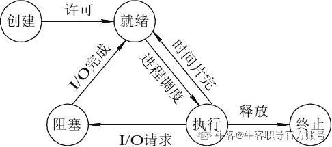
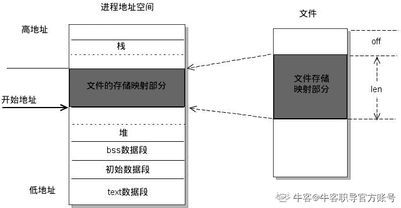
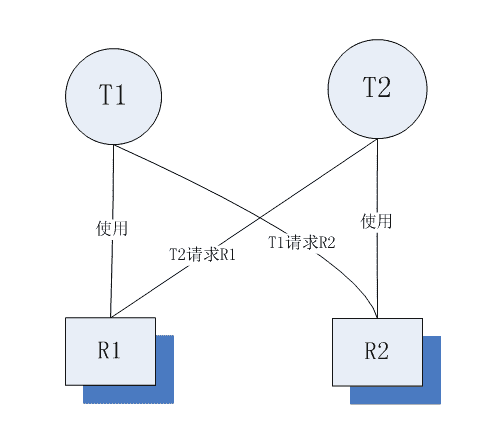

# 第二章 第 4 节 C++操作系统-4

> 原文：[`www.nowcoder.com/tutorial/10069/fe6f93e6343f4871928d0031a2424ead`](https://www.nowcoder.com/tutorial/10069/fe6f93e6343f4871928d0031a2424ead)

### 2.31 说说进程有多少种状态？

**参考回答**

进程有五种状态：**创建、就绪、执行、阻塞、终止**。一个进程创建后，被放入队列处于就绪状态，等待操作系统调度执行，执行过程中可能切换到阻塞状态（并发），任务完成后，进程销毁终止。

**答案解析**

**创建状态**
一个应用程序从系统上启动，首先就是进入**创建状态**，需要获取系统资源创建进程管理块（PCB：Process Control Block）完成资源分配。

**就绪状态**
在**创建状态**完成之后，进程已经准备好，处于**就绪状态**，但是还未获得处理器资源，无法运行。

**运行状态**
获取处理器资源，被系统调度，**当具有时间片**开始进入**运行状态**。如果进程的时间片用完了就进入**就绪状态**。

**阻塞状态**
在**运行状态**期间，如果进行了阻塞的操作，如耗时的 I/O 操作，此时进程暂时无法操作就进入到了**阻塞状态**，在这些操作完成后就进入**就绪状态**。等待再次获取处理器资源，被系统调度，**当具有时间片**就进入**运行状态**。

**终止状态**
进程结束或者被系统终止，进入**终止状态**

**相互转换如图**：


### 2.32 进程通信中的管道实现原理是什么？

**参考回答**

操作系统在内核中开辟一块**缓冲区**（称为**管道**）用于通信。**管道**是一种两个进程间进行**单向通信**的机制。因为这种单向性，管道又称为半双工管道，所以其使用是有一定的局限性的。半双工是指数据只能由一个进程流向另一个进程（一个管道负责读，一个管道负责写）；如果是全双工通信，需要建立两个管道。管道分为无名管道和命名管道，无名管道只能用于具有亲缘关系的进程直接的通信（父子进程或者兄弟进程），可以看作一种特殊的文件，**管道本质是一种文件**；命名管道可以允许无亲缘关系进程间的通信。

管道原型如下：

```cpp
＃include <unistd.h>  
int pipe(int fd[2]);  
```

pipe()函数创建的管道处于一个进程中间，因此一个进程在由 pipe()创建管道后，一般再使用 fork() 建立一个子进程，然后通过管道实现父子进程间的通信。管道两端可分别用描述字 fd[0]以及 fd[1]来描述。注意管道的两端的任务是固定的，即一端只能用于读，由描述字 fd[0]表示，称其为管道读端；另 一端则只能用于写，由描述字 fd[1]来表示，称其为管道写端。如果试图从管道写端读取数据，或者向管道读端写入数据都将发生错误。一般文件的 I/O 函数都可以用于管道，如 close()、read()、write()等。

**具体步骤**如下：

1.  父进程调用 pipe 开辟管道,得到两个文件描述符指向管道的两端。
2.  父进程调用 fork 创建子进程,那么子进程也有两个文件描述符指向同一管道。
3.  父进程关闭管道读端,子进程关闭管道写端。父进程可以往管道里写,子进程可以从管道里读,管道是用环形队列实现的,数据从写端流入从读端流出,这样就实现了进程间通信。

**答案解析**

给出实现的代码，实现父子进程间的管道通信

```cpp
#include<unistd.h>    
#include<stdio.h>    
#include<stdlib.h>    
#include<string.h>    
#define INPUT  0     
#define OUTPUT 1    

int main(){    
    //创建管道    
    int fd[2];    
    pipe(fd);    
    //创建子进程    
    pid_t pid = fork();    
    if (pid < 0){    
        printf("fork error!\n");    
        exit(-1);    
    }    
    else if (pid == 0){//执行子进程  
        printf("Child process is starting...\n");  
        //子进程向父进程写数据，关闭管道的读端   
        close(fd[INPUT]);  
        write(fd[OUTPUT], "hello douya!", strlen("hello douya!"));  
        exit(0);  
    }  
    else{//执行父进程  
        printf ("Parent process is starting......\n");  
        //父进程从管道读取子进程写的数据 ，关闭管道的写端    
        close(fd[OUTPUT]);    
        char buf[255];  
        int output = read(fd[INPUT], buf, sizeof(buf));  
        printf("%d bytes of data from child process: %s\n", output, buf);  
    }  
    return 0;    
}   
```

### 2.33 简述 mmap 的原理和使用场景

**参考回答**

**原理**：**mmap 是一种内存映射文件的方法**，即将一个文件或者其它对象映射到进程的地址空间，实现文件磁盘地址和进程虚拟地址空间中一段虚拟地址的一一对映关系。实现这样的映射关系后，进程就可以采用指针的方式读写操作这一段内存，而系统会自动回写脏页面到对应的文件磁盘上，即完成了对文件的操作而不必再调用 read, write 等系统调用函数。相反，内核空间对这段区域的修改也直接反映用户空间，从而可以实现不同进程间的文件共享。如下图：


**使用场景**：

1.  对同一块区域频繁读写操作；
2.  可用于实现用户空间和内核空间的高效交互
3.  可提供进程间共享内存及相互通信
4.  可实现高效的大规模数据传输。

### 2.34 互斥量能不能在进程中使用？

**参考回答**

**能**。

不同的进程之间，存在资源竞争或并发使用的问题，所以需要**互斥量**。

进程中也需要**互斥量**，因为一个进程中可以包含多个线程，线程与线程之间需要通过互斥的手段进行同步，避免导致共享数据修改引起冲突。可以使用**互斥锁**，属于互斥量的一种。

### 2.35 协程是轻量级线程，轻量级表现在哪里？

**参考回答**

1.  **协程调用跟切换比线程效率高**：协程执行效率极高。协程不需要多线程的锁机制，可以不加锁的访问全局变量，所以上下文的切换非常快。
2.  **协程占用内存少**：执行协程只需要极少的栈内存（大概是 4～5KB），而默认情况下，线程栈的大小为 1MB。
3.  **切换开销更少**：协程直接操作栈基本没有内核切换的开销，所以切换开销比线程少。

### 2.36 说说常见信号有哪些，表示什么含义？

**参考回答**

编号为 1 ~ 31 的信号为传统 UNIX 支持的信号，是不可靠信号(非实时的)。不可靠信号和可靠信号的区别在于前者不支持排队，可能会造成信号丢失，而后者不会。编号为 1 ~ 31 的信号如下：

| 信号代号 | 信号名称 | 说 明 |
| --- | --- | --- |
| 1 | SIGHUP | 该信号让进程立即关闭.然后重新读取配置文件之后重启 |
| 2 | SIGINT | 程序中止信号，用于中止前台进程。相当于输出 Ctrl+C 快捷键 |
| 3 | SIGQUIT | 和 SIGINT 类似, 但由 QUIT 字符(通常是 Ctrl-/)来控制. 进程在因收到 SIGQUIT 退出时会产生 core 文件, 在这个意义上类似于一个程序错误信号。 |
| 4 | SIGILL | 执行了非法指令. 通常是因为可执行文件本身出现错误, 或者试图执行数据段. 堆栈溢出时也有可能产生这个信号。 |
| 5 | SIGTRAP | 由断点指令或其它 trap 指令产生. 由 debugger 使用。 |
| 6 | SIGABRT | 调用 abort 函数生成的信号。 |
| 7 | SIGBUS | 非法地址, 包括内存地址对齐(alignment)出错。 |
| 8 | SIGFPE | 在发生致命的算术运算错误时发出。不仅包括浮点运算错误，还包括溢出及除数为 0 等其他所有的算术运算错误 |
| 9 | SIGKILL | 用来立即结束程序的运行。本信号不能被阻塞、处理和忽略。般用于强制中止进程 |
| 10 | SIGUSR1 | 留给用户使用 |
| 11 | SIGSEGV | 试图访问未分配给自己的内存, 或试图往没有写权限的内存地址写数据. |
| 12 | SIGUSR2 | 留给用户使用 |
| 13 | SIGPIPE | 管道破裂。这个信号通常在进程间通信产生，比如采用 FIFO(管道)通信的两个进程，读管道没打开或者意外终止就往管道写，写进程会收到 SIGPIPE 信号。 |
| 14 | SIGALRM | 时钟定时信号，计算的是实际的时间或时钟时间。alarm 函数使用该信号 |
| 15 | SIGTERM | 正常结束进程的信号，kill 命令的默认信号。如果进程已经发生了问题，那么这 个信号是无法正常中止进程的，这时我们才会尝试 SIGKILL 信号，也就是信号 9 |
| 17 | SIGCHLD | 子进程结束时, 父进程会收到这个信号。 |
| 18 | SIGCONT | 该信号可以让暂停的进程恢复执行。本信号不能被阻断 |
| 19 | SIGSTOP | 该信号可以暂停前台进程，相当于输入 Ctrl+Z 快捷键。本信号不能被阻断 |
| 20 | SIGTSTP | 停止进程的运行, 但该信号可以被处理和忽略. 用户键入 SUSP 字符时(通常是 Ctrl-Z)发出这个信号 |
| 21 | SIGTTIN | 当后台作业要从用户终端读数据时, 该作业中的所有进程会收到 SIGTTIN 信号. 缺省时这些进程会停止执行. |
| 22 | SIGTTOU | 类似于 SIGTTIN, 但在写终端(或修改终端模式)时收到. |
| 23 | SIGURG | 有"紧急"数据或 out-of-band 数据到达 socket 时产生. |
| 24 | SIGXCPU | 超过 CPU 时间资源限制. 这个限制可以由 getrlimit/setrlimit 来读取/改变。 |
| 25 | SIGXFSZ | 当进程企图扩大文件以至于超过文件大小资源限制。 |
| 26 | SIGVTALRM | 虚拟时钟信号. 类似于 SIGALRM, 但是计算的是该进程占用的 CPU 时间. |
| 27 | SIGPROF | 类似于 SIGALRM/SIGVTALRM, 但包括该进程用的 CPU 时间以及系统调用的时间. |
| 28 | SIGWINCH | 窗口大小改变时发出. |
| 29 | SIGIO | 文件描述符准备就绪, 可以开始进行输入/输出操作. |
| 30 | SIGPWR | Power failure |
| 31 | SIGSYS | 非法的系统调用。 |

**而常见信号如下**：

| 信号代号 | 信号名称 | 说 明 |
| --- | --- | --- |
| 1 | SIGHUP | 该信号让进程立即关闭.然后重新读取配置文件之后重启 |
| 2 | SIGINT | 程序中止信号，用于中止前台进程。相当于输出 Ctrl+C 快捷键 |
| 8 | SIGFPE | 在发生致命的算术运算错误时发出。不仅包括浮点运算错误，还包括溢出及除数为 0 等其他所有的算术运算错误 |
| 9 | SIGKILL | 用来立即结束程序的运行。本信号不能被阻塞、处理和忽略。般用于强制中止进程 |
| 14 | SIGALRM | 时钟定时信号，计算的是实际的时间或时钟时间。alarm 函数使用该信号 |
| 15 | SIGTERM | 正常结束进程的信号，kill 命令的默认信号。如果进程已经发生了问题，那么这 个信号是无法正常中止进程的，这时我们才会尝试 SIGKILL 信号，也就是信号 9 |
| 17 | SIGCHLD | 子进程结束时, 父进程会收到这个信号。 |
| 18 | SIGCONT | 该信号可以让暂停的进程恢复执行。本信号不能被阻断 |
| 19 | SIGSTOP | 该信号可以暂停前台进程，相当于输入 Ctrl+Z 快捷键。本信号不能被阻断 |

其中最重要的就是 "1"、"9"、"15"、"17"这几个信号。

### 2.37 说说线程间通信的方式有哪些？

**参考回答**

线程间的通信方式包括**临界区、互斥量、信号量、条件变量、读写锁**：

1.  临界区：每个线程中访问临界资源的那段代码称为临界区（Critical Section）（临界资源是一次仅允许一个线程使用的共享资源）。每次只准许一个线程进入临界区，进入后不允许其他线程进入。不论是硬件临界资源，还是软件临界资源，多个线程必须互斥地对它进行访问。
2.  互斥量：采用互斥对象机制，只有拥有互斥对象的线程才可以访问。因为互斥对象只有一个，所以可以保证公共资源不会被多个线程同时访问。
3.  信号量：计数器，允许多个线程同时访问同一个资源。
4.  条件变量：通过条件变量通知操作的方式来保持多线程同步。
5.  读写锁：读写锁与互斥量类似。但互斥量要么是锁住状态，要么就是不加锁状态。读写锁一次只允许一个线程写，但允许一次多个线程读，这样效率就比互斥锁要高。

### 2.38 说说线程同步方式有哪些？

**参考回答**

线程间的同步方式包括**互斥锁、信号量、条件变量、读写锁**：

1.  **互斥锁**：采用互斥对象机制，只有拥有互斥对象的线程才可以访问。因为互斥对象只有一个，所以可以保证公共资源不会被多个线程同时访问。
2.  **信号量**：计数器，允许多个线程同时访问同一个资源。
3.  **条件变量**：通过条件变量通知操作的方式来保持多线程同步。
4.  **读写锁**：读写锁与互斥量类似。但互斥量要么是锁住状态，要么就是不加锁状态。读写锁一次只允许一个线程写，但允许一次多个线程读，这样效率就比互斥锁要高。

### 2.39 说说什么是死锁，产生的条件，如何解决？

**参考回答**

1.  **死锁**: 是指多个进程在执行过程中，因争夺资源而造成了互相等待。此时系统产生了死锁。比如两只羊过独木桥，若两只羊互不相让，争着过桥，就产生死锁。

2.  **产生的条件**：死锁发生有**四个必要条件**：
    （1）**互斥条件**：进程对所分配到的资源不允许其他进程访问，若其他进程访问，只能等待，直到进程使用完成后释放该资源；

    （2）**请求保持条件**：进程获得一定资源后，又对其他资源发出请求，但该资源被其他进程占有，此时请求阻塞，而且该进程不会释放自己已经占有的资源；

    （3）**不可剥夺条件**：进程已获得的资源，只能自己释放，不可剥夺；

    （4）**环路等待条件**：若干进程之间形成一种头尾相接的循环等待资源关系。

3.  **如何解决**：

    （1）资源一次性分配，从而解决请求保持的问题

    （2）可剥夺资源：当进程新的资源未得到满足时，释放已有的资源；

    （3）资源有序分配：资源按序号递增，进程请求按递增请求，释放则相反。

**答案解析**

举个例子，比如：如果此时有两个线程 T1 和 T2，它们分别占有 R1 和 R2 资源

此时，T1 请求 R2 资源的同时，T2 请求 R1 资源。

这个时候 T2 说：你把 R1 给我，我就给你 R2

T1 说：不行，你要先给我 R2，我才能给你 R1

那么就这样，死锁产生了。如下图：



### 2.40 有了进程，为什么还要有线程？

**参考回答**

1.  **原因**

    进程在早期的多任务操作系统中是基本的**执行单元**。每次进程切换，都要先保存进程资源然后再恢复，这称为上下文切换。**但是进程频繁切换将引起额外开销，从而严重影响系统的性能。**为了减少进程切换的开销，人们把两个任务放到一个进程中，每个任务用一个更小**粒度**的执行单元来实现并发执行，这就是**线程**。

2.  **线程与进程对比**

    （1）**进程间的信息难以共享。**由于除去只读代码段外，父子进程并未共享内存，因此必须采用一些进程间通信方式，在进程间进行信息交换。

    但**多个线程共享**进程的内存，如代码段、数据段、扩展段，线程间进行信息交换十分方便。

    （2）调用 fork() 来创建进程的代价相对较高，即便利用写时复制技术，仍然需要复制诸如内存页表和文件描述符表之类的多种进程属性，这意味着 fork() 调用在时间上的开销依然不菲。

    **但创建线程比创建进程通常要快 10 倍甚至更多。**线程间是共享虚拟地址空间的，无需采用写时复制来复制内存，也无需复制页表。