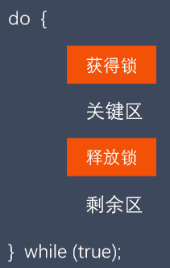
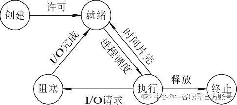
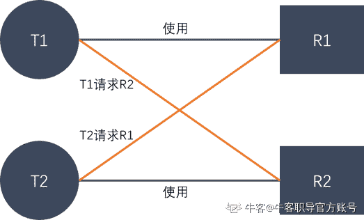

# 第二章 第 5 节 c++操作系统-5

> 原文：[`www.nowcoder.com/tutorial/10069/4d6c7e2ad88143b7bd44751310ddf53c`](https://www.nowcoder.com/tutorial/10069/4d6c7e2ad88143b7bd44751310ddf53c)

### 2.41 单核机器上写多线程程序，是否要考虑加锁，为什么？

**参考回答**

在单核机器上写多线程程序，仍然需要线程锁。

**原因**：因为线程锁通常用来实现线程的同步和通信。在单核机器上的多线程程序，仍然存在线程同步的问题。因为在抢占式操作系统中，通常为每个线程分配一个时间片，当某个线程时间片耗尽时，操作系统会将其挂起，然后运行另一个线程。如果这两个线程共享某些数据，**不使用线程锁的前提下，可能会导致共享数据修改引起冲突。**

### 2.42 说说多线程和多进程的不同？

**参考回答**

（1）一个线程从属于一个进程；一个进程可以包含多个线程。

（2）一个线程挂掉，对应的进程挂掉，多线程也挂掉；一个进程挂掉，不会影响其他进程，多进程稳定。

（3）进程系统开销显著大于线程开销；线程需要的系统资源更少。

（4）多个进程在执行时拥有各自独立的内存单元，多个线程共享进程的内存，如代码段、数据段、扩展段；但每个线程拥有自己的栈段和寄存器组。

（5）多进程切换时需要刷新 TLB 并获取新的地址空间，然后切换硬件上下文和内核栈；多线程切换时只需要切换硬件上下文和内核栈。

（6）通信方式不一样。

（7）多进程适应于多核、多机分布；多线程适用于多核

### 2.43 简述互斥锁的机制，互斥锁与读写的区别？

**参考回答**

1.  **互斥锁机制**：mutex，用于保证在任何时刻，都只能有一个线程访问该对象。当获取锁操作失败时，线程会进入睡眠，等待锁释放时被唤醒。

2.  **互斥锁和读写锁**：

    （1） 读写锁区分读者和写者，而互斥锁不区分

    （2）互斥锁同一时间只允许一个线程访问该对象，无论读写；读写锁同一时间内只允许一个写者，但是允许多个读者同时读对象。

**答案解析**

**原理详解**：

互斥锁其实就是一个 bool 型变量，为 true 时表示锁可获取，为 false 时表示已上锁。这里说的是**互斥锁**，其实是泛指 linux 中所有的锁机制。

我们采用互斥锁保护临界区，从而防止竞争条件。也就是说，一个线程在进入临界区时应得到锁；它在退出临界区时释放锁。函数 acquire() 获取锁，而函数 release() 释放锁，如图 ：


每个互斥锁有一个布尔变量 available，它的值表示锁是否可用。如果锁是可用的，那么调用 acquire() 会成功，并且锁不再可用。当一个线程试图获取不可用的锁时，它会阻塞，直到锁被释放。

按如下定义 acquire()：

```cpp
acquire() {
    while (!available);
    /* busy wait */
    available = false;
}
```

按如下定义 release()：

```cpp
release() {
    available = true;
}
```

### 2.44 说说什么是信号量，有什么作用？

**参考回答**

1.  **概念**：信号量本质上是一个计数器，用于多进程对共享数据对象的读取，它主要是用来保护共享资源（信号量也属于临界资源），使得资源在一个时刻只有一个进程独享。

2.  **原理**：由于信号量只能进行两种操作等待和发送信号，即 P(sv)和 V(sv)，具体的行为如下：

    （1）P(sv)操作：如果 sv 的值大于零，就给它减 1；如果它的值为零，就挂起该进程的执行（信号量的值为正，进程获得该资源的使用权，进程将信号量减 1，表示它使用了一个资源单位）。

    （2）V(sv)操作：如果有其他进程因等待 sv 而被挂起，就让它恢复运行，如果没有进程因等待 sv 而挂起，就给它加 1（若此时信号量的值为 0，则进程进入挂起状态，直到信号量的值大于 0，若进程被唤醒则返回至第一步）。

3.  **作用**：用于多进程对共享数据对象的读取，它主要是用来保护共享资源（信号量也属于临界资源），使得资源在一个时刻只有一个进程独享。

### 2.45 进程、线程的中断切换的过程是怎样的？

**参考回答**

上下文切换指的是内核（操作系统的核心）在 CPU 上对进程或者线程进行切换。

1.  **进程上下文切换**

    （1）保护被中断进程的处理器现场信息

    （2）修改被中断进程的进程控制块有关信息，如进程状态等

    （3）把被中断进程的进程控制块加入有关队列

    （4）选择下一个占有处理器运行的进程

    （5）根据被选中进程设置操作系统用到的地址转换和存储保护信息

    ​ **切换页目录以使用新的地址空间**

    ​ **切换内核栈和硬件上下文（包括分配的内存，数据段，堆栈段等）**

    （6）根据被选中进程恢复处理器现场

2.  **线程上下文切换**

    （1）保护被中断线程的处理器现场信息

    （2）修改被中断线程的线程控制块有关信息，如线程状态等

    （3）把被中断线程的线程控制块加入有关队列

    （4）选择下一个占有处理器运行的线程

    （5）根据被选中线程设置操作系统用到的存储保护信息

    ​ **切换内核栈和硬件上下文（切换堆栈，以及各寄存器）**

    （6）根据被选中线程恢复处理器现场

### 2.46 简述自旋锁和互斥锁的使用场景

**参考回答**

1.  **互斥锁**用于临界区持锁时间比较长的操作，比如下面这些情况都可以考虑

　　（1）临界区有 IO 操作

　　（2）临界区代码复杂或者循环量大

　　（3）临界区竞争非常激烈

　　（4）单核处理器

2.  **自旋锁就**主要用在临界区持锁时间非常短且 CPU 资源不紧张的情况下。

### 2.47 请你说说线程有哪些状态，相互之间怎么转换？

**参考回答**

类似进程，有以下五种状态：

1.  **新建状态(New)**

2.  **就绪状态(Runnable)**

3.  **运行状态(Running)**

4.  **阻塞状态(Blocked)**

5.  **死亡状态(Dead)**

**转换方式如下**：

**创建状态**
一个应用程序从系统上启动，首先就是进入**创建状态**，获取系统资源。

**就绪状态**
在**创建状态**完成之后，线程已经准备好，处于**就绪状态**，但是还未获得处理器资源，无法运行。

**运行状态**
获取处理器资源，被系统调度，当具有时间片开始进入**运行状态**。如果线程的时间片用完了就进入**就绪状态**。

**阻塞状态**
在**运行状态**期间，如果进行了阻塞的操作，如耗时的 I/O 操作，此时线程暂时无法操作就进入到了**阻塞状态**，在这些操作完成后就进入**就绪状态**。等待再次获取处理器资源，被系统调度，当具有时间片就进入**运行状态**。

**终止状态**
线程结束或者被系统终止，进入**终止状态**

相互转换如图：


### 2.48 多线程和单线程有什么区别，多线程编程要注意什么，多线程加锁需要注意什么？

**参考回答**

1.  **区别**：

    （1）多线程从属于一个进程，单线程也从属于一个进程；一个线程挂掉都会导致从属的进程挂掉。

    （2）一个进程里有多个线程，可以并发执行多个任务；一个进程里只有一个线程，就只能执行一个任务。

    （3）多线程并发执行多任务，需要切换内核栈与硬件上下文，有切换的开销；单线程不需要切换，没有切换的开销。

    （4）多线程并发执行多任务，需要考虑同步的问题；单线程不需要考虑同步的问题。

2.  多线程编程需要考虑**同步**的问题。线程间的同步方式包括**互斥锁、信号量、条件变量、读写锁**。

3.  多线程加锁，主要需要注意**死锁**的问题。破坏死锁的必要条件从而避免死锁。

**答案解析**

1.  **死锁**: 是指多个进程在执行过程中，因争夺资源而造成了互相等待。此时系统产生了死锁。比如两只羊过独木桥，若两只羊互不相让，争着过桥，就产生死锁。

2.  **产生的条件**：死锁发生有**四个必要条件**：
    （1）**互斥条件**：进程对所分配到的资源不允许其他进程访问，若其他进程访问，只能等待，直到进程使用完成后释放该资源；

    （2）**请求保持条件**：进程获得一定资源后，又对其他资源发出请求，但该资源被其他进程占有，此时请求阻塞，而且该进程不会释放自己已经占有的资源；

    （3）**不可剥夺条件**：进程已获得的资源，只能自己释放，不可剥夺；

    （4）**环路等待条件**：若干进程之间形成一种头尾相接的循环等待资源关系。

3.  **如何解决**：

    （1）资源一次性分配，从而解决请求保持的问题

    （2）可剥夺资源：当进程新的资源未得到满足时，释放已有的资源；

    （3）资源有序分配：资源按序号递增，进程请求按递增请求，释放则相反。

**答案解析**

举个例子，比如：如果此时有两个线程 T1 和 T2，它们分别占有 R1 和 R2 资源

此时，T1 请求 R2 资源的同时，T2 请求 R1 资源。

这个时候 T2 说：你把 R1 给我，我就给你 R2

T1 说：不行，你要先给我 R2，我才能给你 R1

那么就这样，死锁产生了。如下图：


### 2.49 说说 sleep 和 wait 的区别？

**参考回答**

1.  **sleep**

    sleep 是一个延时函数，让进程或线程进入休眠。休眠完毕后继续运行。

    在 linux 下面，sleep 函数的参数是秒，而 windows 下面 sleep 的函数参数是毫秒。

    windows 下面 sleep 的函数参数是毫秒。

    例如：

    ```cpp
    #include <windows.h>// 首先应该先导入头文件
    Sleep (500) ; //注意第一个字母是大写。
    //就是到这里停半秒，然后继续向下执行。
    ```

    在 Linux C 语言中 sleep 的单位是秒

    例如：

    ```cpp
    #include <unistd.h>// 首先应该先导入头文件
    sleep(5); //停 5 秒
    //就是到这里停 5 秒，然后继续向下执行。
    ```

2.  **wait**

    wait 是父进程回收子进程 PCB 资源的一个系统调用。进程一旦调用了 wait 函数，就立即阻塞自己本身，然后由 wait 函数自动分析当前进程的某个子进程是否已经退出，当找到一个已经变成僵尸的子进程，wait 就会收集这个子进程的信息，并把它彻底销毁后返回；如果没有找到这样一个子进程，wait 就会一直阻塞，直到有一个出现为止。函数原型如下：

    ```cpp
    #include<sys/types.h>  
    #include<sys/wait.h>  

    pid_t wait(int* status);  
    ```

    子进程的结束状态值会由参数 status 返回，而子进程的进程识别码也会一起返回。如果不需要结束状态值，则参数 status 可以设成 NULL。

3.  **区别**：
    （1）sleep 是一个延时函数，让进程或线程进入休眠。休眠完毕后继续运行。

    （2）wait 是父进程回收子进程 PCB（Process Control Block）资源的一个系统调用。

### 2.50 说说线程池的设计思路，线程池中线程的数量由什么确定？

**参考回答**

1.  **设计思路**：

    实现线程池有以下几个步骤：
    （1）设置一个生产者消费者队列，作为临界资源。

    （2）初始化 n 个线程，并让其运行起来，加锁去队列里取任务运行

    （3）当任务队列为空时，所有线程阻塞。

    （4）当生产者队列来了一个任务后，先对队列加锁，把任务挂到队列上，然后使用条件变量去通知阻塞中的一个线程来处理。

2.  **线程池中线程数量**：

    线程数量和哪些因素有关：CPU，IO、并行、并发

    ```cpp
    如果是 CPU 密集型应用，则线程池大小设置为：CPU 数目+1
    如果是 IO 密集型应用，则线程池大小设置为：2*CPU 数目+1
    最佳线程数目 = （线程等待时间与线程 CPU 时间之比 + 1）* CPU 数目
    ```

    所以线程等待时间所占比例越高，需要越多线程。线程 CPU 时间所占比例越高，需要越少线程。

**答案解析**

1.  **为什么要创建线程池**：

    创建线程和销毁线程的花销是比较大的，这些时间有可能比处理业务的时间还要长。这样频繁的创建线程和销毁线程，再加上业务工作线程，消耗系统资源的时间，可能导致系统资源不足。**同时线程池也是为了提升系统效率。**

2.  **线程池的核心线程与普通线程：**

    任务队列可以存放 100 个任务，此时为空，线程池里有 10 个核心线程，若突然来了 10 个任务，那么刚好 10 个核心线程直接处理；若又来了 90 个任务，此时核心线程来不及处理，那么有 80 个任务先入队列，再创建核心线程处理任务；若又来了 120 个任务，此时任务队列已满，不得已，就得创建 20 个普通线程来处理多余的任务。
    **以上是线程池的工作流程。**