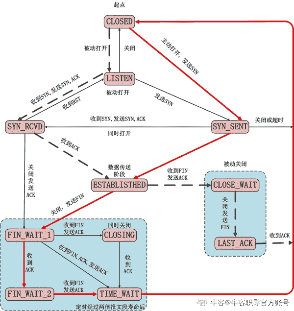

# 第三章 第 2 节 c++计算机网络-2

> 原文：[`www.nowcoder.com/tutorial/10069/14833e2f14f34643b2e98b6f0f223d79`](https://www.nowcoder.com/tutorial/10069/14833e2f14f34643b2e98b6f0f223d79)

### 3.8 简述 TCP 三次握手和四次挥手的过程

**参考回答**

#### 三次握手


1）第一次握手：建立连接时，客户端向服务器发送 SYN 包（seq=x），请求建立连接，等待确认

2）第二次握手：服务端收到客户端的 SYN 包，回一个 ACK 包（ACK=x+1）确认收到，同时发送一个 SYN 包（seq=y）给客户端

3）第三次握手：客户端收到 SYN+ACK 包，再回一个 ACK 包（ACK=y+1）告诉服务端已经收到

4）三次握手完成，成功建立连接，开始传输数据

#### 四次挥手


1）客户端发送 FIN 包（FIN=1）给服务端，告诉它自己的数据已经发送完毕，请求终止连接，此时客户端不发送数据，但还能接收数据

2）服务端收到 FIN 包，回一个 ACK 包给客户端告诉它已经收到包了，此时还没有断开 socket 连接，而是等待剩下的数据传输完毕

3）服务端等待数据传输完毕后，向客户端发送 FIN 包，表明可以断开连接

4）客户端收到后，回一个 ACK 包表明确认收到，等待一段时间，确保服务端不再有数据发过来，然后彻底断开连接

### 3.9 说说 TCP 2 次握手行不行？为什么要 3 次

**参考回答**

1.  为了实现可靠数据传输， TCP 协议的通信双方， 都必须维护一个序列号， 以标识发送出去的数据包中， 哪些是已经被对方收到的。 三次握手的过程即是通信双方相互告知序列号起始值， 并确认对方已经收到了序列号起始值的必经步骤

2.  如果只是两次握手， 至多只有连接发起方的起始序列号能被确认， 另一方选择的序列号则得不到确认

### 3.10 简述 TCP 和 UDP 的区别，它们的头部结构是什么样的

**参考回答**

1.  TCP 协议是有连接的，有连接的意思是开始传输实际数据之前 TCP 的客户端和服务器端必须通过三次握手建立连接，会话结束之后也要结束连接。而 UDP 是无连接的

    TCP 协议保证数据按序发送，按序到达，提供超时重传来保证可靠性，但是 UDP 不保证按序到达，甚至不保证到达，只是努力交付，即便是按序发送的序列，也不保证按序送到。

    TCP 协议所需资源多，TCP 首部需 20 个字节（不算可选项），UDP 首部字段只需 8 个字节。

    TCP 有流量控制和拥塞控制，UDP 没有，网络拥堵不会影响发送端的发送速率

    TCP 是一对一的连接，而 UDP 则可以支持一对一，多对多，一对多的通信。

    TCP 面向的是字节流的服务，UDP 面向的是报文的服务。

2.  TCP 头部结构如下：

    ```cpp
    /*TCP 头定义，共 20 个字节*/
    typedef struct _TCP_HEADER
    {
     short m_sSourPort;        　　　　　　// 源端口号 16bit
     short m_sDestPort;       　　　　　　 // 目的端口号 16bit
     unsigned int m_uiSequNum;       　　// 序列号 32bit
     unsigned int m_uiAcknowledgeNum;  // 确认号 32bit
     short m_sHeaderLenAndFlag;      　　// 前 4 位：TCP 头长度；中 6 位：保留；后 6 位：标志位
     short m_sWindowSize;       　　　　　// 窗口大小 16bit
     short m_sCheckSum;        　　　　　 // 检验和 16bit
     short m_surgentPointer;      　　　　 // 紧急数据偏移量 16bit
    }__attribute__((packed))TCP_HEADER, *PTCP_HEADER;
    ```

```cpp
/*TCP 头中的选项定义
kind(8bit)+Length(8bit，整个选项的长度，包含前两部分)+内容(如果有的话)
KIND = 1 表示 无操作 NOP，无后面的部分
  2 表示 maximum segment   后面的 LENGTH 就是 maximum segment 选项的长度（以 byte 为单位，1+1+内容部分长度）
  3 表示 windows scale     后面的 LENGTH 就是 windows scale 选项的长度（以 byte 为单位，1+1+内容部分长度）
  4 表示 SACK permitted    LENGTH 为 2，没有内容部分
  5 表示这是一个 SACK 包     LENGTH 为 2，没有内容部分
  8 表示时间戳，LENGTH 为 10，含 8 个字节的时间戳
*/

typedef struct _TCP_OPTIONS
{
 char m_ckind;
 char m_cLength;
 char m_cContext[32];
}__attribute__((packed))TCP_OPTIONS, *PTCP_OPTIONS;
```

UDP 头部结构如下：
```cppcpp
/*UDP 头定义，共 8 个字节*/

typedef struct _UDP_HEADER
{
 unsigned short m_usSourPort;    　　　// 源端口号 16bit
 unsigned short m_usDestPort;    　　　// 目的端口号 16bit
 unsigned short m_usLength;    　　　　// 数据包长度 16bit
 unsigned short m_usCheckSum;    　　// 校验和 16bit
}__attribute__((packed))UDP_HEADER, *PUDP_HEADER;

```
```cpp

### 3.11 简述 TCP 连接 和 关闭的具体步骤

**参考回答**

1.  TCP 通过三次握手建立链接


```
1）第一次握手：建立连接时，客户端向服务器发送 SYN 包（seq=x），请求建立连接，等待确认

2）第二次握手：服务端收到客户端的 SYN 包，回一个 ACK 包（ACK=x+1）确认收到，同时发送一个 SYN 包（seq=y）给客户端

3）第三次握手：客户端收到 SYN+ACK 包，再回一个 ACK 包（ACK=y+1）告诉服务端已经收到

4）三次握手完成，成功建立连接，开始传输数据
```cpp

2.  通过 4 次挥手关闭链接


```
1）客户端发送 FIN 包（FIN=1）给服务端，告诉它自己的数据已经发送完毕，请求终止连接，此时客户端不发送数据，但还能接收数据

2）服务端收到 FIN 包，回一个 ACK 包给客户端告诉它已经收到包了，此时还没有断开 socket 连接，而是等待剩下的数据传输完毕

3）服务端等待数据传输完毕后，向客户端发送 FIN 包，表明可以断开连接

4）客户端收到后，回一个 ACK 包表明确认收到，等待一段时间，确保服务端不再有数据发过来，然后彻底断开连接
```

### 3.12 简述 TCP 连接 和 关闭的状态转移

**参考回答**

状态转换如图所示：


上半部分是 TCP 三路握手过程的状态变迁，下半部分是 TCP 四次挥手过程的状态变迁。

1.  **CLOSED**：起始点，在超时或者连接关闭时候进入此状态，这并不是一个真正的状态，而是这个状态图的假想起点和终点。
2.  **LISTEN**：服务器端等待连接的状态。服务器经过 socket，bind，listen 函数之后进入此状态，开始监听客户端发过来的连接请求。此称为应用程序被动打开（等到客户端连接请求）。
3.  **SYN_SENT**：第一次握手发生阶段，客户端发起连接。客户端调用 connect，发送 SYN 给服务器端，然后进入 SYN_SENT 状态，等待服务器端确认（三次握手中的第二个报文）。如果服务器端不能连接，则直接进入 CLOSED 状态。
4.  **SYN_RCVD**：第二次握手发生阶段，跟 3 对应，这里是服务器端接收到了客户端的 SYN，此时服务器由 LISTEN 进入 SYN_RCVD 状态，同时服务器端回应一个 ACK，然后再发送一个 SYN 即 SYN+ACK 给客户端。状态图中还描绘了这样一种情况，当客户端在发送 SYN 的同时也收到服务器端的 SYN 请求，即两个同时发起连接请求，那么客户端就会从 SYN_SENT 转换到 SYN_REVD 状态。
5.  **ESTABLISHED**：第三次握手发生阶段，客户端接收到服务器端的 ACK 包（ACK，SYN）之后，也会发送一个 ACK 确认包，客户端进入 ESTABLISHED 状态，表明客户端这边已经准备好，但 TCP 需要两端都准备好才可以进行数据传输。服务器端收到客户端的 ACK 之后会从 SYN_RCVD 状态转移到 ESTABLISHED 状态，表明服务器端也准备好进行数据传输了。这样客户端和服务器端都是 ESTABLISHED 状态，就可以进行后面的数据传输了。所以 ESTABLISHED 也可以说是一个数据传送状态。

下面看看 TCP 四次挥手过程的状态变迁。

1.  **FIN_WAIT_1**：第一次挥手。主动关闭的一方（执行主动关闭的一方既可以是客户端，也可以是服务器端，这里以客户端执行主动关闭为例），终止连接时，发送 FIN 给对方，然后等待对方返回 ACK 。调用 close() 第一次挥手就进入此状态。
2.  **CLOSE_WAIT**：接收到 FIN 之后，被动关闭的一方进入此状态。具体动作是接收到 FIN，同时发送 ACK。之所以叫 CLOSE_WAIT 可以理解为被动关闭的一方此时正在等待上层应用程序发出关闭连接指令。TCP 关闭是全双工过程，这里客户端执行了主动关闭，被动方服务器端接收到 FIN 后也需要调用 close 关闭，这个 CLOSE_WAIT 就是处于这个状态，等待发送 FIN，发送了 FIN 则进入 LAST_ACK 状态。
3.  **FIN_WAIT_2**：主动端（这里是客户端）先执行主动关闭发送 FIN，然后接收到被动方返回的 ACK 后进入此状态。
4.  **LAST_ACK**：被动方（服务器端）发起关闭请求，由状态 2 进入此状态，具体动作是发送 FIN 给对方，同时在接收到 ACK 时进入 CLOSED 状态。
5.  **CLOSING**：两边同时发起关闭请求时（即主动方发送 FIN，等待被动方返回 ACK，同时被动方也发送了 FIN，主动方接收到了 FIN 之后，发送 ACK 给被动方），主动方会由 FIN_WAIT_1 进入此状态，等待被动方返回 ACK。
6.  **TIME_WAIT**：从状态变迁图会看到，四次挥手操作最后都会经过这样一个状态然后进入 CLOSED 状态。

**答案解析**

| ****状态**** | **描述** |
| --- | --- |
| **CLOSED** | 阻塞或关闭状态，表示主机当前没有正在传输或者建立的链接 |
| **LISTEN** | 监听状态，表示服务器做好准备，等待建立传输链接 |
| **SYN RECV** | 收到第一次的传输请求，还未进行确认 |
| **SYN SENT** | 发送完第一个 SYN 报文，等待收到确认 |
| **ESTABLISHED** | 链接正常建立之后进入数据传输阶段 |
| **FIN WAIT1** | 主动发送第一个 FIN 报文之后进入该状态 |
| **FIN WAIT2** | 已经收到第一个 FIN 的确认信号，等待对方发送关闭请求 |
| **TIMED WAIT** | 完成双向链接关闭，等待分组消失 |
| **CLOSING** | 双方同时关闭请求，等待对方确认时 |
| **CLOSE WAIT** | 收到对方的关闭请求并进行确认进入该状态 |
| **LAST ACK** | 等待最后一次确认关闭的报文 |

### 3.13 简述 TCP 慢启动

**参考回答**

1.  **慢启动**（Slow Start），是传输控制协议（TCP）使用的一种阻塞控制机制。慢启动也叫做指数增长期。慢启动是指每次 TCP 接收窗口收到确认时都会增长。增加的大小就是已确认段的数目。这种情况一直保持到要么没有收到一些段，要么窗口大小到达预先定义的阈值。如果发生丢失事件，TCP 就认为这是网络阻塞，就会采取措施减轻网络拥挤。一旦发生丢失事件或者到达阈值，TCP 就会进入线性增长阶段。这时，每经过一个 RTT 窗口增长一个段。

### 3.14 说说 TCP 如何保证有序

**参考回答**

*   主机每次发送数据时，TCP 就给每个数据包分配一个序列号并且在一个特定的时间内等待接收主机对分配的这个序列号进行确认，如果发送主机在一个特定时间内没有收到接收主机的确认，则发送主机会重传此数据包。接收主机利用序列号对接收的数据进行确认，以便检测对方发送的数据是否有丢失或者乱序等，接收主机一旦收到已经顺序化的数据，它就将这些数据按正确的顺序重组成数据流并传递到高层进行处理。

*   具体步骤如下：

    （1）为了保证数据包的可靠传递，发送方必须把已发送的数据包保留在缓冲区；

    （2）并为每个已发送的数据包启动一个超时定时器；

    （3）如在定时器超时之前收到了对方发来的应答信息（可能是对本包的应答，也可以是对本包后续包的应答），则释放该数据包占用的缓冲区;

    （4）否则，重传该数据包，直到收到应答或重传次数超过规定的最大次数为止。

    （5）接收方收到数据包后，先进行 CRC 校验，如果正确则把数据交给上层协议，然后给发送方发送一个累计应答包，表明该数据已收到，如果接收方正好也有数据要发给发送方，应答包也可方在数据包中捎带过去。

### 3.15 说说 TCP 常见的拥塞控制算法有哪些

**参考回答**

1.  TCP Tahoe/Reno

    最初的实现，包括慢启动、拥塞避免两个部分。基于重传超时（retransmission timeout/RTO）和重复确认为条件判断是否发生了丢包。两者的区别在于：Tahoe 算法下如果收到三次重复确认，就进入快重传立即重发丢失的数据包，同时将慢启动阈值设置为当前拥塞窗口的一半，将拥塞窗口设置为 1MSS，进入慢启动状态；而 Reno 算法如果收到三次重复确认，就进入快重传，但不进入慢启动状态，而是直接将拥塞窗口减半，进入拥塞控制阶段，这称为“快恢复”。

    而 Tahoe 和 Reno 算法在出现 RTO 时的措施一致，都是将拥塞窗口降为 1 个 MSS，然后进入慢启动阶段。

2.  TCP BBR（Bottleneck Bandwidth and Round-trip propagation time）

    BBR 是由 Google 设计，于 2016 年发布的拥塞算法。以往大部分拥塞算法是基于丢包来作为降低传输速率的信号，而 BBR 则基于模型主动探测。该算法使用网络最近出站数据分组当时的最大带宽和往返时间来建立网络的显式模型。数据包传输的每个累积或选择性确认用于生成记录在数据包传输过程和确认返回期间的时间内所传送数据量的采样率。该算法认为随着网络接口控制器逐渐进入千兆速度时，分组丢失不应该被认为是识别拥塞的主要决定因素，所以基于模型的拥塞控制算法能有更高的吞吐量和更低的延迟，可以用 BBR 来替代其他流行的拥塞算法，例如 CUBIC。

### 3.16 简述 TCP 超时重传

**参考回答**

TCP 可靠性中最重要的一个机制是处理数据超时和重传。TCP 协议要求在发送端每发送一个报文段，就启动一个定时器并等待确认信息；接收端成功接收新数据后返回确认信息。若在定时器超时前数据未能被确认，TCP 就认为报文段中的数据已丢失或损坏，需要对报文段中的数据重新组织和重传。