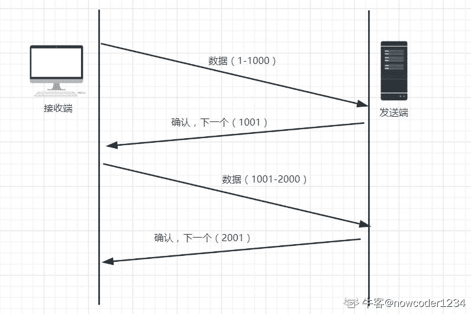
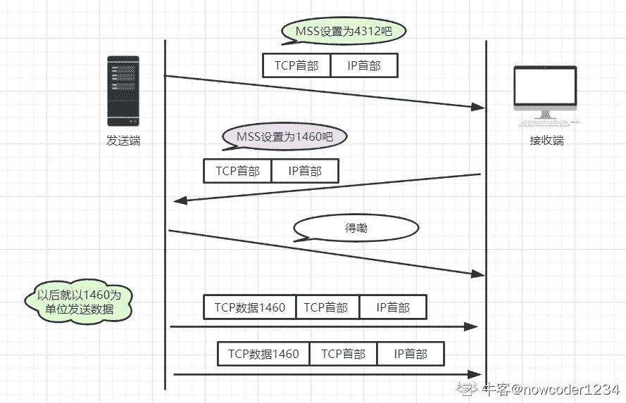
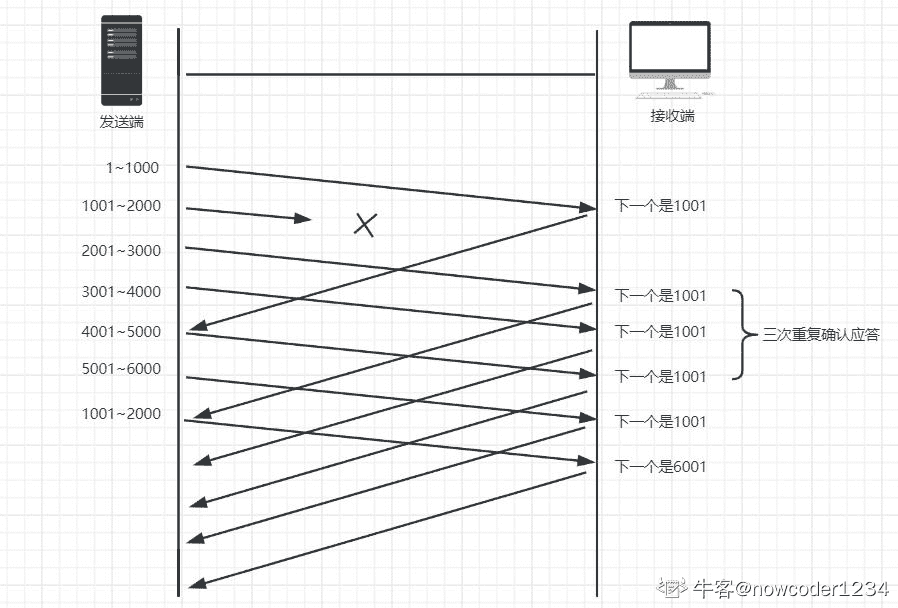

# 第三章 第 3 节 C++计算机网络-3

> 原文：[`www.nowcoder.com/tutorial/10069/34b973f6423146b59003ff7cacfadef9`](https://www.nowcoder.com/tutorial/10069/34b973f6423146b59003ff7cacfadef9)

### 3.17 说说 TCP 可靠性保证

**参考回答**

TCP 主要提供了检验和、序列号/确认应答、超时重传、最大消息长度、滑动窗口控制等方法实现了可靠性传输。

#### **检验和**

*   通过检验和的方式，接收端可以检测出来数据是否有差错和异常，假如有差错就会直接丢弃 TCP 段，重新发送。TCP 在计算检验和时，会在 TCP 首部加上一个 12 字节的伪首部。检验和总共计算 3 部分：TCP 首部、TCP 数据、TCP 伪首部
    

#### **序列号/确认应答**

*   这个机制类似于问答的形式。比如在课堂上老师会问你“明白了吗？”，假如你没有隔一段时间没有回应或者你说不明白，那么老师就会重新讲一遍。其实计算机的确认应答机制也是一样的，发送端发送信息给接收端，接收端会回应一个包，这个包就是应答包。

*   上述过程中，只要发送端有一个包传输，接收端没有回应确认包（ACK 包），都会重发。或者接收端的应答包，发送端没有收到也会重发数据。这就可以保证数据的完整性。
    

#### **超时重传**

*   超时重传是指发送出去的数据包到接收到确认包之间的时间，如果超过了这个时间会被认为是丢包了，需要重传。那么我们该如何确认这个时间值呢？

*   我们知道，一来一回的时间总是差不多的，都会有一个类似于平均值的概念。比如发送一个包到接收端收到这个包一共是 0.5s，然后接收端回发一个确认包给发送端也要 0.5s，这样的两个时间就是 RTT（往返时间）。然后可能由于网络原因的问题，时间会有偏差，称为抖动（方差）。

*   从上面的介绍来看，超时重传的时间大概是比往返时间+抖动值还要稍大的时间。
    

*   但是在重发的过程中，假如一个包经过多次的重发也没有收到对端的确认包，那么就会认为接收端异常，强制关闭连接。并且通知应用通信异常强行终止。

#### **最大消息长度**

*   在建立 TCP 连接的时候，双方约定一个最大的长度（MSS）作为发送的单位，重传的时候也是以这个单位来进行重传。理想的情况下是该长度的数据刚好不被网络层分块。
    

    #### **滑动窗口控制**

*   我们上面提到的超时重传的机制存在效率低下的问题，发送一个包到发送下一个包要经过一段时间才可以。所以我们就想着能不能不用等待确认包就发送下一个数据包呢？这就提出了一个滑动窗口的概念。
    

*   窗口的大小就是在无需等待确认包的情况下，发送端还能发送的最大数据量。这个机制的实现就是使用了大量的缓冲区，通过对多个段进行确认应答的功能。通过下一次的确认包可以判断接收端是否已经接收到了数据，如果已经接收了就从缓冲区里面删除数据。

*   在窗口之外的数据就是还未发送的和对端已经收到的数据。那么发送端是怎么样判断接收端有没有接收到数据呢？或者怎么知道需要重发的数据有哪些呢？通过下面这个图就知道了。
    

*   如上图，接收端在没有收到自己所期望的序列号数据之前，会对之前的数据进行重复确认。发送端在收到某个应答包之后，又连续 3 次收到同样的应答包，则数据已经丢失了，需要重发。

#### **拥塞控制**

*   窗口控制解决了 两台主机之间因传送速率而可能引起的丢包问题，在一方面保证了 TCP 数据传送的可靠性。然而如果网络非常拥堵，此时再发送数据就会加重网络负担，那么发送的数据段很可能超过了最大生存时间也没有到达接收方，就会产生丢包问题。为此 TCP 引入慢启动机制，先发出少量数据，就像探路一样，先摸清当前的网络拥堵状态后，再决定按照多大的速度传送数据。

*   发送开始时定义拥塞窗口大小为 1；每次收到一个 ACK 应答，拥塞窗口加 1；而在每次发送数据时，发送窗口取拥塞窗口与接送段接收窗口最小者。

*   慢启动：在启动初期以指数增长方式增长；设置一个慢启动的阈值，当以指数增长达到阈值时就停止指数增长，按照线性增长方式增加至拥塞窗口；线性增长达到网络拥塞时立即把拥塞窗口置回 1，进行新一轮的“慢启动”，同时新一轮的阈值变为原来的一半。

### 3.18 简述 TCP 滑动窗口以及重传机制

**参考回答**

1.  滑动窗口协议是传输层进行流控的一种措施，接收方通过通告发送方自己的窗口大小，从而控制发送方的发送速度，从而达到防止发送方发送速度过快而导致自己被淹没的目的。

    TCP 的滑动窗口解决了端到端的流量控制问题，允许接受方对传输进行限制，直到它拥有足够的缓冲空间来容纳更多的数据。

2.  TCP 在发送数据时会设置一个计时器，若到计时器超时仍未收到数据确认信息，则会引发相应的超时或基于计时器的重传操作，计时器超时称为**重传超时（RTO）** 。另一种方式的重传称为快速重传，通常发生在没有延时的情况下。若 TCP 累积确认无法返回新的 ACK，或者当 ACK 包含的选择确认信息（SACK）表明出现失序报文时，快速重传会推断出现丢包，需要重传。

### 3.19 说说滑动窗口过小怎么办

**参考回答**

1.  我们可以假设窗口的大小是 1，也是就每次只能发送一个数据，并且发送方只有接受方对这个数据进行确认了以后才能发送下一个数据。如果说窗口过小，那么当传输比较大的数据的时候需要不停的对数据进行确认，这个时候就会造成很大的延迟。

### 3.20 说说如果三次握手时候每次握手信息对方没收到会怎么样，分情况介绍

**参考回答**

1.  如果第一次握手消息丢失，那么请求方不会得到 ack 消息，超时后进行重传

2.  如果第二次握手消息丢失，那么请求方不会得到 ack 消息，超时后进行重传

3.  如果第三次握手消息丢失，那么 Server 端该 TCP 连接的状态为 SYN_RECV,并且会根据 TCP 的超时重传机制，会等待 3 秒、6 秒、12 秒后重新发送 SYN+ACK 包，以便 Client 重新发送 ACK 包。而 Server 重发 SYN+ACK 包的次数，可以设置/proc/sys/net/ipv4/tcp_synack_retries 修改，默认值为 5.如果重发指定次数之后，仍然未收到 client 的 ACK 应答，那么一段时间后，Server 自动关闭这个连接。

    client 一般是通过 connect() 函数来连接服务器的，而 connect()是在 TCP 的三次握手的第二次握手完成后就成功返回值。也就是说 client 在接收到 SYN+ACK 包，它的 TCP 连接状态就为 established （已连接），表示该连接已经建立。那么如果 第三次握手中的 ACK 包丢失的情况下，Client 向 server 端发送数据，Server 端将以 RST 包响应，方能感知到 Server 的错误。

### 3.21 简述 TCP 的 TIME_WAIT，为什么需要有这个状态

**参考回答**

1.  TIME_WAIT 状态也成为 2MSL 等待状态。每个具体 TCP 实现必须选择一个报文段最大生存时间 MSL（Maximum Segment Lifetime），它是任何报文段被丢弃前在网络内的最长时间。这个时间是有限的，因为 TCP 报文段以 IP 数据报在网络内传输，而 IP 数据报则有限制其生存时间的 TTL 字段。

    对一个具体实现所给定的 MSL 值，处理的原则是：当 TCP 执行一个主动关闭，并发回最后一个 ACK，该连接必须在 TIME_WAIT 状态停留的时间为 2 倍的 MSL。这样可让 TCP 再次发送最后的 ACK 以防这个 ACK 丢失（另一端超时并重发最后的 FIN）。

    这种 2MSL 等待的另一个结果是这个 TCP 连接在 2MSL 等待期间，定义这个连接的插口（客户的 IP 地址和端口号，服务器的 IP 地址和端口号）不能再被使用。这个连接只能在 2MSL 结束后才能再被使用。

2.  理论上，四个报文都发送完毕，就可以直接进入 CLOSE 状态了，但是可能网络是不可靠的，有可能最后一个 ACK 丢失。所以 TIME_WAIT 状态就是用来重发可能丢失的 ACK 报文。

### 3.22 简述什么是 MSL，为什么客户端连接要等待 2MSL 的时间才能完全关闭

**参考回答**

1.  MSL 是 Maximum Segment Lifetime 的英文缩写，可译为“最长报文段寿命”，它是任何报文在网络上存在的最长时间，超过这个时间报文将被丢弃。

2.  为了保证客户端发送的最后一个 ACK 报文段能够到达服务器。因为这个 ACK 有可能丢失，从而导致处在 LAST-ACK 状态的服务器收不到对 FIN-ACK 的确认报文。服务器会超时重传这个 FIN-ACK，接着客户端再重传一次确认，重新启动时间等待计时器。最后客户端和服务器都能正常的关闭。假设客户端不等待 2MSL，而是在发送完 ACK 之后直接释放关闭，一但这个 ACK 丢失的话，服务器就无法正常的进入关闭连接状态。

*   两个理由：

    *   保证客户端发送的最后一个 ACK 报文段能够到达服务端。

        这个 ACK 报文段有可能丢失，使得处于 LAST-ACK 状态的 B 收不到对已发送的 FIN+ACK 报文段的确认，服务端超时重传 FIN+ACK 报文段，而客户端能在 2MSL 时间内收到这个重传的 FIN+ACK 报文段，接着客户端重传一次确认，重新启动 2MSL 计时器，最后客户端和服务端都进入到 CLOSED 状态，若客户端在 TIME-WAIT 状态不等待一段时间，而是发送完 ACK 报文段后立即释放连接，则无法收到服务端重传的 FIN+ACK 报文段，所以不会再发送一次确认报文段，则服务端无法正常进入到 CLOSED 状态。

    *   防止“已失效的连接请求报文段”出现在本连接中。

        客户端在发送完最后一个 ACK 报文段后，再经过 2MSL，就可以使本连接持续的时间内所产生的所有报文段都从网络中消失，使下一个新的连接中不会出现这种旧的连接请求报文段。

### 3.23 说说什么是 SYN flood，如何防止这类攻击？

**参考回答**

1.  SYN Flood 是当前最流行的 DoS（拒绝服务攻击）与 DDoS(分布式拒绝服务攻击)的方式之一，这是一种利用 TCP 协议缺陷，发送大量伪造的 TCP 连接请求，使被攻击方资源耗尽（CPU 满负荷或内存不足)的攻击方式.

2.  有以下三种方法预防或响应网络上的 DDoS 攻击：

    (1)从互联网服务提供商(ISP)购买服务。

    许多互联网服务提供商(ISP)提供 DDoS 缓解服务，但是当企业网络受到攻击时，企业需要向互联网服务提供商(ISP)报告事件以开始缓解。这种策略称为“清洁管道”，在互联网服务提供商(ISP)收取服务费用时很受欢迎，但在缓解措施开始之前，通常会导致 30 到 60 分钟的网络延迟。

    (2)保留在内部并自己解决。

    企业可以使用入侵防御系统/防火墙技术和专用于防御 DDoS 攻击的专用硬件来实现内部预防和响应 DDoS 攻击。不幸的是，受影响的流量已经在网络上消耗了宝贵的带宽。这使得该方法最适合在托管设施中配备设备的企业，在这些企业中，流量是通过交叉连接到达互联网服务提供商(ISP)，从而保护流向企业其他部门的下游带宽。

    (3)使用内容分发网络(CDN)。

    由于 IT 团队可以将基础设施置于内容分发网络(CDN)后面，因此这种方法可以最大程度地减少对企业网络基础设施的攻击。这些网络庞大而多样，如果组织订阅 DNS 和 DDoS 缓解措施，则它们可以保护电子商务站点以及企业本身。

### 3.24 说说什么是 TCP 粘包和拆包？

**参考回答**

1.  TCP 是个“流”协议，所谓流，就是没有界限的一串数据。大家可以想想河里的流水，是连成一片的，其间并没有分界线。TCP 底层并不了解上层业务数据的具体含义，它会根据 TCP 缓冲区的实际情况进行包的划分，所以在业务上认为，一个完整的包可能会被 TCP 拆分成多个包进行发送，也有可能把多个小的包封装成一个大的数据包发送，这就是所谓的 TCP 粘包和拆包问题。

**答案解析**

假设客户端分别发送了两个数据包 D1 和 D2 给服务端，由于服务端一次读取到的字节数是不确定的，故可能存在以下 4 种情况。

（1）服务端分两次读取到了两个独立的数据包，分别是 D1 和 D2，没有粘包和拆包；

（2）服务端一次接收到了两个数据包，D1 和 D2 粘合在一起，被称为 TCP 粘包；

（3）服务端分两次读取到了两个数据包，第一次读取到了完整的 D1 包和 D2 包的部分内容，第二次读取到了 D2 包的剩余内容，这被称为 TCP 拆包；

（4）服务端分两次读取到了两个数据包，第一次读取到了 D1 包的部分内容 D1_1，第二次读取到了 D1 包的剩余内容 D1_2 和 D2 包的整包。

如果此时服务端 TCP 接收滑窗非常小，而数据包 D1 和 D2 比较大，很有可能会发生第五种可能，即服务端分多次才能将 D1 和 D2 包接收完全，期间发生多次拆包。

### 3.25 说说 TCP 与 UDP 在网络协议中的哪一层，他们之间有什么区别？

**参考回答**

TCP 和 UDP 协议都是**传输层**协议。二者的区别主要有：

1.  基于连接 vs 无连接

*   TCP 是面向连接的协议。
*   UDP 是无连接的协议。UDP 更加适合消息的多播发布，从单个点向多个点传输消息。

2.  可靠性

*   TCP 提供交付保证，传输过程中丢失，将会重发。
*   UDP 是不可靠的，不提供任何交付保证。（网游和视频的丢包情况）

3.  有序性

*   TCP 保证了消息的有序性，即使到达客户端顺序不同，TCP 也会排序。
*   UDP 不提供有序性保证。

4.  数据边界

*   TCP 不保存数据边界。

    *   虽然 TCP 也将在收集所有字节之后生成一个完整的消息，但是这些信息在传给传输给接受端之前将储存在 TCP 缓冲区，以确保更好的使用网络带宽。
*   UDP 保证。

    *   在 UDP 中，数据包单独发送的，只有当他们到达时，才会再次集成。包有明确的界限来哪些包已经收到，这意味着在消息发送后，在接收器接口将会有一个读操作，来生成一个完整的消息。

5.  速度

*   TCP 速度慢
*   UDP 速度快。应用在在线视频媒体，电视广播和多人在线游戏。

6.  发送消耗

*   TCP 是重量级。

*   UDP 是轻量级。

    *   因为 UDP 传输的信息中不承担任何间接创造连接，保证交货或秩序的的信息。
    *   这也反映在用于报头大小。

7.  报头大小

*   TCP 头大。

    *   一个 TCP 数据包报头的大小是 20 字节。
    *   TCP 报头中包含序列号，ACK 号，数据偏移量，保留，控制位，窗口，紧急指针，可选项，填充项，校验位，源端口和目的端口。
*   UDP 头小。

    *   UDP 数据报报头是 8 个字节。
    *   而 UDP 报头只包含长度，源端口号，目的端口，和校验和。

8.  拥塞或流控制

*   TCP 有流量控制。

    *   在任何用户数据可以被发送之前，TCP 需要三数据包来设置一个套接字连接。TCP 处理的可靠性和拥塞控制。
*   UDP 不能进行流量控制。

9.  应用

*   由于 TCP 提供可靠交付和有序性的保证，它是最适合需要高可靠并且对传输时间要求不高的应用。
*   UDP 是更适合的应用程序需要快速，高效的传输的应用，如游戏。
*   UDP 是无状态的性质，在服务器端需要对大量客户端产生的少量请求进行应答的应用中是非常有用的。
*   在实践中，TCP 被用于金融领域，如 FIX 协议是一种基于 TCP 的协议，而 UDP 是大量使用在游戏和娱乐场所。

10.上层使用的协议

*   基于 TCP 协议的：Telnet，FTP 以及 SMTP 协议。
*   基于 UDP 协议的：DHCP、DNS、SNMP、TFTP、BOOTP。

### 3.26 说说从系统层面上，UDP 如何保证尽量可靠？

**参考回答**

1.  UDP 仅提供了最基本的数据传输功能，至于传输时连接的建立和断开、传输可靠性的保证这些 UDP 统统不关心，而是把这些问题抛给了 UDP 上层的应用层程序去处理，自己仅提供传输层协议的最基本功能。

2.  最简单的方式是在应用层模仿传输层 TCP 的可靠性传输。下面不考虑拥塞处理，可靠 UDP 的简单设计。

    *   添加 seq/ack 机制，确保数据发送到对端
    *   添加发送和接收缓冲区，主要是用户超时重传。
    *   添加超时重传机制。

### 3.27 说一说 TCP 的 keepalive，以及和 HTTP 的 keepalive 的区别？

**参考回答**

1.  **HTTP Keep-Alive**

    在 http 早期，每个 http 请求都要求打开一个 tpc socket 连接，并且使用一次之后就断开这个 tcp 连接。使用 keep-alive 可以改善这种状态，即在一次 TCP 连接中可以持续发送多份数据而不会断开连接。通过使用 keep-alive 机制，可以减少 tcp 连接建立次数，也意味着可以减少 TIME_WAIT 状态连接，以此提高性能和提高 httpd 服务器的吞吐率(更少的 tcp 连接意味着更少的系统内核调用,socket 的 accept()和 close()调用)。但是，keep-alive 并不是免费的午餐,长时间的 tcp 连接容易导致系统资源无效占用。配置不当的 keep-alive，有时比重复利用连接带来的损失还更大。所以，正确地设置 keep-alive timeout 时间非常重要。

2.  **TCP KEEPALIVE**

    链接建立之后，如果应用程序或者上层协议一直不发送数据，或者隔很长时间才发送一次数据，当链接很久没有数据报文传输时如何去确定对方还在线，到底是掉线了还是确实没有数据传输，链接还需不需要保持，这种情况在 TCP 协议设计中是需要考虑到的。TCP 协议通过一种巧妙的方式去解决这个问题，当超过一段时间之后，TCP 自动发送一个数据为空的报文给对方，如果对方回应了这个报文，说明对方还在线，链接可以继续保持，如果对方没有报文返回，并且重试了多次之后则认为链接丢失，没有必要保持链接。

3.  TCP 的 keepalive 机制和 HTTP 的 keep-alive 机制是说的完全不同的两个东西，tcp 的 keepalive 是在 ESTABLISH 状态的时候，双方如何检测连接的可用行。而 http 的 keep-alive 说的是如何避免进行重复的 TCP 三次握手和四次挥手的环节。