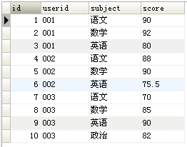
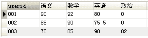

# 第四章 第 1 节 C++数据库-1

> 原文：[`www.nowcoder.com/tutorial/10069/e30e003317a34de080ac0a21e023a8a6`](https://www.nowcoder.com/tutorial/10069/e30e003317a34de080ac0a21e023a8a6)

### 4.1 SQL

#### 4.1.1 介绍一下数据库分页

**参考答案**

MySQL 的分页语法：

在 MySQL 中，SELECT 语句默认返回所有匹配的行，它们可能是指定表中的每个行。为了返回第一行或前几行，可使用 LIMIT 子句，以实现分页查询。LIMIT 子句的语法如下：

```cpp
-- 在所有的查询结果中，返回前 5 行记录。
SELECT prod_name FROM products LIMIT 5;
-- 在所有的查询结果中，从第 5 行开始，返回 5 行记录。
SELECT prod_name FROM products LIMIT 5,5;
```

总之，带一个值的 LIMIT 总是从第一行开始，给出的数为返回的行数。带两个值的 LIMIT 可以指定从行号为第一个值的位置开始。

优化 LIMIT 分页：

在偏移量非常大的时候，例如 `LIMIT 10000,20` 这样的查询，这时 MySQL 需要查询 10020 条记录然后只返回最后 20 条，前面的 10000 条记录都将被抛弃，这样的代价是非常高的。如果所有的页面被访问的频率都相同，那么这样的查询平均需要访问半个表的数据。要优化这种查询，要么是在页面中限制分页的数量，要么是优化大偏移量的性能。

优化此类分页查询的一个最简单的办法就是尽可能地使用索引覆盖扫描，而不是查询所有的列，然后根据需要做一次关联操作再返回所需的列。对于偏移量很大的时候，这样做的效率会提升非常大。考虑下面的查询：

```cpp
SELECT film_id,description FROM sakila.film ORDER BY title LIMIT 50,5;
```

如果这个表非常大，那么这个查询最好改写成下面的样子：

```cpp
SELECT film.film_id,film.description 
FROM sakila.film
INNER JOIN (
    SELECT film_id FROM sakila.film ORDER BY title LIMIT 50,5
) AS lim USING(film_id);
```

这里的“延迟关联”将大大提升查询效率，它让 MySQL 扫描尽可能少的页面，获取需要访问的记录后再根据关联列回原表查询需要的所有列。这个技术也可以用于优化关联查询中的 LIMIT 子句。

有时候也可以将 LIMIT 查询转换为已知位置的查询，让 MySQL 通过范围扫描获得对应的结果。例如，如果在一个位置列上有索引，并且预先计算出了边界值，上面的查询就可以改写为：

```cpp
SELECT film_id,description FROM skila.film
WHERE position BETWEEN 50 AND 54 ORDER BY position;
```

对数据进行排名的问题也与此类似，但往往还会同时和 GROUP BY 混合使用，在这种情况下通常都需要预先计算并存储排名信息。

LIMIT 和 OFFSET 的问题，其实是 OFFSET 的问题，它会导致 MySQL 扫描大量不需要的行然后再抛弃掉。如果可以使用书签记录上次取数的位置，那么下次就可以直接从该书签记录的位置开始扫描，这样就可以避免使用 OFFSET。例如，若需要按照租赁记录做翻页，那么可以根据最新一条租赁记录向后追溯，这种做法可行是因为租赁记录的主键是单调增长的。首先使用下面的查询获得第一组结果：

```cpp
SELECT * FROM sakila.rental ORDER BY rental_id DESC LIMIT 20;
```

假设上面的查询返回的是主键 16049 到 16030 的租赁记录，那么下一页查询就可以从 16030 这个点开始：

```cpp
SELECT * FROM sakila.rental 
WHERE rental_id < 16030 ORDER BY rental_id DESC LIMIT 20;
```

该技术的好处是无论翻页到多么后面，其性能都会很好。

#### 4.1.2 介绍一下 SQL 中的聚合函数

**参考答案**

常用的聚合函数有 COUNT()、AVG()、SUM()、MAX()、MIN()，下面以 MySQL 为例，说明这些函数的作用。

COUNT()函数：

COUNT()函数统计数据表中包含的记录行的总数，或者根据查询结果返回列中包含的数据行数，它有两种用法：

*   COUNT(*)计算表中总的行数，不管某列是否有数值或者为空值。
*   COUNT(字段名)计算指定列下总的行数，计算时将忽略空值的行。

COUNT()函数可以与 GROUP BY 一起使用来计算每个分组的总和。

AVG()函数()：

AVG()函数通过计算返回的行数和每一行数据的和，求得指定列数据的平均值。

AVG()函数可以与 GROUP BY 一起使用，来计算每个分组的平均值。

SUM()函数：

SUM()是一个求总和的函数，返回指定列值的总和。

SUM()可以与 GROUP BY 一起使用，来计算每个分组的总和。

MAX()函数：

MAX()返回指定列中的最大值。

MAX()也可以和 GROUP BY 关键字一起使用，求每个分组中的最大值。

MAX()函数不仅适用于查找数值类型，也可应用于字符类型。

MIN()函数：

MIN()返回查询列中的最小值。

MIN()也可以和 GROUP BY 关键字一起使用，求出每个分组中的最小值。

MIN()函数与 MAX()函数类似，不仅适用于查找数值类型，也可应用于字符类型。

#### 4.1.3 表跟表是怎么关联的？

**参考答案**

表与表之间常用的关联方式有两种：内连接、外连接，下面以 MySQL 为例来说明这两种连接方式。

内连接：

内连接通过 INNER JOIN 来实现，它将返回两张表中满足连接条件的数据，不满足条件的数据不会查询出来。

外连接：

外连接通过 OUTER JOIN 来实现，它会返回两张表中满足连接条件的数据，同时返回不满足连接条件的数据。外连接有两种形式：左外连接（LEFT OUTER JOIN）、右外连接（RIGHT OUTER JOIN）。

*   左外连接：可以简称为左连接（LEFT JOIN），它会返回左表中的所有记录和右表中满足连接条件的记录。
*   右外连接：可以简称为右连接（RIGHT JOIN），它会返回右表中的所有记录和左表中满足连接条件的记录。

除此之外，还有一种常见的连接方式：等值连接。这种连接是通过 WHERE 子句中的条件，将两张表连接在一起，它的实际效果等同于内连接。出于语义清晰的考虑，一般更建议使用内连接，而不是等值连接。

以上是从语法上来说明表与表之间关联的实现方式，而从表的关系上来说，比较常见的关联关系有：一对多关联、多对多关联、自关联。

*   一对多关联：这种关联形式最为常见，一般是两张表具有主从关系，并且以主表的主键关联从表的外键来实现这种关联关系。另外，以从表的角度来看，它们是具有多对一关系的，所以不再赘述多对一关联了。
*   多对多关联：这种关联关系比较复杂，如果两张表具有多对多的关系，那么它们之间需要有一张中间表来作为衔接，以实现这种关联关系。这个中间表要设计两列，分别存储那两张表的主键。因此，这两张表中的任何一方，都与中间表形成了一对多关系，从而在这个中间表上建立起了多对多关系。
*   自关联：自关联就是一张表自己与自己相关联，为了避免表名的冲突，需要在关联时通过别名将它们当做两张表来看待。一般在表中数据具有层级（树状）时，可以采用自关联一次性查询出多层级的数据。

#### 4.1.4 说一说你对外连接的了解

**参考答案**

外连接通过 OUTER JOIN 来实现，它会返回两张表中满足连接条件的数据，同时返回不满足连接条件的数据。常见的外连接有两种形式：左外连接（LEFT OUTER JOIN）、右外连接（RIGHT OUTER JOIN）。

*   左外连接：可以简称为左连接（LEFT JOIN），它会返回左表中的所有记录和右表中满足连接条件的记录。
*   右外连接：可以简称为右连接（RIGHT JOIN），它会返回右表中的所有记录和左表中满足连接条件的记录。

实际上，外连接还有一种形式：完全外连接（FULL OUTER JOIN），但 MySQL 不支持这种形式。

#### 4.1.5 说一说数据库的左连接和右连接

**参考答案**

外连接通过 OUTER JOIN 来实现，它会返回两张表中满足连接条件的数据，同时返回不满足连接条件的数据。常见的外连接有两种形式：左外连接（LEFT OUTER JOIN）、右外连接（RIGHT OUTER JOIN）。

*   左外连接：可以简称为左连接（LEFT JOIN），它会返回左表中的所有记录和右表中满足连接条件的记录。
*   右外连接：可以简称为右连接（RIGHT JOIN），它会返回右表中的所有记录和左表中满足连接条件的记录。

#### 4.1.6 SQL 中怎么将行转成列？

**参考答案**

我们以 MySQL 数据库为例，来说明行转列的实现方式。

首先，假设我们有一张分数表（tb_score），表中的数据如下图：



然后，我们再来看一下转换之后需要得到的结果，如下图：



可以看出，这里行转列是将原来的 subject 字段的多行内容选出来，作为结果集中的不同列，并根据 userid 进行分组显示对应的 score。通常，我们有两种方式来实现这种转换。

1.  使用 `CASE...WHEN...THEN` 语句实现行转列，参考如下代码：

    ```cpp
    SELECT userid,
    SUM(CASE `subject` WHEN '语文' THEN score ELSE 0 END) as '语文',
    SUM(CASE `subject` WHEN '数学' THEN score ELSE 0 END) as '数学',
    SUM(CASE `subject` WHEN '英语' THEN score ELSE 0 END) as '英语',
    SUM(CASE `subject` WHEN '政治' THEN score ELSE 0 END) as '政治' 
    FROM tb_score 
    GROUP BY userid
    ```

    注意，SUM() 是为了能够使用 GROUP BY 根据 userid 进行分组，因为每一个 userid 对应的 subject="语文"的记录只有一条，所以 SUM() 的值就等于对应那一条记录的 score 的值。假如 userid ='001' and subject='语文' 的记录有两条，则此时 SUM() 的值将会是这两条记录的和，同理，使用 Max()的值将会是这两条记录里面值最大的一个。但是正常情况下，一个 user 对应一个 subject 只有一个分数，因此可以使用 SUM()、MAX()、MIN()、AVG()等聚合函数都可以达到行转列的效果。

2.  使用 `IF()` 函数实现行转列，参考如下代码：

    ```cpp
    SELECT userid,
    SUM(IF(`subject`='语文',score,0)) as '语文',
    SUM(IF(`subject`='数学',score,0)) as '数学',
    SUM(IF(`subject`='英语',score,0)) as '英语',
    SUM(IF(`subject`='政治',score,0)) as '政治' 
    FROM tb_score 
    GROUP BY userid
    ```

    注意，`IF(subject='语文',score,0)` 作为条件，即对所有 subject='语文'的记录的 score 字段进行 SUM()、MAX()、MIN()、AVG()操作，如果 score 没有值则默认为 0。

#### 4.1.7 谈谈你对 SQL 注入的理解

**参考答案**

SQL 注入的原理是将 SQL 代码伪装到输入参数中，传递到服务器解析并执行的一种攻击手法。也就是说，在一些对 SERVER 端发起的请求参数中植入一些 SQL 代码，SERVER 端在执行 SQL 操作时，会拼接对应参数，同时也将一些 SQL 注入攻击的“SQL”拼接起来，导致会执行一些预期之外的操作。

举个例子：

比如我们的登录功能，其登录界面包括用户名和密码输入框以及提交按钮，登录时需要输入用户名和密码，然后提交。此时调用接口/user/login/ 加上参数 username、password，首先连接数据库，然后后台对请求参数中携带的用户名、密码进行参数校验，即 SQL 的查询过程。假设正确的用户名和密码为 ls 和 123456，输入正确的用户名和密码、提交，相当于调用了以下的 SQL 语句。

```cpp
SELECT * FROM user WHERE username = 'ls' AND password = '123456'
```

SQL 中会将#及--以后的字符串当做注释处理，如果我们使用 `' or 1=1 #` 作为用户名参数，那么服务端构建的 SQL 语句就如下：

```cpp
select * from user where username='' or 1=1 #' and password='123456'
```

而#会忽略后面的语句，而 1=1 属于常等型条件，因此这个 SQL 将查询出所有的登录用户。其实上面的 SQL 注入只是在参数层面做了些手脚，如果是引入了一些功能性的 SQL 那就更危险了，比如上面的登录功能，如果用户名使用这个 `' or 1=1;delete * from users; #`，那么在";"之后相当于是另外一条新的 SQL，这个 SQL 是删除全表，是非常危险的操作，因此 SQL 注入这种还是需要特别注意的。

如何解决 SQL 注入

1.  严格的参数校验

    参数校验就没得说了，在一些不该有特殊字符的参数中提前进行特殊字符校验即可。

2.  SQL 预编译

    在知道了 SQL 注入的原理之后，我们同样也了解到 MySQL 有预编译的功能，指的是在服务器启动时，MySQL Client 把 SQL 语句的模板（变量采用占位符进行占位）发送给 MySQL 服务器，MySQL 服务器对 SQL 语句的模板进行编译，编译之后根据语句的优化分析对相应的索引进行优化，在最终绑定参数时把相应的参数传送给 MySQL 服务器，直接进行执行，节省了 SQL 查询时间，以及 MySQL 服务器的资源，达到一次编译、多次执行的目的，除此之外，还可以防止 SQL 注入。

    具体是怎样防止 SQL 注入的呢？实际上当将绑定的参数传到 MySQL 服务器，MySQL 服务器对参数进行编译，即填充到相应的占位符的过程中，做了转义操作。我们常用的 JDBC 就有预编译功能，不仅提升性能，而且防止 SQL 注入。

#### 4.1.8 将一张表的部分数据更新到另一张表，该如何操作呢？

**参考答案**

可以采用关联更新的方式，将一张表的部分数据，更新到另一张表内。参考如下代码：

```cpp
update b set b.col=a.col from a,b where a.id=b.id;
update b set col=a.col from b inner join a on a.id=b.id;
update b set b.col=a.col from b left Join a on b.id = a.id;
```

#### 4.1.9 WHERE 和 HAVING 有什么区别？

**参考答案**

WHERE 是一个约束声明，使用 WHERE 约束来自数据库的数据，WHERE 是在结果返回之前起作用的，WHERE 中不能使用聚合函数。

HAVING 是一个过滤声明，是在查询返回结果集以后对查询结果进行的过滤操作，在 HAVING 中可以使用聚合函数。另一方面，HAVING 子句中不能使用除了分组字段和聚合函数之外的其他字段。

从性能的角度来说，HAVING 子句中如果使用了分组字段作为过滤条件，应该替换成 WHERE 子句。因为 WHERE 可以在执行分组操作和计算聚合函数之前过滤掉不需要的数据，性能会更好。

### 4.2 索引

#### 4.2.1 说一说你对 MySQL 索引的理解

**参考答案**

索引是一个单独的、存储在磁盘上的数据库结构，包含着对数据表里所有记录的引用指针。使用索引可以快速找出在某个或多个列中有一特定值的行，所有 MySQL 列类型都可以被索引，对相关列使用索引是提高查询操作速度的最佳途径。

索引是在存储引擎中实现的，因此，每种存储引擎的索引都不一定完全相同，并且每种存储引擎也不一定支持所有索引类型。MySQL 中索引的存储类型有两种，即 BTREE 和 HASH，具体和表的存储引擎相关。MyISAM 和 InnoDB 存储引擎只支持 BTREE 索引；MEMORY/HEAP 存储引擎可以支持 HASH 和 BTREE 索引。

索引的优点主要有以下几条：

1.  通过创建唯一索引，可以保证数据库表中每一行数据的唯一性。
2.  可以大大加快数据的查询速度，这也是创建索引的主要原因。
3.  在实现数据的参考完整性方面，可以加速表和表之间的连接。
4.  在使用分组和排序子句进行数据查询时，也可以显著减少查询中分组和排序的时间。

增加索引也有许多不利的方面，主要表现在如下几个方面：

1.  创建索引和维护索引要耗费时间，并且随着数据量的增加所耗费的时间也会增加。
2.  索引需要占磁盘空间，除了数据表占数据空间之外，每一个索引还要占一定的物理空间，如果有大量的索引，索引文件可能比数据文件更快达到最大文件尺寸。
3.  当对表中的数据进行增加、删除和修改的时候，索引也要动态地维护，这样就降低了数据的维护速度。

#### 4.2.2 索引有哪几种？

**参考答案**

MySQL 的索引可以分为以下几类：

1.  普通索引和唯一索引

    普通索引是 MySQL 中的基本索引类型，允许在定义索引的列中插入重复值和空值。

    唯一索引要求索引列的值必须唯一，但允许有空值。如果是组合索引，则列值的组合必须唯一。

    主键索引是一种特殊的唯一索引，不允许有空值。

2.  单列索引和组合索引

    单列索引即一个索引只包含单个列，一个表可以有多个单列索引。

    组合索引是指在表的多个字段组合上创建的索引，只有在查询条件中使用了这些字段的左边字段时，索引才会被使用。使用组合索引时遵循最左前缀集合。

3.  全文索引

    全文索引类型为 FULLTEXT，在定义索引的列上支持值的全文查找，允许在这些索引列中插入重复值和空值。全文索引可以在 CHAR、VARCHAR 或者 TEXT 类型的列上创建。MySQL 中只有 MyISAM 存储引擎支持全文索引。

4.  空间索引

    空间索引是对空间数据类型的字段建立的索引，MySQL 中的空间数据类型有 4 种，分别是 GEOMETRY、POINT、LINESTRING 和 POLYGON。MySQL 使用 SPATIAL 关键字进行扩展，使得能够用创建正规索引类似的语法创建空间索引。创建空间索引的列，必须将其声明为 NOT NULL，空间索引只能在存储引擎为 MyISAM 的表中创建。