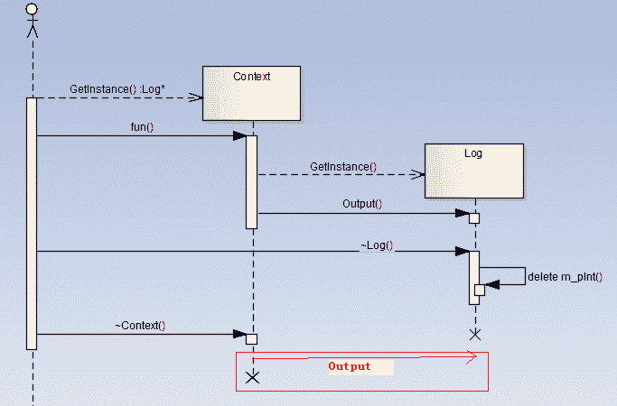

# 第五章 第 1 节 C++设计模式-1

> 原文：[`www.nowcoder.com/tutorial/10069/b20db0551c9b4d4b9da073ded4bf7fb1`](https://www.nowcoder.com/tutorial/10069/b20db0551c9b4d4b9da073ded4bf7fb1)

## 第五章 设计模式

### 5.1 说说什么是单例设计模式，如何实现

**参考回答**

1.  单例模式定义

    保证一个类仅有一个实例，并提供一个访问它的全局访问点，该实例被所有程序模块共享。

    那么我们就必须保证：

    （1）该类不能被复制。

    （2）该类不能被公开的创造。

    那么对于 C++来说，它的构造函数，拷贝构造函数和赋值函数都不能被公开调用。

2.  单例模式**实现方式**

    单例模式通常有两种模式，分别为**懒汉式单例**和**饿汉式单例**。两种模式实现方式分别如下：

    （1）懒汉式设计模式实现方式（2 种）

    a. 静态指针 + 用到时初始化

    b. 局部静态变量

    （2）饿汉式设计模式（2 种）

    a. 直接定义静态对象

    b. 静态指针 + 类外初始化时 new 空间实现

**答案解析**

1.  懒汉模式

    懒汉模式的特点是延迟加载，比如配置文件，采用懒汉式的方法，配置文件的实例直到用到的时候才会加载，不到万不得已就不会去实例化类，也就是说在第一次用到类实例的时候才会去实例化。以下是懒汉模式实现方式 C++代码：

    （1）**懒汉模式实现一：静态指针 + 用到时初始化**

    ```cpp
    //代码实例（线程不安全）
    template<typename T>
    class Singleton
    {
    public:
    static T& getInstance()
    {
        if (!value_)
        {
            value_ = new T();
        }
        return *value_;
    }
    private:
        Singleton();
        ~Singleton();
        static T* value_;
    };
    template<typename T>
    T* Singleton<T>::value_ = NULL;
    ```

    在单线程中，这样的写法是可以正确使用的，但是在多线程中就不行了，该方法是线程不安全的。
    a. 假如线程 A 和线程 B, 这两个线程要访问 getInstance 函数，线程 A 进入 getInstance 函数，并检测 if 条件，由于是第一次进入，value 为空，if 条件成立，准备创建对象实例。
    b. 但是，线程 A 有可能被 OS 的调度器中断而挂起睡眠，而将控制权交给线程 B。
    c. 线程 B 同样来到 if 条件，发现 value 还是为 NULL，因为线程 A 还没来得及构造它就已经被中断了。此时假设线程 B 完成了对象的创建，并顺利的返回。
    d. 之后线程 A 被唤醒，继续执行 new 再次创建对象，这样一来，两个线程就构建两个对象实例，这就破坏了唯一性。
    另外，还存在内存泄漏的问题，new 出来的东西始终没有释放，下面是一种饿汉式的一种改进。

    ```cpp
    //代码实例（线程安全）
    emplate<typename T>
    class Singleton
    {
    public:
    static T& getInstance()
    {
        if (!value_)
        {
            value_ = new T();
        }
        return *value_;
    }
    private:
         class CGarbo     
        {    
        public:    
            ~CGarbo()    
            {    
                if(Singleton::value_)    
                    delete Singleton::value_;    
            }    
        };    
        static CGarbo Garbo;    
        Singleton();
        ~Singleton();
        static T* value_;
    };
    template<typename T>
    T* Singleton<T>::value_ = NULL;
    ```

    在程序运行结束时，系统会调用 Singleton 的静态成员 Garbo 的析构函数，该析构函数会删除单例的唯一实例。使用这种方法释放单例对象有以下特征：

    a. 在单例类内部定义专有的嵌套类；

    ```cpp
     b. 在单例类内定义私有的专门用于释放的静态成员；
     c. 利用程序在结束时析构全局变量的特性，选择最终的释放时机。
    ```

    （2）**懒汉模式实现二：局部静态变量**

    ```cpp
    //代码实例（线程不安全）
    template<typename T>
    class Singleton
    {
    public:
    static T& getInstance() 
    {
        static T instance;
        return instance;
    }

    private:
        Singleton(){};
        Singleton(const Singleton&);
        Singleton& operator=(const Singleton&);
    };
    ```

    同样，静态局部变量的实现方式也是线程不安全的。如果存在多个单例对象的析构顺序有依赖时，可能会出现程序崩溃的危险。
    对于局部静态对象的也是一样的。因为 static T instance；语句不是一个原子操作，在第一次被调用时会调用 Singleton 的构造函数，而如果构造函数里如果有多条初始化语句，则初始化动作可以分解为多步操作，就存在多线程竞争的问题。
    为什么存在多个单例对象的析构顺序有依赖时，可能会出现程序崩溃的危险？

    原因：由于静态成员是在第一次调用函数 GetInstance 时进行初始化，调用构造函数的，因此构造函数的调用顺序时可以唯一确定了。对于析构函数，我们只知道其调用顺序和构造函数的调用顺序相反，但是如果几个 Singleton 类的析构函数之间也有依赖关系，而且出现类似单例实例 A 的析构函数中使用了单例实例 B，但是程序析构时是先调用实例 B 的析构函数，此时在 A 析构函数中使用 B 时就可能会崩溃。

    ```cpp
    //代码实例（线程安全）
    #include <string>
    #include <iostream>
    using namespace std;
    class Log
    {
    public:
        static Log* GetInstance()
        {
            static Log oLog;
            return &oLog;
        }

        void Output(string strLog)
        {
            cout<<strLog<<(*m_pInt)<<endl;
        }
    private:
        Log():m_pInt(new int(3))
        {
        }
        ~Log()
        {cout<<"~Log"<<endl;
            delete m_pInt;
            m_pInt = NULL;
        }
        int* m_pInt;
    };

    class Context
    {
    public:
        static Context* GetInstance()
        {
            static Context oContext;
            return &oContext;
        }
        ~Context()
        {
            Log::GetInstance()->Output(__FUNCTION__);
        }

        void fun()
        {
            Log::GetInstance()->Output(__FUNCTION__);
        }
    private:
        Context(){}
        Context(const Context& context);
    };

    int main(int argc, char* argv[])
    {
        Context::GetInstance()->fun();
        return 0;
    }
    ```

    在这个反例中有两个 Singleton: Log 和 Context，Context 的 fun 和析构函数会调用 Log 来输出一些信息，结果程序 Crash 掉了，该程序的运行的序列图如下（其中画红框的部分是出问题的部分）：

    

    **解决方案：**对于析构的顺序，我们可以用一个容器来管理它，根据单例之间的依赖关系释放实例，对所有的实例的析构顺序进行排序，之后调用各个单例实例的析构方法，如果出现了循环依赖关系，就给出异常，并输出循环依赖环。

2.  饿汉模式

    单例类定义的时候就进行实例化。因为 main 函数执行之前，全局作用域的类成员静态变量 m_Instance 已经初始化，故**没有多线程的问题**。

    （1）**饿汉模式实现一：直接定义静态对象**

    ```cpp
    //代码实例（线程安全）
    //.h 文件
    class Singleton
    {
    public:
      static Singleton& GetInstance();
    private:
      Singleton(){}
      Singleton(const Singleton&);
      Singleton& operator= (const Singleton&);
    private:
      static Singleton m_Instance;
    };
    //CPP 文件
    Singleton Singleton::m_Instance;//类外定义-不要忘记写
    Singleton& Singleton::GetInstance()
    {
       return m_Instance;
    }
    //函数调用
    Singleton& instance = Singleton::GetInstance();
    ```

    **优点：**

    实现简单，多线程安全。

    **缺点：**

    a. 如果存在多个单例对象且这几个单例对象相互依赖，可能会出现程序崩溃的危险。原因:对编译器来说，静态成员变量的初始化顺序和析构顺序是一个未定义的行为;具体分析在懒汉模式中也讲到了。

    b. 在程序开始时，就创建类的实例，如果 Singleton 对象产生很昂贵，而本身有很少使用，这种方式单从资源利用效率的角度来讲，比懒汉式单例类稍差些。但从反应时间角度来讲，则比懒汉式单例类稍好些。

    **使用条件：**

    a. 当肯定不会有构造和析构依赖关系的情况。

    b. 想避免频繁加锁时的性能消耗

    （2）**饿汉模式实现二：静态指针 + 类外初始化时 new 空间实现**

    ```cpp
    //代码实例（线程安全）
    class Singleton
    {
    protected:
        Singleton(){}
    private:
        static Singleton* p;
    public:
        static Singleton* initance();
    };
    Singleton* Singleton::p = new Singleton;
    Singleton* singleton::initance()
    {
        return p;
    }
    ```