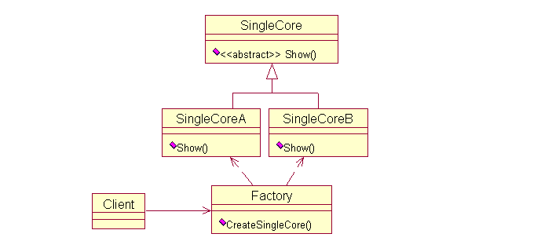
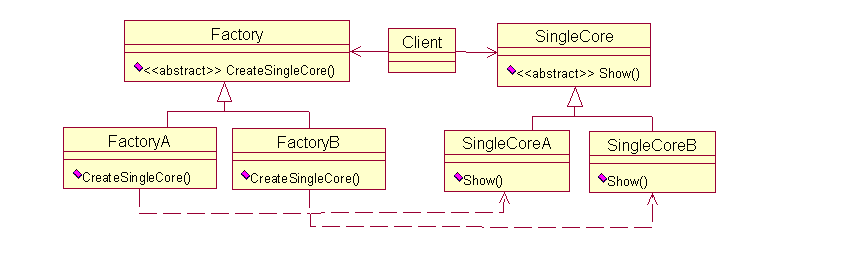
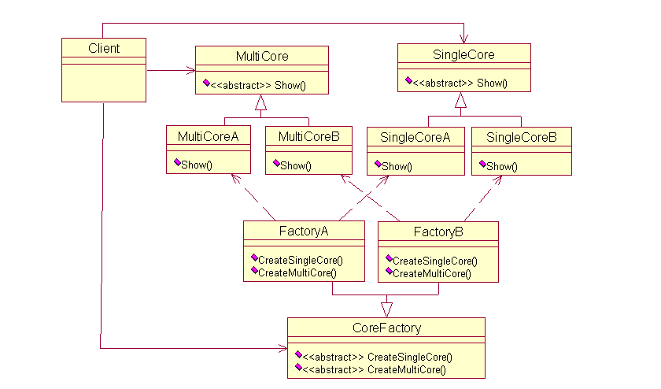

# 第五章 第 3 节 C++设计模式-3

> 原文：[`www.nowcoder.com/tutorial/10069/c6c1810db05545db9c55fda508292f56`](https://www.nowcoder.com/tutorial/10069/c6c1810db05545db9c55fda508292f56)

### 5.3 请说说工厂设计模式，如何实现，以及它的优点

**参考回答**

1.  工厂设计模式的定义

    定义一个创建对象的接口，让子类决定实例化哪个类，而对象的创建统一交由工厂去生产，有良好的封装性，既做到了解耦，也保证了最少知识原则。

2.  工厂设计模式分类

    工厂模式属于创建型模式，大致可以分为三类，**简单工厂模式、工厂方法模式、抽象工厂模式**。听上去差不多，都是工厂模式。下面一个个介绍：

    （1）简单工厂模式

    它的主要特点是需要在工厂类中做判断，从而创造相应的产品。当增加新的产品时，就需要修改工厂类。

    **举例：**有一家生产处理器核的厂家，它只有一个工厂，能够生产两种型号的处理器核。客户需要什么样的处理器核，一定要显示地告诉生产工厂。下面给出一种实现方案：

    ```cpp
    //程序实例（简单工厂模式）
    enum CTYPE {COREA, COREB};     
    class SingleCore    
    {    
    public:    
        virtual void Show() = 0;  
    };    
    //单核 A    
    class SingleCoreA: public SingleCore    
    {    
    public:    
        void Show() { cout<<"SingleCore A"<<endl; }    
    };    
    //单核 B    
    class SingleCoreB: public SingleCore    
    {    
    public:    
        void Show() { cout<<"SingleCore B"<<endl; }    
    };    
    //唯一的工厂，可以生产两种型号的处理器核，在内部判断    
    class Factory    
    {    
    public:     
        SingleCore* CreateSingleCore(enum CTYPE ctype)    
        {    
            if(ctype == COREA) //工厂内部判断    
                return new SingleCoreA(); //生产核 A    
            else if(ctype == COREB)    
                return new SingleCoreB(); //生产核 B    
            else    
                return NULL;    
        }    
    };    
    ```

    **优点：** 简单工厂模式可以根据需求，动态生成使用者所需类的对象，而使用者不用去知道怎么创建对象，使得各个模块各司其职，降低了系统的耦合性。

    **缺点：**就是要增加新的核类型时，就需要修改工厂类。这就违反了开放封闭原则：软件实体（类、模块、函数）可以扩展，但是不可修改。

    （2）工厂方法模式

    所谓工厂方法模式，是指定义一个用于创建对象的接口，让子类决定实例化哪一个类。Factory Method 使一个类的实例化延迟到其子类。

    **举例：**这家生产处理器核的产家赚了不少钱，于是决定再开设一个工厂专门用来生产 B 型号的单核，而原来的工厂专门用来生产 A 型号的单核。这时，客户要做的是找好工厂，比如要 A 型号的核，就找 A 工厂要；否则找 B 工厂要，不再需要告诉工厂具体要什么型号的处理器核了。下面给出一个实现方案：

    ```cpp
    //程序实例（工厂方法模式）
    class SingleCore    
    {    
    public:    
        virtual void Show() = 0;  
    };    
    //单核 A    
    class SingleCoreA: public SingleCore    
    {    
    public:    
        void Show() { cout<<"SingleCore A"<<endl; }    
    };    
    //单核 B    
    class SingleCoreB: public SingleCore    
    {    
    public:    
        void Show() { cout<<"SingleCore B"<<endl; }    
    };    
    class Factory    
    {    
    public:    
        virtual SingleCore* CreateSingleCore() = 0;  
    };    
    //生产 A 核的工厂    
    class FactoryA: public Factory    
    {    
    public:    
        SingleCoreA* CreateSingleCore() { return new SingleCoreA; }    
    };    
    //生产 B 核的工厂    
    class FactoryB: public Factory    
    {    
    public:    
        SingleCoreB* CreateSingleCore() { return new SingleCoreB; }    
    };  
    ```

    **优点：** **扩展性好，符合了开闭原则**，新增一种产品时，只需增加改对应的产品类和对应的工厂子类即可。

    **缺点：**每增加一种产品，就需要增加一个对象的工厂。如果这家公司发展迅速，推出了很多新的处理器核，那么就要开设相应的新工厂。在 C++实现中，就是要定义一个个的工厂类。显然，相比简单工厂模式，工厂方法模式需要更多的类定义。

    （3）抽象工厂模式

    **举例：**这家公司的技术不断进步，不仅可以生产单核处理器，也能生产多核处理器。现在简单工厂模式和工厂方法模式都鞭长莫及。抽象工厂模式登场了。它的定义为提供一个创建一系列相关或相互依赖对象的接口，而无需指定它们具体的类。具体这样应用，这家公司还是开设两个工厂，一个专门用来生产 A 型号的单核多核处理器，而另一个工厂专门用来生产 B 型号的单核多核处理器，下面给出实现的代码：

    ```cpp
    //程序实例（抽象工厂模式）
    //单核    
    class SingleCore     
    {    
    public:    
        virtual void Show() = 0;  
    };    
    class SingleCoreA: public SingleCore      
    {    
    public:    
        void Show() { cout<<"Single Core A"<<endl; }    
    };    
    class SingleCoreB :public SingleCore    
    {    
    public:    
        void Show() { cout<<"Single Core B"<<endl; }    
    };    
    //多核    
    class MultiCore      
    {    
    public:    
        virtual void Show() = 0;  
    };    
    class MultiCoreA : public MultiCore      
    {    
    public:    
        void Show() { cout<<"Multi Core A"<<endl; }    

    };    
    class MultiCoreB : public MultiCore      
    {    
    public:    
        void Show() { cout<<"Multi Core B"<<endl; }    
    };    
    //工厂    
    class CoreFactory      
    {    
    public:    
        virtual SingleCore* CreateSingleCore() = 0;  
        virtual MultiCore* CreateMultiCore() = 0;  
    };    
    //工厂 A，专门用来生产 A 型号的处理器    
    class FactoryA :public CoreFactory    
    {    
    public:    
        SingleCore* CreateSingleCore() { return new SingleCoreA(); }    
        MultiCore* CreateMultiCore() { return new MultiCoreA(); }    
    };    
    //工厂 B，专门用来生产 B 型号的处理器    
    class FactoryB : public CoreFactory    
    {    
    public:    
        SingleCore* CreateSingleCore() { return new SingleCoreB(); }    
        MultiCore* CreateMultiCore() { return new MultiCoreB(); }    
    };   
    ```

    **优点：** 工厂抽象类创建了多个类型的产品，当有需求时，可以创建相关产品子类和子工厂类来获取。

    **缺点：** 扩展新种类产品时困难。抽象工厂模式需要我们在工厂抽象类中提前确定了可能需要的产品种类，以满足不同型号的多种产品的需求。但是如果我们需要的产品种类并没有在工厂抽象类中提前确定，那我们就需要去修改工厂抽象类了，而一旦修改了工厂抽象类，那么所有的工厂子类也需要修改，这样显然扩展不方便。

**答案解析**

三种工厂模式的 UML 图如下：

1.  简单工厂模式 UML

    

2.  工厂方法的 UML 图

    

3.  抽象工厂模式的 UML 图

    