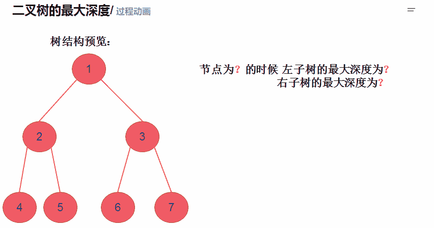

# 第六章 第 9 节 NC13 二叉树的最大深度

> 原文：[`www.nowcoder.com/tutorial/10069/14bea58dd7c94e7091dbf58fb8d5cda5`](https://www.nowcoder.com/tutorial/10069/14bea58dd7c94e7091dbf58fb8d5cda5)

### NC13 二叉树的最大深度

**- 题目描述：**


**- 题目链接：**

[`www.nowcoder.com/practice/8a2b2bf6c19b4f23a9bdb9b233eefa73?tpId=188&&tqId=36522&rp=1&ru=/ta/job-code-high-week&qru=/ta/job-code-high-week/question-ranking`](https://www.nowcoder.com/practice/8a2b2bf6c19b4f23a9bdb9b233eefa73?tpId=188&&tqId=36522&rp=1&ru=/ta/job-code-high-week&qru=/ta/job-code-high-week/question-ranking)
**- 设计思想：**


详细操作流程看下图


**- 代码：**
c++版本:

```cpp
 /**
 * struct TreeNode {
 *    int val;
 *    struct TreeNode *left;
 *    struct TreeNode *right;
 * };
 */

class Solution {
public:
    /**
     * 
     * @param root TreeNode 类 
     * @return int 整型
     */
    int maxDepth(TreeNode* root) {
        if(root == NULL) return 0; //根点为空返回 0
        int lh = maxDepth(root->left); // 求出左子树的最大高度
        int rh = maxDepth(root->right); //求出右子树的最大高度
        return max(lh,rh) + 1; //左右子树高度求一个最大然后+1
    }
};

```

Java 版本：

```cpp
import java.util.*;

/*
 * public class TreeNode {
 *   int val = 0;
 *   TreeNode left = null;
 *   TreeNode right = null;
 * }
 */

public class Solution {
    /**
     * 
     * @param root TreeNode 类 
     * @return int 整型
     */
    public int maxDepth (TreeNode root) {
        if(root == null) return 0; //节点为空返回 0
        int lh = maxDepth(root.left); // 求出左子树的最大高度
        int rh = maxDepth(root.right); //求出右子树的最大高度
        return Math.max(lh,rh) + 1; //左右子树高度求一个最大然后+1
    }
}
```

Python 版本:

```cpp
# class TreeNode:
#     def __init__(self, x):
#         self.val = x
#         self.left = None
#         self.right = None

#
# 
# @param root TreeNode 类 
# @return int 整型
#
class Solution:
    def maxDepth(self , root ):
        # write code here
        if not root : return 0 #节点为空返回 0
        lh = self.maxDepth(root.left) #求出左子树的最大高度
        rh = self.maxDepth(root.right) #求出右子树的最大高度
        return max(lh,rh) + 1 #左右子树高度求一个最大然后+1

```