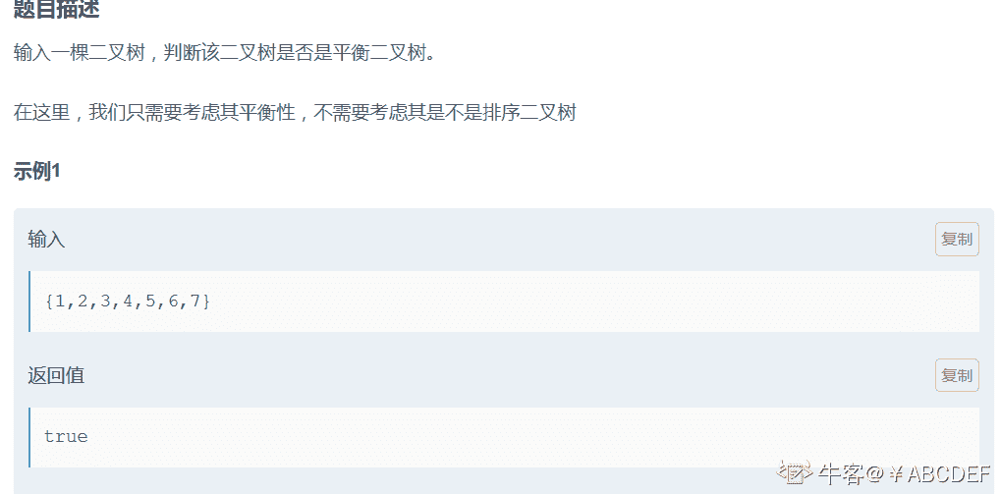
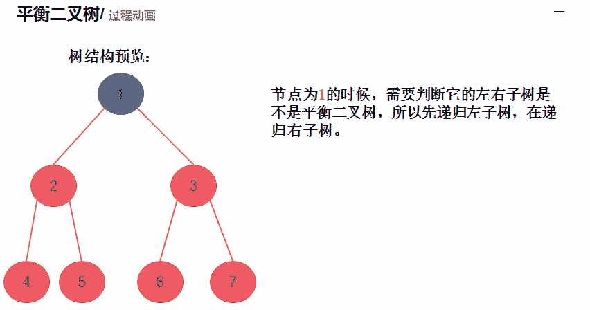

# 第六章 第 10 节 NC62 平衡二叉树

> 原文：[`www.nowcoder.com/tutorial/10069/6aefeaa4dc8f4537a5ebeab09447ec26`](https://www.nowcoder.com/tutorial/10069/6aefeaa4dc8f4537a5ebeab09447ec26)

### NC62 平衡二叉树

**- 题目描述：**


**- 题目链接：**

[`www.nowcoder.com/practice/8b3b95850edb4115918ecebdf1b4d222?tpId=188&&tqId=36580&rp=1&ru=/ta/job-code-high-week&qru=/ta/job-code-high-week/question-ranking`](https://www.nowcoder.com/practice/8b3b95850edb4115918ecebdf1b4d222?tpId=188&&tqId=36580&rp=1&ru=/ta/job-code-high-week&qru=/ta/job-code-high-week/question-ranking)
**- 设计思想：**


详细操作流程看下图


**- 代码：**
c++版本:

```cpp
 class Solution {
public:
    int getHeight(TreeNode* root){
        if(root == NULL) return 0;//如果节点为空高度为 0
        int lh = getHeight(root->left);//返回左子树高度
        int rh = getHeight(root->right);//返回右子树高度
        return max(lh,rh) + 1;    //取左子树和右子树高度中最大的并且+1
    }
    bool IsBalanced_Solution(TreeNode* pRoot) {
        if(pRoot == NULL) return true;//节点为空返回 true
        if(!IsBalanced_Solution(pRoot->left)) return false;//节点的左子树不是平衡二叉树返回 false
        if(!IsBalanced_Solution(pRoot->right)) return false;//节点的右子树不是平衡二叉树返回 false
        //左右都为平衡二叉树判断高度差
        int lh = getHeight(pRoot->left);
        int rh = getHeight(pRoot->right);
        if(abs(lh - rh) > 1) return false;//如果左右子树高度差大于 1 就返回 false
        return true;
    }

};

```

Java 版本：

```cpp
public class Solution {
    public boolean IsBalanced_Solution(TreeNode root) {
        if(root == null) return true;//节点为空返回 true
        if(IsBalanced_Solution(root.left) == false) return false; //节点的左子树不是平衡二叉树返回 false
        if(IsBalanced_Solution(root.right) == false) return false;//节点的右子树不是平衡二叉树返回 false
        //左右都为平衡二叉树判断高度差
        int lh = getHeight(root.left);
        int rh = getHeight(root.right);
        if(Math.abs(lh - rh) > 1) return false;//如果左右子树高度差大于 1 就返回 false
        return true;
    }
    public int getHeight(TreeNode root){
        if(root == null) return 0;//如果节点为空高度为 0
        int lh = getHeight(root.left);//返回左子树高度
        int rh = getHeight(root.right);//返回右子树高度
        return Math.max(lh,rh) + 1;//取左子树和右子树高度中最大的并且+1
    }

}

```

Python 版本:

```cpp
class Solution:
    def IsBalanced_Solution(self, pRoot):
        # write code here
        if not pRoot: return True #节点为空返回 true
        if self.IsBalanced_Solution(pRoot.left) == False : return False #节点的左子树不是平衡二叉树返回 false
        if self.IsBalanced_Solution(pRoot.left) == False : return False #节点的右子树不是平衡二叉树返回 false
        #左右都为平衡二叉树判断高度差
        lh = self.getHeight(pRoot.left) 
        rh = self.getHeight(pRoot.right)
        if abs(lh - rh) > 1: return False #如果左右子树高度差大于 1 就返回 false
        return True

    def getHeight(self,root):
        if not root: return 0 #如果节点为空高度为 0
        lh = self.getHeight(root.left) #返回左子树高度
        rh = self.getHeight(root.right) #返回右子树高度
        return max(lh,rh) + 1 #取左子树和右子树高度中最大的并且+1

```