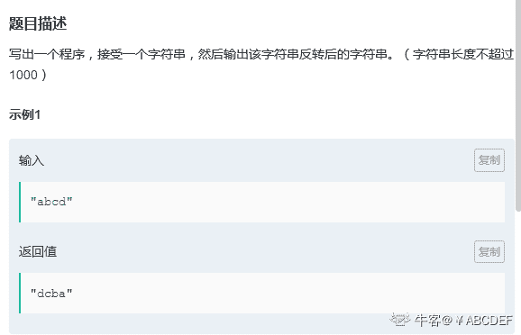
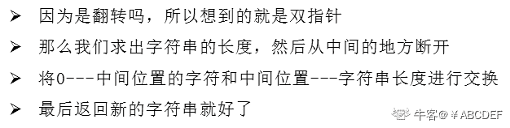
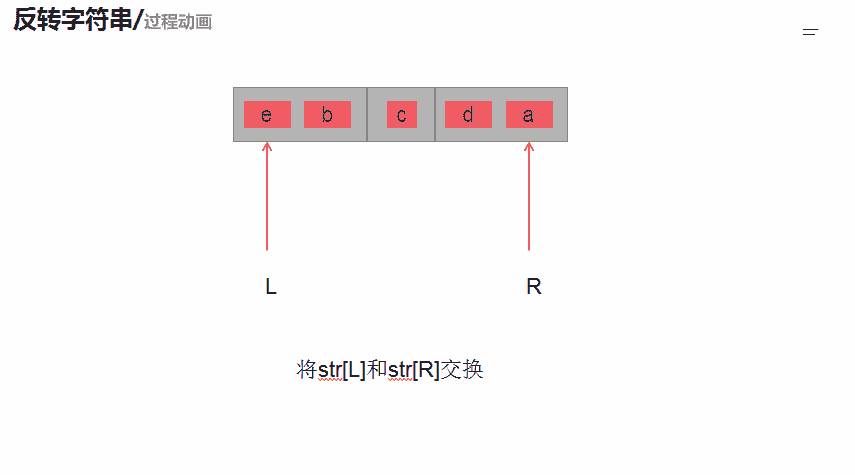

# 第六章 第 16 节 NC103 反转字符串

> 原文：[`www.nowcoder.com/tutorial/10069/d8fa682d476d45d4868772d576a21bdc`](https://www.nowcoder.com/tutorial/10069/d8fa682d476d45d4868772d576a21bdc)

### NC103 反转字符串

**- 1、题目描述：**


**- 2、题目链接：**
[`www.nowcoder.com/practice/c3a6afee325e472386a1c4eb1ef987f3?tpId=117&&tqId=35028&rp=1&ru=/ta/job-code-high&qru=/ta/job-code-high/question-ranking`](https://www.nowcoder.com/practice/c3a6afee325e472386a1c4eb1ef987f3?tpId=117&&tqId=35028&rp=1&ru=/ta/job-code-high&qru=/ta/job-code-high/question-ranking)

**-3、 设计思想：**

详细操作流程看下图：


**-5、代码：**
c++版本:

```cpp
 class Solution {
public:
    /**
     * 反转字符串
     * @param str string 字符串 
     * @return string 字符串
     */
    string solve(string str) {
        // write code here
        int len = str.size(); //求出字符的长度
        for(int i = 0;i < len/2;i ++){//然后从中间切开，第一个和最后一个交换
            swap(str[i],str[len - 1 - i]);
        }
        return str;
    }
};

```

Java 版本：

```cpp
import java.util.*;

public class Solution {
    /**
     * 反转字符串
     * @param str string 字符串 
     * @return string 字符串
     */
    public String solve (String str) {
        // write code here
        char[] str1 = str.toCharArray(); //先转化为字符串数组
        int len = str.length();//求字符串的长度
        for(int i = 0;i < len/2;i ++){//然后从中间切开，第一个和最后一个交换
            char tmp = str1[i];
            str1[i] = str1[len - 1 - i];
            str1[len-1-i] = tmp;
        }
        return new String(str1);返回一个新的字符串

    }
}

```

Python 版本:

```cpp
#
# 反转字符串
# @param str string 字符串 
# @return string 字符串
#
class Solution:
    def solve(self , str ):
        l,r = 0,len(str) - 1# 定义一个双指针
        s = list(str) #将 str 变为 list，然后可以进行字符的交换
        while l < r:#进行字符串的翻转
            c = s[l]
            s[l] = s[r]
            s[r] = c
            l += 1
            r -= 1
        return ''.join(s)

```