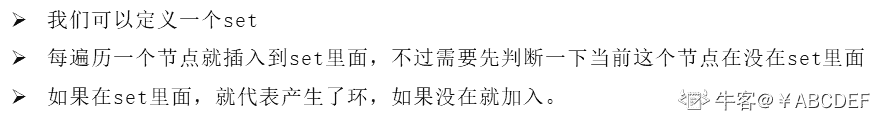
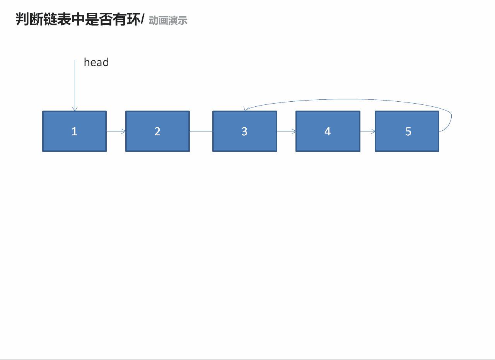

# 第六章 第 24 节 NC4 判断链表中是否有环

> 原文：[`www.nowcoder.com/tutorial/10069/2fcbaa5146b7467eb1c0b64a060e7995`](https://www.nowcoder.com/tutorial/10069/2fcbaa5146b7467eb1c0b64a060e7995)

### NC4 判断链表中是否有环

**- 1、题目描述：**


**- 2、题目链接：**
[`www.nowcoder.com/practice/650474f313294468a4ded3ce0f7898b9?tpId=117&&tqId=34925&rp=1&ru=/activity/oj&qru=/ta/job-code-high/question-ranking`](https://www.nowcoder.com/practice/650474f313294468a4ded3ce0f7898b9?tpId=117&&tqId=34925&rp=1&ru=/activity/oj&qru=/ta/job-code-high/question-ranking)

**-3、 设计思想：**

详细操作流程看下图：


**-5、代码：**
c++版本:

```cpp
 /**
 * Definition for singly-linked list.
 * struct ListNode {
 *     int val;
 *     ListNode *next;
 *     ListNode(int x) : val(x), next(NULL) {}
 * };
 */
class Solution {
public:
    bool hasCycle(ListNode *head) {
        set<ListNode *> se;//定义一个集合
        while(head != NULL){//如果头节点不为空，就遍历链表
            if(se.count(head)){//判断当前节点是否出现过，如果出现过就返回 true
                return true;
            }
            se.insert(head);//如果没有出现过就插入
            head = head->next;//head 等于下一个节点
        } return false;

    }
};

```

Java 版本：

```cpp
import java.util.*;
/**
 * Definition for singly-linked list.
 * class ListNode {
 *     int val;
 *     ListNode next;
 *     ListNode(int x) {
 *         val = x;
 *         next = null;
 *     }
 * }
 */
public class Solution {
    public boolean hasCycle(ListNode head) {
        Set<ListNode> se = new HashSet<ListNode>();//定义一个集合
          while (head != null) {//如果头节点不为空，就遍历链表
            if (se.contains(head)) {//判断当前节点是否出现过，如果出现过就返回 true
                return true;
            }
            se.add(head);//如果没有出现过就插入
            head = head.next;//head 等于下一个节点
        }
        return false;
    }
}

```

Python 版本:

```cpp
# class ListNode:
#     def __init__(self, x):
#         self.val = x
#         self.next = None

#
# 
# @param head ListNode 类 
# @return bool 布尔型
#
class Solution:
    def hasCycle(self , head ):
        # write code here
        se = set()#定义一个集合
        while head != None:#如果头节点不为空，就遍历链表
            if head in se:#判断当前节点是否出现过，如果出现过就返回 true
                return True
            se.add(head)#如果没有出现过就插入
            head = head.next#head 等于下一个节点
        return False

```