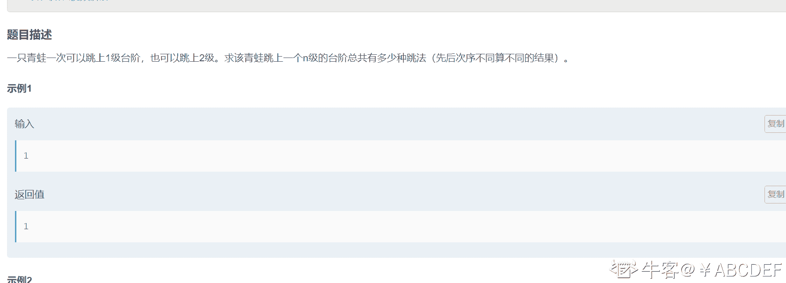

# 第六章 第 27 节 NC68 跳台阶

> 原文：[`www.nowcoder.com/tutorial/10069/fbd5cf1a0821491eada809ed78720ffc`](https://www.nowcoder.com/tutorial/10069/fbd5cf1a0821491eada809ed78720ffc)

### NC68 跳台阶

**- 1、题目描述：**


**- 2、题目链接：**
[`www.nowcoder.com/practice/8c82a5b80378478f9484d87d1c5f12a4?tpId=188&&tqId=37379&rp=1&ru=/activity/oj&qru=/ta/job-code-high-week/question-ranking`](https://www.nowcoder.com/practice/8c82a5b80378478f9484d87d1c5f12a4?tpId=188&&tqId=37379&rp=1&ru=/activity/oj&qru=/ta/job-code-high-week/question-ranking)

**-3、 设计思想：**


**-5、代码：**
c++版本:

```cpp
 class Solution {
public:

    int jumpFloor1(int number) {
        if(number == 1) return 1;//只有一个台阶的时候就有一种跳法
        if(number == 2) return 2;//只有 2 个台阶的时候就有 2 种跳法 1）每次跳 1 格 2）直接跳 2 格
        //第 n 个台阶是不是可以从第 n-1 个台阶跳过来，或者第 n-2 格台阶跳过来，总和就是第 n 个台阶的总和
        return jumpFloor(number-1)+jumpFloor(number-2);
    }
        int jumpFloor(int number) {
            if(number == 1) return 1;
            vector<int>dp(number + 1,1);
            for(int i = 2;i <= number;i ++){
                dp[i] = dp[i - 1] + dp[i - 2];
            }
            return dp[number];
    }
};

```

Java 版本：

```cpp
public class Solution {
    public int JumpFloor1(int target) {
        if(target == 1) return 1;//只有一个台阶的时候就有一种跳法
        if(target == 2) return 2;//只有 2 个台阶的时候就有 2 种跳法 1）每次跳 1 格 2）直接跳 2 格
        //第 n 个台阶是不是可以从第 n-1 个台阶跳过来，或者第 n-2 格台阶跳过来，总和就是第 n 个台阶的总和
        return JumpFloor(target-1)+JumpFloor(target-2);
    }
    public int JumpFloor(int target){
        int [] dp = new int[target + 10];
        dp[0] = 1;
        dp[1] = 1;
        for(int i = 2;i <= target;i ++){
            dp[i] = dp[i - 1] + dp[i-2];
        }
        return dp[target];
    }
}

```

Python 版本:

```cpp
# -*- coding:utf-8 -*-
class Solution:
    def jumpFloor1(self, number):
        # write code here
        if number == 1:return 1 #只有一个台阶的时候就有一种跳法
        if number == 2: return 2#只有 2 个台阶的时候就有 2 种跳法 1）每次跳 1 格 2）直接跳 2 格
        #第 n 个台阶是不是可以从第 n-1 个台阶跳过来，或者第 n-2 格台阶跳过来，总和就是第 n 个台阶的总和
        return self.jumpFloor(number - 1) + self.jumpFloor(number - 2)
    #上面的递归写法超时，所以可以通过上面递归来写出 dp 方程式
    def jumpFloor(self, number):
        dp = [1 for _ in range(number + 10)]
        for i in range(2,number + 1):
            dp[i] = dp[i-1] + dp[i - 2]
        return dp[number]

```