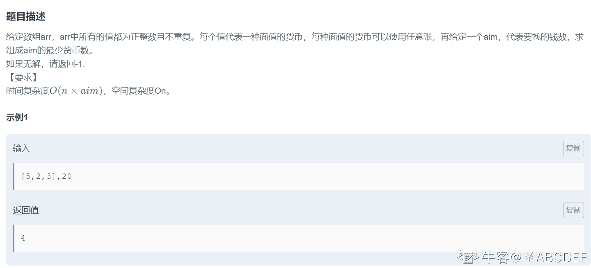
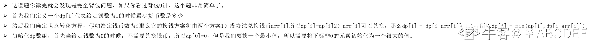
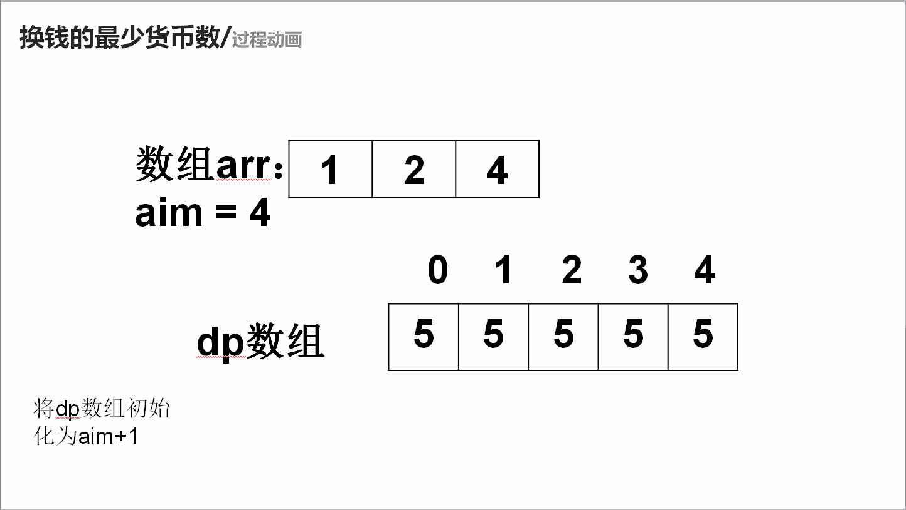

# 第六章 第 34 节 NC126 换钱的最少货币数

> 原文：[`www.nowcoder.com/tutorial/10069/e4b46f1164fe4969918910d5c8fca4cb`](https://www.nowcoder.com/tutorial/10069/e4b46f1164fe4969918910d5c8fca4cb)

### NC126 换钱的最少货币数

**- 1、题目描述：**


**- 2、题目链接：**

[`www.nowcoder.com/practice/3911a20b3f8743058214ceaa099eeb45?tpId=196&&tqId=37128&rp=1&ru=/activity/oj&qru=/ta/job-code-total/question-ranking`](https://www.nowcoder.com/practice/3911a20b3f8743058214ceaa099eeb45?tpId=196&&tqId=37128&rp=1&ru=/activity/oj&qru=/ta/job-code-total/question-ranking)
**-3、 设计思想：**

详细操作流程看下图：


**-5、代码：**
c++版本:

```cpp
 class Solution {
public:
    /**
     * 最少货币数
     * @param arr int 整型 vector the array
     * @param aim int 整型 the target
     * @return int 整型
     */
    int minMoney(vector<int>& arr, int aim) {
        // write code here
         int Max = aim + 1;//定一个全局最大值
        vector<int> dp(aim + 1, Max);//把 dp 数组全部定为最大值
        dp[0] = 0;//总金额为 0 的时候所需钱币数一定是 0
        for (int i = 1; i <= aim; i ++) {// 遍历目标值
            for (int j = 0; j < arr.size();j ++) {// 遍历钱币
                if (arr[j] <= i) {//如果当前的钱币比目标值小就可以兑换
                    dp[i] = min(dp[i], dp[i - arr[j]] + 1);
                }
            }
        }
        return dp[aim] > aim ? -1 : dp[aim];
    }
};

```

Java 版本：

```cpp
import java.util.*;

public class Solution {
    /**
     * 最少货币数
     * @param arr int 整型一维数组 the array
     * @param aim int 整型 the target
     * @return int 整型
     */
    public int minMoney (int[] arr, int aim) {
        // write code here
        int Max = aim + 1;//定一个全局最大值
        int []dp = new int[aim + 1];//dp[i]的含义是目标值为 i 的时候最少钱币数是多少。
        Arrays.fill(dp,Max);//把 dp 数组全部定为最大值
        dp[0] = 0;//总金额为 0 的时候所需钱币数一定是 0
        for(int i = 1;i <= aim;i ++){// 遍历目标值
            for(int j = 0;j < arr.length;j ++){// 遍历钱币
                if(arr[j] <= i){//如果当前的钱币比目标值小就可以兑换
                    dp[i] = Math.min(dp[i],dp[i-arr[j]] + 1);

                }
            }
        }
        return dp[aim] > aim ? -1 : dp[aim];

    }
}

```

Python 版本:

```cpp
#
# 最少货币数
# @param arr int 整型一维数组 the array
# @param aim int 整型 the target
# @return int 整型
#
class Solution:
    def minMoney(self , arr , aim ):
        # write code here
        dp = [aim + 1] * (aim + 1)#把 dp 数组全部定为最大值
        dp[0] = 0#总金额为 0 的时候所需钱币数一定是 0
        for i in range(1,aim + 1):#遍历目标值
            for j in arr: #遍历钱币
                if j <= i:#如果当前的钱币比目标值小就可以兑换
                    dp[i] = min(dp[i],dp[i-j] + 1)
        if dp[aim] > aim:
            return -1
        else:
            return dp[aim]

```