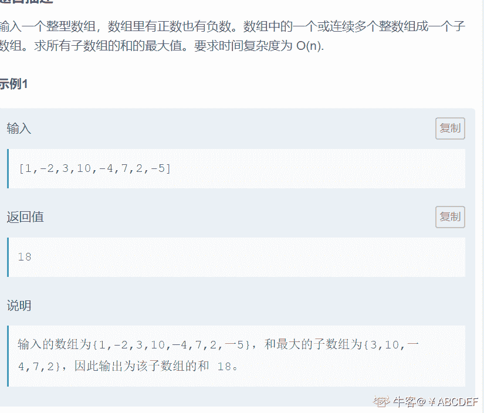
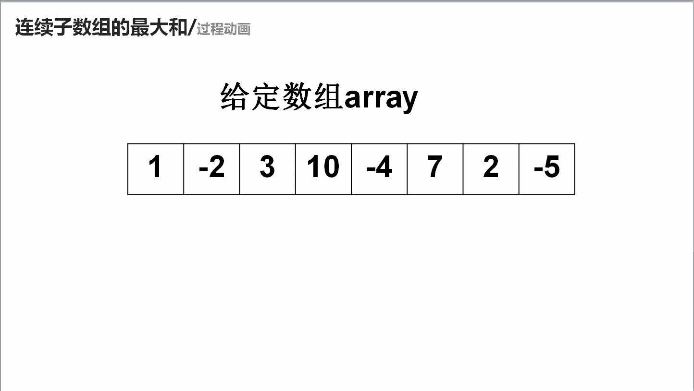

# 第六章 第 37 节 NC67 连续子数组的最大和

> 原文：[`www.nowcoder.com/tutorial/10069/0d84ed1e78f74cb286bde0148a8b7417`](https://www.nowcoder.com/tutorial/10069/0d84ed1e78f74cb286bde0148a8b7417)

### NC67 连续子数组的最大和

**- 1、题目描述：**


**- 2、题目链接：**

[`www.nowcoder.com/practice/459bd355da1549fa8a49e350bf3df484?tpId=190&tqId=35198&rp=1&ru=%2Factivity%2Foj&qru=%2Fta%2Fjob-code-high-rd%2Fquestion-ranking&tab=answerKey`](https://www.nowcoder.com/practice/459bd355da1549fa8a49e350bf3df484?tpId=190&tqId=35198&rp=1&ru=%2Factivity%2Foj&qru=%2Fta%2Fjob-code-high-rd%2Fquestion-ranking&tab=answerKey)
**-3、 设计思想：**

详细操作流程看下图：


**-5、代码：**
c++版本:

```cpp
class Solution {
public:
    int FindGreatestSumOfSubArray(vector<int> array) {
        vector<int>dp(array.size() +10,0);//dp[i]代表在下标为 i 时子数组的值
        dp[0] = array[0];//dp[0]就应该等于 array 的第一个元素
        int res = array[0];//用来保存子数组的最大值
        for(int i = 1;i < array.size();i ++){
            //因为是连续，所以 i-1 位置时的子数组值如果小于 0，就没必要在加了，因为越加越小
            //如果大于 0 就让，dp[i] = dp[i-1] + array[i]
            dp[i] = max(dp[i-1],0)+array[i];
            res = max(res,dp[i]);//dp 只要更新，res 就需要更新
        }
        return res;
    }
};

```

Java 版本：

```cpp
public class Solution {
    public int FindGreatestSumOfSubArray(int[] array) {
        int []dp = new int[array.length];//dp[i]代表在下标为 i 时子数组的值
        dp[0] = array[0];//dp[0]就应该等于 array 的第一个元素
        int res = array[0];//用来保存子数组的最大值
        for(int i = 1;i < array.length;i ++){
            //因为是连续，所以 i-1 位置时的子数组值如果小于 0，就没必要在加了，因为越加越小
            //如果大于 0 就让，dp[i] = dp[i-1] + array[i]
            dp[i] = Math.max(dp[i-1],0)+array[i];
            res = Math.max(res,dp[i]);//dp 只要更新，res 就需要更新
        }
        return res;
    }
}

```

Python 版本:

```cpp
# -*- coding:utf-8 -*-
class Solution:
    def FindGreatestSumOfSubArray(self, array):
        # write code here
        dp = [0] * (len(array) +10)#dp[i]代表在下标为 i 时子数组的值
        dp[0] = array[0]#dp[0]就应该等于 array 的第一个元素
        res = array[0]#用来保存子数组的最大值
        for i in range(1,len(array)):
            #因为是连续，所以 i-1 位置时的子数组值如果小于 0，就没必要在加了，因为越加越小
            #如果大于 0 就让，dp[i] = dp[i-1] + array[i]
            dp[i] = max(dp[i-1],0)+array[i];
            res = max(res,dp[i])#dp 只要更新，res 就需要更新
        return res

```