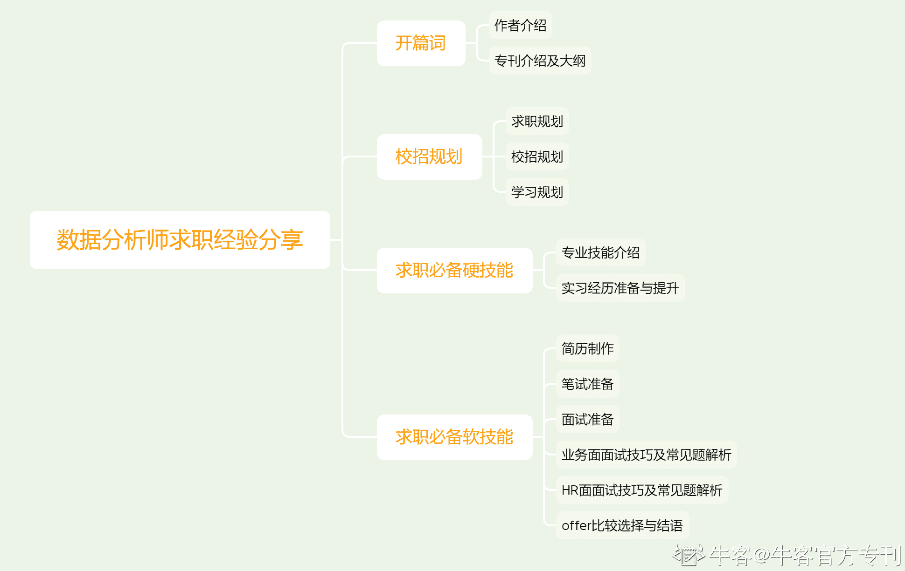

# 第一章 第 2 节 专刊介绍及大纲

> 原文：[`www.nowcoder.com/tutorial/10062/10e2ab07bc0146d2ab613817c7aaab97`](https://www.nowcoder.com/tutorial/10062/10e2ab07bc0146d2ab613817c7aaab97)

# 专刊内容

对于没参加过校招的同学来说，可能会对校招感到迷茫比如不知道该如何写准备校招、不知道如何写简历等，本专刊会详细的从校招的各个环节来介绍一下该怎么准备，内容包括:

1.  校招介绍
2.  岗位技能树
3.  简历如何撰写
4.  如何通关笔面试
5.  如何选择合适自己的 offer 以及如何 Argue 到更好的 offer

       如果你是什么都不懂，不知道该如何学习的小白或者对于校招信息不了解的同学，那么本专刊正是为你打造的，本刊绝对不会让你失望，仔细介绍了校招中的各个坑以及如去避免它。

# 学习本专刊你能收获什么

*   优秀简历模板
*   岗位技能树
*   如何点满技能点
*   笔面试通关秘籍

# 本专刊适合哪些用户

1.  基础较为薄弱，想要找对学习方向；
2.  复习时间较短，希望在短时间内能达到面试要求；
3.  面试经验不足，想要在面试中有更好的表现；
4.  对校招不了解，想要快速了解加入秋招。

**关于阅读本专刊的 tips**

*   在本专刊中，我会结合秋招的不同阶段，按照时间线和不同场景的维度拆分，进行分板块的介绍。所以处于秋招不同环节、对不同场景有问题的同学都可以根据自己的问题重点阅读不同的板块。
*   对于一些主观问题（如职业规划和 offer 抉择），代表的仅是我的个人想法，大家可以对可取的地方进行借鉴，也许我的思维方式对你也会有所启发，但需求同存异。不同人的侧重点不同，最后的抉择需要更加全面的以自己的具体情境出发。
*   大家如果对文章内的任何内容有疑问，或有想法想要和我沟通，欢迎在每一个章节的评论区留言，我看到后一定会尽我所能做出详细解答。

 # 专刊大纲

