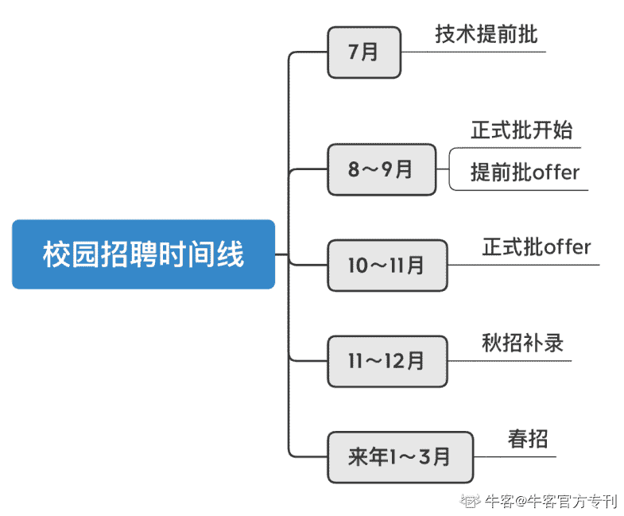

# 第二章 第 1 节 求职规划

> 原文：[`www.nowcoder.com/tutorial/10062/9ae46a00bc0748689cbcbf58ce083e01`](https://www.nowcoder.com/tutorial/10062/9ae46a00bc0748689cbcbf58ce083e01)

# 1 **了解校招**

## 1.1 **介绍**

        顾名思义，校招面向应届毕业生，是各大公司招募优秀应届生、培养人才的途径之一。相对来讲，校招开放的岗位空缺（headcount,下文使用简称 hc）比较多，辅以比较全面的培训机制，每年都会吸引广大应届毕业生投递，竞争压力也会相应增大。特别是今年因为疫情，给校招又蒙上了一丝不确定性，所以提前对校招做出了解才能在千军万马中脱颖而出。

## 1.2 **时间及面向人群**

  

        从 7、8 月开始，互联网行业会抢先开始秋招，9、10 月左右其他行业也会陆陆续续开启秋招，对于未招满的岗位，会在年底和来年春天进行秋招补录和春招。在秋招中，最早在 7 月，有一些公司会开启技术提前批的招聘，有能力的同学就可以早早拿到保底 offer。8～9 月是正式批开启的时间，也是主流批次。通常来讲，正式批的 offer 会在 10～11 月统一发放。

        关于“应届”的定义，以今年为例，2020 年秋季和 2021 年春季进行的校招的目标人群是 2021 届毕业生，通常也就是毕业时间在 2020 年 10 月到 2021 年 9 月之间的学生群体。大部分留学生（包括我）是在 2020 年底毕业的，而大部分的国内应届生是 2021 年夏季毕业，都属于 2021 届应届生的范围。需要注意的是，不同公司对应届生的定义和划分可能有所不同，也有些公司接受去年的应届生参与校招，所以具体情况应参考公司具体的校招规定。

## 1.3 **形式**

按照时间先后，常见的数据分析招聘流程分为简历筛选、笔试、业务面、高管面、HR 面五个环节。与产品、运营等典型非技术岗不同，大部分数据分析岗是没有群面的，且有个别公司是没有 HR 面的。这其中的每一个节点都是很重要的，并且对受试者能力的考察有不同的侧重，在后面的章节中我会一一拆解重点。

## 1.4 **秋招是最优选择**

        有些同学可能会有所疑问，市面上有大量的岗位空缺，我一定要在大四刚开始的时候参加秋招吗？答案是：是的。、

        第一，和春招相比，秋招的 hc 更多、时间上更持久、且竞争压力较低。而春招只是秋招的补录，在岗位和城市选择上都会有所局限，心理压力也会更大。并且，**除了秋招没有找到理想岗位的同学外**，考验失败的同学也会选择参加春招。岗位少、人数多，这些因素大大加剧了春招的竞争压力。

        第二，和社招相比，校招对业务能力和经验的要求会放宽，培养机制也更加完善健全。因为面向的人群是未毕业的学生，校招更多考察的是大家的通用能力，比如团队协作和沟通能力等。综上所述，校招，特别是秋招，应该是准毕业生们的首选。所以，大家面对秋招，一定要用百分百的认真准备完善，拿到满意的 offer。机会是留给有准备的人的，秋招过后才反应过来，就为时已晚了。

# **2 数据分析师岗位介绍**

## 2.1 岗位概况 

         “数据分析师”虽然是一个岗位，但下面的分支千差万别。宏观来看，数据分析的工作方向可以分为两类：技术向和业务向。

        技术向的数据分析偏向数据挖掘和算法，包括数据工程师、数据挖掘、数据科学家等。这类岗位对算法/机器学习的要求较高，需要熟悉各算法的运行机制并进行优化，需要有很好的数学/统计/计算机基础。同时，一些公司会把此岗位归结于算法或数据开发岗而不是数据分析师，所以在数据分析校招岗位中较少。

        而业务向的数据分析偏向产品/运营，title 上来看包括业务分析、经营分析、商业分析等。通常，业务数据分析师会和产品或者运营合作，通过数据提取和分析对产品或运营做描述性或探索性的分析及可视化，以数据驱动的方法对业务决策提供支撑和建议。这两个方向的区分从 JD 叙述中也可以看出，比如技术向的数据分析师需要有模型经验，而商业分析岗偏好有咨询背景的同学，对技术的要求没有那么严格。

|  | 技术向 | 业务向 |
| 侧重点 | 数据科学、数据挖掘、算法 | 产品、运营策略 |
| 技术门槛 | 高 | 低 |
| 校招需求量 | 小 | 大 |
| 常见岗位 | 数据工程师、数据科学家 | 商业分析师、经营分析师、业务分析师 |
| 工作内容 | 建立模型、优化模型、数据库建设 | 结合产品、运营工作，以数据支撑业务决策 |
| 技能要求 | a.有很好的数学/统计/计算机基础 b.有机器学习知识储备及实践经验，熟悉各算法的运行机制 c.必须熟练使用 Python 或 Rd.偏好工科背景 | a.良好的统计学基础 b.对主流算法的概念及优缺点有一定了解 c.熟练使用 SQL，Python 或 R 为加分项 d.数据分析或咨询实习经历 e.产品、运营等业务思维 |
| 薪资 | 一线城市 28～40w/年 |

        虽然可能都被称为“数据分析”，但大家也能看出来，这两个分支的工作内容、未来发展有很大的差别，需要大家在求职前对自己有一个准确的定位，综合考虑个人技能和职业发展。拿我来说，因为我本科学的商科，并非技术出身（技能），之前做的实习也都比较前端（经历），并且我比较偏向靠近用户的岗位，长期职业目标是转型为商业分析师或策略产品经理（规划），所以我的求职方向是于业务向的数据分析。

## **2.2 数据分析师在互联网**

        关于行业选择，数据分析岗的普适性还是比较高的，覆盖互联网、快消、金融、地产等多个行业，侧重点也各不相同。比如互联网中针对产品和运营的数据分析会比较多，快消偏向市场和消费者分析，而金融行业中会结合 risk management 和一些独特的 financial modeling 方式进行分析。所以，数据分析本身只是工具，在与不同业务形态的结合中产生了自己的价值。

        在互联网中，在具体细分的业务形态包括短视频&直播、电商、出行、本地生活、航旅、游戏、教育等，覆盖了包括 BATTMD 在内的各大主流大厂。可以说，在每个细分业务垂类中，分析师的工作侧重点也会有所不同。不同于开发岗等上游岗位，数据分析师位于中游，也需要对所处业务有所了解。

        数据分析在互联网中的求职门槛适中，并没有算法类岗位要求那么高，但对于 0 技术基础的求职者来说也是比较困难的。在校招中，通常会安排三轮面试，其中包括三轮业务面或两轮业务面+一轮 HR 面。业务面中，有时会出现现场写代码（通常为 SQL）或口述代码思路的题。同时，另一大重要的考察能力点是逻辑思维。技术的欠缺是有形的，可以随时弥补，而逻辑思维是决定一个分析师职业天花板和竞争力的重要因素。