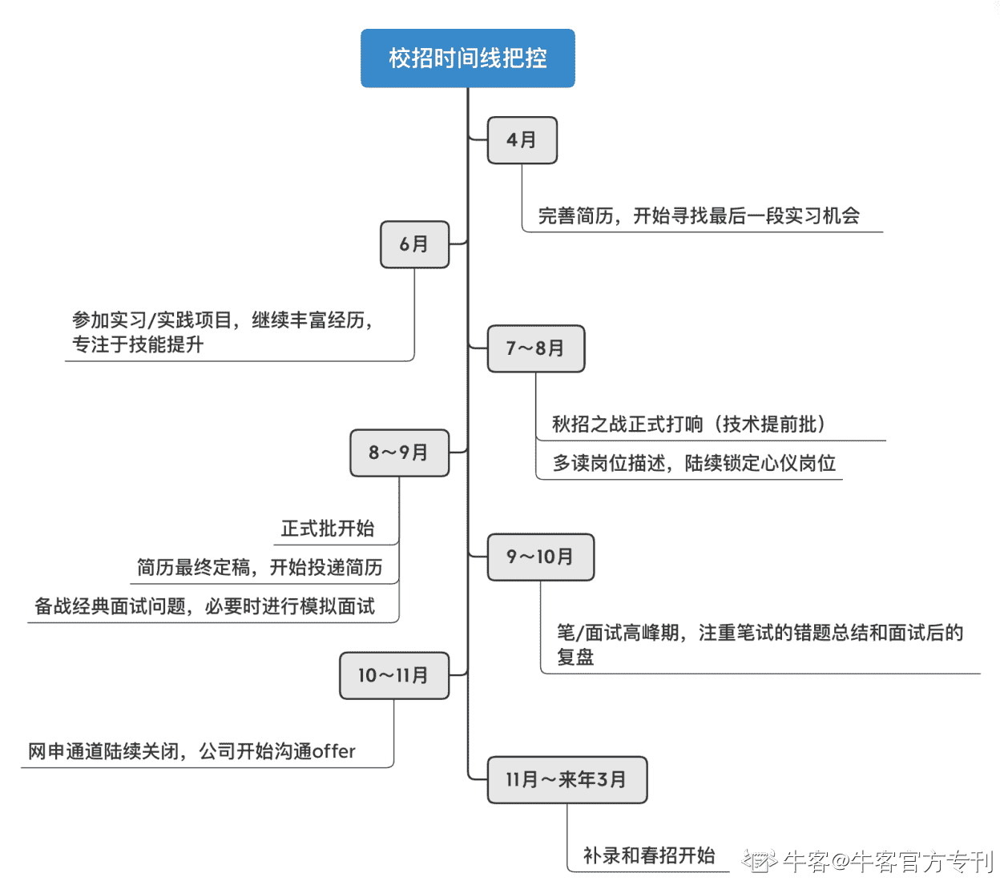

# 第二章 第 2 节 校招规划

> 原文：[`www.nowcoder.com/tutorial/10062/90a770176e4e48edb3ee7f66d49b7bf1`](https://www.nowcoder.com/tutorial/10062/90a770176e4e48edb3ee7f66d49b7bf1)

# 1 **如何明确自己的职业方向**

        我们要明白一个概念：行业和岗位的选择，是一个双向选择的过程。所以，我们既要从个人的角度去挑选行业，比如兴趣爱好、发展、薪资、头部公司地区；也要从公司的角度出发，考虑自己的专业、能力、经历与这个行业/岗位是否匹配。我选择职业方向的路径是先从兴趣出发，再结合当下就业市场竞争力（技能的可替代性），以及未来的职业发展天花板的高度（薪酬、晋升、换方向的可能性）综合考虑的。

        当锁定一个具体行业后，对各岗位的工作内容做出了解也是你需要做的。以互联网为例，你需要提前了解算法、开发、数据、产品、运营、市场、职能等岗位的工作内容，才能将自己的兴趣和能力进行匹配。这里一个比较有效的方法是多阅读岗位 JD，全方位了解工作内容和用人方要求。

        这里推荐两个明确职业方向的方法：**networking（人脉关系网）和实习**。

        首先，想提醒大家注意的是，最好对自己早做规划并充分利用身边的资源，可以使用牛客网求职交流圈、讨论帖等方式进行了解。如果有资源，更推荐的是联系学长学姐、校友等业内人士咨询。领英也是一个我比较推荐的平台，我在规划期间会在 LinkedIn 领英上通过精准搜索找到同行业的校友沟通，对方时间方便的话甚至可以准备好自己的问题约半小时时间电话沟通，既可以解决困惑，又可以争取内推机会。这种方法的好处是可以快速了解一个行业的发展前景和特定岗位的工作内容、考察技能，自己现存的优劣势等。同时，当对某家公司产生兴趣后，也可以通过在领英上查看这家公司的整体人员背景和职业发展历程了解公司情况。总之，相比自己独行，通过广泛的沟通和投入可以达到事半功倍的效果，不要觉得不好意思。

        此外，进行职业方向的选择还有一个非常有效的方法——实习。所谓纸上得来终觉浅，绝知此事要躬行，通过实习中的亲身实践，可以形成对岗位最直观的感受。

# 2 **背景提升-实习**

        实习的好处可以说是非常大的了，不仅可以帮我们明确职业方向（试错），也可以提升背景、丰富简历。对于互联网公司来说，因为竞争大，简历筛选未通过率极高。是否有一段匹配度高的大厂实习是决定你能否进入面试的分界线，在后续面试中也是决定你岗位认知和表达方式的重要因素。并且，实习的要求会低于全职工作，大厂实习可以当做全职工作的敲门砖。

        尤其对于非技术岗来说，实习的重要性就更大了。与技术类专业的同学不同，非技术岗对技术的硬性要求较低，所以考察的重点就是经历，其中实习是占比最大的部分。我有 3 段数据分析相关实习，在秋招的同时也在快手数据分析部门做实习。这段实习基本使我对国内互联网的数据分析岗位有了从 0 到 1 的认知，并且后续经过了解发现部门的行业认可度比较高，所以在秋招中 100%的面试官都问了我的这段实习经历，甚至有些只问了这一段经历。

        所以，找实习要尽早，最好可以在秋招中手握 2～3 份优质且匹配的实习甚至边实习边秋招。实习时长最好在三个月以上，让面试官有更多的故事可以深挖。

# 3 **时间线的把控**

        我是今年 5 月回国的，因为本科学的工商管理，数据分析实习经历缺乏，回国后先后在新浪微博和快手进行了两段实习补充背景，最终版简历是在入职快手一个月后（八月初）准备好的。

        想要进入有实力的大厂，就需要更早的准备和清晰的时间把控，下面给大家分享一下我的具体时间点，当然，每个人的具体情况不太一样，这里只是给大家指明一个方向，具体规划还是要看自己。

 

        为了进行更好的时间把控，我准备了两个 excel 表。

        表一是投递流水表，摘录了我的意向公司、意向岗位、网申通道截止日期，是否有固定的笔试轮次等；表二是进度表，详细记录了我所有投递的公司、投递时间、最新流程（简历筛选/笔试/第 x 轮面试/意向书…）。这样，我们可以确保自己不错过任何一个时间节点。此外，虽然公司会列出最后截止日期，大家也切忌拖到最后几天再进行投递，也许内部 hc 早就被抢光了，甚至还有职位提前下架的情况。

# 4 **拥有良好的心态**

        概括成三个词，就是：充分准备，接受得失，做好自己。

## **4.1 充分准备**

        良好的心态一定要建立在充分准备和对自己清晰的认知的基础上，机会是留给有准备的人的，缺乏了这一点，投递再多的岗位也是事倍功半。这里的准备需要面面俱到，包括个人认知、岗位选择、时间规划、技能提升、笔面试准备，任何一环的缺失都有可能使你偏离心仪的岗位。秋招的时间范围代表着你可能需要实习、秋招、毕设多线程工作，优秀的规划能力就变得更加重要了。

## **4.2 接受得失**

        校招岗位有限，竞争者也是千军万马，难免会产生遗憾，在某场面试中的失败不代表对自己能力的否定。或早或晚，相信总会有伯乐相中，大可不必因为一场面试的失利过于沮丧而一蹶不振、因小失大。整理好心情开始面试复盘，把失落转化为下一场提升自己的动力，是不是更好呢？

## 4.3 **做好自己**

        最后，在校招的过程中，我们要抱着自信的态度，做好自己。9-10 月是面试高峰期，随着面试的推进公司会陆续发放意向书。在与他人交流的过程中，有些同学会有这种心态：周围的同学相继拿了大厂 offer，为什么我还没有 offer？室友投了 xx 岗位月薪 2w+，我这个岗位是不是没有前途？

        对于这些压力较大的同学，我想说的是：对标周围优秀的人可以促进你的进步，但不要从中迷失了自己。自己的路是自己选择的，应该是综合了自己的经历、职业目标、性格特点的结果，是独一无二的。大可不必盲目追求高薪或者其他某点因素而随波逐流、飘忽不定。另外，你要明白，不管过程如何，最后你总会有地方可以施展才华，或早或晚。所以，既然明确了前进的方向，就勇敢地去追求吧，相信自己！