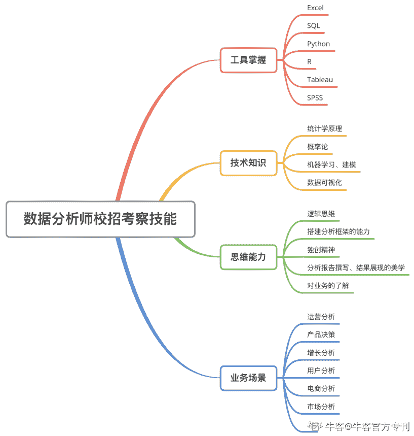
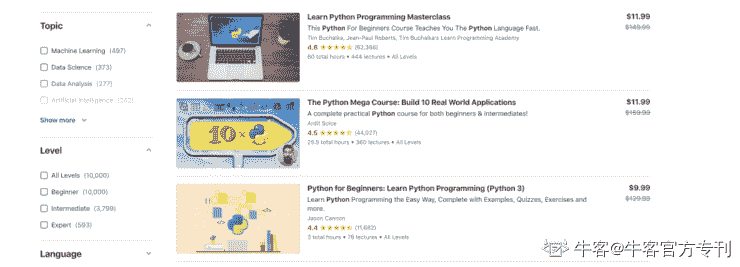
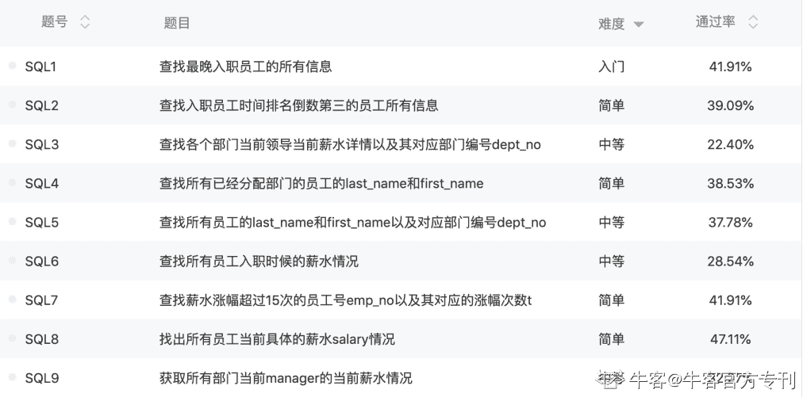
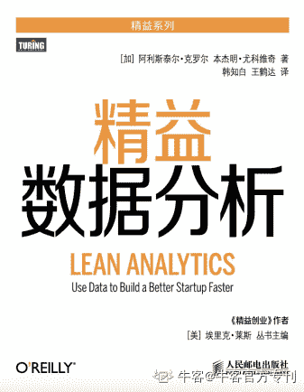
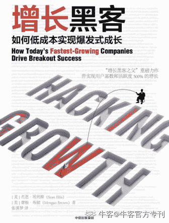
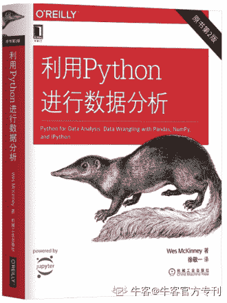

# 第二章 第 3 节 学习规划

> 原文：[`www.nowcoder.com/tutorial/10062/1f965a24e843422fb4dfa842990cbf69`](https://www.nowcoder.com/tutorial/10062/1f965a24e843422fb4dfa842990cbf69)

# 1 校招岗位技能树概览 

         每个部分的解释以及细分岗位在每个技能点的掌握程度会在下一章具体讲解。

#  2 学习资源推荐

## **2.1 技术方面**

        我大量学习技术工具的时候是在美国，所以使用国际网课平台资源较多，在国内也可以观看，比较适合学习数据科学、机器学习、统计学等领域的理论基础，以 Python、SQL、R、tableau 等工具的使用。常见的两大平台为：Udemy 和 Cousera。以 Udemy 为例，它的精品课程质量是非常高的，讲师大多数为行业资深人员，讲解比较透彻，价格方面也比较亲民（折合人民币最低 70 元一门课）。每节课都会辅以材料和练习，建议大家挑练习多的课观看，是真的可以学到东西的。但有一个小缺点：存在语言壁垒。虽然大多数课都有中文翻译，但因为翻译都是机翻且老师讲课的口音各异，会对听力有一定要求。

（上图为 Udemy 搜索 Python 后出现的课程界面，可进一步选择具体分支领域和级别）

Udemy: [`www.udemy.com/`](https://www.udemy.com/)

Cousera: [`www.coursera.org/`](https://www.coursera.org/)

        因为逻辑简单，代码语法相对基础，我学习 SQL 的学习方法主要在刷题，牛客题库中的“数据库实战”我刷了三遍，大家可以按照难度从易到难阶梯状刷题。一般数据分析岗校招面试中最多也就是中等难度，大多数都比较简单，所以当你可以熟练写出 hard 模式，通过 SQL 面试就不在话下了。另外，大家也可以关注各大厂的面试真题，以及 SQL 高频面试题，这些资源在牛客、知乎上都可以搜到，可以自己给自己进行模拟面试。

 

        此外，对于大一大二、刚打算入门数据分析且空闲时间比较多的同学，还有几本书可以参考阅读：

*   《精益数据分析》：学习与业务结合的模型及指标体系的搭建，有大量的案例可供阅读，可以接触到常见的业务分析模型如 AARRR 模型、漏斗分析等。

 

*   《增长黑客》：特别是对于重运营的公司（如阿里、滴滴），这本书的作用很大，我自己也正在阅读中。这本书的主题为如何以低成本实现爆发式增长，以数据驱动营销、以市场指导产品，通过技术化手段贯彻增长目标。包含数据思维和运营、市场思维，会对参与实际业务有很大启发。

 

*   《利用 Python 进行数据分析》：这本书出名的原因是它是由 Python 中 pandas 库的创始人创作的，是 Python 学习领域教科书级的参考书，非常适合初学 Python 的数据分析师和数据科学家，你将学会如何利用各种高频 Python 库（包括 NumPy、pandas、matplotlib 等）。

 

## **2.2 思维方面**

        其实，思维和技术是不可割裂的，在上方技术方面的资源学习中，我们的分析思维也会得到逐步强化。这里额外推荐一个我很喜欢的网站：人人都是产品经理。顾名思义，它是一个产品爱好者和从业者的交流平台，对提升产品思维帮助很大。我的使用场景一般是在某个地方（有可能是面试准备、当下热点推送、甚至是工作中的日常聊天）发现了一个感兴趣的话题，比如数据运营的要素、某产品的优缺点、指标体系搭建方式等，就会在“人人都是产品经理上”搜索相应文章。与上一部分的技术学习资源不同，“人人都是产品经理”上的文章对于提升产品/运营思维、数据思维、逻辑思维都有很好的帮助，也不乏一些高频面试题的解析。大家可以尝试利用碎片时间阅读一些行业资讯类文章，对于增加行业和岗位了解也很有帮助。

 # 3 小结 

        本章主要介绍了校招和岗位信息、如何规划校招、如何稳定心态、以及数据分析岗位技能总结，下一章会更细致的介绍各技能点需要掌握的深度和实习经历补充。

         校招是一场战役。在作战准备期间，提前规划、了解岗位、掌握时间线是成功的一半。此外，对应的数据分析求职技能相当于你的刀剑，工具运用、技术知识以及业务思维都是需要日复一日磨砺的方向。在后期的关键时刻，是它们帮助你在这场战斗中脱颖而出。不积跬步无以至千里，不如从今天就开始积累吧，为自己加油。