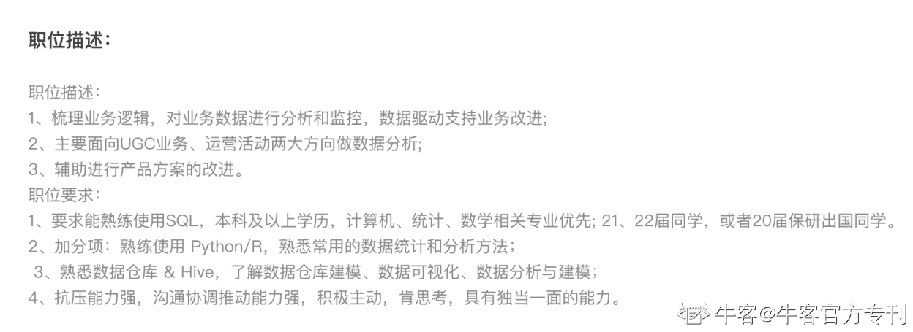
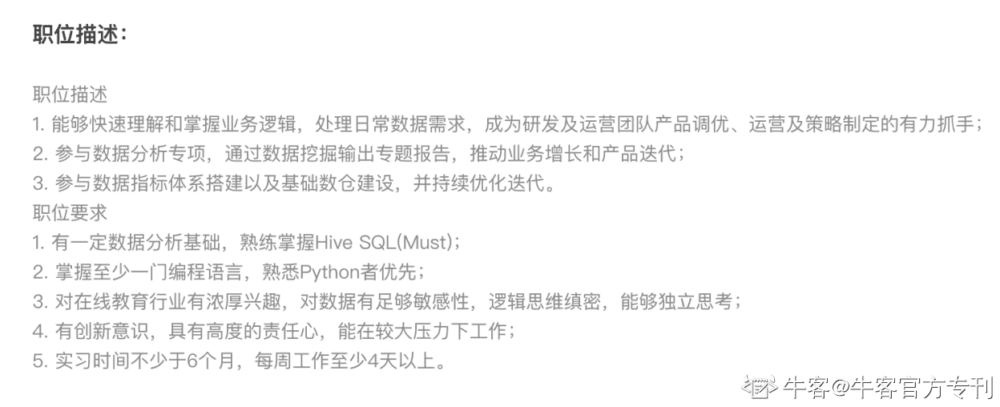
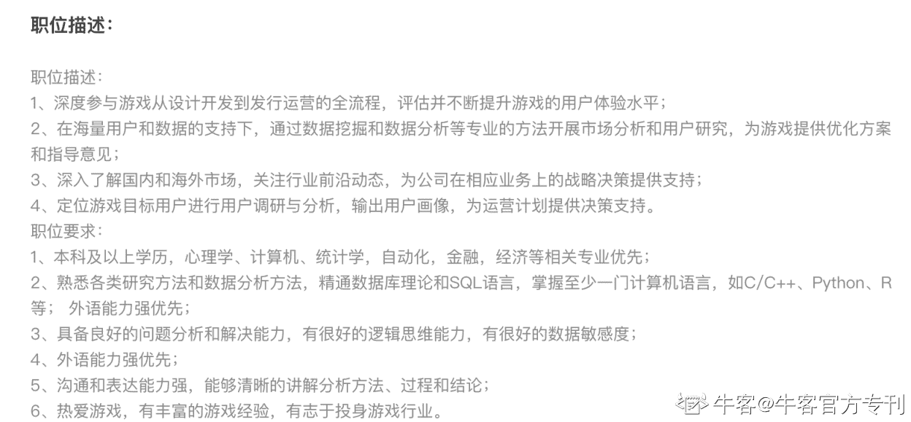
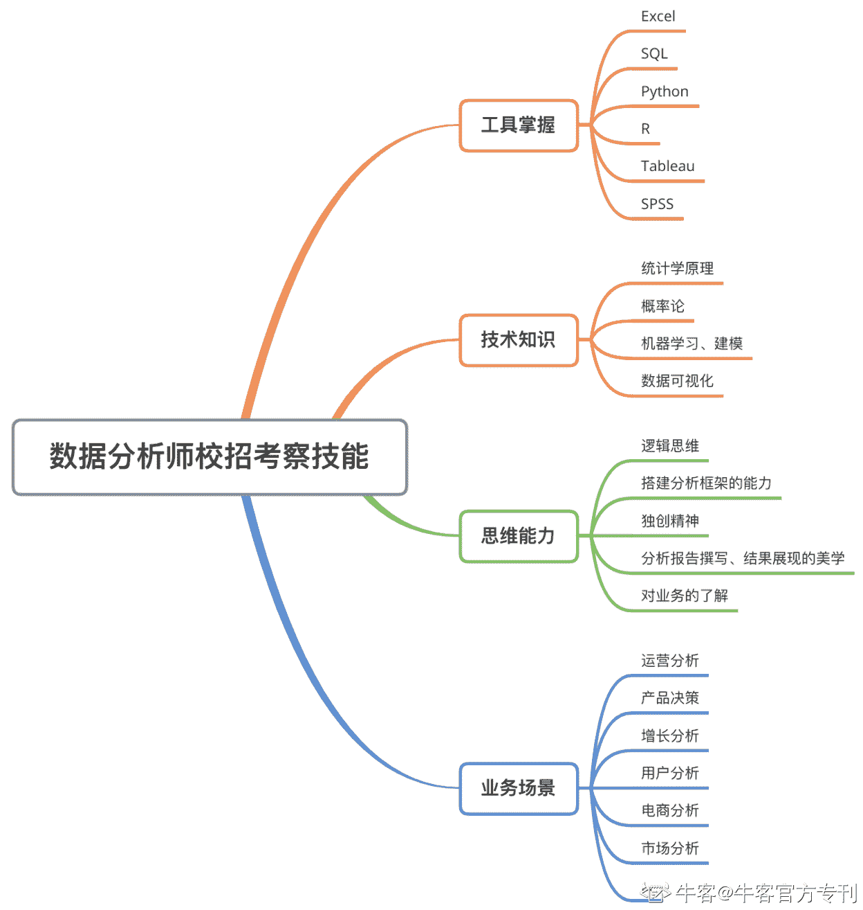

# 第三章 第 1 节 专业技能介绍

> 原文：[`www.nowcoder.com/tutorial/10062/6a7dc7cdd41d4f55b8cd1008bb68b9e3`](https://www.nowcoder.com/tutorial/10062/6a7dc7cdd41d4f55b8cd1008bb68b9e3)

        在各大厂岗位的岗位描述（Job Description）中，大家肯定会经常见到类似的要求：有扎实的 SQL 基础，熟练使用 Excel，有统计学基础，至少掌握一门数据挖掘语言（R、Python、）；了解业务（岗位业务内容，如游戏/在线教育/短视频/直播等），有较强的数据敏感度和逻辑思维能力（下方以几个字节跳动的数据分析实习生岗位 JD 为例）。可以看出，以上描述中包括了几个技能板块：工具掌握、技术知识、逻辑思维、对业务的了解等。下面我会按照这些板块拆分讨论每个细分点的意义和需要掌握的程度。大家可以结合上一章的技能树对应查看。

数据分析–短视频：

数据分析-在线教育：

数据分析-游戏：
回顾：技能树  

# 1 工具掌握 

· **SQL：**除 Excel 外，扎实的 SQL 基础是分析师的基本功，也是数据分析岗位的敲门砖。SQL 可以起到数据提取和指标计算的作用，而分析师的大部分数据都是从公司数据库中提取出来的。拥有扎实的 SQL 功底可以保证初始环节的准确度，并且大大增加分析的效率。面试中，SQL 也属于高频考点之一，通常考察 left/right join、group by/having、窗口函数，常见的题目包括留存率、DAU、连续登录天数计算等。

· **Python、R：**作为一种数据挖掘工具和语言，Python 的应用场景就更加丰富了，比如基于海量数据的可视化、建模分析、AB 实验（AB test）评估等。Python 和 R 都有包罗万象的统计函数可以调用，两者各有优势，但互联网公司中 Python 的使用度更加广泛。面试中，直接考察 python 现场代码的不是很多，通常会问掌握程度、经常使用的包等。

· **Tableau：**Tableau 也是十分方便的数据可视化工具，可以支持多种展现方式且操作简单，也是小白最容易上手的工具，适合运用于报告中展现分析结果。除数据分析岗位外，Tableau 同样也适用于其他岗位的可视化需求。

# 2 其他知识

· **统计学/假设检验：**常用概念包括 z 检验和 t 检验及使用情况、置信水平、p-value、混淆矩阵及一二类错误等。统计知识是必不可少的，假设检验、置信区间、统计调查方法等都会广泛运用于 AB 实验和用户研究方案中。AB 实验的重点知识包括 AB 实验的步骤、AB 测试中分流分桶的原理、样本量如何确定、检验方法如何选择等。

· **概率论：**需了解离散/连续概率分布，大数定律，中心极限定理等。有些公司比如快手、字节会在面试中出概率论的题，通常考察排列组合。如果没有这方面背景，也可以通过上一章提到的书籍和网络资源弥补。

· **机器学习：**常用算法包括逻辑回归、决策树、支持向量机、贝叶斯、K-Means、神经网络等。这块需要提醒的是，机器学习学习成本较高，运用比较多的是技术型的数据分析师，对于业务型的数据分析和商业分析岗位来讲，能做到在理论层面了解不同算法的原理、应用场景和优缺点，再了解一下模型的检验机制比如混淆矩阵、ROC 就可以了。

# 3 思考方式

· **逻辑思维：**逻辑思维是贯穿每个分析项目全程的。前期，分析师需要定位问题，运用脑图等工具搭建分析框架、进行指标拆解。中期，需要根据阶段性分析结果调整分析框架。后期，报告的撰写需要图文搭配，讲解清晰。以盖房子为例，如果说数据资料是地基，分析框架是支柱，那么报告的制作和展示就是最后的展现出的大厦。如果能有独特的见解（增量），那么这次的分析就更加有亮点了。

· **业务理解：**技术是必备的，但不是最重要的。数据分析师如果想要避免成为“工具人”，必须需要主动熟悉业务。以短视频公司为例，如果一名数据分析师不懂得观看者基本诉求、app 使用方式、产品设计的目的（也是面试中的产品类高频考题），就无法透彻理解分析中的指标体系，数据分析工作只能算空中楼阁。只有熟悉业务，分析师才能看懂数字背后的逻辑，使用合理的指标和特征，更能提出具有针对性的建议。