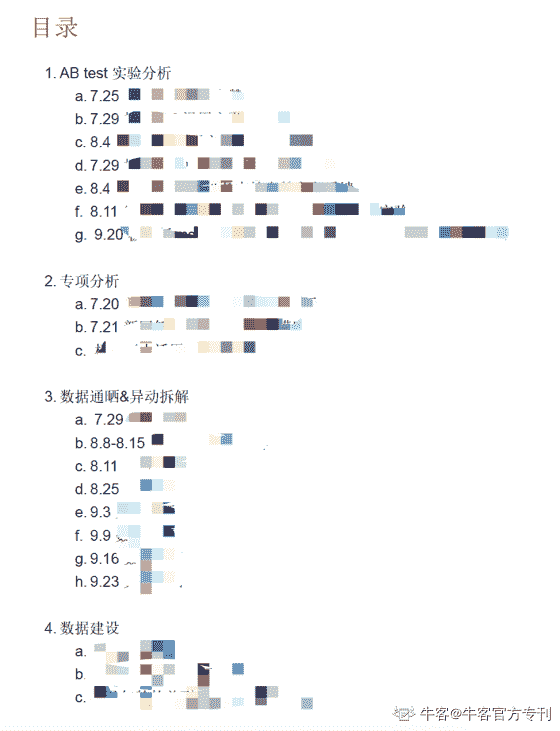

# 第三章 第 2 节 实习经历准备与提升

> 原文：[`www.nowcoder.com/tutorial/10062/07c581ffb5bb487984171d86a32c9804`](https://www.nowcoder.com/tutorial/10062/07c581ffb5bb487984171d86a32c9804)

# 1 如何高效找实习

### 1.1 **先定岗、后定公司**

        实习经历的重要性主要在于两点：经验积累和简历匹配度，体现于实习的数量和质量。但这些都要基于一个前提，那就是清晰的规划。从职业规划方面来讲，通过实习也可以试错，但时间成本较大。如果精力支持海投的话，也最好不要海投多个岗位，而应先定好目标岗位，再去投递多家公司。因为哪怕是同一岗位，因为公司业务不同也需要分别了解其产品、准备面试，投递过多岗位会导致后期迷茫的心理。

### 1.2   **不要把鸡蛋装在一个篮子里（渠道+公司）**

        第二个建议是多渠道、多公司投递。就像前一点提到过的，在定下岗位后，就是广撒网的时候了。特别是当你使用***、boss 直聘这样的 app 时，投递成本很低，hr 一天接收的简历很多，投递自然是多多益善了。

        除了求职 app 外，大家也可以采用内推渠道，比如学校资源和牛客内推专场。HR 每天接收来自各地的简历，甚至会有堆积几千封未读简历的情况。对于实习来说，当一封简历没有及时被打开，基本就等于石沉大海了，被捞的可能性很低。内推不等于走后门，但它的作用是至少保证简历不会被 HR miss 掉。如果缺乏学姐学长内推的话，也可以在牛客内推专场上找到自己心仪岗位的内推机会。

### 1.3   **把握时间**

    找实习要趁早，但也不要过早，最佳时间是在计划入职时间前的 3 至 4 周开始投递，正好留出简历筛选和面试的时间。因为许多实习都会标明“可实习三个月以上者优先”、“可尽快入职者优先”，如果投递太晚会因开学等因素缩短时间，降低竞争力，而投递太早会因入职时间间隔太长而无法满足用人单位着急用人的需求。

    并且，也建议大家协调自己的时间，至少实习两个月以上，三个月以上更佳。在简历上，实习时间的长度也是体现大家工作深度和学习程度的指标。

# 2 项目参与及包装 

### 2.1 **最重要的：善于总结**

        尤其在互联网行业，工作内容基本是 base 在一个个项目上的，这些项目或大或小，小项目可能两三天就可以完成产出，大项目要经历几周甚至数月。项目的形式也因岗位不同有所不同，有可能是分析报告、营销活动、产品功能升级、节假日新活动上线等。

这些项目会是大家实习中宝贵的积累，也是之后面试会主要被问到的“故事”，这就需要大家一定要养成多总结的习惯。 上一段实习中，我在快手期间总共经历了大大小小十几个项目，离职前正好是双月一次的 okr review，需要进行工作总结。我把我经手的项目背景、时间、分析过程、主要发现等都汇总成了个人的项目报告。

        在日常工作中，我也会以周报的形式写一下每周的工作内容、踩过的坑、得到的收获、日后 todo 等。除此之外，工作中的一些零碎的体会和思维过程都可以记下来，形成自己独特的工作日记。这些都可以保存下来，在实习结束后成为工作的证明和之后面试时准备的材料。

        这里要提醒的是，自己写的项目报告（doc 或 ppt）可以存下来，但一定要注意公司有关数据安全的规定，对关键数据进行脱敏，切忌触发红线，不然可能会影响之后校招的投递。

        对于实习不够或参与项目不够的同学，也可以自己寻求一些项目机会，比如牛客的项目实战板块以及数据分析项目交流平台 Kaggle 等。

### 2.2 **S****TAR 法则**

        在写简历和面试的叙述中，推荐使用 STAR 法则，即 Situation(情景)、Task(任务)、Action(行动)和 Result(结果)结构，并辅以数据支持，适用于实习经历类问题，也适用于更宏观的行为面试。

        面试时，被问到做过的特定项目，有些同学会急着讲自己是如何做这个项目的，然而这种行为是直接跳到了第三步 Action，面试官根本不知道你所处的情景，也就是项目的背景和目的，自然会一头雾水了。

比如，我们讲述项目的时候可以这样表达，以流失用户专题分析为例：

S：在快手实习的时候，产品侧想从内容推荐的角度了解是什么导致了流失/留存，所以先提需求进行专项分析，方便后面确定 ab 实验方案。

T：我的工作/任务是将次日流失、留存的用户进行对比分析，通计计算点赞率判断用户偏好的视频类别，并探求用户观看的推荐视频与他们的偏好是否匹配。

A：我提取了一周的数据，分视频垂类计算曝光率和点赞率，并按照点赞率降序排名判断和曝光率是否一致。

R：（加上数据展现）根据分析结果我提出了一些算法的改进计划，比如针对一些点赞率和曝光率极度不匹配的视频做了提权和打压，在此前提下保证视频推荐的多样性。

        在准备面试的时候，建议大家根据自己的工作总结，每段实习挑出至少两段故事（项目），每段按 STAR 模式浓缩成 200 字，面试前多次阅读，方便面试时熟练地叙述给面试官。

# 3 小结

        本章主要介绍专业技能准备与提升，结合岗位技能树展开描述；以及分享补充实习经历和项目包装中的一些建议。下一章内，我们将对校招流程中的简历、笔试、面试三大节点的注意事项逐一讲解。

        专业技能和实习经历是面试官最感兴趣的部分，同时也无法一蹴而就。在这个过程中，你做的每一步都是在为自己的秋招添砖加瓦。在找实习和做项目的过程中，大家也应该根据自己的思考总结出只属于自己的方法论，随着自己的进步与提升，经常与周围能力强的同学、与心仪的岗位 JD 做比较，看看自己还差在哪里。优秀的人永远可以为自己找到进步的空间，希望未来面试官看到的是最优秀的自己。