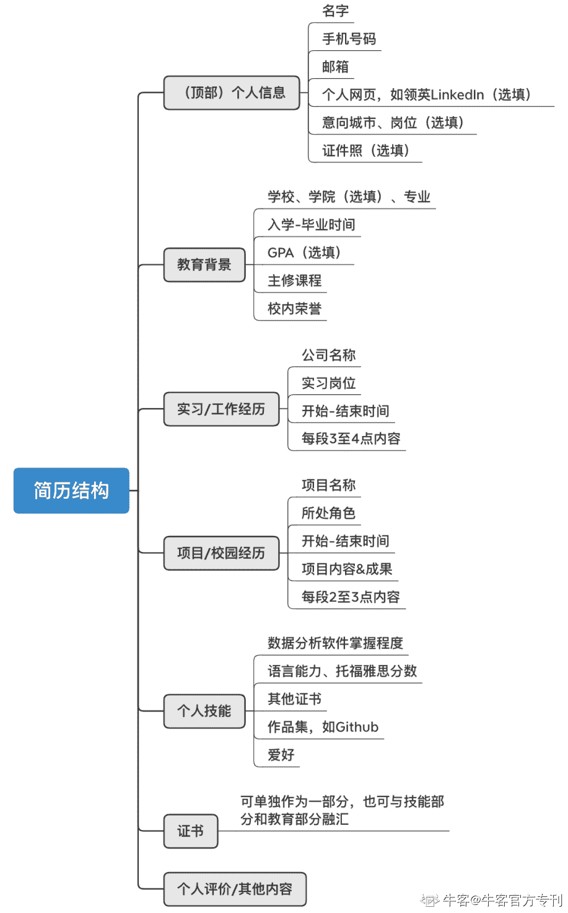
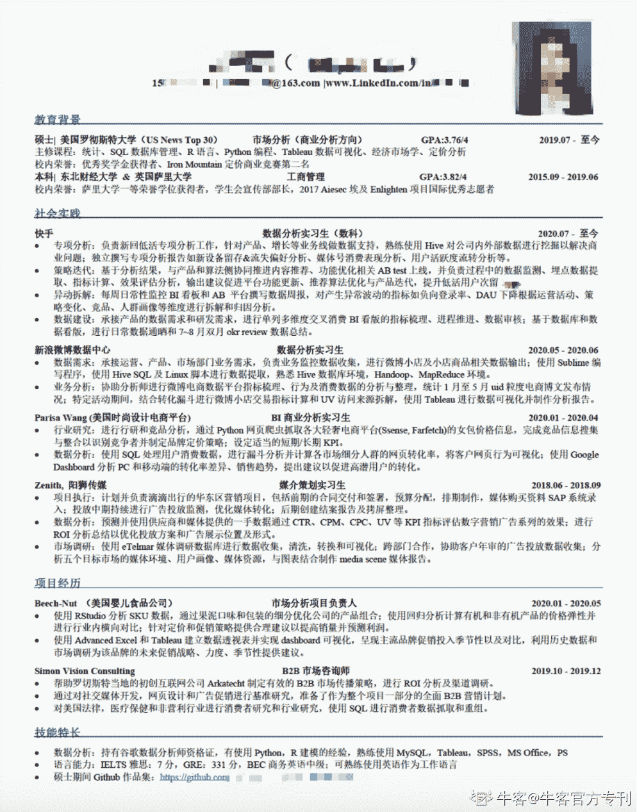

# 第四章 第 1 节 简历制作

> 原文：[`www.nowcoder.com/tutorial/10062/3586f582524e4528bddfc10c2839910b`](https://www.nowcoder.com/tutorial/10062/3586f582524e4528bddfc10c2839910b)

# 1 一份好简历的作用

        首先，我们要明白一份简历的目标用户是谁：HR、直系 leader、部门老板（也是典型情况下三轮面试的面试官）。在这三个环节中，每个人的关注点都是不一样的，核心要点就是从工作经验、个人能力、职业方向等方面来了解“你”这个人。

        秋招全过程中，通过率最低的环节是什么？简历筛选。简历是 HR 对你的初印象、个人形象的代表、更是校招的敲门砖。再优秀的同学，也有可能因简历制作的不好，没能体现自己的优势而早早被刷掉，失去在面试中展示自己的机会。所以，像之前校招时间线中提到的，校招正式开始前，我们最先准备好的应该是一份优秀的简历。

        简历被刷掉的原因可以归结为两大类：硬性条件不符合（教育门槛、实习公司级别等），以及简历制作问题。而第二个问题是本章的主题，我在这一部分会最大限度的教大家如何写好一份简历。

# 2 简历结构

        一般情况，简历长度为一页，按先后顺序分为 6 部分：个人信息、教育背景、实习/工作经历、项目/校园经历、个人技能、个人评价/其他内容（选填）。其中，校招简历中占用篇幅最长的部分是实习经历和项目经历，我会在本章节内着重说明。

        除此之外，个人信息部分和教育背景部分写起来相对简单。在顶部个人基础信息中，需要包括的至少是名字、手机号码、邮箱，选填的信息点为个人网页、证件照、意向城市、意向岗位。常见的布局方式为居中或居左，其中名字一定要使用大字体展示。

        关于教育背景部分，宗旨也是清楚明确、突出优势。比如，对于学院名称不对口或知名度远小于学校的，可以不写明学院；而对于所学课程和岗位要求很贴合的，建议写出几节核心课程，展现“我掌握岗位核心技能”；关于 GPA 和排名（如 Top 10%），成绩优异的同学建议写上。

        个人评价部分为选填。对于缺乏实习经历的同学，可以在个人评价/其他内容处对简历进行填充，这里可以写上自己过往经历的总结，也可以包括其他可以展现个人能力的点，如工作之外的特长。

# 3 简历制作与注意事项

## 3.1 **格式：简单明了、逻辑清晰**

        格式是 HR 打开简历，首先可以感受到的方面，格式清晰的简历可以体现出写简历者的逻辑能力和专业度。

###  **3.1.1 做什么：**

- **分清楚板块，有详有略。**实习经历应该是最详尽的部分，每段实习有 3～4 点描述为最佳。若实习经历实在不够，可适当扩充校园/项目经历篇幅占比，也可以通过详写高质量实习来弥补实习数量上的不足。

- **篇幅控制在一页内，避免啰嗦。**校招生的经历本来就比较有限，大可不必洋洋洒洒写出两页的简历。过于冗杂的简历不会让 HR 认为你经历丰富，只会给让她/他留下阅读困难、不整齐的印象。试着尽量精简语言，略写甚至删掉与投递岗位不相关的经历。比如我在投递数据分析岗位的时候，删掉了本科一整段公关公司的实习，因为工作内容偏向品牌营销，确实和数据没什么关系。此外，也可以通过调整页边距、字号（最小可以到 9 号）的方法控制篇幅。

- **文件存储为 pdf 格式。**相比 word，pdf 的易读性更高，排版不会因为对方使用的软件版本而发生改变。所以，递交一份 pdf 格式的简历更能突出你的专业度。

- **善用 bullet****point，层层分级。**实习经历下面的每一点不是全部工作简单的堆积，而应该分类叙述。以一段实习经历为例，之下的每一个小点应该展现此实习中一个方面的工作内容和成果，并且可以增加小标题概括，这里的目的是为了增加简历的易读性、逻辑感、和真实度。

### ** 3.1.2 不要做什么：**

- **盲目追求模版的套用。**这一点非常重要，因为我了解大部分的同学简历都曾经套用过模板。这里我的意思不是否认所有的模板，但是许多的模版都会给招聘方留下不专业的感觉，比如鲜艳的颜色、花哨的布局和分割线等，打开后视觉上不简约、难抓重点。简历中正文部分应该使用黑色字，大标题可以使用其他深色系颜色。如果大家对自己手动排版不满意，可以使用牛客网简历在线排版功能，而不是简单的套用模板。尤其对于数据分析岗位而非艺术设计类岗位来说，相对严谨的简历比色彩感、设计感强的简历更恰当。

- **本末倒置。**建议大家根据自己简历各板块的重要程度排序。像前面提到的，我比较习惯把实习经历排在项目经历和个人技能的前面，这样的排列方法也推荐给投递其他非技术岗的同学。对于算法、开发等一些技术岗来说，有些同学会把专业技能排在前面；而对于非技术岗，相比在简历开头放上洋洋洒洒的技能和证书，不如先让 HR 了解你的实习经历。

- **格式不统一。**这一点是大家都知道，但有时候还会犯错的地方。这里的“统一”包括字体、字号、英文大小写、标点使用方法（比如每一点后是否使用句号）的统一，属于细节问题。这个问题不会影响简历的视觉呈现，但容易使招聘方给你扣上“不细心”的帽子。所以简历定稿后，一定要在反复检查后，再进行投递。

## 3.2 **内容：匹配度+专业度**

        如果说格式是第一印象，内容就是对个人能力更深层的了解。列好框架后，我们就要往每部分中补充内容了。在内容的撰写中，最应该注重的两点是：匹配度和专业度。

### 3.2.1 **做什么：**

- **突出与岗位的匹配度，“我是你的首选”。**除了技能的展现，匹配度也是选人标准之一，留学生同学在写文书的时候相信也有同样的感觉。建议大家拿出一下午时间深度挖掘自己的经历，包括实习、校园社团、项目、志愿者等，挑选与数据分析岗相关的经历，并且在叙述中侧重描述数据相关的工作内容。我们可以对最匹配的经历做突出展示，比如详写或排在靠前位置。技能方面，大家首先需要广泛阅读岗位 JD，寻找共同点也就是 HR 最看重的技能，在简历中体现出来。比如项目中是如何使用 SQL、Python 的。如果投递多个岗位（比较常见的比如数据分析+产品经理混申），就需要制作多份简历了。

- **使用专业词汇，避免口语化表达。**这里的专业词汇包括行业词汇、指标名称、使用过的分析模型等，对此不太熟悉的同学可以多阅读公司公开文档（如 wiki 和组内项目报告），读的多了，自然专业词汇的使用就更熟练了。

- **熟练使用谓+宾模式。**与上一点衔接，省略主语，使用谓语+宾语的叠加也是一种可以避免口语化表达的方式。丰富的谓语变化搭配，能有效增强叙述的一致性和可读性，避免整句话读起来啰嗦，既可以体现专业度也可以避免简历过长。比如“负责 xx 项目，承接 xx 需求，使用 xx 方式进行了 xx 分析，通过看板监控和历史数据分析预测 DAU 波动趋势”的小短句叠加。

- **STAR 原则，“A”最重要。**第三章中提到的 STAR 法则，相信大家还记得，在这里就不赘述了。需要补充的一点是，相对来讲 S 和 R 是重点放到面试里说的部分，而在简历中 Action 是最重要的也是直接展现工作内容的部分。就 Result 来说，尤其身为实习生，R 并不是你一个人导致的，如果写得太大容易有吹牛嫌疑，比如“使利润提升 30%”的表达，写作重点应该放在 Action。当然，如果有独立负责项目的 R 产出，写在简历上肯定是多多益善的。

### **3.2.2 不要做什么：**

- **过于“日常”。**包括口语化用词、流水账表达、生活照使用等因过于日常随意而影响专业度的做法。

- **内容过泛或内容过多。**

经历的叙述需要细节恰到好处，太泛或太多都是不好的。

有些简历内容过泛，项目中的需求方、对接方都不写，比如“我独立负责过大型项目，非常成功的完成了项目 A 的工作，加强了组织协调能力”。这句话更像是日常聊天，HR 读完并不明白你到底做了什么，在项目中起到了什么增量作用，最后一点能力提升也显得没有说服力。如果改成“与推荐算法组合作承接 xx 部产品需求，独立负责了 xx 渠道拉新项目的数据监控和后期分析复盘工作，优化用户增长效率”，既不夸大其词，又叙述清晰，最后能力的提升无需多提，HR 也是可以从文中感受到的。

与此相反，内容过多也是不可取的。内容过多的原因有可能是项目过程写的太细，采用流水账式叙述；也有可能是不相关经历占据过多篇幅。相应的，可以采用前文谓宾搭配的结构和小标题的方式将经历简练的讲清楚，并且删掉与数据分析岗位不相关的实习/项目经历，不要觉得心疼，因为无关经历并不会给你提供帮助。

- **夸大其词。**我们要对简历上的每个字负责。从网申投递开始，一份简历将一直跟随你到 HR 面，建议大家叙述时不要夸大其词，尤其是在实习产出和技能点部分。一定要保证简历上的每个数据、每个名词，你都能解释清楚。面试官一眼就能看出来你有没有撒谎，如果面试中面试官问了关于简历的问题而你无法描述清楚，是非常减分的。

# 4 优秀简历

