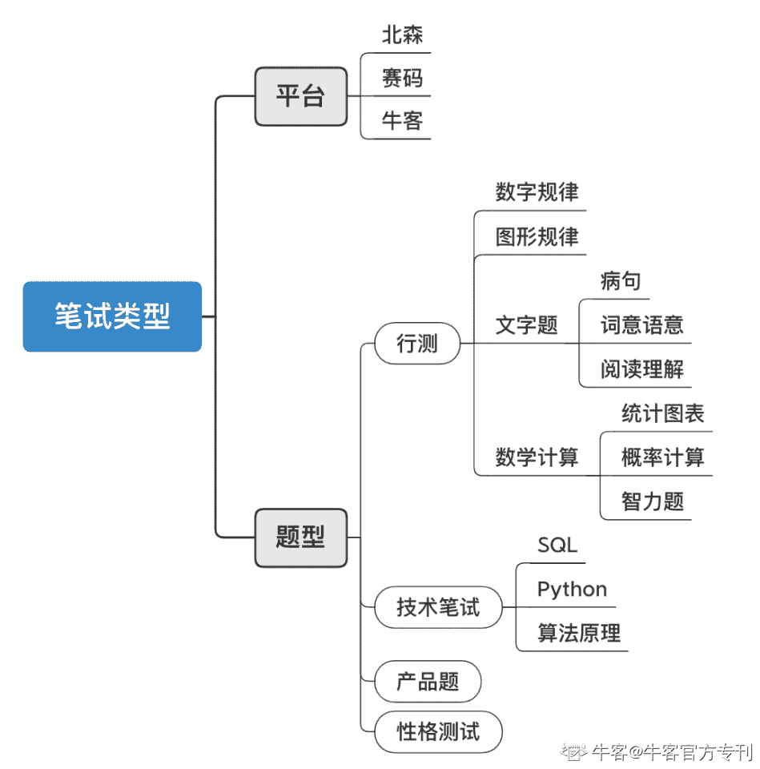
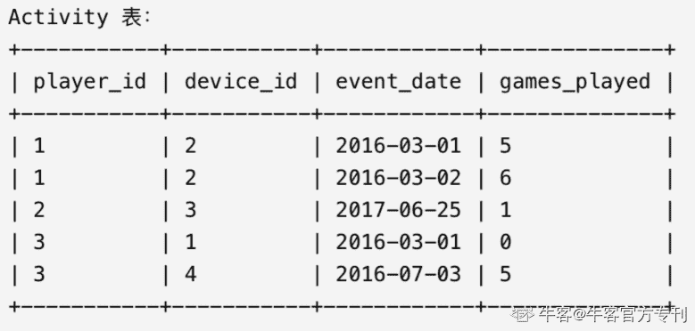

# 第四章 第 2 节 笔试准备

> 原文：[`www.nowcoder.com/tutorial/10062/3dce50eb6a5a47c78d4fd40ff58a9c3c`](https://www.nowcoder.com/tutorial/10062/3dce50eb6a5a47c78d4fd40ff58a9c3c)

# **1 笔试形式介绍**

 

        不是所有岗位都会设置笔试（比如字节跳动用户增长数据分析师岗位），不同公司的笔试淘汰率也大有不同。但无论难度和淘汰率高低，笔试依然是大部分岗位的必经之路，所以大家还是要提前做准备的，不要给自己留下遗憾。

        在我们着手准备笔试前，首先要明白笔试的形式，包括平台、题型等方面。下面我将按照上面的脑图逐一介绍。首先，笔试位于简历筛选后或与简历筛选同时进行，形式通常为通过链接进入的线上考试。比较常见的笔试平台有北森、赛码、也包括进行技术笔试比较常见的牛客网，不同的平台的做题界面会略有不同。

        题型来看，以数据分析岗位为例，笔试通常会涉及到（小于等于）四个部分：行测、技术笔试、产品题、性格测试，具体单场考试覆盖的题型不同公司之间会有不同。其中行测是最为常见的笔试形式（覆盖大于一半的数分岗），特别是对于属于非技术岗的业务分析、商业分析岗位来说。对比来看，一些对技术要求较高的数分岗会考察技术笔试而非行测。

| **题型** | **细分题型** | **解释** |
| **行测** | 数字规律 | 找规律填空，考察数学能力和归纳总结能力 |
| 图形题 | 包括图形找规律、旋转、折叠变化等题目，考察平面、立体几何和归纳总结能力 |
| 文字题 | 包括阅读理解、词义语意（同义词、选词填空等）、病句等，考察文字理解能力 |
| 数学计算 | 包括统计图表、概率计算，也有部分逻辑&智力题，考察快速阅读、计算以及综合能力 |
| **技术笔试** | 代码题 | 在线代码题，大部分为基础 SQL，少数涉及 Python，形式类似牛客编程题页面 SQL 常考点为：数学计算、if()、case when、左右连接、窗口函数、日期时间函数、行转列等 |
| 算法&统计学原理 | 通常为选择题，出现概率小，难度较大 |
| **产品题** | 简答题 | 考察产品&运营思维、逻辑能力，需短时间内头脑风暴 |
| **性格测试** | 通常为选择题 | 无标准答案，测试性格匹配度 |

# 2 笔试准备方法及例题

        准备笔试中的客观题（包括行测、技术题）没有什么巧办法，最重要的就是多刷题，每周应该保证一定的做题量，避免手生。行测方面，可以在牛客网题库中的专项练习-通用能力和模拟笔试中刷题；同时，技术笔试的刷题也可以在题库中找到对应的板块（如“数据库 SQL 实战”）。产品题方面，前期产品 sense 的培养可参考前面章节中技能树部分的推荐，同时注重实习过程中的项目积累和沉淀。答题中，可以提前练习分层分点的叙述方法（下面会展开讲解），如层层细分用户群体、使用场景、行为模式等。

        下面，我会针 SQL 代码题和统计概率题分别举例讲解。

*   **题目一****-****SQL 代码题：DAU****&****留存率**

**考察点：左连接、自连接、datediff****()**

*备注*：留存率是互联网行业数据分析岗笔面试中最高频的 SQL 考题。与网上例题答案不同，下面分享一种简单易懂的、采用自连接和左连接计算留存的方法。

*重要概念*：

DAU：当日活用户数

次日留存数：某日活跃，且下一日还活跃的用户

N 日留存数：某日活跃，且 N-1 日还活跃的用户

N 日留存率：N 日留存数/当日日活用户数

*题目：*下表名为 Activity，共有四个字段，记录用户在平台上的活跃情况。编写代码求出每日 DAU、次日留存数及留存率、七日留存数及留存率。

 

*答案：*left join 的目的是为了找出两天都登录的用户，当日未登录的用户在右表会显示 NULL，不会计数。主要难点在于 join 条件的理解。

select

    event_date,                         -- 当日

    count(distinct a.player_id) as DAU,                               -- DAU

    count(distinct b.player_id) as 1_retention,                 -- 次日留存数

    count(distinct c.player_id) as 7_retention,                  -- 七日留存数

    count(distinct b.player_id)/count(distinct a.player_id) as 1_retention_rate, -- 次日留存率

    count(distinct c.player_id)/count(distinct a.player_id) as 7_retention_rate -- 七日留存率

from Activity a left join Activity b left join Activity c

on a.player_id = b.player_id

and a.player_id = c.player_id                -- 用户在两天***同活跃

and datediff(a.event_date, b.event_date)=1 -- b 表中时间为 a 表中的后一天，用于计算次留

and datediff(a.event_date, c.event_date)=6 -- c 表中时间为 a 表中的后六天，用于计算七留

*   **题目二****-****概率题**

 *题目**：*扑克牌 54 张，平均分成 2 份，求这 2 份都有 2 张 A 的概率

*备注*：概率题主要考察点为排列组合，建议大家熟悉排列组合的公式

*答案**：*

M 表示两个牌堆各有 2 个 A 的情况：M=4*(25!*25!)

N 表示两个牌堆完全随机的情况：N=27!*27!

所以概率为：M/N = 9*26/53*17

# 3 笔试注意事项

## 3.1 **把控时间**

        学会把控时间是笔试中最需要注意的一点。笔试前，最好不要卡点打开链接，而是留出充裕时间（提前 15 分钟）登录填写信息。笔试中，也要灵活分配时间，适时做出取舍。以行测为例，有些系统（如北森）是每道题 1 分钟至 1 分半分别倒计时；有些（如赛码）是分题型计时，并且一个题型提交后无法修改；还有些公司（如腾讯）采用全部问题整体计时的系统。尤其对于后面两种类型，时间分配就更加重要，必要时候要舍弃难题，不要在一道题上耗费过多时间而影响后面的作答。

## 3.2  **提前查好不同系统的特点**

        以上一点为延伸，不同系统操作方法不同会体现在很多方面，比如上面提到的计时，也比如代码题的输入输出。在技术题的考察中，与我们平时刷题不一样的是，有些平台要自己设定输入输出，导致许多同学因为不熟悉操作而丢分。这种问题是可以通过提前做功课避免的，比如提前在牛客看其他同学的笔试经验、笔试前进入平台试做等。

## 3.3 **产品题：写出结构感**

        最后一点建议针对简答题及论述题。因为时间有限或想法多而散，我们经常会出现“想一点，写一点”的情况，导致最后语言的呈现只是零碎想法的堆积，缺乏逻辑感。想法多是好事，如果结合有结构感且逻辑缜密的叙述，就可以产出高分答案了。这些题目除了想法本身，也考察逻辑论述能力，所以呈现方式是很重要的。

        这里给大家的建议是多分层、分点写，避免一堆文字直接堆上去。这里的“层”可以包括不同的时间（比如淡季 vs 旺季）、不同人群（青年 vs 老年，VIP vs 非 VIP）、不同场景（内部因素 vs 外部因素）等等，可通过合理假设层层分级形成嵌套。

        比如“先排查外部因素（层级 A），如果单量降低是因为竞品给出更低的价格（情况 a）下，我们应该…（点 123）；如果是因位于淡季（情况 b），我们应该…（点 456）。”分层分点的论述可以使题目回答的一目了然。

## 3.4 **注意复盘**

        尤其针对产品题，因为笔试时时间有限，思维难以全部打开，建议大家记住每次笔试时的简答题题干，笔试后进行重新的思考和总结。在复盘阶段，最好可以和一起秋招的朋友共同讨论，吸取不同思维方式的精华，不断完善自己的答案。久而久之，就可以形成一套属于自己的、完善的答题框架和话术，在下一场笔试中就可以回答得更加完善。

        关于行测等客观题，题目多而杂，记录下原题比较不现实。建议大家分板块练习，多练习自己在考试中耗时较长的部分，并进行总结。拿图形规律题举例，我们可以把不同规律总结下来，如翻转、封闭区域个数、是否对称、角的个数等，笔试时就可以一一排查，不会漫无目的了。