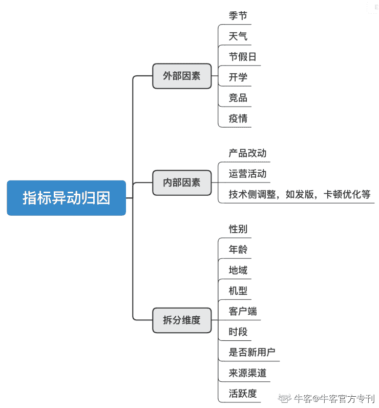
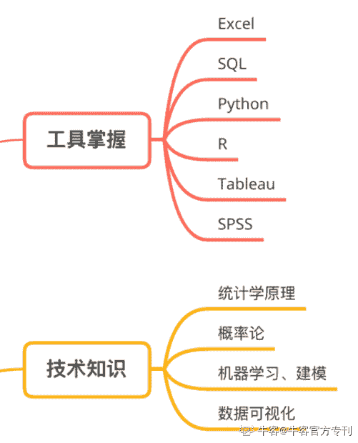
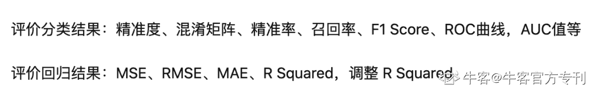

# 第四章 第 4 节 业务面面试技巧及常见题解析

> 原文：[`www.nowcoder.com/tutorial/10062/2bd97feb0d5a423cad765e88646b7093`](https://www.nowcoder.com/tutorial/10062/2bd97feb0d5a423cad765e88646b7093)

        因为数据分析岗并非完全的技术岗（只是被一些公司归为技术序列招聘），所以很少出现完整的技术面，所以这里的业务面仅与 HR 面区分，包括如下几个主要组成部分：自我介绍、经历（实习&项目）介绍、业务理解、行业知识、专业考察、反问环节。

        其中自我介绍和反问环节，在上一部分中已经做了详细的介绍，所以本部分我会针对业务面中间的几个核心部分做讲解。

# 1 **经历介绍：突出优势**

        我们在介绍某段经历前，可以先讲一下自己所在公司的架构，分析师承接需求到产品决策的对接流程，给面试官一个背景介绍。

        在讲项目时，需要注意的首先是前文中提到的遵循 STAR 结构撰写多段项目小结，并且提前进行演讲。在讲述过程中，要把项目像讲故事一样向面试官展现出来。因为面试官起初并不了解你的项目，所以切忌“炫技”，把过多的技术和专业词汇堆积，而让面试官无法了解项目的背景、目的等。

        提到技术的堆积，我之前面试某互联网公司的时候，曾经被要求讲实习中的一个项目，我讲了一个与算法协作探求用户兴趣点以优化视频推荐算法机制的项目。在讲述中，我突出描述了算法相关内容，自以为讲得非常华丽，但是面试官听完后说：“你这个项目听起来非常的技术，但是我好像没有听到太多你自己的思考逻辑，可以再讲一个吗？”当时我确实慌了一下，之后又讲了在同一实习公司的另一个项目。在这段描述中，我把项目的背景、做项目的目的、项目中不同部门是如何协作、项目中的难点、产出方式、以及最后落地收益条理清晰地讲了一遍，最终面试官比较满意。

        可以看出，相比技术细节，这位面试官更在意的是项目的业务逻辑和自己的思考，加之数据分析岗本身就是业务和技术相结合的岗位，业务思维和逻辑能力在某种程度上是更重要的。面对这种情况，我们就要学会随机应变，组织好语言讲出面试官想听的内容。

# 2 **业务理解：产品&运营思维**

        与笔试的简答题部分相同，面试中的业务题也会涉及到产品、运营相关知识，比如指标（DAU、留存等）变动归因、产品优劣势及改进方法、如何衡量运营活动 ROI、某产品的内容分发机制优劣势等。这里，依旧要尽量采取分层分点的论述方法，注重逻辑性。

*   例 1: 当问到“DAU 下降如何分析”时，我通常采用多维度分析、假设检验、数据倒推的方法：

- **外部因素**：首先，通过环比分析整个大盘变化，是否因为大盘变化，包括一些影响大盘的外部因素如疫情、季节变化、天气变化、也包括竞品原因；和一些影响某个群体的比如假期、返校、考试季、区域性台风暴雨。

- **内部因素**：产品改动、运营活动、app 发版等。

- **拆分人群维度**：锁定大因素后，我们开始拆人群属性的维度以验证对上面因素的推测。比如拆地域（天气）、年龄（开学）、男女、机型品牌、客户端（发版）、是否新用户（上阶段裂变和运营活动）、来源渠道（是不是之前裂变来的留存比新用户大盘差）、上一阶段不同渠道不同时间注册的新用户在这一阶段的留存（裂变活动用户留存低）。

- **数据角度，计算贡献率**：对细分人群算贡献率（维度人群的变化/总体变化），同时考虑到各个人群在大盘中的占比。如果影响系数大，但人群占比本来就很大，增减数量在这个人群内不值一提，也不算很显著。这是数据解释（data interpretation）领域的问题。

        总结：总的来讲，采用由外到内的归因方法，再根据细分维度来进行数据检验。逻辑上说核心点在于一个假设得到验证后，在这个假设为真的基础上，进行更细维度的数据拆分。比如“原因在于东北地区提前开学”的结论，是通过细分地域和年龄（东北三省年龄在 12 至 18 岁的中学生人群）验证的。

*   例 2: 当问到产品优劣势及改进方法时，首先我会提前准备 2 至 3 个互联网产品，按照定位、UI、特点、优势、劣势（与竞品对比论述）、改进方法等方面进行总结，下面以图片社交平台 Instagram 为例：

- 定位：一个重内容轻社交的的图片分享社交应用

- UI：采用卡片式的瀑布流。主要页面为推荐页、搜索（发现）页、点击加号创作、个人主页。

- 特点：重内容轻社交，主要盈利模式为广告+广告主要形态举例，推荐页采用个性化推荐。

- 优势：

· 重内容轻社交：丰富的促生产的方法如不支持分享和独特的 ins stories 功能，增加基于图片的互动，搭建内容生态，而不是像国内竞品 In、Nice 那样将社交做成强需求

· 鼓励创作：不能分享、下载；有独特的 stories 功能，创作方式丰富且***，与朋友圈相比为弱打扰

· 品质感：滤镜驱动，设计团队优秀，使得它兼有 UGC 社交平台和图片美化软件两个角色

· 用户路径短且交互感强：页面极为简洁，每个页面没有超过两处的视觉重心或功能重心+举例

- 劣势：

· 个性化推荐的弊端：在主页靠前的内容多为名人，一些朋友（特别是点赞较少的）就不会推出来，但我们有时候更想看，这就使得社区感过弱，对促生产不利

· 发现页可优化：优点是信息获取成本低，缺点是信息展现冗杂，图片也未按垂类区分，导致用户渗透率不高

- 改进方法：

· 希望在首页顶导可以加一个双关页（像微博的好友圈和抖音的朋友），ins 熟人关系链和生人关系链占比为 6:4（给出数据支持），毕竟是一个架构在图片上的 UGC 社交平台而不是 PGC 资讯平台。在首页加入双关页能在不改变初衷、不使得页面过于冗杂的前提下适度增加社交体验，增加用户粘性，从而也能促生产

· 发现页建议增加类别筛选（现在只有 10 个），选择自己喜欢的垂类，减少成本

        总结：建议大家在补充产品思维的时候着重学习产品分析的框架，用于回答此类题可以完美适配。分析的时候，我们要站在用户角度，通过分层分点和对比论述的方法回答。准备过程中也可以思考一下面试官可能的追问方法，比如“针对你刚刚提的改进意见，后期如何上线 AB 实验做分析？”。

# 3 **行业知识：做好功课**

        行业知识，包括一些行业发展前景和其他战略性问题，多出现在总监面中。这类问题不局限于任何岗位，需要方法论和经验的积累。

         如果短时间内需要突击，建议大家多阅读行业分析报告，如艾媒网、易观智库，也包括一些咨询公司出具的行业分析和市场分析，如德勤、尼尔森。

         在阅读过程中，可以着重看面试高频考题包括：某公司的商业模式、盈利模式、竞品对比（竞品分析），也包括最近疫情期间的问题“疫情如何影响公司业务和消费者的使用形态”等。这些都是我们在阅读中可以加强思考的点，关于其中某个具体问题的答案可以在“人人都是产品经理”上直接搜索。

# 4 **专业考察：夯实基础**

         面试知识点参考技能树部分的工具掌握和技术知识部分，分别对应代码题和技术知识的考查。这部分在面试中通常出现在考察完简历上的实习、项目经历之后，面试官的目的是判断你的专业能力。

 ## 4.1 **代码题**

        代码题的练习方法和例题在技能补充和笔试部分都做过相应的讲解，对此有问题的同学可以进行回看。

        有些同学对于面试中的手撕代码会非常惧怕。其实面试中如果需要现场写代码，题目一般都是一些常见的 SQL 题目，难度也会低于笔试，主要考查细心和全面。如果发现题目中的陷阱，也可以随时和面试官交流，思考完整后再动笔写。如果实在没有思路，也可以和面试官进行讨论，有时候面试官甚至会给出提示，所以不必太紧张。

         还有一种常见的代码能力考察方法是要求面试者口述思路和使用的公式，并不一定要进行在线编程，具体形式需要看面试官的面试方法。

## 4.2 **技术知识考察**

        考察的知识点包括统计学&概率论、机器学习&模型检验，数据清洗&数据解读方法、以及由统计学衍生出的 AB 实验相关问题。在每场面试后，我们也可以通过面试官的问题判断高频考点，并且加以延伸，进行更深度的学习。

**例 1****:** **model****evaluation**

    在机器学习部分，我被多次问到过的点是 AUC（area under the curve），如“ROC 曲线上 FPR 和 TPR 为什么会形成多个坐标？”答案为模型阈值不同。ROC 曲线是基于混淆矩阵得出的，一个二分类模型的阈值可能设定为高或低，每种阈值的设定会得出不同的 FPR 和 TPR 。阈值越低，判断的 Positive 越多，TPR、FPR 越大。将同一模型每个阈值的 (FPR, TPR) 坐标都画在 ROC 空间里，就成为特定模型的 ROC 曲线。

    基于此，我又复盘了其他 model evaluation 的方法，汇总于下：

**例****2:** **AB 实验**

AB 实验可以说是技术面试中最最常见的考察点了，具体细分点包括：置信度判断依据、置信区间宽和窄的区别、分流分筒的定义、样本大小如何确定、AB 实验基本步骤、中心极限定理。对于过往实习中没有 AB 测试经验的同学，面试官应该不会问的太深，明白进行 AB 测试的步骤以及依据的假设检验原理就好。

这里梳理一下 AB 实验的基本步骤，大家可以根据总体步骤进行针对性查漏补缺：

1) 从之前的现象和专项分析中发现问题，形成可以量化的统计假设

2) 确定实验单元（对象）、策略的不同 treatment（独立）

3) 有一个希望监测到的指标提升，然后**计算最小样本量**

4) **分流、分桶方式**：随机分桶，分流单元为人群 or 设备，每波流量占比多少（通常是 5%）

5) 预判是否存在溢出效应：比如在滴滴派单的环境下，上了倾斜某一部分司机的策略以让他们收到更好的订单，但因总体需求不变导致抢占了另一部分司机的订单，反而拉高实验组对照组的 gap，导致对后期扩全量后的影响估算不准

6) 实验上线后监测指标，计算核心指标提升，计算功能指标（如通过埋点计算漏斗转化）

7) 判断显著性：通过观测实验前 aa、实验中整体波动和置信区间判断