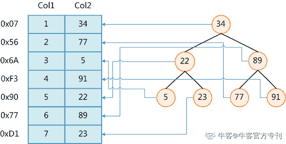
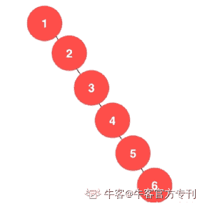
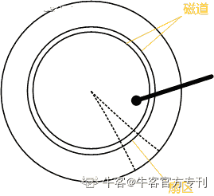

# 第二章 第 1 节 索引是什么

> 原文：[`www.nowcoder.com/tutorial/10039/45ab94d93e2b4febab64f9e6a0652629`](https://www.nowcoder.com/tutorial/10039/45ab94d93e2b4febab64f9e6a0652629)

# 一 索引是什么

MySQL 官方对索引的定义为：索引（Index）是帮助 MySQL 高效获取数据的数据结构。这句话表明索引是一种数据结构，索引的作用是为了更高效的查找数据。

提到查找数据的算法，我们想到最简单的查询算法就是顺序查找，但顺序查找的时间复杂度为 O(n)O(n)，这在数据量很大的时候显然是糟糕的，因此更优秀的查找算法被发明，例如二分查找、二叉树查找等。但每个查找算法都只能在满足一定条件下才能被使用，如二分查找要求源数据有序存放，二叉树查找要求源数据以二叉排序树的形式组织存放。

这里，我们再给索引下一个定义：索引就是数据库维护源数据的组织形式，并利用查找算法高效的获取数据。

# 二 索引常用的数据结构

维护源数据的组织形式一定会用到数据结构，因此索引肯定要使用某种数据结构来组织数据，并在此数据结构上利用查找算法加快数据查找。这里给大家介绍三种常见的数据结构：哈希表、有序数组和搜索树。

## 2.1 哈希表

### 2.1.1 哈希表概念

查找数据最好的时间复杂度是 O(1)，哈希查找就是 O(1)的。哈希查找的前提是数据以哈希表的形式组织存放。
如下图就是哈希表的示意图。哈希表的底层存储是数组，当要存储键为 key2 时，根据 Hash Function 的计算，存储位置为 1（数组下标从 0 开始），将 key2 放在数组下标为 1 的位置。
常见的 Hash Function 有如下：

*   除留取余法。f(key)=key mod p(p<=m)。m 为数组的长度。
*   直接定址法。f(key)=a*key+b(a,b 为常数)。

在图中，我们看到 Key1 和 Key3 经过 Hash Function 计算的值都是 3，这称为“哈希冲突”。处理冲突的方法也有很多，最常用的一种方法就是拉链法。如图中所示，Key1 和 Key3 都放在了数组下标为 3 的链表中。当要查找 Key1 时，首先经过 Hash Function 计算得到 3，然后在下标为 3 的链表中做等值查询，直到找到 Key1。

### 2.1.2 作为索引的优缺点

哈希表作为索引适用等值查询的场景，给定一个 key，找到对应的 value。但哈希表存在如下缺点：

*   对范围查询支持不好。哈希表的 Hash Function 是尽可能的使 key 分布均匀，这样就减少了冲突，因此即使相邻的 key 值，在实际存储位置上不一定是相邻的。所以在执行如 between...and 之类的范围查询时，就只能对整个哈希表进行遍历了，只有符合条件范围的数据，才取出来。
*   性能受数据量的影响较大。数组的大小总是有限的，当存储的数据量很大时，冲突的可能性就很大。假设采用拉链法解决冲突，则一个链表的长度可能很长，这样插入，查找和删除操作消耗的时间较长，并且性能随着数据量的增大更受影响。
*   不支持多列联合索引的最左匹配原则。对于 Hash 索引的联合索引，是将联合索引字段值相捆绑然后计算 Hash 值的，无法利用对单一字段的 Hash 值

## 2.2 有序数组

二分查找的时间复杂度是 log(n)log(n)，二分查找的条件是数据是有序存放的，并且数据支持随机查找，这就要求数据结构是有序数组。有序链表不支持二分查找，因为链表不支持数据的随机查找，只能顺序查找。
有序数组对等值查询和范围查询支持较好，如执行 between 1 and 10 的范围查询，可以利用二分算法找到等于 1 的，又因为数组是有序的，然后顺序往后查找，直到值大于 10。
有序数组存在如下缺点：

*   插入和删除的成本太大。因为我们要始终保证数组的有序性，在需要更新数据的时候就麻烦了，你往数组中间插入一个记录就必须得挪动后面所有的记录，成本太高。

## 2.3 搜索树实现索引

### 2.3.1 二叉搜索树

二叉树查找算法要求数据以二叉搜索树组织存放。如下图所示为二叉搜索树的数据存放形式。


如图所示，源数据表由 Col1、Col2 两列构成，一共有七条记录，最左边的是每一行数据记录的物理地址。为了加快 Col2 的查找，可以维护一个右边所示的二叉搜索树，其中树节点包含索引键值和一个指向对应行数据物理地址的指针，这样就可以运用二叉查找在 (O(log_2n)) 的复杂度内获取到相应数据。如果是加快根据 Col1 查找行数据的速度，需要再根据 Col1 列的值建立一个二叉搜索树。
二叉搜索树的严格定义如下：对于树中的每个节点 X，它的左子树中所有关键字值小于 X 的关键字值，而它的右子树中所有关键字值大于 X 的关键字值。在一棵二叉搜索树上查找指定 Key 的算法如下：

```cpp
/* 在以 t 为根的二叉搜索树，查找 key */
Position Find(ElementType key, SearchTree t)
{
    if (t == NULL) {
        return NULL;
    } else if (key < t->element) {
        return Find(key, t->left);
    } else if (key > t->element) {
        return Find(key, t->right);
    } else {
        return t;
    }
}
```

二叉搜索树在一般情况下查询、插入和删除的性能较好，但在某些极端情况下，性能退化为 O(n)的顺序查找。如单调递增的二叉搜索树。


### 2.3.2 高度均衡的二叉搜索树

树的查找性能取决于树的高度，让树尽可能平衡，就是为了降低树的高度。平衡二叉搜索树和红黑树都是高度均衡的二叉搜索树。
平衡二叉搜索树在符合二叉搜索树的条件下，还需要保证任何节点的两个子树的高度差不超过 1。为了维护这一个条件，平衡二叉搜索树在插入、删除的时候，当发现有节点不满足左右子树高度差不超过 1 时，会进行相关的操作来满足这个条件。
红黑树是一种自平衡的二叉搜索树。除了符合二叉搜索树的基本特性外，它还具备以下特性：

1.  节点是红色或者黑色；
2.  根节点是黑色；
3.  每个叶子的节点都是黑色的空节点（NULL）；
4.  每个红色节点的两个子节点都是黑色的；
5.  从任意节点到其每个叶子的所有路径都包含相同的黑色节点。

红黑树通过上述严格的要求，能确保树的最长路径不大于两倍的最短路径的长度，所以可以看出它的查找效果是有最低保证的，在最坏的情况下也可以保证 O(logN)。

平衡二叉搜索树和红黑树都能保证查询的性能，那是不是就适合做数据库索引呢？首先我们知道，数据库最终是要存在磁盘的，索引也是要以索引文件的形式存储在磁盘上。这样的话，索引查找过程中就要产生磁盘 I/O 消耗，所以评价一个数据结构作为索引的优劣最重要的指标就是在查找过程中磁盘 I/O 操作次数的渐进复杂度。换句话说，索引的结构组织要尽量减少查找过程中磁盘 I/O 的存取次数。

下面，我先介绍磁盘存取的基本原理来解释为什么磁盘 I/O 的代价比较大，然后结合二叉搜索树的结构来说明为什么二叉树作为索引的磁盘 I/O 次数较多。

#### 2.3.2.1 磁盘存取原理


磁盘整个的物理结构如上图所示。磁盘由多个大小相等的圆形盘片构成，多个盘片用一根主轴串联，通过主轴带动盘片的旋转。在盘片左边有一个支架，支架上固定了多组磁头，磁头可以前后移动。

盘片的示意图如下所示。盘片被划分成一系列同心环，圆心是盘片中心，每个同心环叫做一个磁道，所有半径相同的磁道组成一个柱面。磁道被沿半径线划分成一个个小的段，每个段叫做一个扇区，每个扇区是磁盘的最小存储单元。为了简单起见，我们下面假设磁盘只有一个盘片和一个磁头。


系统读取数据时将数据逻辑地址传给磁盘，磁盘将逻辑地址翻译成物理地址，即要在哪个磁道上的哪个扇区读取数据。确定了物理地址，磁盘控制磁头移动到相应的磁道上，该过程的耗时被称为寻道时间，然后磁盘控制主轴旋转盘片到指定扇区，这个过程的耗时称为旋转时间。磁头移动和盘片旋转都是机械运动，所以寻道时间和旋转时间都比较久。

如果每次数据的读取都实际从磁盘来获取，性能令人无法接受。在计算机科学中有一个著名的局部性原理：即当前使用的数据的周边数据也会被马上使用到，根据这个局部性原理，磁盘往往采用预读来提高性能。预读就是当要读取数据时，将该数据附近的数据（同一磁道，相邻扇区）读入内存，磁盘读取相邻数据不需要寻道时间，仅仅花费很少的旋转时间，系统要使用相邻数据就从内存直接读取，大大提升了性能。

预读的长度一般为页（page）的整倍数。页是计算机管理存储器的逻辑块，硬件及操作系统往往将主存和磁盘存储区分割为连续的大小相等的块，每个存储块称为一页（在许多操作系统中，页得大小通常为 4k），主存和磁盘以页为单位交换数据。当程序要读取的数据不在主存中时，会触发一个缺页异常，此时系统会向磁盘发出读盘信号，磁盘会找到数据的起始位置并向后连续读取一页或几页载入内存中，然后异常返回，程序继续运行。

#### 2.3.2.2 为什么二叉搜索树不适合作为索引

数据库系统的设计者巧妙利用了磁盘预读原理，将一个节点的大小设为等于一个页，这样每个节点只需要一次 I/O 就可以完全载入。

因此二叉搜索树一次检索（从根节点找到指定 key 称为一次检索）最多需要 h-1h−1 次 I/O（根节点常驻内存），而 hh 最多为 log_2(n)log2(n)。在一般真实的应用中，数据量一般很大，即 nn 很大，这样 hh 就很大，做一次检索需要经过很多次 I/O 操作，这显然是不可接受的。

并且一页的大小为 4k，而二叉树的一个节点仅仅存放一个关键字和其他信息，对页的利用率很低，导致空间成本很大。综上两个原因，二叉搜索树不适应作为数据库的索引。