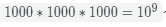

# 第二章 第 2 节 平衡多路搜索树

> 原文：[`www.nowcoder.com/tutorial/10039/c4fcef8f465d457ba1bf1e87c741cc98`](https://www.nowcoder.com/tutorial/10039/c4fcef8f465d457ba1bf1e87c741cc98)

### 2.3.3 平衡多路搜索树

为了提高页的利用率，我们希望树的一个节点存储的信息较多；为了减少一次检索的 IO 操作次数，我们希望搜索树的高度很小。基于这两个目的，平衡多路搜索树被提出。下面介绍两种最常用的平衡多路搜索树：B-树和 B+树。

#### 2.3.3.1 B-树

一棵阶数为 mm 的 B-树定义如下：

*   如果根结点不是叶结点，则其至少有两棵子树。
*   每一个非根的分支结点都有**k-1**个关键字和**k**个子树，其中 **⌈m/2⌉⩽k⩽m**。
*   所有叶子结点都位于同一层次。
*   所有分支结点包含下列信息数据,其中: 为关键字，且为指向子树根结点的指针，且指针所指子树中所有结点的关键字均小于 所指子树中所有结点的关键字均大于为关键字的个数。

一棵阶数为 3 的 B-树如下所示。
B-树的代码定义如下：

```cpp
typedef struct node{                //B-树和 B-树结点类型 
    int keynum;                     //结点关键字个数
    KeyType key[MAXM];              //关键字数组，key[0]不使用 
    struct node *parent;            //双亲结点指针
    struct node *ptr[MAXM];         //孩子结点指针数组 
}BTNode,*BTree;
```

在 B-树中查找指定的关键字 K 的大致代码如下：

```cpp
typedef struct{                     //B 树查找结果类型 
    BTNode *pt;                     //指向找到的结点
    int i;                          //在结点中的关键字位置; 
    int tag;                        //查找成功与否标志
}Result;

Result SearchBTree(BTree t, KeyType k){
    BTNode *p=t,*q=NULL;                            //初始化结点 p 和结点 q,p 指向待查结点,q 指向 p 的双亲
    int found_tag=0;                                //设定查找成功与否标志 
    int i=0;                 
    Result r;                                       //设定返回的查找结果 

    while(p!=NULL&&found_tag==0){
        i=SearchBTNode(p,k);                        //在结点 p 中查找关键字 k                   if(i>0&&p->key[i]==k)                       //找到待查关键字
            found_tag=1;                            //查找成功 
        else{                                       //查找失败 
            q=p;                            
            p=p->ptr[i];
        }
    }

    if(found_tag==1){                               //查找成功
        r.pt=p;
        r.i=i;
        r.tag=1;
    }
    else{                                           //查找失败
        r.pt=q;
        r.i=i;
        r.tag=0;
    }
    return r;                                       //返回关键字 k 的位置(或插入位置)
}

int SearchBTNode(BTNode *p,KeyType k){
    int i=0;
    for(i=0;i<p->keynum&&p->key[i+1]<=k;i++);
    return i;
}
```

#### 2.3.3.2 B+树

B+树是对 B-树的一种变形树，它与 B-树的差异在于：

*   节点的子数和关键字个数相等（B-树是关键字数比子树数少一）；
*   节点的关键字表示的是子树中的最大数，在子树中同样含有这个数据（B-树没有）；
*   非叶结点仅具有索引作用，跟记录有关的信息均存放在叶结点中（B-树非叶子节点不仅做索引，还存放指向数据信息的指针）；
*   树的所有叶结点构成一个有序链表，可以按照关键码排序的次序遍历全部记录。

一棵 B+树如下所示：


#### 2.3.3.3 为什么平衡多路搜索树适合作为索引

前面提到二叉树之所以不适合作为索引是因为它的高度很大，导致一次检索的磁盘 I/O 次数很多。我们从这个角度来谈论为什么平衡多路搜索树为什么适合作为索引。

B-/B+树的一个节点可以有多个分支，我们称分支数为扇出 ***d***。一般来说 ***d***会较大，则在数据量为 ***n***时，树的高度为通常计算的 ***h***很少（通常不超过 3），则一次检索的磁盘盘 I/O 次数不会超过 3，这就是为什么平衡多路搜索树适合作为索引。

我们假设 ***d***为 1000，则高度为 3 的 B+数有个关键字，则可以链接到 1 亿个数据记录，并且一次检索的 I/O 次数为 3。