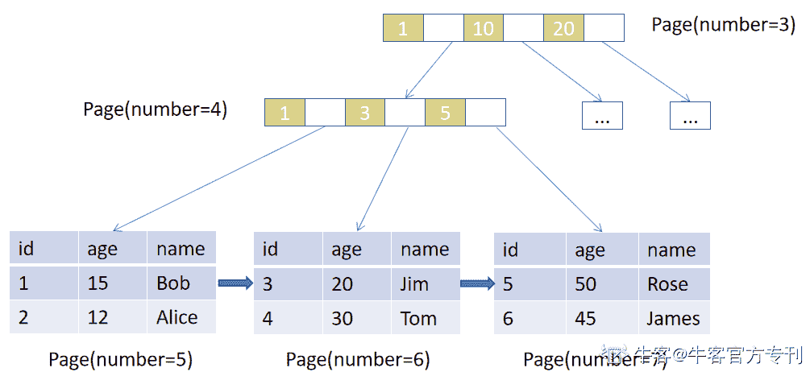
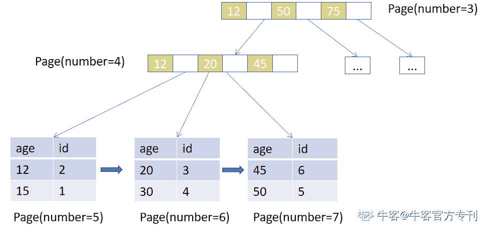
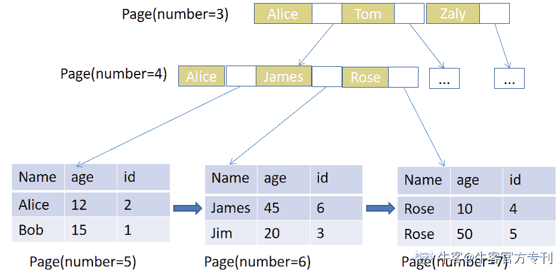

# 第三章 第 1 节 MySql 中的索引及优化策略

> 原文：[`www.nowcoder.com/tutorial/10039/a2fb7077b4e440c4bb6e1c1878a7d6f7`](https://www.nowcoder.com/tutorial/10039/a2fb7077b4e440c4bb6e1c1878a7d6f7)

MySql 的存储层可以使用不同的存储引擎，不同的引擎存储支持的索引不同，实现索引的方式也不同，本文仅介绍 InnoDB 存储引擎支持的索引及其实现方式。
InnoDB 存储引擎支持一下几种常见的索引：

*   B+树索引
*   哈希索引
*   全文索引

下面进行详细的介绍。

## 2.1 B+树索引

### 2.1.1 InnoDB 为什么选择 B+树作为索引

前面我们介绍了多种可以作为索引的数据结构，最后我们也知道为什么只有平衡多路搜索树适合作为索引。但平衡多路搜索树有 B-树和 B+树，那为什么 InnoDB 选择 B+树呢？
这主要是基于 B-树和 B+树的结构不同，原因大致有如下几点：

1.  由于 B+树在非叶子节点上不包含数据信息，则一个节点（一页）能够存放更多的关键字，则扇出 dd 更大。 因为 B-树节点不仅存放了关键字作为树的索引信息，还存放关键字对应的数据记录的指针信息，而 B+树非叶子节点只有关键字，最后一层的叶子节点有所有关键字对应的数据记录的指针信息，因此一个节点能够存放更多的关键字，则扇出 dd 更大。在同样的数据量 nn 的情况下，dd 越大，则高度 hh 越小，则一次检索的磁盘 I/0 就小。
2.  B+树的叶子结点都是相链的，并且从小到大存放了所有的关键字，因此对整棵树的遍历只需要一次线性遍历叶子结点即可。而且由于数据顺序排列并且相连，所以便于区间查找和搜索。而 B-树则需要进行每一层的递归遍历。相邻的元素可能在内存中不相邻，所以缓存命中性没有 B+树好。

### 2.1.2 聚簇索引

在 InnoDB 中，每一个数据表都有一个聚簇索引，也称为主键。我们以如下的人员表 T 为例。

```cpp
create table T(
    id int primary key,
    age int,
    name varchar(16)
    )engine=InnoDB;
```

其中 id 字段为聚簇索引，则该表的存储示意图如下。其中 Page3 和 Page4 为索引页，存放索引关键字，最后 Page5 到 Page7 为数据页，存放完整的行记录。

我们以查找 id 为 4 的人员为例，根据根索引页 Page3，知道应该取出关键字为 1 的右边的索引页 Page4，然后根据 Page4 的索引知道应该取出数据页 Page6，在数据页 Page6 中进行查询，取出 id 为 4 的人员信息。

### 2.1.3 辅助索引

在 InnoDB 中，我们可以给数据表建立辅助索引，辅助索引也称非聚簇索引，我们在人员表 T 建立 age 的辅助索引，这索引的示意图如下。

辅助索引的数据页并不是包含对应的完整行记录，但为了能够找到完整的行记录，因此辅助索引的数据页存储了行记录的主键。通过这个主键，可以通过聚簇索引查找完整的行记录。

我们以查 age=30 为例。通过根索引页 Page3 找到索引页 Page4，然后索引到数据页 Page6。在 Page6 中取出 age 为 30 的 id 为 4，然后查找 id=4 的行记录。

聚簇索引和辅助索引有什么不同点：

1.  数据页存放的数据不同。聚簇索引的数据页存放的是完整的行数据，而辅助索引的数据页存放的是聚簇索引值，通过这个聚簇索引值可以找到完整的行记录。
2.  查询模式不同。通过聚簇索引可以直接得到完整的行记录，但基于辅助索引的查找不能。基于辅助索引的查询为了得到完整的行记录，需要需要多扫描一棵索引树（聚簇索引对应的 B+树），这称为回表。

### 2.1.4 联合索引

在人员表 T 中，我们建立了 id 字段的聚簇索引，建立了 age 字段的辅助索引，这都是在单个字段上建立索引，InnoDB 还支持为多个字段建立索引，这就是联合索引。
我们在人员表 T 上建立 (name，age)的联合索引，示意图如下。


和单个字段建立的索引不同，联合索引的数据页有多个关键字，如上图有 name 和 age 为关键字。数据先按 name 排序，相同的 name 按 age 排序，如上图的关键字顺序为 (Alice, 12) -> (Bob, 15) -> (James, 45) -> (Jim, 20) -> (Rose, 10) -> (Rose, 50)。先按 name 的字典序排序，当 name 相同时，按 age 排序，如(Rose, 10) -> (Rose, 50)。

如果我们建立 （age，name）的联合索引，大家觉得会和 （name，age）的索引一样吗。答案是不一样的，建立 (age，name)的联合索引，则数据会先按 age 排序，再按 name 排序，这和建立 (name，age) 的排序规则是相反的，所以即使是相同的字段，字段的定义顺序不同，联合索引就不同。

假设我们人员表插入了 id 为 7，age 为 20，name 为 Rose 的人，哪么联合索引对应的 B+树应该怎么更新呢。首先先按照 name 进行索引，最后定位到 Page7 的数据页，发现在该数据页中两个 name 为 Rose 的人，然后再根据 age 进行排序插入，最后 age 为 20 的 Rose 插入到 age 为 10 的 Rose 和 age 为 50 的 Rose 中间。

### 2.1.5 索引的优化策略

InnoDB 存储引擎为了进一步提高利用索引的性能，针对索引设计了许多有效的优化策略，在实际利用索引时，我们要尽量使用到这些策略。

#### 2.1.5.1 覆盖索引

假设我们有这样一个需求，在人员表 T 中查找 age 为 20 的人员 id。一般来说，我们有如下两种做法：

*   select * from T where age = 20。利用 age 的辅助索引取出 age 为 20 的人员完整记录，然后取出其中的 id 字段。
*   select id from T where age = 20。利用 age 的辅助索引取出 age 为 20 的人员 id。

大家觉得哪一种查询的性能更好？通过上一节，我们知道利用辅助索引查找完整的行记录时，需要进行回表操作，因为辅助索引对应的 B+树的数据页存放的不是行记录而是聚簇索引值。所以第一个查询语句为了取得完整的行记录需要进行回表操作，而第二个查询语句不需要进行回表操作，因为辅助索引对应的 B+树的数据页存放的聚簇索引值就是 id 字段，不需要到聚簇索引对应的 B+树去查询。

上述不需要回表操作的原因就是辅助索引对应的 B+树有我们想要的值，Mysql 会利用这一点提高查询的性能，这被称为覆盖索引。为了能够利用好覆盖索引，这就需要我们规范 SQL 语句，做到按需查询。

还记得我们建立了(name，age)的联合索引吗。当执行 select age from T where age = 'Alice' 语句时，你觉得会利用覆盖索引策略吗？答案是肯定的，因为 age 字段在我们的索引对应的 B+树上，不需要进行回表，因此也会利用到覆盖索引策略。

#### 2.1.5.2 最左匹配原则

我们在人员表 T 中建立了(name, age)的联合索引，如 select * from T where name = xxx and age = xxx 这样的 SQL 语句肯定会利用这个索引， 如 select * from T where name = xxx 这样的 SQL 语句也是可以利用到 （name, age）索引的，我们看联合索引对应的 B+树示意图就知道。如执行 select * from T where name = 'James'，先根据根索引页 Page3 索引到 Page4，然后定位到 Page6，在 Page6 中取出 name 为 James 的记录。但 select * from T where age = xxx 则不能利用（name, age）的联合索引，这是因为数据在 age 上不是有序的。利用联合索引的查询必须遵守最左前缀原则。

最左前缀原则的具体说明如下：

*   如果有一个 2 列的索引(col1,col2),则已经对(col1)、(col1,col2)上建立了索引；
*   如果有一个 3 列索引(col1,col2,col3)，则已经对(col1)、(col1,col2)、(col1,col2,col3)上建立了索引；
*   即对 k 个列进行了联合索引，则我们可以利用连续的前 n（n<=k）个列作为查询条件利用到该联合索引。

不仅多个列组成的联合索引可以利用最左前缀原则，单个字符型列作为索引也能利用最左前缀原则。

假设你在人员表 T 上以 name 字段建立了辅助索引，则 select * from T where name like 'B%' 也能利用到 name 索引。该语句是查找所有姓名以 B 字母开头的记录，因为在 name 索引树上已经按照 name 的字典序进行排序了，该语句为先找到第一个以 B 字母开头的记录，然后顺序往后遍历，直到条件不满足。

总结起来，最左前缀原则在如下场景生效：

*   对于多个列组成的联合索引，对连续的前 n（n<=k）个列作为查询条件；
*   对于单个字符串列组成的索引，对最左 M 个字符作为查询条件。

#### 2.1.5.3 索引下推

我们知道利用辅助索引查询的时候，为了得到完整的行数据需要进行回表操作，如果查找的数据就是辅助索引树上则可以利用覆盖索引策略减少回表次数，那还有没有其他策略能够减少回表次数呢。

假设我们执行如下语句 select * from T where name like 'R%' and age > 20。执行过程如下：

1.  利用(name,age)索引找到以 R 字母开头的第一个记录(Rose, 10)，因为 age 字段在索引上，判断 age<20,不满足条件，不需要回表查询行数据；
2.  找到下一个记录(Rose，50)，age>20 条件满足，进行回表取得完整的行数据。

索引下推优化（index condition pushdown)， 可以在索引遍历过程中，对索引中包含的关键字先做判断，直接过滤掉不满足条件的记录，减少回表次数。