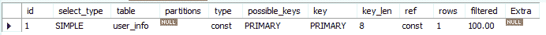

# 第五章 第 2 节 Explain 输出详解（下）

> 原文：[`www.nowcoder.com/tutorial/10039/d08308c0fd6947faa2d42faa45b26b2c`](https://www.nowcoder.com/tutorial/10039/d08308c0fd6947faa2d42faa45b26b2c)

### 1.2.3 table

该字段表明当前查询正在访问哪张表。该表名可能是真实的表，也可能是查询过程中产生的临时表。如执行 explain select id from user_info union select user_id from order_info，输出信息如下。

其中第三个查询的 table 字段值为 <union 1,2>，就是查询过程中产生的临时表。

### 1.2.4 partitions

该字段的值表明分区表使用哪个分区。因为我们创建的表都是非分区表，故该字段的值为 NULL。这里有一个新的概念——分区表，下面我将对分区表进行讲解。

我们知道在 Mysql 中一张表有一个数据文件存放表中的记录，当表中的数据量太大的时候，那么数据文件就很变得很大。这时，对表中记录进行增删改查操作的时间就会很大，特别的，如果需要定期删除过时的数据，耗时也会很大。因此，Mysql 提供了分区的功能，在物理上将一张大表按照分割逻辑分成多张小表，此时，原来的超大数据文件就分割成了多个较小的数据文件。当我们去查找一条数据时，不再像以前一样到大的数据文件中查找，而是只要知道这条数据在哪张子表中，然后就到该子表的数据文件中查找。如果表的数据太大，可能一个磁盘放不下，这个时候，我们可以把数据分配到不同的磁盘里面去。

通俗地讲表分区就是按照分割条件将一张大表分割成独立的多个小表，每个小表之间独立存储和管理。查询的时候，先根据分割条件判断出数据可能在哪些小表上，然后在这些小表中分别独立查询出数据返回给用户，其中在小表中查询数据和在普通的表上查询数据的过程一模一样。

前面多次涉及到分割条件，Mysql 提供如下分割条件，不同的分割条件就是不同的表分区类型：

1.  RANGE 分区。就是按照某列的值的范围作为分区条件。如分区表有一个列 a 表示年龄,类型为 int，则可以将 a 的值<3 的行数据作为一个分区，a 的值<6 的行数据作为一个分区。
2.  LIST 分区。和 RANGE 分区类似，不过列的值不是连续区间而是离散区间。如一个分区表有一个列 a 表示省份, 类型为字符串，则可以将 a 的值属于("北京","上海")的作为一个分区，可以将 a 的值属于("浙江","江西")的作为一个分区。
3.  HASH 分区。就是将某列作为 key，hash 函数的输出作为行数据存放的分区号。如分区表有一个列 a 表示金额，类型为 int，分区表分区个数为 10，则 hash(a)的值就作为行数据存放的分区号。
4.  KEY 分区。KEY 分区其实跟 HASH 分区差不多，不同就在于计算 hash 值的时候 KEY 分区允许多列作为 key，而 HASH 分区只允许一列作为 key。采用的 hash 函数也不同。

下面我们创建分区表来演示一下。执行如下语句创建表和分区。

```cpp
CREATE TABLE test_range_partition(
    id INT auto_increment,
    createdate DATETIME,
    primary key (id,createdate)
) 

PARTITION BY RANGE (TO_DAYS(createdate) ) (
   PARTITION p201801 VALUES LESS THAN ( TO_DAYS('20180201') ),
   PARTITION p201802 VALUES LESS THAN ( TO_DAYS('20180301') ),
   PARTITION p201803 VALUES LESS THAN ( TO_DAYS('20180401') ),
   PARTITION p201804 VALUES LESS THAN ( TO_DAYS('20180501') ),
   PARTITION p201805 VALUES LESS THAN ( TO_DAYS('20180601') ),
   PARTITION p201806 VALUES LESS THAN ( TO_DAYS('20180701') ),
   PARTITION p201807 VALUES LESS THAN ( TO_DAYS('20180801') ),
   PARTITION p201808 VALUES LESS THAN ( TO_DAYS('20180901') ),
   PARTITION p201809 VALUES LESS THAN ( TO_DAYS('20181001') ),
   PARTITION p201810 VALUES LESS THAN ( TO_DAYS('20181101') ),
   PARTITION p201811 VALUES LESS THAN ( TO_DAYS('20181201') ),
   PARTITION p201812 VALUES LESS THAN ( TO_DAYS('20190101') )
);
```

创建了一个分区表 test_range_partition，其中有 12 个分区，第一个分区 p201801 的记录的创建时间小于 20180201，第二个分区 p201802 的记录的创建时间小于 20180301，依次类推。这是一个按时间的 range 分区。分区表的数据文件如下所示。

执行如下 SQL 插入语句。

```cpp
insert into test_range_partition (createdate) values ('20180105');
insert into test_range_partition (createdate) values ('20180205');
insert into test_range_partition (createdate) values ('20180206');
insert into test_range_partition (createdate) values ('20180305');
insert into test_range_partition (createdate) values ('20180405');
insert into test_range_partition (createdate) values ('20180505');
insert into test_range_partition (createdate) values ('20180605');
insert into test_range_partition (createdate) values ('20180705');
insert into test_range_partition (createdate) values ('20180805');
insert into test_range_partition (createdate) values ('20180905');
insert into test_range_partition (createdate) values ('20181005');
insert into test_range_partition (createdate) values ('20181105');
```

执行 explain select * from test_range_partition where createdate = '20180105'，输出信息如下。
可以看到 partitions 字段的值为 p201801，这是因为 createdate = '20180105'的行记录在分区 p201801 上。

### 1.2.5 type

该字段表明 Mysql 是如何查找表中的行。该字段有多个值，每个值代表一种查找方式，下面根据查找性能从低到高一一解释。

**ALL**
这表示全表扫描，即从头开始一直遍历到表尾，取出需要的行。如执行 explain select * from user_info，输出信息如下。


**index**

该方式和全表扫描类似，但扫描的对象不同，index 方式扫描的是索引树。尽管 ALL 和 index 方式都是全表扫描，但通常索引文件比数据文件小，因此 index 方式比 ALL 要快。如执行 explain select name from user_info，输出信息如下。

**range**

该方式和 index 类似，但不同于 index 的全索引扫描，range 方式是带有范围的索引扫描。一般就是在你的 where 语句中出现 between、<>、in 等的查询。如 执行 explain select * from user_info where id between 1 and 5，输出信息如下。

**ref**
该方式为非唯一性索引访问，返回匹配某个单独值的所有行。一般就是在你的 where 语句中出现 = 的查询。如执行 explain select * from user_info where name = 'a'，输出信息如下。


**eq_ref**
该方式为唯一性索引扫描，和 ref 不同的是，在表中一个索引值只有一个记录与之匹配。一般常见于根据主键或者唯一索引进行查找行的查询。如执行 explain select order_info.* from order_info left join user_info on order_info.user_id = user_info.id，输出信息如下。
 **const**
该方式表示通过索引一次就找到了，const 用于比较 primary key 或 unique 索引，因为只匹配一行数据，所以很快。如执行 explain select * from user_info where id = 1，输出信息如下。


**system**

该方式只发生在表中只有一条数据。

**NULL**

该方式意味说 mysql 能在优化阶段分解查询语句，在执行阶段甚至用不到访问表或索引。如执行 explain select min(id) from user_info，输出信息如下：


### 1.2.6 possible_keys

该字段列出查询可能会使用到的索引。可能列出的索引基于如下依据：

1.  查询访问到的列上如果建立了索引，则该索引会列出。
2.  如果比较操作符的列上建立了索引，则该索引会列出。

如执行 explain select * from user_info where id = 1 or name = 'a'，输出信息如下：
 ### 1.2.7 key

该字段表明 Mysql 在优化查询的时候真实使用到的索引。该索引可能是 possible_keys 列出的索引列表中的一个，也有可能没出现在 possible_keys 中。

如执行 explain select id, name from user_info，输出信息如下：
使用到的索引为 name 字段，key_len 为 152。name 字段的类型为 VARCHAR(50) NOT NULL，则 key_len 的计算为 50 * 3 + 2 = 152。关于 key_len 的计算规则可参考如下：

| 数据类型  | 计算公式  |
| char(n)允许 NULL  | n * ( character set：utf8=3,gbk=2,latin1=1)+1(NULL)  |
| char(n)不允许 NULL  | n * ( character set：utf8=3,gbk=2,latin1=1)  |
| varchr(n)允许 NULL  | n * ( character set：utf8=3,gbk=2,latin1=1)+1(NULL)+2(变长字段)  |
| varchr(n)不允许 NULL  | n * ( character set：utf8=3,gbk=2,latin1=1)+2(变长字段)  |
| int 允许 NULL  | 4+1(NULL)  |
| int 不允许 NULL  | 4  |
| timestamp 允许 NULL  | 4+1(NULL)  |
| timestamp 不允许 NULL  | 4  |
| datatime 允许 NULL  | 5+1(NULL)  |
| datatime 不允许 NULL  | 5  |
| BIGINT 不允许 NULL  | 8  |
| BIGINT 允许 NULL  | 8+1(NULL)  |

如执行 explain select * from order_info where user_id = 1 and product_name='p1'， 输出信息如下：

 

该查询利用了 user_product_detail_index 索引，该索引是建立在 ***(user_id, product_name, productor)*** 的联合索引，其中 ***user_id*** 的类型为 ***BIGINT(20)***，故仅仅 ***user_id***的***key_len***为**9** ；***product_name***的类型为 **VARCHAR(50) NOT NULL**，故仅仅***product_name***的***key_len***为**152**,；***productor***的类型为 **VARCHAR(30)**，故仅仅***productor***的***key_len***为**93**。

根据最左匹配原则，该查询仅仅利用了 user_product_detail_index 索引的前两个字段，故***key_len***为 9 + 152 = 161。
如执行 ***explain select * from order_info where user_id = 1 and product_name='p1' and productor='a'***，输出信息如下。这不难分析出，查询利用了***user_product_detail_index***索引的全部字段。

### 1.2.9 ref

该字段显示使用到的索引有哪些列被使用，并显示哪些列或常量被用于查找索引列上的值。如执行***explain select * from order_info where user_id = 1 and product_name='p1' and productor='a'***，输出信息如下。

ref 字段为 const,const,const，这表明索引 user_product_detail_index 的三个字段都被实际使用了，并且都是和常量进行比较。

如执行 ***explain select * from user_info, order_info where user_info.id = order_info.user_id***， 输出信息如下。


根据信息可知，整体的查询先从 order_info 表中取出全部的数据，然后再到 user_info 表取出 id 值等于 order_info.user_id 的值。其中第二个子查询利用了 主键索引，并且 ref 值为 order_info.user_id，即说明 order_info.user_id 列被用于在 user_info 主键索引上进行查找。

### 1.2.10 rows

该字段的值表明 mysql 为了找到所需的行，大致估算的需要扫描的行数。该值可作为 SQL 性能指标，很显然，rows 越小越好。但 rows 的值是估算值，并不一定正确。

### 1.2.11 filtered

该字段的值是对符合条件的行记录数所占百分比的一个悲观估算。
如执行 explain select * from user_info where age = 20， 输出信息如下。


该查询采用了全表扫描方式，并根据 where 条件进行过滤，因为全表有 10 行，故 rows 的值为 10，满足 age=20 的行只有一个，故 filtered 为 1/ 10 * 100 = 10.00，表明满足条件的占比为 10%。

### 1.2.12 Extra

该字段包含不适合在其它列中显示但十分重要的额外信息。其中几种常见重要的信息如下。

**Using index**

表明该查询利用到了覆盖索引优化技术，不需要进行回表操作即可获取所需的数据。如执行 explain select id, name from user_info，输出信息如下。

**Using where**
若查询语句使用了 where，一般 Extra 字段有 Using where，表明服务器会从存储引擎中取出的行根据 where 条件进行过滤。如执行 explain select * from user_info where age = 20，输出信息如下。

如执行 explain select * from user_info where id = 2，输出信息如下。
虽然有 where 语句，但执行的时候并不需要从存储引擎中取出的行，然后根据 where 条件进行过滤，因为根据主键索引能直接找到对应的行记录。

**Using temporary**

当查询过程使用了临时表，Extra 字段出现 Using temporary。当查询语句有 group by 等语句时，一般出现此值。如执行 explain select * from order_info group by product_name， 输出信息如下。

**Using filesort**

当需要对结果进行一个外部索引排序时，Extra 字段出现 Using filesort。当 mysql 无法利用索引完成排序，就需要外部索引排序。 如执行 explain select * from user_info order by age desc，输出信息如下。

我们并没有在 age 字段进行索引，故无法利用索引完成排序，因此需要外部索引排序。

## 1.3 总结

通过这两节，我们对 explain 输出的每个字段都进行了详细的讲解，因此我们大致能总结出 explain 的作用如下：

1.  描述 MySQL 如何执行查询操作、执行顺序，使用到的索引，以及 MySQL 成功返回结果集大约需要扫描的行数。
2.  可以帮助我们分析 select 语句,让我们知道查询效率低下的原因,从而改进我们的查询。

但你要意识到 Explain 输出的是个近似结果，有时候真正如何执行查询和 explain 输出的信息相差甚远，但大多数时候，我们通过 explain 工具可以很好的知道查询的执行细节。