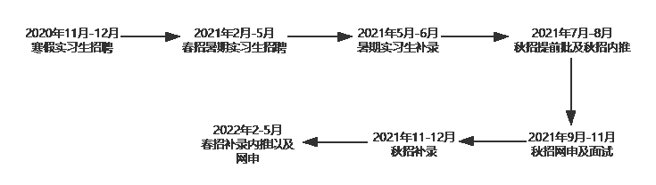

# 第二章 第 1 节 做好求职规划

> 原文：[`www.nowcoder.com/tutorial/10054/e3255a22223d41a1baf4212483cbcd12`](https://www.nowcoder.com/tutorial/10054/e3255a22223d41a1baf4212483cbcd12)

# 1.**求职规划**

## **1.1****校招****岗位****的选择**

岗位的选择是一个很复杂的过程，回顾从开始准备秋招到秋招结束，这都是一个绕不开的话题，不管是开始的大方向（选择做运维），还是后续的 offer 选择（到底做哪方面的运维），这都是一个头疼的问题。我个人认为职业选择是一个不断审视自我、不断调整自我的过程。怎么看自己适合什么岗位，这里我给出三点建议：**第一点：在大学专业课里找兴趣点**大学课程会不断告诉我们适合干什么。计算机专业会开设很多课程，而我们在学的过程中，就应该不断去看自己的兴趣点在哪，懂得自己对什么感兴趣，结合这些，最起码可以有一个大方向的确定。比如有的同学数据结构、算法好，并且代码能力很强，那就可以去做一些软件研发、后台类的岗位，又或者拿我来说，大学期间，代码能力一般，相比后台开发、软件设计，我更喜欢去研究一些网络设备、服务器。软件开发需要极强算法能力、逻辑思维能力、很好的数学功底，而我深知自己在这些方面技不如人，所以慢慢将自己的方向锁定在了运维行业。当然也有一些和网络安全、测试相关的专业课程，如果对这些课程感兴趣，也可以从事如网络安全工程师、测试开发工程师这些岗位。这些都是技术类岗位，也有非技术类，比如运营、产品、销售等，当然在这里，对于非技术岗位我就不做多谈。**第二点：做好校招岗位的信息收集**我们要去多了解实际公司的岗位以及对应岗位的职责，这样不管对学习方向或是秋招准备，都有好处。大二、大三可以去公司官网上看一些招聘岗位的技能树、要求，在这些方面提升自己就行了。**第三点：个人性格**是否能很好的同他人协作，是否更喜欢自己单独工作，这些都是你择业的重要因素，因为不同的岗位平时的工作方式以及氛围是完全不同的。比如开发的工作需要极强的逻辑思维，平时工作内容围绕项目展开，项目再拆解成模块，出现 bug 就需要去调试，一个项目结束去另一个项目，而且工作时间是在一个时间段内，另外研发类薪资也是高于很多技术岗位；而运维就大不相同，运维人员是要负责公司已有项目的运行维护，出现问题有时是需要随时在线解决的，这就需要你的 24 小时待命。当然，有的时候不能全然按照自己的性格去做事，性格只是一个参考，让你在一开始有个大的方向去选择。此外，还有很多因素，比如自己的意向地点，自己喜欢的工作模式等等。 以及公司的选择，对于公司，我个人看法，要去大公司，因为对于技术岗位来说，大公司所接触的技术可能也会更前沿一些，更能锻炼人一些。这些都是在你的校招规划时需要考虑的。总之，结合自身，选一个自己不会后悔的岗位，并为之付出努力。

## **1.****2** **重点说说运维岗位**

运维岗位，可投的公司很多，但是要看自身想做哪方面的运维。**运维开发：**运维开发这个岗位整体是运维里最偏向开发的一个岗位，因为目前运维偏向智能化趋势的缘故，运维开发这个岗位更多的是去用开发去实现一些运维平台，整合运维项目，实现运维自动化。当然这个岗位的发展前景也是这些运维职位里最好的，因为做运维开发不仅需要一定的运维能力，你的研发能力也会在工作中得到提升。另外，这个岗位的薪资水平也相当可观，比其他运维能高出一个档次，并且很多互联网企业都需要运维开发这样的人才，所以前途不可限量。**业务运维：**对接业务，保证公司的业务项目。这类运维其实日常工作中接触的最多就是业务，因为技术总归要服务于业务，而业务恰恰是公司的核心，所以保障业务的平稳就是业务运维的工作核心。这个岗位在工作的过程中，运维人员要围绕业务展开，用一系列手段去保证业务稳定，毕竟业务宕机后果还是很严重的，所以这就需要运维人员 24 小时能够去发现、解决问题，提高业务的使用满意度。这个岗位整体跟业务关系很大，所以业务能力会得到提升，后期其实是可以朝着技术部门的管理层发展的。也有基础架构 ，保证公司的系统、网络等方面的运维，这类运维研究的东西就偏向于底层一些，相比前两个岗位所涉及的方面很少，比如网络运维，其实更多的是做一些网络建设、保证网络稳定的工作。但是术有专攻，这方面的运维其实在某一个领域深耕很长时间，有了自己的经验，也是很吃香的，可以朝着一个技术方向的架构师去努力，也能做出很好的成绩。还有一些专门针对数据库、CDN 的等，不同方向的技能要求侧重点是不一样的。先确定自己要做的，再去投递。**“你理解的运维岗位是什么？”**这个问题是我遇到的面试中最常问的一个，看到这个问题，你脑海中浮现的是什么？以下是我对运维岗位的一些理解。运维，就是运行维护，不管是业务运维、基础运维还是运维开发等等，它都是让你去保证你要运行维护的东西能够平稳运行，遇到问题能够立即响应处理。比如我实习体会的，监控报警，需要做到 7*24 小时的响应；其次还要有一个良好的排错能力，当然这需要时间去沉淀，校招会更注重基础知识一些，大家也不必担心。对于运维岗位的发展前景，我认为技术永远都是一个不断更新的状态，比如现在说的智能化运维，去整合运维项目到平台；让开发与运维有一个良好沟通与合作的 Devops，又或者以后的云计算，中小型企业都会考虑一些业务上云。这就催生了云运维等等，业务项目上线，总要伴随着后续的运行维护，所以我觉得这个岗位永远不会被淘汰，但同时也需要我们不断迭代自己，增强自己的专业能力。

## **1.****3****秋招求职规划**

与其说是秋招，我觉得应该是春招+秋招+春招，这三个时间点所干的事情也是不同的。下面我以**2022 届同学为例**用图介绍一下各个校招的各个时间点。

### **1.3.1 寒暑假实习生招聘（11 月-12 月、2 月-6 月）**

寒暑假的实习招聘每年都有，而且时间就集中在这两个节点上。

#### **1.3.1.1 为什么要找实习？**

优秀的实习经历是秋招的砝码，是给我们简历镀金的最好手段。实习也是一个试错的机会，判断我们是不是真的适合所选择的岗位，尤其是对于运维这个岗位，其实我们在本地虚机、模拟器、云服务器上做的东西跟实际业务环境还是相差很大的，秋招的面试官是很在意这一点的，运维的面试官也很喜欢去问求职者的项目，问求职者的实习做了什么。可以不夸张的说，如果有了高质量的实习，那么我们的秋招就成功了一半。因为面试官聊的时候觉得求职者熟悉这方面，并且有过实习经历，就会对我们产生一个正面积极的影响，同时在沟通的时候也会更顺利。

#### **1.3.1.2 找实习前的准备工作**

要想找到好的实习公司，自然就要求我们要为自己早早规划、准备。系统学习知识、做实习简历、内推投递、复习、笔试、面试、入职。实习面试难度相对于秋招面试自然低很多，但也要全力准备，因为你的实习经历往往会决定你的秋招高度。

### **1.3.2 正式秋招（7 月-12 月）**

#### **1.3.2.1 秋招要趁早**

以我为例，其实走到秋招中期，我才意识到，我准备迟了，很多公司提前批开始的太早了，在我秋招还在进行中时，身边很多人已经拿到很多 offer 了。所以各位同学一定要准确把握各个招聘节点，多留意自己心仪企业的招聘官网、官方招聘公众号等，避免错过宝贵机会。

#### **1.3.2.2 正式秋招的流程**

我大概是在 8 月底实习期间开时投的秋招，建议大家一定要海投，这能帮助你争取相对较多的笔试机会，毕竟多一份机会就多一分拿 offer 的希望，当然海投并不是毫无目的的投，而是基于确定了岗位之后的投递，不能运维、测试、研发甚至产品运营乱投一通。求职前的两个月，就要开始系统复习技术栈、在牛客网上看面经，面试题。技术面试一般最少两轮技术面，一轮 hr 面，重要的还是技术面，牛客网上多刷题，多看知识点，多总结面试经验，面的多了，自然就知道如何面试了。

#### **1.3.2.3 注意秋招的补录**

另外，一般 10 月底正式秋招完毕之后，部分企业在 11 月-12 月会开启秋招补录，跟秋招流程一样，所以没在 10 月之前拿到满意 Offer 的同学，可以在这个时间段多留意补招信息，早日上岸！

### **1.3.3** **春招（2 月-5 月）**

秋招结束，也不要灰心，来年的春招还有机会，这个春招针对的是在上一年秋招还没有找到正式工作以及考研失败的应届毕业生，很多公司都会有春天的补招，虽然相比秋招岗位数量会减少，但是在流程、薪资待遇等都是对齐正式秋招的。特殊的，有的公司不进行秋招，在春天才开始，我的实习公司就是这样，所以，不要放弃，在没找到工作之前，任何机会都不要放过。

### **1.3.4 小结**

总之，我们要非常明确自己各个时间点该做的事情，并且提前准备。针对于各个公司的招聘时间节点，可以参考牛客网的[校招日程](https://www.nowcoder.com/school/schedule)模块，模块里已经将各个企业的校招时间表归纳好，便于我们查阅。最后，校招过程中最重要的还是心态。心态不能炸，我身边例子很多，包括我，刚开始面一个没结果，面一个挂一个，但是这就是一个经验积累的过程，最后他们都收获了大厂 Offer，拼的就是心态吧。另外要稳住，要向前看，我个人是觉得找到真正适合的，不要将就，如果拿到一个自己认为不合适的 offer，不要就结束了，继续去面，找到自己喜欢的！