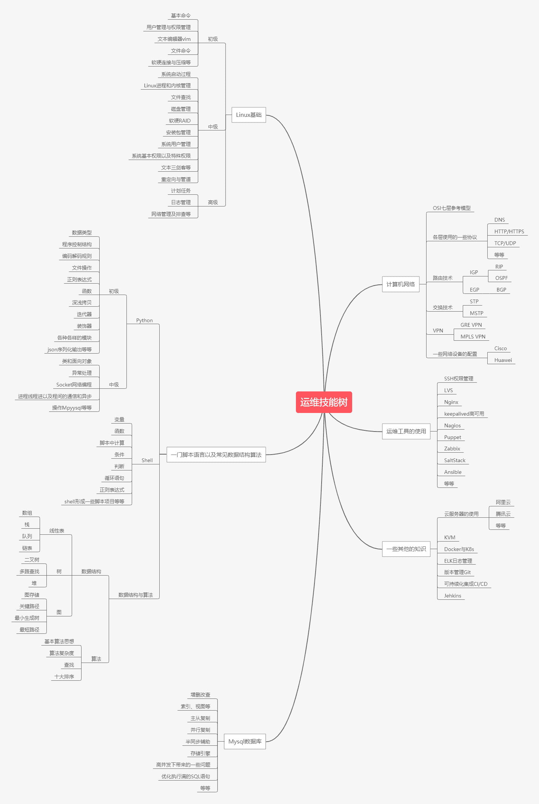
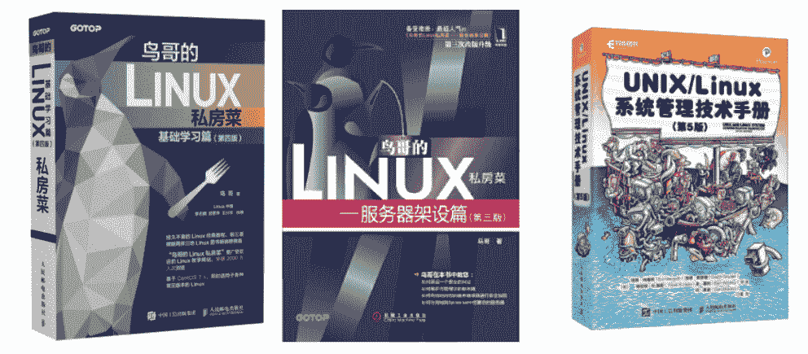
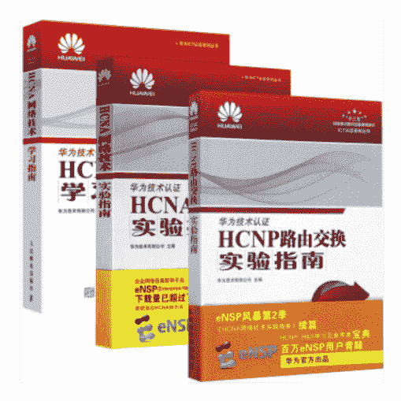
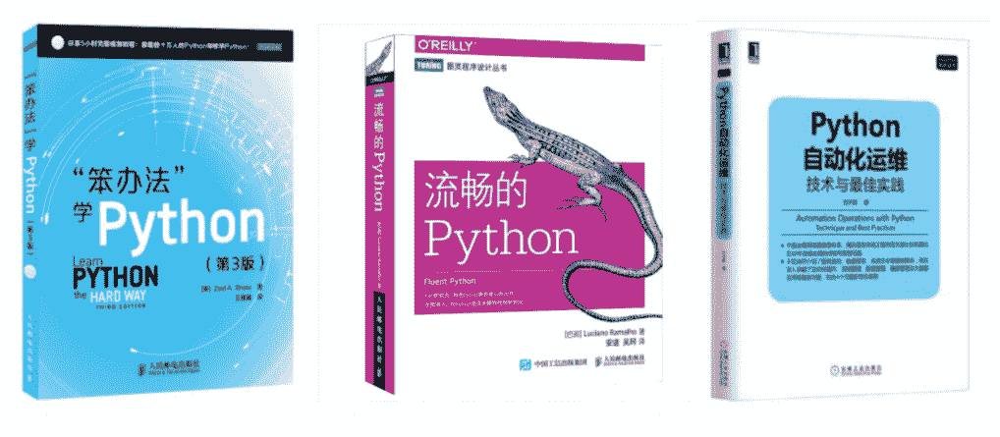
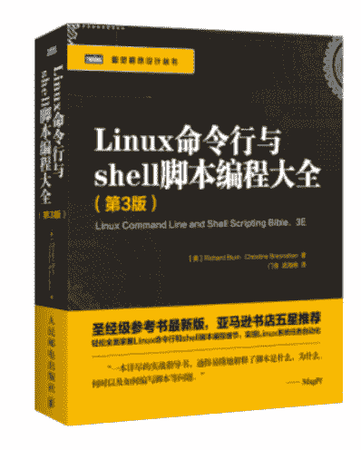
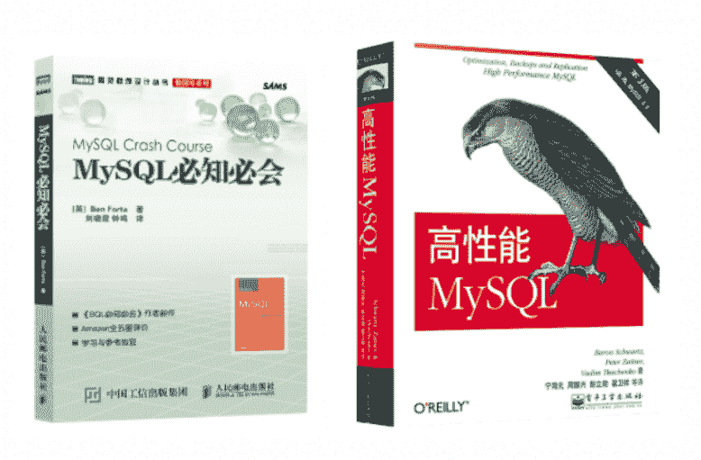

# 第二章 第 2 节 如何做好学习规划

> 原文：[`www.nowcoder.com/tutorial/10054/b5b10d581b7648e2a2852d418639c3f8`](https://www.nowcoder.com/tutorial/10054/b5b10d581b7648e2a2852d418639c3f8)

## **1****运维的****校招****技能树**

技术能力是一个自己逐渐积累的过程，不可能速成的，从大二开始就要慢慢向自己的职业方向上去靠，好好学专业技能，包括大学的计算机专业课程，比如操作系统、计算机网络、数据库等，其实这些还不够，运维这个岗位对于专业技能跟其他岗位不同，可能知识点深度要求不是很高，但需要知道的东西很多，像一些开源软件 nginx,keepalived,rsync,ansible,Zabbix 等等，都需要你知道并在项目中用过。下面是我自己总结的运维岗位的求职技能树：

# **2.****学习资源推荐**

## 2.1 Linux

《鸟哥的 Linux 私房菜 基础学习篇》、《鸟哥的 Linux 私房菜 服务器假设篇》、《UNIX/Linux 系统管理技术手册》。下面三本书不论是对于 Linux 的诠释，还是使用以及案例，都写的很详细，可以作为长久的工具书。

##### **一些实操红帽习题**

可以借鉴红帽认证的一些题目，如果把这些题目做的很熟练了，说明最起码在 Linux 上面入了门。《红帽系统管理 1 学生工作簿（RH124）》、《红帽系统管理 2 学生工作簿（RH134）》、《红帽系统管理 3 学生工作簿（RH254）》。

## 2.2 计算机网络

### 基础知识

网络这部分知识很杂，很细，偏向理论性多一点。因为我是网络专业，所以我首推谢希仁的《计算机网络》，这本书就是根据网络七层模型去逐层介绍，而且每一层的的作用，所用到的协议以及层与层之间的联系，都有一个详细的介绍。另外两本计算机网络必修书：《TCP/IP 路由技术》和《TCP/IP 详解》。

### 实践配置

网络如果想深入拓展的话，可以考虑去做一些网络实验，可以让我们对协议有深的理解。《HCNA 网络技术实验指南》和《HCNP 路由交换实验指南》这两本书是我们学校的实验指导书，里面实验写的很详细，并且模块化。

## 2.3 数据结构及算法

### 基础

浙江大学陈越老师的《数据结构》，老师讲的很细，而且课后有对应的练习习题可以及时巩固。大学教材《数据结构》和《数据结构与算法分析》，一个是入门，一个是提升。

### 实践练习

牛客网：[牛客题霸](https://www.nowcoder.com/activity/oj)， [牛客题库](https://www.nowcoder.com/questionCenter)。

## 2.4 计算机语言

### Python

学一切都可以从官方文档开始:[Python 的官方文档](https://www.python.org/)。入门书籍推荐《笨办法学 Python》搭配视频,这本书涉及动手实践很多，而且提供了一些题目，通过这些题目可以快速提升基础；进阶的话可以看看《流畅的 Python》，这本书包含很多进阶 Python 内容，比如数据结构、并发编程等等。后面可以靠近运维方向，《Python 自动化运维：技术与最佳实践》这本书分基础、高级、案例，是一位运维届大牛级人物写的书，由浅到深，最后教你打造一个运维平台。

### Shell

Shell 的话，其实相比 Python 知识点较少，而且它更贴近 Linux，你在使用 Linux 时，会有很多机会接触它。《Linux Shell 脚本攻略》这本书很值得一看，整本书把 Shell 的精华都讲了出来，适合一直伴在身边。

## 2.5 数据库

**入门 《mysql 必知必会》**书中从介绍简单的数据检索开始，逐步深入一些复杂的内容，包括联结的使用、子查询、正则表达式和基于全文本的搜索、存储过程、游标、触发器、表约束，等等。通过重点突出的章节，条理清晰、系统而扼要地讲述了应该掌握的知识。**提高 《高性能 Mysql》**内容涵盖 MySQL 架构和历史，性能分析，优化，复制、备份和恢复，高可用与高可扩展性等，值得深读，读完感觉会对数据库有一个深刻的了解。

# 3\. 小结

其实在学习资源方面，现在网络这么发达，唾手可得。我们要做的就是在技术方面保持一颗好奇的心，多去学习一些新东西，在看视频、看专业书时，要做好总结以及笔记。另外，技术最后总要回归于实践，所以要勤动手，才能有质的提升。