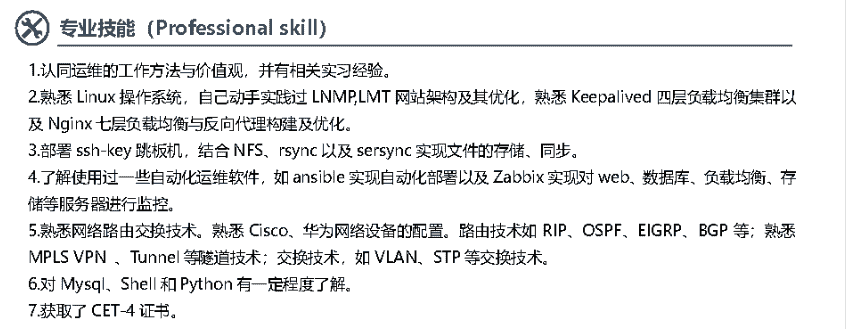

# 第四章 第 1 节 简历撰写与投递

> 原文：[`www.nowcoder.com/tutorial/10054/7e116ef460e14cad8351bcd0e610fe56`](https://www.nowcoder.com/tutorial/10054/7e116ef460e14cad8351bcd0e610fe56)

# 1.**简历撰写**

## **1.1****如何制作****一份简历**

简历，是面试官了解求职者的首要信息来源，一份好的简历，不仅能帮助我们通过 HR 的初筛，还能瞬间拉近我们和面试官的距离，给面试官留下好印象。一份好的简历要具备诚实、简约大气、模块排序有逻辑、与应聘岗位契合这几个特征。

### 1.1.1 简历模板

首先就是简历的模板，我极力推荐简约大气一点，其实完全没有必要为了追求简历的炫酷，而去使用一些花里胡哨的简历模板，但也不要应付！技术岗位面试官还是想看简历上有哪些跟工作岗位有关的重要信息、求职者会哪些技术点，不会注重简历制作的多么漂亮。所以我在这里推荐一个运维岗位的简历模板：

### 1.1.2 简历每个模块如何写以及注意事项

每个公司的 HR 在校招时收到的简历数量巨大，而我们要保证通过 Hr 的初筛，不仅要靠简历的模板，更重要的还是简历上内容的规划，这个时候重要信息的快速提取就显得至关重要。我们要保证 HR 和面试官在看到简历时，能快速找到与应聘岗位相符合的信息，这样能大大增加简历筛选这一关通过的机率，所以一个好的简历必须有一个好的内容规划。简历最好是一页纸，简洁明了，方便快速阅读。我的简历内容主要是个人信息、教育经历、实习经历、专业技能以及个人评价。具体情况要视个人而定，比如我没有好的校园经历和获奖经历，我就用自我评价一栏补充，但如果你有好的教育经历或者其他，就可以将这一栏删去，添加上你自己的闪光点。我个人推荐的模块排序是个人信息、教育信息、实习经历、项目经历、专业技能。之所以这几个在前面因为技术岗着重的还是你的实习、项目、专业技能，当然，如果其他模块更加优秀，自己可酌情调整顺序。

#### 个人信息

个人信息栏就是把自己的名字、邮箱、电话、学历、求职意向写准确，尤其是求职意向，这个还是相当重要的，能让 HR 快速匹配。

#### 教育经历

教育经历里面要标明自己的专业，学校等。这里要注意的是可以去添加一些跟应聘岗位相关的大学课程，写自己成绩高且熟悉的。比如我的专业课计算机网络、Linux 成绩较高，所以将它写在最前面。如果没有与应聘岗位相关的课程，那就写一些自己 GPA，把获奖经历模块整合在教育经历里就行。教育经历一般从近处开始写，硕士、本科依次。比如下面的因为只有本科，所以只要写上本科，但如果有硕士，可以将硕士写在本科的上面，隔开就行。

#### 实习经历

实习经历部分主要包括实习时间、实习公司、岗位、工作职责等。实习时间代表着求职者的稳定性。你的实习时间越长，代表着你越稳定，可以按照自己的实际情况去写，如果实习时间在三个月以上，就可以将实习时间注明，向企业表明自己的稳定性。如果实习时间较短，就可以不写，交代清楚细则就好。实习经历是最能和面试官拉近距离和引起面试官兴趣的模块。我们需要把实习的部门、岗位、内容写清楚，客观描述自己的职责。职责我们可以模仿当时应聘实习单位时给的岗位描述来写。如果经历很多，要分段填写，中间留有间距，表明自己实践经验丰富，尽量将与所求职岗位关系较大的实习经历放在最前面，让面试官能够一眼看到，提高面试成功率。另外我们在写具体内容是要注重实际内容+量化的方法，不要只是客观描述自己的工作内容，要基于数据信息去叙述。给出一些例子：比如在实习期间负责 oncall 工作，那完全可以将时间“7×24”小时加进去；还有比如进行了故障处理、跟踪以及文档输出，这也可以量化，进行了多少次故障处理，输出了多少篇故障文档等。一切以准确客观为基础，加上一定的量化数据，让面试官觉得你在你的实习工作中收获了一定的成功。

#### 项目实践

项目实践部分也是面试官考察的重要模块，它占你和面试官沟通的一大部分时间。简历里要把项目背景、项目环境、项目模块等交代清楚。内容一般我们都是围绕 STAR 法则来写的，S 就是情景，项目的地点、名称；T 就是目标，项目要实现的内容；A 就是行动，为达成目标所用的手段，遇到的难题；R 就是结果，量化我们的结果，自己的项目收获。比如下面的集群项目，我们先交代项目名称、时间、项目背景，项目旨在实现什么功能，比如这里是实现一个博客和类知乎的双重站点。项目具体内容，我们可以量化比如我们用了多少台服务器，前端、后端、监控的工具，介绍冗余与高可用实现手段；项目遇到了哪些难题以及解决方案，以及我们项目最后能够实现的并发量；最后再对项目做个总结，有哪些收获。项目的整体架构，用到的技术点都要极其熟悉，切记不要把自己不熟悉的写上去，这是给自己挖坑，要保证面试官针对项目提出的问题要都能答出来。注意：不要将所有的项目都写在简历上，过于简单的项目所涉及的技术点太少，引起不了面试官的兴趣，反而会占用纸张。

#### 专业技能

专业技能方面，一定要保证准确、真实。对于各个技能点，我们要把握好自己的学习程度。比如我们经常使用的“了解”、“熟悉”、“精通”这三个词语，他们的区别还是很大的，要谨慎使用。因为在你心里的熟悉可能只是面试官的了解，你和面试官对知识的理解可能不在一个层面，如果你回答知识点的效果低于面试官的期望，那面试评分就会降低。这里我建议不要用精通，除非你是极强的大佬。我来解释一下我所理解的这三个词语各自对应的要求：了解就是可能你只是看过相关的知识点，没有去做过多实践，没有成熟的项目，所以一般了解类技能要少写，避免面试官问到你不会的。熟悉就是大多人用的词语，它是指你用这个知识点去实际操作过，解决过一些问题，掌握这个知识点的整体框架。精通就更深入了，它要求你对这个知识点以及它的底层原理极其熟悉，利用技术思想去解决问题，这个我不建议普通人写。

## **1.2** **如何投递简历**

简历投递有三种方式：宣讲会、网申、内推。三种方式不同，效果排序我个人觉得内推>宣讲会>网申。

### 1.2.1 内推

投递能走内推尽量走内推，内推的作用和好处就是用公司内部员工的渠道进行投递简历，企业内部会优先在这些内推里面筛选简历。可以去牛客的内推广场，牛客已经将企业分类好，而且很完善。内推比正常在官网投递快，而且有的时候内推还是免笔试的，增加面试成功的机率。还有，内推的时候要记住你的内推员工的联系方式，这样可以实时的查询进度。

### 1.2.2 宣讲会

宣讲会效果大于网申的原因，是因为企业如果来到学校，说明是想给这个学校一些 HC 的，这是学校给我们带来的好处。所以我们在招聘季来临之前，多去关注一些就业公众号，比如学校就业中心，拿我们学校举例，我们学校的就业中心公众号在校招季每天都会更新宣讲会时间表，列明公司以及宣讲时间，你只需要带着简历按时参加投递简历就行。另外，需要注意有的企业在宣讲会完毕后会进行笔试、面试，所以要认真准备。

### 1.2.3 网申

网申就是一个最常规的申请方式，我们通过企业官网的招聘入口，找到自己想要投递的岗位，投递，之后就是等待筛选、面试就行。

### 1.2.4 投递注意事项

网申和内推在填写信息时候，注意要提前把需要的东西准备好，比如证件照、四六级照片、简历 PDF 版等等，另外在投递时候简历名称格式格外注意，一般是**姓名-学校-专业-应聘岗位-邮箱**形式。