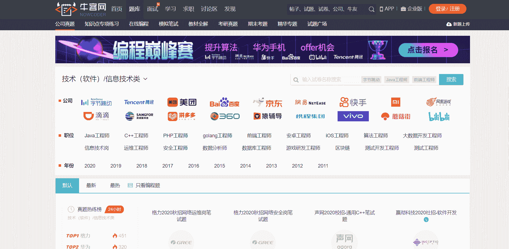

# 第四章 第 2 节 如何通过笔面试

> 原文：[`www.nowcoder.com/tutorial/10054/965276e649ce4745a0d4e07dda76bab8`](https://www.nowcoder.com/tutorial/10054/965276e649ce4745a0d4e07dda76bab8)

## **如何通过笔试**

笔试最开始会有性格测评与行测，之后技术岗会有针对技术能力的专业笔试，运维岗位笔试试题不定，有的公司会把运维笔试和开发类岗位归为一类，着重考察编程能力，有的公司则会考的更偏向于运维一些，要做完全准备。

### 2.1 如何准备笔试

技术岗位我觉得通过笔试的关键还是要多刷题，多积累。这跟学习一些逻辑类科目一样，刷题的提升巨大，但前提还是要有过硬的基础能力以及分析问题、总结问题能力，这些相辅相成，才能提高我们的笔试应对能力。刷题我还是首推牛客网，因为牛客网是一个专门针对应届生求职的社区网站，牛客网针对笔试分的模块也很多，比如公司真题、专项练习、在线编程、模拟笔试等等，尤其是专项练习，它会针对不同岗位以及不同知识有各种题型，每道题都有热心牛友热情解答，最惊喜的是还有错题本，便于归纳总结。另外，牛客网上的[题霸](https://www.nowcoder.com/activity/oj)做的也很好，题霸下面会把一些校招岗位的常考题总结下来，能为我们省去不少精力。

### 2.2 性格测评与行测题目

其实这两方面作为技术岗位来说，我个人觉得影响并不大，但不代表公司不会在这两方面淘汰求职者，所以也要认真对待。性格测评主要是考察求职者的性格以及做事倾向，一般会给你一个场景，让你选择几个程度不同的词语，比如“非常同意”、“较为同意”、“较为不同意”、“非常不同意”，大家谨慎对待，表现出真实的自己就行。行测类题目主要考察的基础常识，数量关系，逻辑思维等，这块刷题提升很大，刷题是注意命题的规律，他们很多其实规律相同，只不过形式不一样而已，牛客网的[题库](https://www.nowcoder.com/intelligentTest?categories=0)就有行测类题目的专项练习，把它练熟了，我觉得就没问题了。总之，这两部分题目相比技术能力笔试难度略低，但不可轻视，做好总结就行。

### 2.3 技术能力笔试

技术能力笔试就是完全考察求职者的技术能力了，一般都有选择、简答、编程这几个部分。运维类会涉及比如计算机网络、操作系统、数据结构与算法、Linux、脚本、中等以下难度编程等。要想通过技术能力笔试，我觉得还是要提前准备，至少提前两个月去多做模拟笔试，熟悉笔试环境，针对不会的、做错的善于归纳纠错，这里我还有个小建议，因为是运维，不必死磕一些高难度编程类题目，做好简单和中等的就行，但其他上面技能树提到的，还是要认真对待。

## 3.**如何通过面****试**

### 3.1 **如何准备面试**

笔试通过后就会通知面试，面试技术岗位一般分为三轮或四轮，一些大一点的公司会更多，前几轮都是技术面，最后一轮是 HR，还可能会有一个领导级别的面试。技术岗位技术面肯定是比较重要的，面试前的准备还是很重要的，我在秋招前会选择把上面提到的所有知识点先过一遍，过的时候，会进行一些总结，把自己总结的常考的技术点记录下来，这样后续面试比较频繁的时候，可以进行快速复习，过知识点。还是上面说的，简历上的必须熟悉，所以要更注重简历上的东西。面试流程也大概相同，但其中也会存在一些技巧。

### **3.2****面试的基本流程以及相应的技巧**

#### 3.2.1 自我介绍

一般都是先进行自我介绍，这个时间就是面试官在看简历，所以控制自己的时间，还有自我介绍个人建议不要去做模板，以自己面试岗位为中心结合自己的个人经历、学习方向简单说说，引起面试官的兴趣。当然，如果实在不知道怎么介绍，可以给出一段参考：面试官您好！我叫×××，我目前是××大学××专业的一名大×学生，大学期间呢，我主要学习了很多和××（专业技术方向）等有关的内容，自己也围绕这些内容做了很多实践，另外 ，自己也有很多这方面的实习实践经验，通过实习，自己将来也决定在这个方向发展下去，今天很荣幸能够参加××公司的面试，谢谢！

#### 3.2.2 介绍实习

之后都是介绍实习，实习是很重要的一段经历，因为实习岗位和面试岗位匹配的话，和面试官的沟通距离会大大缩小，可能面试官就是你入职的同事或者你的直属 leader，所以大胆去展示自己吧。可以先简单介绍自己部门、小组以及自己的实习岗位名称；部门的工作内容；小组的工作内容；自己在自己的岗位上主要负责的工作职责。之后会慢慢引入自己在这个岗位上所遇到的一些技术难题，以及最后的解决办法。这里注意整体要把自己遇到问题时的组内协作、沟通介绍出来。举个例子：我当时的小组偏向于基础架构，像基础网络、系统层面的工作都是我们负责，所以我们这边如果出现问题，业务会受到极大影响。一些监控、oncall 的及时发现，遇到问题，和组内、业务 Sre、数据中心机房内部沟通都很重要，后续解决问题的过程和给出的多种解决方案，这些都可以介绍出来，当然中心还是要围绕所面的岗位，让面试官觉得你的实习经历对进入他们公司很契合、有帮助，这一部分也对增加面试成功几率有很大帮助，要灵活应对！

#### 3.2.3 项目考察

来到项目，项目介绍可以按照总分总结构。先介绍项目实现的内容，前期的一些规划，然后把项目分离开来，负载、高可用、集群、后端、监控等实现用到的技能点，最后总结项目的收获。项目涉及的内容较多，所以要足够熟悉自己的项目以及用到的知识点。讲的时候不要扯自己不会的专业内容，避免给自己挖坑。面试官肯定会把技能点扒开，会问得更加详细一点，比如为什么选 Nginx？Nginx 有哪些特性？与其他负载区别？高可用实现原理？Zabbix 原理，咋添加监控项？集群机器初始化咋做的？所以不熟悉项目，这部分会很吃力。还有会涉及到一些常见的专业知识。面试官会通过一些技术知识点来看求职者对这方面是否熟悉。比如运维看求职者是否对 Linux 很熟悉，会问到用过哪些命令？敲命令是咋生效的？Linux 的一些系统配置文件在哪？网络，会问 TCP/UDP 区别，常见的一些应用层协议，比如 HTTP、DNS 等都有很多可以去问，HTTP 状态码？有做过 DNS 服务器吗？里面字母代表的含义？DNS 不同查询发生咋实现的？操作系统，会问到进程、线程；Python，会考你深浅拷贝、运维用到的模块等等。所以前期认真复习还是很重要的。回答可以结合自己实践的项目，这样更真实一点。如果遇到自己不会的，比如我没做过 LVS，但是我了解过，或者知道别的集群调度，就可以给面试官展示你学过的，不至于直接尴尬跳过，这也可以增加面试分数，回答专业知识之前，提前想一想，再回答，争取回答的更全面一些。

#### 3.2.4 面试官反问及 HR 面

最后还有面试官让求职者反问，这个时候尽量展示出你想去这家公司，比如先让面试官指出你的技术上或者面试过程中还有哪些不足，再可以去询问你所应聘部门的工作内容，运维这块比如可以问部门运维主要是做哪方面？对内还是对外？对接业务吗？这样既可以表现出自己的专业性，也可以展现出自己对公司的浓厚兴趣。一般技术面完了，还会有一个 HR 面试，这个面试注意自己的言行，尽力表现出自己的优点，这个一般技术面过了的话，HR 面就是一个最后的简单考核，但也要认真对待，多看看 HR 的面经，很简单。

### 3.3 面试的注意事项

#### 3.3.1 着装

面试着装只要保证干净、得体就行。面试一些国有企业有正装最好能穿上正装，其他互联网企业其实一些休闲得体的服装都可以。女生最好化淡妆，求职者要表现出神清气爽的一面。

#### 3.3.2 面试心态

面试前我们或多或少都有些紧张，但是紧张过度就会影响我们的发挥，所以我们一定要调整好自己的心态。一般在面试前几分钟，可以做几分钟的深呼吸，使自己身心得到放松，也可以尝试自己做一下自我介绍，熟悉一下环境，做好面试准备。

#### 3.3.3 基本礼节

基本礼节也会成为你面试的加分项，向面试官开始时问好，面试官解答问题时表示感谢，面试结束再次言谢以及道别，尤其是讲话时不要有小动作，两眼与面试官做一定的目光交流，都是侧面反应你的基本素养。

#### 3.3.4 自信

自信这一点我决定要贯穿面试的所有过程，不管是自我介绍还是回答问题，而且自信的表现形式也很多，比如你的肢体语言，你的神态等等，尤其是面试期间会有考察你的抗压能力的环节，面试官会刻意刁难你，这个时候你就要表现出自己的自信，冷静应对。