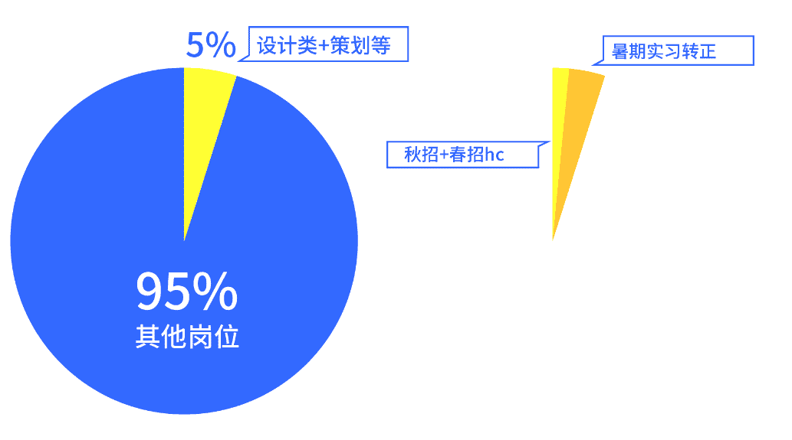
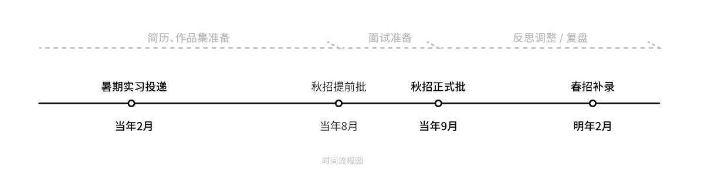

# 第二章 第 1 节 校招准备与规划

> 原文：[`www.nowcoder.com/tutorial/10050/1a0d56df13384b179555a8ab746a7e69`](https://www.nowcoder.com/tutorial/10050/1a0d56df13384b179555a8ab746a7e69)

# **1、了解校招**

## **（1）什么是校园招聘**

校园招聘是面向于应届本科毕业生与研究生的公司招聘，非本届毕业生是不能填报当届的校招。各个公司在毕业前一年的 7-8 月，便陆续开始招聘流程，持续大概 3 个月。因为整个流程横跨了一个秋季，所以这就是所熟知的秋招。

## **（2）关于校园招聘的补录环节**

补录环节一般包括了秋季补录与春季招聘。秋季补录开始时间一般会在 11 月-12 月陆续开始，对于秋招过程中没有招到合适人才的公司，会再次进行一次补录。这一轮的补录招聘需要重新投递简历，因此大家需要重新走一次网申流程。春招，也就是春季校园招聘，则是在来年（也就是毕业这一年）的 2 月-4 月，开始校园招聘的补录环节，主要面向未参加秋招或者秋招补录中未表现好的一些同学。两次补录招聘都是建立在部门未找到合适人才的前提，因此大家应该利用更多的经历去冲刺秋招。虽然补录环节没有秋招那么激烈，但是给予的求职机会也少之又少，难度不亚于秋招。

## **（3）校园招聘的流程与形式**

### **投递流程：**

校招主要有两个渠道：自己网申与内推。网申的开始时间与截止时间，每个公司会有自己的招聘微博号、招聘公众号、招聘官网、以及牛客内推等平台同步开展。内推往往是以内推码的形式分享到各个论坛之中，大家通过扫二维码进行简历投递。内推人可以快速帮所投同学查看自己的面试流程，在对后面的录用环节能有清晰追踪。虽然内推宣传有着快速进入筛选的优先权，但是你的简历与作品集才是硬核能力。因此对于已内推的同学不能松懈，未内推的同学也不用气馁。大家可以去[牛客的内推广场](https://www.nowcoder.com/discuss/referral/all/index)寻找自己的内推人

### **简历筛选进入面试笔试：**

在通过简历筛选之后，就会进入笔试，面试环节。面向设计类面试候选人的笔试通常是素质类笔试题目与专业类题目二选一（腾讯是两者结合）。大家可以通过[牛客题库平台](https://www.nowcoder.com/questionCenter)了解历年来的一些真题题型。因每个公司或者部门要求差异，笔试的发起几率也有所偏差。很多时候笔试会作为进入下一轮筛选很重要的指标之一。往往笔试是在面试之后发起的特定试题，面试候选人需要在规定的时限内，完成某类指定的场景要求或主题指向设计，并提交至下一轮面试。面试通常分为专业面试与 hr 面试。专业面试包括部门上级一面，总监二面。最后才是 hr 面试。在我所有面试经历中，没有遇到过设计类的群面，因此大家对于群面不用太紧张。专业面试考察候选人的专业与综合能力，hr 考察候选人的整体素质以及背调。每个公司的面试流程差异化挺大，部分公司专业面一轮就可以直通 hr 面，某些则会经历很复杂的流程：部门面-总监面-交叉面之后，才会进入 hr 面试。

### **横向比较到 offer 审批：**

完成 hr 面试之后，就是静静等待部门综合考虑，进入 offer 发放环节。大部分完成 hr 面试之后还会有 1-3 位候选人，面试部门会通过综合考量评估前几次面试，笔试，简历的成绩进行排名。因此往往面完 hr 面以后，到 offer 审批还有一段比较长的等待时间。关于笔试内容与我的秋招面试经历，我会在第四章“笔试与面试”章节中再细细展开分享。**小贴士：**投递岗位时确定是秋招而不是实习，在我投递过程中有出现过：投递了腾讯秋招又投递了一次实习，就自动取消了秋招变成只有实习投递。因此大家一定要反复确定好自己的个人信息与应聘的岗位。

# **2、行业情况**

## **（1）当前与未来的岗位竞争**

我们依据腾讯的秋招数据作为参考：2021 届腾讯预计招聘 5000 人，设计、策划类占 5%，因此竞争仍特别的大；其中除去实习转正的名额，最后实际 hc 名额更寥寥无几，真正分派到某一部门的人数，可能就屈指可数。设计往往作为产品环节的最后一轮，所以一般不是新部门，对于设计类的人才招聘其实没有预想的那么多。（尤其体现在互联网公司）因此个人认为近几年，无论是设计工作室还是互联网公司，人才输出会继续远大于人才需求。大家需要有比较高的警觉性与了解就业情况的主动性。**大家要去敏锐的关注当年招聘情况，每一年都会有新需求的提出，因此每年的机遇都不一样：比如今年网易大量招聘游戏 GUI 设计岗位；字节开展游戏业务线，提出了大量关于游戏美术，游戏设计的岗位需求等等。****校招生的优势在于能够快速转型，因此有专业能力相关的岗位，大家都可以参与其投递。**在这里给大家的建议是，广投为主。我暑期实习投递的视觉设计岗位，最后是被京东的 UI 体验部所看重。因此在投递上，运气也有着很高的占比。

## **（2）如何挖掘自己的核心竞争力**

当我们在思考如何提高自己面试竞争力时候，不如我们去思考面试官更需要什么的人。在面试中，面试官对于面试者能力的评估分为专业能力与适应能力。除了你自身的专业能力以外，他们也在考量着你是否能胜任这个工作，需要多长的时间适应从校园到职场的过渡。因此这时候你有丰富的实践项目，尤其是实习项目，无不能快速与同行其他同学拉开差距。曾有位面试官对我们的作品评价是：校园内的设计作品只能叫作业，其实称不上一个完整的方案。当我反思这句话时候，其实深感我们做的很多作品是缺少与实际需求的接轨的。以及在之后腾讯面试中，大家对于我的作品提问更多集中在我京东的实习项目上，因此，我推荐大家去争取更多实习经历。实习不仅是提高自己专业能力与需求的匹配能力，也是自己的抗压与在团队中的合作能力。优秀的专业能力+大厂实习经历，是能在茫茫选拔中快速脱颖而出的。大家常说，多去实习丰富简历，就是这个原因。

# **3、校招规划与准备**

## **（1）投递岗位划分：**

视觉设计类根据部门需求差异，有几大分类：视觉设计（有指向），UI 设计，品宣设计，品牌设计，创意设计等。其中各个分类之间有区别也有交织，但是都有明确的指向性。绝大多数的视觉设计是包含了 UI 设计与品宣设计。大多数公司例如腾讯，京东等，视觉设计为一个大类。根据部门的业务，可以分为 h5 设计、界面 ui（GUI）设计、品牌设计、游戏品宣设计等:H5 设计就是面向手机移动端的互动界面设计；界面 ui（GUI）则负责 app 或者 web’端的视觉逻辑设计；品牌设计倾向于品牌的形象规范，指定 vi 输出规范；游戏品宣设计师侧重于游戏活动推广的界面美术设计；每个业务所要求的核心会有所差异，大致分为：创意、逻辑、品牌性、交互、视觉美术等要素。

## **（2）自己的专业定位：**

往往我们对我们所面试部门业务不会直接了解。因此参考以上分类，结合我们自己所学的专业，寻找到自己的主要发力点，自己期望的发展方向，这样有了明确的自我认知之后，才能有一个比较清晰的作品集规划与面试准备。这样才能方便面试官最快找到他们所需要的人才，以及展现你是否愿意在该部门工作的意愿。例如我在学校所学的是品牌设计，因此我的作品集中 70%是展现品牌设计项目，辅之其他一些视觉设计项目比如：字体设计，UI 设计，海报设计等来展示我的综合能力。

## **（3）材料准备时间：**

设计类的面试材料主要由简历和作品集组成。因为秋招开始时间往往在 7-8 月，建议在 6 月份之前完成简历和作品集，避免秋招正式开始时惊慌失措。（暑期实习的投递时间是在秋招当年的 2 -4 月，因此简历与作品集建议提前 1-2 个月，在 2 月份之前准备好。）对于每个公司的校招时间，[牛客网的校招日程平台](https://www.nowcoder.com/school/schedule)会不断持续更新汇总。

## **（4）材料准备细节：**

关于简历叮嘱：保证纸面的简洁与可读性，作为设计类简历，简历的版面文本也会体现出作为设计师自己的一种设计素养。因此切记花哨的装饰，注意排版细节。关于简历的信息填写会在第三章专门介绍。在作品集上，大家应关注自己应聘岗位的应聘门槛要求：投递 UI 设计岗位就要以 UI 设计为主，辅之一些其他设计作品展示自己别的技能；切忌各类冗杂的放在一起。作品集体现出的不仅是你的专业能力，还有你的专业匹配度。之后根据作品的完整度，满意度等，将最好的放于最前，依次置后。（如果大家项目特别多，先自我筛选一遍，往往同类作品控制在 2-3 个。如果一味的全部放进去，则展示的越多，暴露的问题也越多。）

## **（5）如何利用秋招开始前的前 1 个月：**

6-7 月的一个月时间开始熟悉自己的简历与作品集，从头到尾的回忆项目的设计过程，不要放过任何一处设计细节的思考：调研的结果，颜色的选择，再设计的思考等维度去自我反思。1 个月的时间，不仅能充分地自我内化作品集，以便之后面试的自信与坦然；更多的是在思考过程中去调整自己的作品中的不足。因此预留时间越足，在面试中的发挥自然会更好。对于错过秋招，或者因为准备不足的同学，还有次来年的春季补录。**春季补录开始时间是在来年的 2 月，持续大概 2 个月。面向秋招失利或者未参加秋招的同学。因此在大概 1 月份春招前，也仍有充足的时间去准备。**模拟面试：[`www.nowcoder.com/interview/ai/index`](https://www.nowcoder.com/interview/ai/index)题库：[`www.nowcoder.com/questionCenter`](https://www.nowcoder.com/questionCenter)