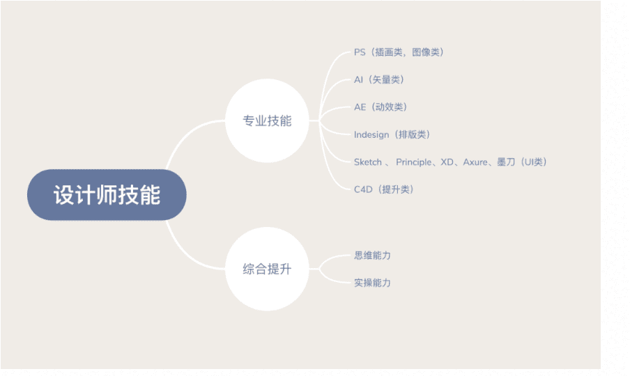

# 第二章 第 2 节 专业技能资源推荐

> 原文：[`www.nowcoder.com/tutorial/10050/be9fc2b7396b4c5e82a52246b465502e`](https://www.nowcoder.com/tutorial/10050/be9fc2b7396b4c5e82a52246b465502e)

# **1、专业技能与资源推荐**

因为我们学科的特殊性，对于专业能力的要求没有一个成文的规定，因此更多的是根据作品集整体观感出发，但是目前有许多新的设计软件出现，因此对于设计师的要求，不再传统地局限于自己的专业领域，能拥有更多的软件技能会成为一个闪光点。我们常说的一个 T 型发展人才：有深度也有广度。而不是只有广度，没有一项精通。因为往往投递岗位是指定型，要求某项技能必须很精通才能达到最低门槛，这是必要条件，其次才是加分的其他软件技能。现在对于不同专业岗位有一些具体的软件要求：Photoshop、Illustrator 的基础软件掌握，在特殊岗位比如 UI，GUI 设计上就会有对 Sketch，Flinto 的要求。在面向电商方向上，会有 C4D 的加分项，以及一些动态软件 AE 的掌握也能成为一个加分技能。在专业的深度上，除了学校的项目课题以外，推荐课外有三个渠道进行自我提升：实际项目、设计类文章与网课。实际项目往往会作为一个面试重点加分项，因为实际项目从实用性，落地性，思维性上要比学校项目更成熟。往往面试官会对实际项目或者实习项目更加关注，作为候选人思维、实操等能力的加分参考。后两者则更多的是有着丰富经验的设计师去介绍自己的项目，引导你去完成一些课题或者分享一些自己的案例思考与专业想法。我常关注的公众号有：**design360，野鹿志，AlibabaDesign，陆俊毅 _ 设计现场，日本设计小站**等。(更多学习资源，我会在第三章节进行深入的讨论与分享)

# **2、部分学习资源分享：**

作为设计师，一定要学会眼高手低。除了以上提到的设计类的公众号，大家也可以通过相关的设计类的设计刊物提升。作品集/年鉴类的有每年一新刊的《Design360》、《Graphic Design In Japan-JAGDA》、《China TDC 文字设计在中国》等。通过对每年新设计的关注，保持自己设计想法的更新，与对新设计潮流的关注。有足够广的眼界与阅历，能让在实际设计过程中有着天马行空的 idea。《Brand D》是偏向于品牌设计杂志。这类刊物更面向某一特定的专业领域。对于自身素养的提升可以阅读原研哉的《设计中的设计》、康纳德诺曼的《设计心理学》等。这类书籍更多是站在更高的纬度去谈论设计，不单只局限于设计本身，从个人到社会到世间的角度，去探寻设计师自身。还有一些信息分享平台的网站，主要是通过每日一些小更新来不断保持我们自身的好奇心。

## 字体整理类：

[`www.hellofont.cn`](http://www.hellofont.cn/)

## 配色类：

[`coolors.co/browser/latest/1`](https://coolors.co/browser/latest/1)[`color.adobe.com/zh/create/color-wheel/`](https://color.adobe.com/zh/create/color-wheel/)[`color.uisdc.com/`](https://color.uisdc.com/)

## 设计灵感网站：

[`dribbble.com/`](https://dribbble.com/)[`www.behance.net/`](https://www.behance.net/)[`www.pinterest.com/categories/design/`](https://www.pinterest.com/categories/design/)[`huaban.com/all/`](http://huaban.com/all/)[`muz.li/`](https://muz.li/)

# **3、心态与建议**

对于面试的准备，不用太过于紧张，紧张的情绪有时候反而会让自己的思维与表达陷入混乱。因此按照以上建议得提前做好充足的准备，能够很好的缓解面试中的表述与回答。秋招的道路并非一帆风顺，每一次面试都是可贵的机会，之后的复盘思考都会成为自己下一次面试前准备的发力点。参考面试官的面试问题或者自己表现不足的地方，加以反思，思考如何在下一次面试中不在相同的地方碰壁。面经可以去牛客的论坛寻找，时常会有面试候选人分享自己的面试流程与经验。参考他人的面试过程，来预备模拟也是一个很好的办法。