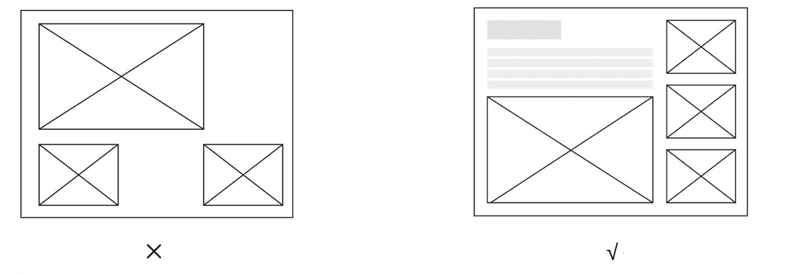

# 第三章 第 1 节 专业技能准备与提升（上）

> 原文：[`www.nowcoder.com/tutorial/10050/98282b4d046f42429cd1a8b556af85f3`](https://www.nowcoder.com/tutorial/10050/98282b4d046f42429cd1a8b556af85f3)

设计师的考核，不同于其他职业，不只是停留在个人知识储备上，更多的是对自己设计项目的思考过程、设计呈现进行考量。本章就联系我求职准备的经验，对关于简历与面试作品中的“个人项目”如何准备，展开分享。

## **1、专业技能准备与提升**

我作品中的项目由三部分组成：学校课题、课外项目（包括实习）、日常练习。一份优秀的作品集通常也是包含了这三个不同维度的作品展示：校园课题展示的是自己的在校学习能力；实地项目（包括但不限于课外私活、实习经历、设计比赛等经历）展示的是自己遇到实际需求时的变通分析能力；这也是我在上一章节提到的为何要去争取更多的私活、参加实习等项目的原因，这是你与在校生拉开差距的竞争优势。日常练习则展示的是自我提升能力。从宏观缩小到局部，同样的两个项目如何去鉴别哪一个更优秀？我给大家依次列举我们在面试中，面试官优先的考虑要素：专业性、逻辑性、表达性、细节推敲等。下面我一一来解释每一个要素：

### **（1）专业性**：

专业性就是考察你在项目中表现出的专业度、匹配度，是否具备他们想要的能力。面试官会根据你的项目呈现有个整体感觉，进行评估，先打一个范围分。之后参考其他能力考查进行增减。作品集作为我们面试的敲门砖，因此从整体的视觉呈现到单个的视觉呈现也都体现着设计师对于整体、细节的把控能力。我们常提到的设计能力有：视觉、版式、跨界。视觉即在图形、色彩、排版上的功底。图形概括能力、色彩的选择把控能力、版式的疏密排版能力，这是我们从一个完整的作品中感受到的设计师的设计能力。

#### **a、学习渠道：**

那么如何提升这些能力，首先是自己主动去多看设计类作品。在我前一章末尾有提到的我关注的公众号：Design360**，野鹿志，陆俊毅 _ 设计现场，**MICU**设计**等都是以分享国内外优秀设计作品的文章为主；对于字体感兴趣的同学，也有 Typeschool，字体设计这一类优秀的公众号可以进行了解学习；在样机素材的选择上我是购买了 LH 会员，不定期去找到一些合适的设计资源。
此外还想和大家再分享一下日常中我是如何锻炼自己的能力的：在我大二那一年，进行了很多的海报作品尝试。给自己定下了一个 daily poster 的练习。大概坚持了有 200 天。设计师，也是生活的摄影师。我把每天生活中遇到的有趣的事物，所言所感，用图形、色彩、排版抽象于一张画面中。这是一系列无主题的创作，可能是随感而发的设计，可能是带有感情的设计。随着一天天的积累，我对软件、色彩、图形的理解也在慢慢的提高。因为我在校期间所接的私活不多，因此我更强调要求自己坚持每日海报的练习。
大家也可以给自己拟订一个小计划：比如 UI 类的每日一个小 icon 设计、插画类的每日一个小随笔、字体类的每日一个文字设计等。每天给自己多一点小练习，日积月累之后，设计的能力会潜移默化的得到很大提升。当你积累的作品达到一定体量之后，便可成为你作品集的一部分。我将我的 daily poster 练习置于了我作品集的最后一项。往往面试前或者过程中所遇到的笔试题目，也是根据部门需求或者你的专业能力给予的一些设计类题目。因为我在之前有大量设计海报的经验，因此在百度的海报设计笔试中，有很高的自信与设计效率。除此以外，现在也有着许多网络教学课程，站酷上面与许多设计大咖在不断开展更新自己的在线课程。如果大家在课余有空闲时间，也可以多关注挑选自己感兴趣或者薄弱的环节，进行更多的深入学习。在大三之后，我开始强迫自己去尝试接触一些商业项目。小到给一个啤酒烧烤店的 logo 设计，大到协助为“城市论坛”设计展览主视觉。期间给我最大的收获就是，让你的设计成果落地是需要很高的经验积累的。这与在校期间所完成的设计课题有着天壤之别。当我们在面临一个实际设计需求的时候，我们要考虑的东西会更加具体：面向人群、实际预算、甲方喜好等。如何做到设计师与需求方有很好的共识，是极具挑战性的。你不仅需要用专业能力去说服他们，还要将你的设计表达出来。这一能力便是我们在校期间所缺失的，但也是作为设计师而言必不可少的。因此对于实际项目的接触，希望大家能接触的越多越好，因为这才是真正展现设计师能力的项目，也是面试官的目光为什么更多的聚集在你的实际项目上的原因。

#### **b、细节展示：**

除了每个项目的版式设计以外，作品集的版式也很重要。在作品中的视觉排版上，图文并茂的方式会远远优于只有图片排版。面试官如果能通过你的图文介绍清晰 get 到你的设计点，闪光点，便会少了很多问题询问；相反单纯的图片放置，只会让面试官不明白你的设计点，这样会给自己打上很多问号的标签。这就是为什么我在第二点说的推荐逻辑性会先于表达性的原因，作品集的逻辑性呈现比你的表达更加提前。在作品集介绍之前，面试官的问题是遵循你的面试作品集出发的。

### （**2）逻辑性与表达性**：

这两点主要是针对面试过程中所具备的能力展开分析：为何逻辑性会置于表达性之前，这里给大多数艺术生打个警醒：作品集介绍不等同于结课汇报。我们在学校汇报自己的作品时往往都是靠语言的表达，缺少系统的逻辑呈现。结合我面试腾讯暑期实习的经历，面试官的评价：我的专业能力优于很多同行学生，但是在逻辑表达梳理上会弱于别的学生。对于他们的人才招聘来说，这些能力不是二选一，而是都需要具备。这也是通过我自己的亲身经历，才深感到在面试之中，有逻辑的呈现项目，让面试官能清晰的明白你的设计思路，是至关重要的。我在秋招前 3 个月的时间里，便一直在重新梳理自己的项目逻辑，在秋招面试中也得到了很好的反馈。何为逻辑性呈现，给大家关于我的项目思考逻辑作为参考：设计背景，调研分析，设计概念，设计方案，设计敲定，呈现效果，（反思与总结）。

#### **a.设计背景：**

就是 Why？即为什么要去设计这个项目，项目的出发点是为了解决哪一类需求；

#### **b.调研分析：**

往往在实际项目中，我们会叫“用户画像”。我们会对面向的人群进行一个轮廓描摹，并且结合市场上现有产品进行分析其优点与不足，最后得到我们自己设计的突破点；

#### **c.设计概念：**

从调研分析之后你得到的设计突破点：是随性创作还是有理有据；

#### **d.设计方案：**

前期有多少次尝试，还是一锤定音；往往大家会忽略对于试错的展示，但其实这一点是很重要的。在社招作品集展示中，大家也都十分重视试错的方案，它是你设计过程最重要的展现；

#### e**.反思总结：**

是否有项目中的不足与改进地方。在百度面试中有关于项目改进地方的提问，我之前也有对自己的作品反复审视，所以很好的回答了这个问题。结合以上的几个关键词，大家去重新审视自己的每一个项目，便会明白项目中或多或少都有逻辑不清晰的地方，那这便是你可以尽快填补的漏洞。在我个人看来，这一块是最容易在面试前事半功倍的地方，只要能付出一点时间去理清项目逻辑，就能让你在面试过程中不论是介绍还是答疑上，都能有很好的自信与表达效果。看完以上关于逻辑性的分析之后，大家对于作品集如何去展示排版，结合之前两张示例图片，应该会有了更深的体会。

### **（3）细节推敲**

虽然细节推敲我排在了最后，但这一环节却是面试之中最容易减分的地方。看似是微不足道的地方，却也同时展现出你作为设计师的细节把控能力与设计思考的逻辑性。逻辑性在设计细节中的体现，比如为什么使用这个颜色？为什么使用这种风格？如何拉开差异化？等等，这些是在你有逻辑性设计过程中产出的结果，但凡一个问题模糊不清，那么在前一节的“逻辑性”上就会大大减分。在京东暑期实习面试的时候，面试官有询问过我颜色为什么选择这个而非其他颜色。当时其实我并未思考到这一问题点，但我选择了从品牌调性、品牌差异上进行分析回答。有逻辑的的分析，不一定是最合理的，但一定是比回答“感觉这个比较好”受面试官青睐的。因此在之后的准备中，我有单独放置一页说明该项目的一些设计思考逻辑：为何使用紫色而非蓝色？为何使用圆角图标而非几何直角？为何使用动物作为 logo 而非抽象图形等。