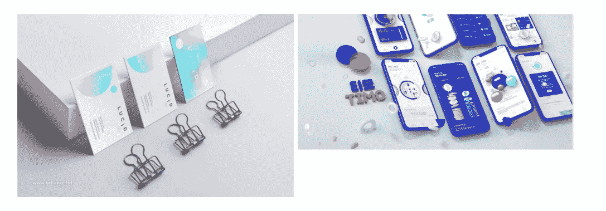
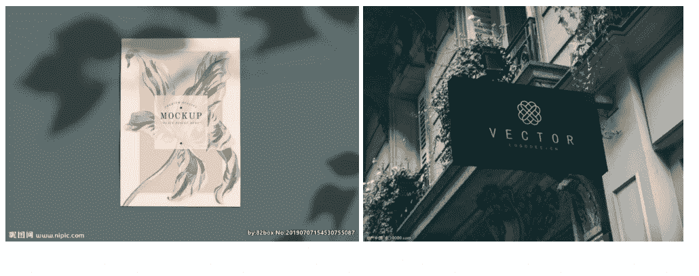

# 第三章 第 2 节 专业技能准备与提升（下）

> 原文：[`www.nowcoder.com/tutorial/10050/5b30072f7bae4b95a4867e33dad745b5`](https://www.nowcoder.com/tutorial/10050/5b30072f7bae4b95a4867e33dad745b5)

# **1\. 项目包装**

针对在校项目与实习项目，如何进行适度包装在这里给了几个参考角度。

### a.在校项目：

在校项目往往具有其艺术性的特点，因此在内文排版上可以相对个性化一些，包括在呈现的贴图样机的选择上可以更加的特别，不要受商业贴图的影响，可以自己制作一些特别的贴图而非常规贴图。（以下列举了运用在品牌设计、UI 设计中的贴图样机）
在我的个人校园项目中，我放大了其艺术性，无论是在色彩背景上还是版式上，都相当于我的实习作品更加的个性化。在这里我们可以参考一些艺术类的展览或者杂志文字排版。像一些公众号：design360，陆军毅-设计现场等都会定期更新艺术性的展览或者优秀作品。

### b.实际项目

在实习项目中，我会尽量舍弃一些艺术性，强调其思维性与落地性。在我们真实的实习项目中，往往有一个特定的场景需求，例如我所在京东实习部门是数据产品部，这款产品所面向的用户人群，使用场景等因素会成为我设计中重要的参考因素。如何去表达自己的设计呈现与项目需求的匹配关系是最重要的。视觉效果固然重要，但是设计的合理性、有效性会占更大的比重。在京东实习作品项目中，我不仅展示了我的设计定稿，也展示了前期很多草图、视觉尝试。在实际项目中，很少有项目是一两次就能敲定的，展现自己的试错过程，是对自己的工作态度，抗压能力，思维能力的很好展现。在一些难度较高的项目中，还可以分析团队中的项目分工，过程中所遇到的实际问题与解决思路，以及自己的收获。关于展示效果的样机上的建议：在品牌设计等商业设计中，我们会面对一些实地效果贴图的场景。这时候我们尽量去选择气质、效果好的那种贴图，避开单一空壳的那种样机。我会选择在淘宝等素材网站反复挑选出最适合的样机进行展示。
精致的样机，会提高你的设计作品气质与削弱一些不足。像 UI 设计类的样机，统一使用全面屏 16:9 的样机，避免使用 4:3 的传统贴图，紧跟时代设计趋势。

# **2\. 实习经历准备与提升**

这一小节，是分享关于我在京东数据产品用户组的一些实习经验与感受。我实习经历不多，仅有这一次实习经历。通过网申暑期实习，经历了三轮面试，最后取得了京东的暑期实习 offer。来到京东之后，我在部门里面负责的是给部门产品做品牌视觉设计。对于没有参加过实习的同学，和我一样刚进入职场一样谨慎又不自信。但其实对于实习而言，部门不会对你有太高的要求。我在实习期间的感受，就是一个部门“吉祥物”：一边完成视觉设计，一边慢慢熟悉和同事的关系。刚开始的第一个月，在给 leader 呈现我的设计成果的时候，有明显的的不适应与紧张。作品呈现质量其实不高。但是 leader 有比较耐心的的指导我，给我一些灵感启发。在之后的两个月里，自己状态有很好的见长，做出来得作品也得到了部门同事的认可。实习过程中更多的是去展示自己的学习能力与上进心，不用太过于苛求结果。当你尽心尽力时，结果往往不会太差。在我第一次受挫时候，便重新整理心态，放下之前的已有设计，重新上网搜索新作品学习构思。在勇敢的否定了之前的设计思路之后，效率达到了空前的提高，也是第一次深深感受到了压力转化为了无限的动力。同时也要学会去主动跟 leader 交流自己的进展。往往很多同学会因为第一次步入职场而有所害羞胆怯，但是学会主动的迈出第一步，提高自己的存在感，能让 leader 认可你是一个会主动学习的人。虽然只是实习生，却有着与正式员工一样的责任感与主动性。这样无论是对自己之后的人际关系，还是实习转正都有着很好的效果。对于我们从事设计的同学参加实习，更多的不仅是去学习专业知识，也是去熟悉职场环节，与待人接物、抗压能力的学习。在这四个月的时间里，其实完成的项目并不太多，但其中反复打磨的过程让我收获很多。我渐渐地从自我认知中，去考虑看我设计作品的人群认知。我会根据不同人群的定位进行一些视觉风格的调整。例如在我在负责小型窗口预览图的时候，就会舍弃过多的装饰细节，以视觉效果与信息传达为首要。因为这类窗口用户眼睛停留时间不会超过 3 秒，因此抓主要的信息传达比设计本身更为重要；在招聘海报上，因为第一次做有点艺术个性化，画面效果冲突了招聘信息的传达。因为是面向招聘部门技术岗位，所以避免过多的装饰，直接传达招聘信息更重要。如果是招聘设计岗位，个性化图形与装饰，就会比较合适。因此在之后的调整与新需求的设计之中，我也时常提醒自己，最主要与最次要的点。能得到最后的转正机会，**一是肯定了自己的专业能力，二是我也在努力调整自己状态去和同事建立关系，展现出自己想融入团队的想法。**我在很多人眼中都是一个比较开朗主动社交的性格，“爱笑的人，运气一定不会差”，希望大家在进入职场时候，多学会微笑。一方面是因为职场大家都是不轻易喜形于色的，如果你的情绪会快速反应在你脸上，对于职场关系的建立没有好处。二来笑容能传递更多的正能量给对方，能吸引大家与你交流。回忆实习那段时间，给我感受都特别深刻。在选择 offer 的时候，最后去了腾讯，心里也对京东部门同事有很多不舍。Leader 也并没有责备自己的离开，激励我未来一帆风顺。所以我对实习没有任何后悔，不管是氛围还是人文关怀上，仍都对京东抱着感激与不舍。校园时候的我们，常常抱着我要去改变环境的想法，其实在现实社会中，应该是去适应环境。这是给我最大的感触。**其实每一次实习都是一次成长，当你成长的经历多了，你的能力也在不断提高，离心愿的 offer 也会越来越近。**

### **章末小结：**

有人说，进入大学就是步入半个社会。在有限的大学几年时间里，大家如何在秋招中脱颖而出，便是对你这个“半个社会人”的考量。不再单单是像学生时代的成绩单就能评定你的能力，考核越来越综合。不管是自我提升，还是外出实习，都是让你未来成为拉开与同龄人差距的两个钥匙。不要局限于校园的课题安排，主动去了解未来的行业趋势，早点熟悉职场生活，提高自己的综合实力。