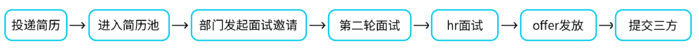
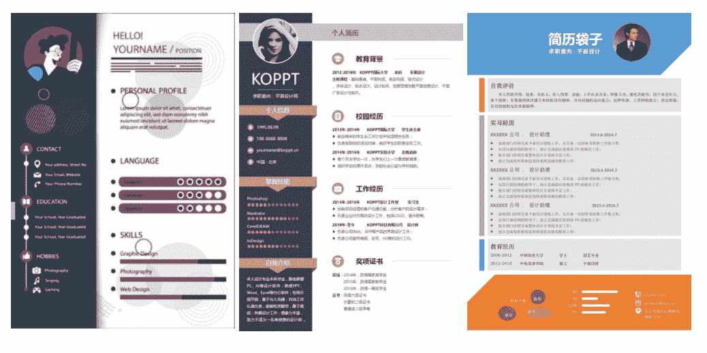

# 第四章 第 1 节 简历撰写及注意事项

> 原文：[`www.nowcoder.com/tutorial/10050/acbd267786d647e7a459a843cdb89703`](https://www.nowcoder.com/tutorial/10050/acbd267786d647e7a459a843cdb89703)

参考校招流程线框图的示意，在本章节，我会对每一步流程中所需要注意的细节进行仔细分析。**小贴士：**在腾讯面试过程中，如果面试流程中有未通过的情况，简历会重新回到简历池等待别的部门重新筛选。因此落选的小伙伴不用特别伤心，机会还会很多。而有些公司，也可能等秋招结束后重新释放简历，进入补录环节。

# 1、**制作一份优秀的简历**

## （1）简历的作用：

首先，简历是一个人的自荐信，从某种角度来说，也是个人的说明书。在个人简历中必须要有，有个人的基本信息，比如教育状况、兴趣爱好、个人能力、工作经验、求职意向，还有对自我的评价。这些是对自己所学的基本介绍，同时也是对自己能力的进一步说明，是让他人更好的了解你的重要渠道，因此必须要展示出你个人优势的一面，简历中所能够显示出你的优势越多，那么对你自己的“推销”就越有利，从而被录用的几率也就越大。第二，个人简历在求职的过程中起到“敲门砖”的作用。有人说学历就是一块“敲门砖”，简历又何尝不是呢?简历是一个企业了解求职者的重要渠道，一般用人单位觉得求职者的简历合适了才会约见面聊。然而在这个过程中，你有没有认真填写自己的个人简历，面试官一眼就能看出来，因为从简历中就可以看出来你有没有用心，你对这份工作有没有渴望。如果面试官从你的简历中看不出你对这份工作的渴望，那么你就直接被拒之门外了，根本不会再有面试的机会，所以大家在求职的时候一定要重视简历的填写。校招流程中，hr 会先进行简历与作品集筛选，将第一批候选人名单给部门，部门再次筛选第二批候选人参与面试。简历在整个过程中是 hr 对你综合能力的评估依据，横跨你的教育经历与工作经历等多维度，而作品集更多是向你的专业匹配度倾斜。

## （2）简历注意事项：

在招聘设计师的简历中，个人经历是 hr 最看重的地方，往往会高于学历。个人经历也叫个人经验。有一个最常用的模式，叫做 STAR 法则：在什么样的情境下（Situation），接受了什么任务（Task），做了什么事情（Action），得到了什么成果（Result）。STAR 法则是一种很清晰和有条理的模板，能够比较好地描述个人工作经历，让人觉得你对工作的目标和思路都非常清晰，并且有具体而详细的经验。比如在我个人项目中，可以分别概括为：在 x 年 x 月-x 月期间，完成了 A 方的一个项目需求，负责完成了 xx 的工作，在规定的时间，达到 xx 的效果（如果有因设计带来的业务增长可以附加）。实习经历也同样适用：本人 x 年 x 月-x 月期间在 A 公司 xx 设计组参与实习，负责 x 产品的设计工作，独立/合作完成了 xx 的项目。通过一个修改前后对比案例，大家会有更直观的感受：**修改前：曾做过 3 个月的实习，负责日常设计工作。****修改后：曾在 A 公司 xx 设计组参与为期三个月的实习，通过品牌调研与用户心理分析，寻找设计切入点，独立完成了新产品的日常设计需求。**很明显，修改后的内容给 HR 充分展现了你的工作方法、产出和成果，这就是能够让你“脱颖而出”的竞争力。这就是有实习经验会更受面试官青睐的原因。一般学历，却有着丰富经历的普通应届生，与高学历无项目的美院毕业生相比，前者往往更能得到赏可与赏识。当然很多同学不会写也是因为觉得自己的工作 “没什么”，并没有什么结果和产出，实习过程中不知道自己到底做了什么。那就更需要利用写简历的机会好好总结一下自己，不只是展示给 HR，首先是自己发现自己的价值。简历不是个人自传，**与你申请的工作无关的事情尽量不写，**而对你申请的工作有意义的经历和经验绝不能漏掉。要保证你的简历会使招聘者在 30 秒之内，即可判断出你的价值，并且决定是否聘用你。关于建立之中，个人简介，我将自己的给大家一个参考：

> 本人就读/毕业于 xxx 学校 xx 系，接触过 xx、xx 等设计课程，有着 xxx、xx 的实际项目设计经验。目前在/曾在 xx 公司 xx 部门参与实习，担任 xxx 职位，负责完成 xxxx 项目。

## (3)设计师简历的独特之处

以上是一份合格的简历撰写思路，那么何为设计师的简历呢？还会多一条，那就是视觉呈现。对于设计师而言可能从拿起简历那一刻开始，就是你的面试了。你的简历排版能力，信息传达有效性会间接体现出你的专业水平。因此杜绝过于模板化的简历，没有繁琐的装饰，做到言简意赅的表达是很重要的。以下我列举了几个案例参考：第一份简历就是很大众的简历模板，作为一个设计师，没有一个体现设计能力或者设计审美的简历是会难以入选的。如果在独特性上做好了，我认为是可以加分的。第二份简历就是装饰元素太多，会影响信息的表达，所以也是容易出错的地方。第三份是三个中，观感、设计感上、逻辑上都有较好平衡的。但此类模板也比较大众，所以推荐大家多花时间在简历的文字筛选与排版上。【控制在一页】