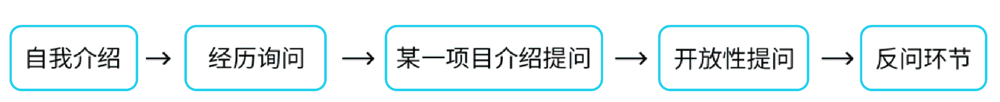
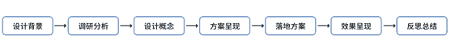

# 第四章 第 2 节 如何通关笔面试

> 原文：[`www.nowcoder.com/tutorial/10050/a6f067a528054dc6981cfa2f9b588506`](https://www.nowcoder.com/tutorial/10050/a6f067a528054dc6981cfa2f9b588506)

# **1\. 笔试环节：**

## (1)**笔试形式**

往往秋招笔试形式有以下三种：1、以腾讯为代表的：统一素质类、专业类并行的笔试题+面试流程中穿插笔试测试 2、以百度、阿里为代表的：统一素质类笔试+部门指定测试题 3、以字节、网易为代表的：由部门发送笔试测试题于绑定邮箱之中因为设计类是比较特殊的学科，因此在基础知识上大家不要有太大压力。

## (2)**笔试题型**

专业笔试中题型浮动性较大，往往会根据应聘岗位特征，发送对应专业能力的笔试题。UI 类：给一张白底黑字的需求文稿，完成指定的画面风格和图标 icon 的设计。考察点：①明确主题风格；②专业的基础考察；③个性与独特性的加分处理海报类：给一段描述“主题”（例如科技、古风类）的介绍，为该主题完成一张海报创作。考察点：①设计与主题的契合度；②视觉的设计能力考察；③延展性与人文性/冲击力的细节处理 h5 类：给一段产品时间背景，例如“七夕”“端午”等主题节日，完成一个 xx 需求的 h5 设计。考察点：①与产品品牌的联想性；②互动的创意点；③交互的可实施性品牌类：针对某个在研或者孵化产品，为其品牌设计一套 vi 形象。关键词“科技感”“亲人性”等。考察点：①logo 的设计能力；②整体视觉风格的把控；③延展性，例如未来的品宣、会议等。笔试通常给予的时间是 3-7 个工作日时间，完成后发送至指定的邮箱。我在百度笔试中就是在一个明确指定的场景下，完成设计一个主题的海报创作，在 7 天时间内完成返回至邮箱。笔试是作为你是否能顺利走向下一步的重要参考。如何应对好这类笔试，给大家分享一下我的设计思路：1、明确场景，是科技类还是中国风类或者游戏类等等，设计风格的联想性会高于创新性，因此不用追求独一无二的风格。2、设计呈现的稳重踏实便是最好的答复。考虑延展性是一个加分的点，面试该部门是一个品牌设计部门，因此我会思考如果设计使成果的延展性很强，就会有很高的加分，这在实际工作中有利于更多拓展需求的高效完成。对于 GUI 设计，除了风格的对应，还要考虑人机交互的合理性：交互原则，icon 大小布局的上手性，视觉信息的清晰性等等。很多时候在下一轮面试时候，面试官会依据你的笔试结果进行提问。所以设计过程的逻辑性，合理性会作为很重要的参考。不论是作品集还是笔试，逻辑性都是要时刻铭记在心的关键词。

# 2. **面试环节：**

小贴士：不同的面试官有不同的面试风格，这五个环节可能都会进行，也可能只有自我介绍-项目提问-反问整个过程就结束了。

## （1）自我介绍：

自我介绍是面试的必考题，在介绍的时候内容需要与个人简历保持一致，表述简介概括，条理清晰，层次分明。因此推荐大家事先以文字形式做准备并多练习。内容包括自己的就读院校所学专业、课外相关专业实践/实习经验、自己对于该专业的学习掌握情况、应聘理由等。90%内容与自己匹配的专业有关，词句简练，不要过于口水话且控制在 2-3 分钟。为了缓解面试的严肃性，自我介绍中可以加入一些个人兴趣爱好。兴趣爱好这里，可以于自我介绍中主动介绍，也可能会成为面试官的一个小问题进行提问。对于“个人爱好”的问题，如何进行准备回答？①过滤掉不能体现出和未来工作有相关的能力，比如个人类项目：音乐，武术，书法这类。②将一些能力用专业术语来转换表达，比如英语好，联系到实际工作中：爱好英语电影或杂志，有比较好的英语口语能力；比如爱登山，体现出自己愿意参与团队活动的意愿等等。如果没有，尽量说一些能够体现团队精神的爱好，如足球、篮球等。我在秋招面试中没有主动提及我的个人爱好，更多是在自己的实践经历上进行了介绍。保证自我介绍的内容更多围绕我的专业能力与综合素质出发。总结可以概括为：就读院校专业+专业掌握情况+课外实践/实习情况+爱好即可。所有的介绍都是紧扣未来你的专业或者团队协作能力。

## （2）面试的问答环节：

面试官会根据你的自我介绍或者作品集进行提问。往往提问问题有以下几类：

### **①你有 xx 实习的经历，可以介绍下你的实习情况么。**

回答：在 x 年 x 月-x 月期间，于 A 公司 x 部门设计组参与了为期 x 月的实习。在此期间，独立负责/团队合作完成 B 项目的设计工作，推动了项目的设计上线。提醒大家如果没有实习经历，不要随便捏造。面试官会询问部门构架，以及业务沟通问题来考察你的经历是否属实。忌讳不诚信的行为，因此千万不要因小而失大。**——面试官往往会紧接着询问，设计中是否遇到困难？（并如何解决的）**回答：无论是否过程一帆风顺，以谦虚的态度去回答。问题并非想考察你的缺点与能力，而是考察你的解决问题的态度与方法论。因此，如何克服这一难题，不管面试官是否有提问，都应该自己主动去介绍出来。当你主动说出解决的办法，这个问题就从一个被动的立场化为一个主动。【这一类问题的思路，不管是实习经历中，还是校内项目里都是通用的】在我的陈述中我是这么回答的：由于自己初入实习，在设计中有自我的表达欲。在思考用户群体与用户体验上有所不妥。之后重新进行梳理思考，勇敢的否定了之前的设计方案。主动与同事交流讨论，并重新搜集资料，进行新一轮设计。慢慢的找到了在校期间的学习能力与实际工作中的实操能力的平衡点。

### **②针对你作品集里的某个项目，进行更详细的介绍？**

几乎也是设计类面试中的必考题目，介绍的逻辑性、流畅性由前期对自己项目的熟悉程度所决定着。因此前期在第三章中，强调的对 ppt 中项目的打磨可见是尤为重要的。对于某一项目如何去准备，在第三章节有着详细的介绍分享。不论是在 ppt 排版之初，还是在面试回答中，都可以通过这一线性逻辑一一进行分析回答。——面试官会紧接着根据你的项目思路、设计细节（颜色、图形设计、版式等因素）进行发问。询问的角度往往有：你为什么采用这种设计语言？这样设计是否合理？相比较于其他市场已有项目，该项目设计的优点与不足有哪些？是否有更好的解决方法？如果前期准备不够充分，便会在这里暴露出很多问题。因此再三叮嘱，第三章节的前期准备不可以有丝毫马虎。反复雕刻自己的作品集，对自己每一个项目做到胸有成竹的把握。很多面试者的失利，并不是作品不够优秀，而是对自己作品认知没有合理的归纳总结。要对自己作品集中的项目做到不断的反复熟悉，这种熟悉过程是在你每一次准备，每一次实战中不断形成的。因此大家可以私下和同学模拟面试，缓解自己的临场紧张情绪与理清自己的设计思路与设计逻辑。除了和同学模拟面试，牛客也有相应的求职辅导与 AI 模拟面试服务。

### **③现场提一个具体需求，思考片刻之后，给一个回答。（少见）**

现场提需求不会在第一面试就询问，但在复试或者后几轮面试可能遇到。这种设计需求更多的是面向该部门业务方向进行询问。在我面试微信过程中，遇到过一次。因为我所面的是 A 部门，提了个实际需求让我给一个设计思路，思考时间两分钟。第一次作答面试官评价我没理解他意思，如果没法回答也没事。但自己又争取了一次思考回答的机会。面对这类问题，其实往往是对部门了解的疏忽。大家如果在面试之后得知了自己部门业务，便可以因此在复试以及后几轮面试前，多关注一下自己所面部门的业务内容，提前准备对部门所负责的产品了解以及自己对该产品目前的一些设计思考。如果临场对于问题没有思绪，就主动承认自己目前没有想法。大家不用太在意因此会造成太大影响，如果我第二次也没回答上，反而会使面试官认为自己性格有点倔。因此不建议大家因小失大。

### **④一些主观开放性问题，例如：**

**1/你有哪些主要的缺点？**回答这一问题，千万不要认为是一个挖苦面试者的问题。有两个思路：第一，大家参考①的设计中是否遇到困难？其实这两问题是同一类问题，学会化弱势为优势。表达出自己在通过可行的办法去改变，并且得到了可见的提高。第二，说一些表面上看是缺点，从工作角度看却是优点的缺点。例如：我需要学会更耐心一点，在实际工作中不能急与莽，总赶着第一时间做完事情。**2/你有了解过当下的设计趋势吗？你平常都关注什么公众号？对于现在的 ui 设计有什么看法思考？**这类问题大家的原则还是从自身的专业出发，不管是公众号内容还是设计趋势，都围绕自己的专业发展为中心思考。推荐大家的回答思路是“所学专业扩展+工作匹配扩展”。问题的回答，其实都是对你的自学能力，综合能力的考察。这也是为什么我在第三章节的公众号分享中，并不仅仅是分享了设计类的公众号，还包括了一些艺术性、UI 类的公众号推荐。而像“Alibaba Design”这类公众号，便是作为我了解当下互联网语境下对设计师提出的新要求的学习渠道。重点：切忌做一个抢麦的人，在面对提问时候，不要去抢话抢答，切忌强行把自己的想法传达给别人。每一次发言都要十分珍惜，回答到点上即可。如果你的介绍有逻辑遵循，就自然而然能得到获得面试官的赏识。有时候面试官也会主动分享自己的经验经历，认真的去倾听别人的想法，说不定能够激起你真正的思维。

## （3）反问环节：

在结尾的时候，面试官往往会问出“你还有什么问题要问我的”。这就意味着面试即将结束。首先切忌说没有。我们保持一个谦虚的态度，应该表露出自己对这份工作的兴趣，想加入公司。因此抱着很想学习的态度，主动询问面试官对于新人的期望（我的万能提问）、自己在面试过程中是否有有不足的地方需要改进等等。大家不要站在大公司的角度去提问公司发展方向这类，以及薪资，这样会给面试官带来不适的感受。好的问题能引起面试官的共鸣，那么你们的面试时间会加长，最后进入下一轮面试的可能性就会大大提高。会聊，会说，想得快，快速反馈，跟面试官有共鸣，这样的话基本上能在面试中十拿九稳。

## （4）终面 hr 面：

Hr 面主要是对个人信息的确认以及家庭情况的了解。因此走到这一步，已经是离 offer 近在咫尺。但是 hr 更偏向于未来你的工作能力进行提问，因此大家也不能有懈怠。之后会有背调环节，因此对于个人信息不要有撒谎行为。除了自我介绍，hr 会从哪些角度来考验求职者呢？大概会有以下几类：**①你有哪些主要的缺点？****②作为应届毕业生，缺乏工作经验，如何能胜任这项工作？**回答中应体现出自己的诚恳、果敢与敬业。例如：作为应届毕业生，在工作经验方面的确有所欠缺，因此在读书期间我一直利用自己的空闲时间与各种机会进行实习与接触实际项目。逐渐发现，实际工作远比在校学习要丰富、复杂。但是自己有很强的学习能力与适应能力，通过实习与外接项目让自己的综合素质都有了很大的提高，复盘获取的经验也令自己受益匪浅。**③你为什么选择本公司？**这一问题主要了解你的求职动机、求职愿望与工作态度。因此要表达出你对贵公司的热心与决心。例如：自己特别认可贵公司的企业文化，对人才的重视与工作的氛围，对员工的福利与照顾等。给大家一个关于我在面试腾讯 hr 面的经验分享：我如何表达出想进入腾讯的决心：自己在暑期实习的失利之后，一直在不断复盘重新调整，希望在秋招能够得到腾讯的认可。其实表达自己对公司的热爱，也有多种方式：可以通过自己对公司企业文化的了解、对产品的了解、自己为之付出的准备等多角度来表达。态度越坚定越能得到 hr 的青睐。Hr 也会询问到你是否有其他公司的 offer，以及询问你对多方的选择倾向。hr 往往会站在培养一个人的高成本的角度去考量。当已有其他 offer 的时候，如果你有犹豫，耍一些小心思是极其危险的，尤其是手上有很多 offer 的时候。慎重对待自己的一言一行。当自己不是有确信把握未来不会选择该家公司时候，最好不要在该问题上展现出你的犹豫，给自己一个最好的退路，等收到 offer 之后再做斟酌选择。