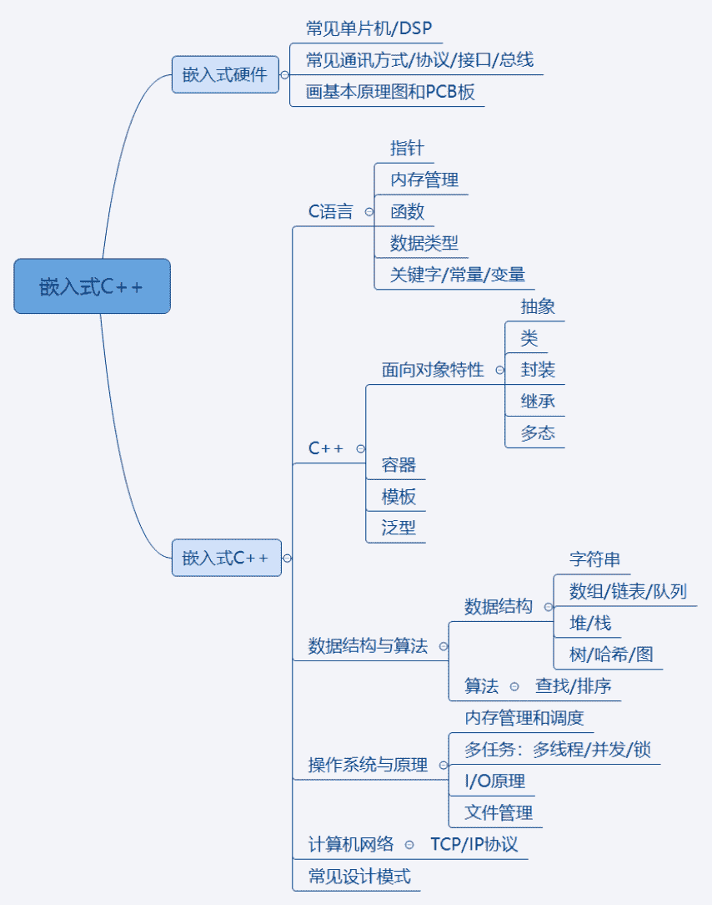

# 第一章 第 1 节 作者介绍

> 原文：[`www.nowcoder.com/tutorial/10059/42752be3de944cefbd1644a8049587a5`](https://www.nowcoder.com/tutorial/10059/42752be3de944cefbd1644a8049587a5)

# **1  作者背景**   

        本专刊分享的内容主要为电机控制开发岗位和国家电网求职经验，适用于对电机控制开发岗位感兴趣和电气专业同学校招期间学习和参考。

 我本科是东南大学吴健雄学院电气工程专业，期间参加过一些学科竞赛，主要包括数学建模竞赛，全国大学生电子设计竞赛，并获得了数学建模竞赛全国一等奖和电子设计竞赛江苏省一等奖、二等奖。在电子设计竞赛中，我主要负责嵌入式开发，主要内容是完成 DC-DC 功率电源变换器软件部分，之后我保研到东南大学电气工程学院。我们课题组主要做电机本体设计，部分电机控制相关的科研项目与嵌入式相关，我的方向是永磁电机的控制，会涉及到 C++编程、自动控制、嵌入式硬件设计等。 

# **2 ****求职经历**  

##  **2.1****求职规划** 

        接下来简单介绍一下个人的求职经历：不夸张的说，近十年来我们学院 80%以上的毕业生都去了国家电网、南方电网工作，但电网的工作不一定适合每一个电气学子，同时，最近几年电网招聘要求越来越高，但薪资水平相较之前甚至略有下降。      结合自己没有国网背景、成绩并不靠前，项目经历相对丰富的学习经历，选择了在电网提前批（一般在国庆节后）到来之前投递互联网、通讯等比较热门的行业。考虑离家近的因素，主要考虑了工作地点在四川、重庆，薪资待遇较好或者发展较好的行业或者公司。  ## **2.2****学习规划与总结**         因为本科和研究生都接触的 DSP 均为 C++语言开发，于是从 6 月低开始准备嵌入式 C++开发岗位的相关内容，如下。                                                                                                具体的学习过程为先将 C++基础快速过一遍然后刷牛客上面经和[直通 BAT 面试算法精讲课](https://www.nowcoder.com/courses/semester/algorithm)，最后就是反复的看书刷题，编程四件套（数据结构和算法、操作系统与原理、计算机网络、设计模型），最后一定要及时总结，只有自己总结的东西才是自己掌握的。

##  **2.3****求职经历与结果** 

 其实每年 6 月份秋招提前批已经陆续展开了，但是由于自己准备得有点晚，且相关基础较差，所以选择先学习一段时间专业知识。到八月中旬的时候，开始投递简历，参加笔试面试等，主要投递的公司和岗位如下表：

| **公司名称** | **岗位** | **笔试** | **面试** | **O****ffer** | **备注** |
| **美的集团** | 电控开发 | **√** | **√** | **√** |  |
| **大疆创新** | 电控开发 | **√** | **×** |  |  |
| **华为(****2012****实验室）** | 单板硬件开发 | **×** |  |  |  |
| **远景能源** | 风机研发 | 无 | **√** | **√** |  |
| **重庆中冶赛迪信息** | 智能制造 | 无 | **√** | **√** |  |
| **中电****14****所** | 电控开发 | **√** | **√** | **√** |  |
| **中国核动力研究设计院** | 仪控仪表 | 无 | **√** | **√** | 签约 |
| **中电****29****所(成都)** | 信号处理 | **√** | **√** | **√** |  |
| **OPPO****(成都)** | C++开发工程师 | **√** | **×** |  |  |
| **VIVO** | C++开发工程师 | **×** |  |  |  |
| **TP-LINK****（成都）** | 软件开发工程师 | **√** |  |  | 无 HC |
| **中兴通讯** | 嵌入式软开 | 无 | **√** | **√** | 未谈薪资 |
| **重庆云从科技** | C++开发工程师 | **×** |  |  |  |
| **中国移动成都产业研究院** | 嵌入式硬件开发 | **√** | **√** | **√** |  |
| **浙江之江实验室** | 嵌入式硬件开发 | 无 | **√** | **√** |  |
| **重庆供电公司** | 大概率主城 |  |  |  | 放弃 |
| **四川供电公司** | 南京站无成都岗位 |  |  |  | 放弃 |
| **江苏供电公司** | 苏南 | **√** | **×** |  |  |

        总体来说，今年秋招收到贸易战和新冠疫情的影响，大部分私企都有一定程度的缩招，部分企业甚至大幅缩招，比如华为。同时，因国外疫情持续爆发，大量留学生选择了回国就业，大量准备出国深造的毕业生选择了直接就业，导致求职人数大幅上升，求职压力也大幅上升。  ##  #### **2.4****校招形式之我见** 

 就面试经历来说，私企更看重个人能力和岗位匹配度，面试过程主要考核专业能力和项目内容；而国企则更看重综合能力，学历，成绩，学术成果等，就电网而言，第一梯队江苏、广东、冀北、浙江、山东尤其激烈，往年要求较低的重庆主城和安徽市局也基本上要求双 985 起步。

        因为经济形势的不确定性，加上自己更喜欢科研相关的工作，所以放弃了去重庆供电局的机会，选择了签约国企成都核动力研究院。

        本刊总共四章，后续第二章主题为校招规划，主要针对如何准备电控开发岗和电网的面试，并会给出规划建议与学习资料；第三章主题为专业技能准备与提升，并具体的指出第二章提到的技能树需要学习到什么程度，在校招来临前如何准备项目与实习等；第四章主题为求职技能准备与提升，专注于如何改简历，怎么通过笔试面试的一些小建议等等。欢迎大家继续订阅！