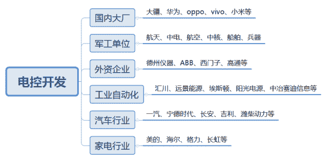
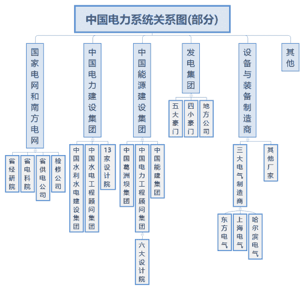

# 第一章 第 2 节 岗位介绍

> 原文：[`www.nowcoder.com/tutorial/10059/0f57febadb3f47f78b5278d82e6a2b29`](https://www.nowcoder.com/tutorial/10059/0f57febadb3f47f78b5278d82e6a2b29)

## 1 岗位描述

        这里整理了 2021 年校区招聘企业对电机控制开发岗位的职位描述，主要有：

岗位描述：

1. 软件方向：电机控制系统软件设计、电机驱动相关控制算法及程序编写；

2. 硬件方向：从事电机控制新技术研究（矢量控制/直接转矩控制、无位置传感器控制、弱磁控制、参数辨识、高速电机驱动控制等），推动电机控制新技术的产业化应用。

岗位要求：

1. 硕士学历，英语六级以上；

2. 电子信息类、控制科学类、电气工程类、计算机类、机械电子类相关专业，熟练掌握电子电路基础知识和电子器件工作原理；

3. 具有较强的学习能力，具有谦逊、开放、包容、创新的精神和团队协作的意识，良好的沟通能力；

4. 参加电子设计竞赛获奖或者在国内外主流核心期刊发表过论文者优先。

## 2 薪资与行业前景

        下表为根据某薪资爆料网站查询到的 2021 年与电机控制开发、嵌入式开发等相关岗位行业薪资待遇情况，主要分为家用电器及自动化、外企、汽车制造、国内大厂。整体来看制造业相关的企业从薪资待遇上较互联网相关的大厂差距较大，但互联网相关的企业工作强度较高，对人才要求也相对较高。但就找工作而言，薪资只是一个很重要的参考因素，工作地点、公积金缴纳比例、是否稳定以及是否提供编制等都是签约工作前需要考虑的问题。

| **行业** | **企业** | **岗位** | **学历** | **薪资-年薪** | **工作地点** |
| **家****用****电****器****及****自****动****化** | 美的集团 | 电控开发 | 硕士 | 17.5k*14 |     上海、佛山 |
| 海尔集团 | 算法 | 硕士 985 | 18w | 青岛 |
| 奥克斯 | 电控软件开发 | 硕士其他 | 13.5k*13 | 宁波 |
| 格力电器 | 电控开发 | 硕士其他 | 8-10k*14 | 珠海 |
| 长虹 | 嵌入式开发 | 硕士 211 | 10.5*14 | 四川绵阳 |
| 汇川技术 | 电机控制 | 硕士 985 | 16k*15 |      苏州、深圳 |
| 远景能源 | 电机研发 | 硕士 985 | 16k*15 |      上海、江阴 |
| 阳光电源 | 电气工程师 | 硕士 985 | 21w | 合肥 |
| **外****企** | 德州仪器 | 技术支持 FAE | 硕士 211 | 30w |      上海、南京 |
| ABB | 制造类 | 硕士 985 | 11k*16 | 上海 |
| **汽****车****制****造** | 长安汽车 | 智能化软开 | 硕士 985 | 12.5k*12 | 重庆 |
| 宁德时代 | 研发 | 硕士 985 | 10.5k*15-18 | 宁德 |
| 一汽集团 | 电机控制 | 硕士 985 | 15-18w | 长春 |
| 吉利 | 三电软件开发 | 硕士 211 | 9k*12-13 | 杭州湾 |
| 潍柴动力 | 电控开发 | 硕士 985 | 15K*12 | 潍坊 |
| 小鹏汽车 | 电机控制 | 硕士 985 | 18k*15 | 广州 |
| **国****内****大****厂** | 大疆 | 嵌入式开发 | 硕士 985 | 20-24k*15 |            深圳 |
| 华为 | 单板硬件开发 | 硕士 | 20k*14-16 |       上海、东莞 |
| OPPO | C++开发 | 硕士其他 | 31w |        成都、东莞 |
| VIVO | C++开发 | 硕士 985 | 20k*15 |              深圳 |
| 小米 | C++开发 | 硕士 985 | 16-18k*14 |              南京 |

## 3 电控开发岗位企业篇

        有的地方也叫做电机控制开发工程师或者电控开发等，就电控开发而言，主要用人单位集中在家电、汽车、工业自动化等传统制造领域，这部分企业对技术的要求不算特别高，求职难度一般，但工作的薪资待遇以及个人发展也会较通讯、互联网差一些。如果偏嵌入式一点，就有大疆以及华为、中兴、小米等手机等企业。下图是个人对电控开发岗位在不同行业的推荐程度，推荐程度按照从高到低的顺序排列。

  

## **4 电力系统相关岗位**

        目前中国电力系统的结构大致如下图所示，主要包括两大电网、中电建、中能建、发电集团等。因为周边的同学普遍都去了左下角的省供电公司，所以下面主要针对省供电公司做部分介绍。

 

        省供电公司相关岗位主要是指国家电网公司和南方电网公司及其附属单位的招聘岗位，主要分为检修、运行、实验、输电线路、电缆、带电作业、调度、继保等，因为电网的岗位都入职后企业再分配的，所以这里不再展开对职位的描述。通常电气专业的学子有机会到企业工作，但毫不夸张的说，电气就业最热门的用人单位还是国家电网和南方电网。在 2020 年的世界 500 强排名中，国家电网和南方电网分别排第 3 位和第 105 位，他们在为电气毕业生提供事业编制的同时还有较高的有效时薪，毋庸置疑的成为了最吸引电气方向学子的用人单位。一般的根据各个省市电网发展情况和薪资，通常电网待遇越好的城市当地用电量越高，将电网主要分为三个梯队（排名有先后）：

| **第一梯队** | 江苏电网 | 广东电网 | 冀北电网 | 浙江电网 | 山东电网 |  |
| **第二梯队** | 天津电网 | 四川电网 | 福建电网 | 河南电网 | 湖南电网 | 湖北电网 |
| **第三梯队** | 重庆电网 | 安徽电网 | 陕西电网 | 山西电网 | 江西电网 | 辽宁电网 |

        关于电网的招聘，主要的面试流程一般为网上性格测试和线下一轮 3-5 分钟的综合面试，关于决定面试结果的因素，个人心中的排名为家庭背景、学历，成绩排名、科研成果、面试表现。其中，一二线城市市局供电局竞争难度较大，学历一般要求本硕双 985，县局要求相对低一些。