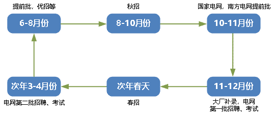
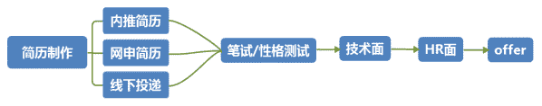

# 第二章 第 1 节 求职及校招规划

> 原文：[`www.nowcoder.com/tutorial/10059/5777b85e7b014180876f0f4f6ab84f52`](https://www.nowcoder.com/tutorial/10059/5777b85e7b014180876f0f4f6ab84f52)

        这份校招规划适合电气专业同学校招期间学习和参考，阅读本章可以了解校园招聘的基本流程、电控开发岗位与国家电网相关岗位的求职技能等。好的开始是成功的一半，那么正式求职前，我们应该准备些什么呢？

## 求职规划

### **1.1** **了解校招**

        校园招聘，顾名思义是面向高校应届毕业生的招聘活动，有别于社会招聘，大多数国企、事业单位只招收应届生，针对电气专业主要有国家电网/南方电网各个省（市）公司、军工单位、研究所、事业单位、选调生等。所以一定要珍惜应届毕业生的身份，毕业后进入这些优秀企业的难度较大。

### **1.2** **校招时间节点**

        按照时间顺序校招分为春招实习、秋招和春招。部分企业会有春招实习，时间较早，春招实习的大概时间线如下图。

 

        大部分有人才需求的企业都会参加秋季招聘，只有秋招结束后仍然有人才需求的企业才会继续参加次年的春招，因此相比春招，秋招的岗位多，需求大，企业多，是应届生找工作的黄金时期。

 

        具体的，以 2021 年 6 月份毕业的硕士为例，秋招在 2020 年秋天，但一般提前批/优招/夏令营报名从 6 月份便陆续开了，其中电网的招聘一般集中在国庆节前后，而国家电网第一批考试则安排在 12 月初。若有志于从事 IT、通讯等行业，则需要在 6 月前做好准备，包括但不限于简历，专业知识，项目经历，实习等。而春招则从 2021 年 2 月份开始，国网第二批考试时间则安排在 3 月末。

 

        秋招的流程主要为：网申（线上投递，内推）-性格测评-笔试-技术面-综合面试（hr 面），网申后企业会对收到的简历进行筛选，个人理解而言用人单位比较看重应届生的岗位匹配程度、实习经历、项目获奖、学历、专业、学术成果、成绩等。

### **1.3** **校招心态**

        对于应届毕业生而言，校园招聘一般是自己的第一次正式求职，因此应聘者首先也是最重要的就是对自己保持信心，校招更看重的是应届生的基础能力和学习能力，若应届生在求职过程中对自己信心满满并充分的向用人单位展示自己的优势，会使得应聘者更容易脱颖而出并拿到心仪的 offer。

        其次，对自己想去的企业、城市、工作类型有优先级排序，主要投递自己意向较大的岗位，有别于互联网求职，不是很建议海投，海投对电气方向求职的帮助有限，但会使自己疲于奔命。

        然后，随着近几年应届毕业生人数的增加，国内求职形势异常内卷，即使自己非常优秀也要有危机意识，就拿电网来说，2020 年秋招电网整体的招录人数有所减少，各市局门槛大幅提高。因此建议大家一定不要错过提前批的机会，提前批招聘既增加了自己找到的好工作的机会，也能在面试过程中查漏补缺，为后续正式批的面试做好准备。

        最后，需要心态平和，在学校可能会过分看重成绩排名、论文成果等，这种比较是比较单一的，但找工作是面向社会的，既会看一个人综合能力，也会看他拥有的社会资源，其中家庭背景（如电网子弟等）、运气、个人表达能力、籍贯、性别等可能会成为用人单位优先考虑的因素。

        就像世界上没有两片完全相同树叶一样，每个人的出生、家庭、社会关系、成长经历也不尽相同，因此，就找工作而言，每个人内心希冀的好工作也是不同的，可能有的人看重薪资，有的人看重平台，有的人侧重于稳定等等。就个人经验而言，找工作准备越早越好，规划越清晰越好，切记眼高手低，找到自己在就业市场的定位。

##  2 校招规划 

        首先根据个人的实际情况，选择最想去的行业或者岗位。电网属于央企，工作稳定福利待遇也不错，但也不一定适合每一个人；而类似华为这样的私企，能够给应届毕业生提供更高的薪资，以后想跳槽也相比电网更加容易；另外还剩家电、车企、军工单位、公务员、外企等可以考虑。有一个很实际的规划方法就是和已经找完工作或者毕业的师兄师姐沟通，了解他们当时是处于什么样的考虑选择签约了现在的工作，而不是其他的工作，以及一些岗位的要求与求职难度等。

        特别地，针对电气的学子来讲，若想换电气外的其他行业（如互联网、通讯等）应及早做打算，（因为互联网行业对编程等能力要求较高，建议至少准备 3 个月以上），并付诸行动，除了专业知识外，若条件允许，到相关企业实习也是一个提升自己专业能力很好的机会，其中，牛客网也很多优秀的求职经验帖可以参考。

对于大多数参加秋招的电气学子来讲，一般秋招在每年的 7 月份开始，在这之前我做的准备主要包括：

1. 针对嵌入式开发等对编程要求较高的岗位，看书->刷题->看面经，一直这么循环；

2. 对自己学过的知识和项目进行复盘，能清晰的向面试官表达出自己有哪方面的经历和能力；

3. 根据不同岗位的工作描述，对要求的技能点进行逐个学习和掌握，并以此参考制作个人简历与自我介绍；

4. 针对现场面试准备一套合适的西装；