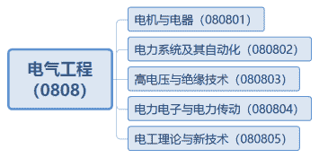
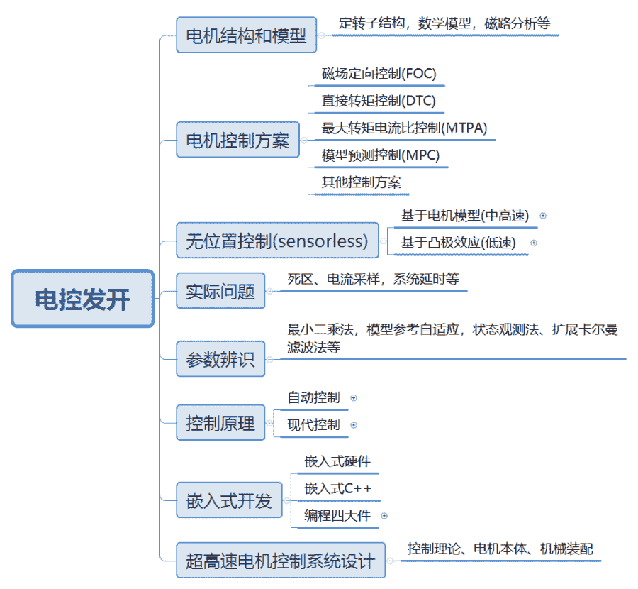
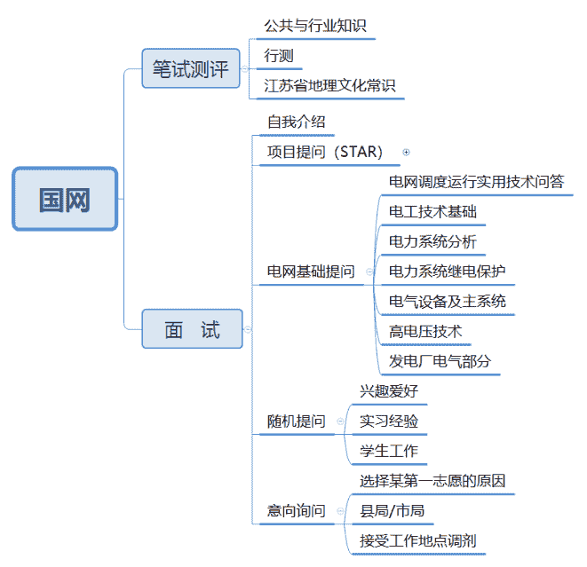

# 第二章 第 2 节 学习规划

> 原文：[`www.nowcoder.com/tutorial/10059/57698a8e87ec423c811819b0524ad4b6`](https://www.nowcoder.com/tutorial/10059/57698a8e87ec423c811819b0524ad4b6)

        本节内容主要介绍电控开发技能树和电网应聘技能树，可能部分读者认为这两个岗位相关度不大，这里做一个简单的介绍。 高校开设的电气工程及其自动化专业均为一阶学科电气工程，与该一级学科对口的企业包括电网（国家电网、南方电网）与各电气设备制造商等。首先只有应届生有机会进入电网，同时电网会为应届毕业生提供事业编制；其次电网每年约 80%~90%招聘人数中只招收一级学科为电气工程的毕业生，因此即便说电网和电气毕业生为“天作之合”也不为过。

        电气工程一级学科下的二级学科如下图所示，其中二级学科电机与电器、电力电子与电力传动在私企中也有较多的对口岗位，包括电控开发、单板硬件开发、嵌入式开发等。

    

 # **1 ****电控开发技能树**

       就电控开发而言，核心的问题是将自动控制、现代控制理论等一些理论应用在电机这个被控对象中，因此电控开发岗位主要会要求应聘者对电机这个被控对象的特点比较了解，如弱磁，参数辨识，超高速与超低速控制面临问题等；同时还有在应用层面的矢量控制，实际问题，嵌入式开发，控制理论等。电控开发岗位就知识点来说并不是很多，但是更深层次的理解需要到项目中去发现解决问题，因此该岗位的面试官一般会结合应聘者的项目经历进行提问，这也凸显了参与项目的重要性。         

# **2 ****电网应聘技能树**

        因为本人参加的是国家电网面向研究生的提前批招聘，所以这里主要介绍研究生参加江苏供电公司提前批面试的一些经验，当然，对于参加其他地区提前批面试或者需要参加国网考试的电气学子也有较好的借鉴意义。

        首先，重要的事情说三遍，对电网面试而言，成绩非常重要，成绩非常重要，成绩非常重要！！！就江苏供电公司来说，苏南（苏锡常镇宁）供电公司普遍录取成绩排名靠前的应聘者，而苏州局、南京局正常只录取我们学院前十的学生，对个别其他方面比较优秀的应聘者，成绩排名也要在前二十。无独有偶，浙江供电公司杭州局也在我院要求应聘者需要满足成绩排名前 50%才有面试资格，因此如果你还有机会提高自己的成绩，即便你以后不一定去电网工作，也应该尽自己最大努力的去提高自己的专业排名。

        当然，虽然成绩非常重要，但是也不是唯一的评价指标，毕竟每个学院排名前十的只能有十位同学，然而每一届电气学子的数量是远大于十的，那抛开成绩而言，我们还能做哪些准备呢。下面我主要介绍从面试的角度出发，谈一下需要准备哪些技能。江苏电网 2020 年的面试时间为 5-10 分钟，自我介绍 2-3 分钟，剩下的时间为提问交流时间。自我介绍时，应该是有个人特色，不是重复简历，不是重复简历，不是重复简历，最好能在自我介绍的时候介绍自己某个做得很好的项目或者经历等，能给面试官留下你有很优秀、有自己特点的印象。

        在面试过程中，若应聘者有较多的项目经历或者较为丰富的科研成果或者学生工作等，都能成为自己的加分项，对于应聘江苏电网来讲，在成绩不够突出的情况下，若没有 SCI 论文将会比较吃亏，因为有论文的研究生还是不少的。

        一般面试官也会考察你电网相关的知识点掌握的情况，这里推荐将《电网调度运行实用技术问答第三版》看一遍，若时间充裕可以结合其他的书籍如《暂态》、《稳态》、《继电保护》、《电路》、《高电压技术》等看细一点，若时间紧张一定也要将这本书过一遍。

        最后面试官会问你的家乡在哪，就业意愿的问题，作为一个事业单位，电网还是希望给出的 offer 都能被签约，因此会通过询问你是否接受去其他市或者县来考察你的意愿，一般都是不犹豫的说愿意。但也要根据具体情况变通，如果是考察你的就业意愿，那么说愿意是面试官希望的回答，如果是签约确认那么你需要认真考虑自己是否真的愿意去面试官所提的地方工作。

         

# **3 ****学习资源推荐**

        在百度网盘中，主要给出了国网面试、电控开发的相关资料。在嵌入式 C++的学习过程中，除了 C 语言和 C++的基本知识外，关于算法与数据结构强烈推荐牛客算法真题精讲班-中级班和高级班，牛客提供了从归纳讲解、编程练习、社区问答的完整过程，十分细致。国家电网的面试主要是消化相关的知识点，对书上重点的知识点需要仔细掌握。电控开发的资料更多的是一些个人学习科研中积累的一些文献，都是比较干货的。

国网面试

链接：[`pan.baidu.com/s/1Odi0WP54QwaVZWQp3AQDDQ`](https://pan.baidu.com/s/1Odi0WP54QwaVZWQp3AQDDQ) 
提取码：g57k 电控开发链接：[`pan.baidu.com/s/1Yq-WfMhnAcUBM-i4-x_rfg`](https://pan.baidu.com/s/1Yq-WfMhnAcUBM-i4-x_rfg) 
提取码：c5go