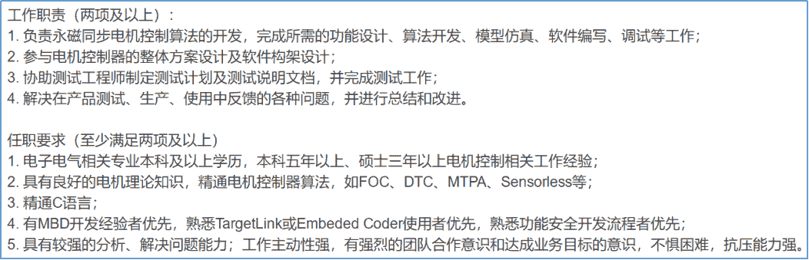
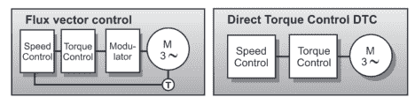

# 第三章 第 1 节 专业技能准备与提升

> 原文：[`www.nowcoder.com/tutorial/10059/7f896d79c55d41628c98ab310a253527`](https://www.nowcoder.com/tutorial/10059/7f896d79c55d41628c98ab310a253527)

# **1 ****岗位要求**

        对于电机控制开发岗位来讲，核心的理论主要是电机学与控制理论；同时，该岗位也是一个偏向于嵌入式开发的岗位，需要熟练掌握的技能包括 DSP 或 STM 等微处理器，从设计到调试 PCB 电路板，较好的编程能力等等。就个人理解而言，大疆创新-电机控制算法工程师是对这个岗位要求最高的，所以这里结合大疆创新的工作描述（Job Description,JD）进行一个专业技能准备与提升的讲解。

 

        工作描述中的任职要求，都是笔试和面试高频题目，需要进行一定深度的准备，最好有相关的项目和实习经历。其中，对专业技能的要求体现在两处精通上面，第一点是对电机控制理论的要求，第二点是对编程能力的要求。后续章节我将结合自己的项目和面试经验，抛砖引玉的谈一下对这部分技能要求的理解。

# **2 ****电控开发技能点**

        这一节主要介绍面试与笔试中常问的电机理论知识和电机控制算法，主要包括磁场定向控制(Field-Oriented Control，FOC)，直接转矩控制(Direct Torque Control，DTC)，最大转矩电流比控制(Maximum Torque Per Ampere，MTPA)，无位置传感器控制(Sensorless)等。

## **2****.****1 ****FOC****技能点**

        FOC 也被叫做矢量控制，它通过精确地控制磁场大小与方向，使得电机的运行转矩平稳、噪声小、效率高，并且具有高速的动态响应。FOC 控制需要理解的核心思想包括坐标变换（Clark 变换与 Park 变换），PID 控制器（电流环、速度环、位置环），空间电压矢量调制（SVPWM 技术）。

**常见的面试笔试问题包括：**

1. 手写同步坐标系下永磁电机电压方程，解释各项的意义等？

*   解题思路为电压是磁链的导数，空载反电势与交叉耦合项。

2. 以一个两对极表贴式永磁电机为例，画出 d 轴和 q 轴的完整磁路？

*   解题思路为 d 轴的方向为从永磁体内部 S 极指向 N 极，q 轴方向逆时针超前 d 轴方向 90 度。

3 为何说永磁电机是非线性强耦合的系统？

*   永磁电机建模时：

        ①忽略了电机磁路饱和，认为磁路是线性的；
        ②不考虑涡流和磁滞损耗；        ③当定子绕组加上三相对称正弦电流时，气隙中只产生正弦分布的磁势，忽略气隙中的高次谐波；        ④驱动开关管和续流二极管为理想元件；        ⑤忽略了齿槽、换向过程和电枢反应等影响。正是这部分假设将永磁电机从非线性强耦合的系统转换为了一个线性系统，而实际中这些假设不一定能全部满足。

4 电流环参数怎么整定，分别与哪些电机参数有关，电流环的带宽受哪些因素的影响等；速度环参数怎么整定，速度环参数整定需要哪些电机参数；位置环、转速环、电流环之间的关系，带宽选取等？

*   解题思路为从 S 域传递函数理解电机控制系统的各个环节、零极点对消等，这部分内容可以参考书籍《电机传动系统控制》第四章，控制系统参数整定主要与电阻、电感、转动惯量等电机参数相关，当参数未知时可能需要做系统参数辨识。通常带宽按照按照电流环带宽大于 5 倍速度环带宽，速度环带宽大于 5 倍位置环带宽进行选取。

5 如何在传统 PID 控制的基础上提高系统的带宽？

*   解题思路为减小系统延时与增加状态反馈，延时的解决方案包括提高控制频率、改变采样方式等，状态反馈主要是做速度和加速度前馈，具体实现可以参考参考书籍《电机传动系统控制》第四章。

6 同步调制与异步调制，SVPWM 与 SPWM 的区别，七段与五段式 SVPWM？

*   解题思路为理解载波比、零矢量与开关损耗的概念，参考贺益康《电力电子技术》第二版第五章与袁雷《现代永磁同步电机电机控制原理及 MATLAB 仿真》第二章。

7 定位力矩（Cogging torque）计算？

*   定位力矩是由永磁电机机械结构产生的转矩波动，参考论文《新型磁通切换永磁电机的分析、设计与控制》第三章。

8 S 域电流环设计与 Z 域电流环设计，复矢量，有源阻尼？

*   解题思路为理解闭环传递函数中的主导极点，参考第二章百度云盘电控开发模块论文资料与书籍《电机传动系统控制》第四章。

9 电机控制中逆变器死区的影响和补偿？

*   为了防止三相逆变电路同一相上下桥臂直通，在电机控制中添加了死区，这也给相电流带来 5/7 次电流谐波，同时，死区限制了开关管开关频率的提高，主要内容可以参考百度云盘矢量控制死区模块相关论文。

10 S 域电机控制系统分析、离散域电机控制系统分析、S 域与离散域控制系统的相互转换？

*   解题思路为考虑 MCU 算法实现时需要离散域信号处理方案，因此在 S 域建立的模型需要转换为离散域模型，参考胡寿松《自动控制原理》第四版，明尼苏达大学 Katsuhiko Ogata 教授《离散时间控制系统》第二版。

## **2.2 ****DTC 技能点**

**- **DTC 与 FOC 控制的区别

*   解题思路，从定义出发：

        矢量控制是转子磁链定向，它将电机定子电流分解成转矩电流分量和励磁电流分量以实现解耦。可以按照线性系统控制理论方法来设计转速和磁链的 PI 控制器，从而可以实现连续控制，如下左图。

        直接转矩控制则是定子磁链定向，在定子坐标系下分析电机的数学模型，计算控制电机的磁链和转矩，不用复杂的坐标变换。按照非线性的控制理论方法来设计离散的两点式 BANG-BANG 控制器，如下右图。具体的分析可以参考书籍《异步电动机直接转矩控制》李夙编与书籍《交流电动机直接转矩控制》胡育文。

## **2.3 ****MTPA****技能点**

1. 电压极限圆与电流极限圆？

*   解题思路为电压方程受直流母线电压和硬件电路电流承受能力的约束。

2. MTPA 控制的核心？

*   解题思路为在相同的电磁转矩下找到最合适的电流组合，也就是偏导数为零的极值点，参考《现代电机控制》王成元第三章，表贴式电机 MTPA 控制就是 id=0 控制，内嵌式电机含有磁阻转矩，有所区别。

3. 弱磁控制？

*   受电压极限圆的约束，一般在永磁同步电机矢量控制中，电机在基速以下用最大转矩电流比（MTPA）控制，基速以上采取弱磁控制。当永磁电机转速较高时，永磁反电势增大，若希望进一步提高电机转速范围需要对永磁体进行弱磁，可以参考《现代电机控制》第三章。

## **2.4 Sensorless****技能点**

        在矢量控制中，为了实现坐标变换需要实时获取电机转子位置，传统的解决方案为在电机轴向上安装一个物理的位置传感器，但物理传感器带来了诸如成本、装配、体积以及维护等各方面的问题。

        为了解决安装物理传感器带来的一系列问题，提出了无位置传感器(Sensorless)矢量控制方案，其核心思想是通过算法获取电机转子实时位置，主要可以分为基于电机模型的中高速无位置控制和基于电机凸极的零低速无位置控制。

**-** 基于电机模型的中高速无位置控制常见的笔试面试问题有：

1. 永磁电机中高速无位置传感器控制解决了哪些现实问题？

*   永磁电机中高速无位置解决的现实问题主要包括减小系统成本，减小控制系统体积，作为物理的位置传感器损坏时系统备用，以及解决高速电机（>10000r/min）安装物理传感器工程方面的问题等，主要应用包括无人机，空气压缩机和对体积要求严格的场合等。

                                                                           

2. 高速电机控制器设计的难点在哪里？

*   高速电机无位置控制的难点主要来自两个方面，首先是高速电机控制系统载波比小，系统阻尼比减小，系统容易失稳；其次无位置传感器控制依赖电流采样与模型重构，相比于物理传感器，存在位置估计误差和与相位滞后。因此为了解决高速无位置传感器控制难题，首先从控制角度，可以提高控制器的开关频率增加系统的载波比；从无位置传感器的角度出发，可以考虑系统延时，对系统进行离散域精确建模，提高位置观测器的带宽和收敛速度。

3. 无位置观测器的具体实现？

*   在无位置传感器实现的过程中，常用位置观测器包括滑模观测器与龙伯格观测器，滑模控制作为一种非线性控制，收敛速度快，系统结构简单，但传统的基于符号函数 sign()的滑模控制率不能兼顾减小抖振与收敛速度，需要在两者之间进行平衡，因而出现了以 Sigmoid()函数的滑模控制律；龙伯格观测是一种线性观测器，是基于永磁电机机械运动方程而建立的一类观测器，在使用该观测器进行高速位置观测时需要注意观测器从 S 域到 Z 域的转换，同时需要系统转动惯量等参数。

**-** 基于电机凸极的零低速无位置控制常见面试题目

        基于电机凸极的零低速无位置控制一般需要注入外部激励，主要有旋转电压注入，脉振电压注入，方波电压注入等，这里主要以方波电压注入为例，常见面试笔试问题包括：

1. 什么是方波电压注入无位置控制，它解决了哪一类实际问题？

*   方波电压注入无位置控制是通过向永磁电机同步坐标系注入方波形式的电压，并通过响应电流获取电机转子位置的方法。方波电压注入的方法弥补了永磁同步电机在零低速反电势信号不足以用来观测电机位置的缺点，使得永磁电机能够在低速时通过注入的方法得到电机转子位置，实现良好的矢量控制。该方案常见的应用场景包括破壁机、冰箱、洗衣机等家用电器。

  2. 方波电压注入相比其他注入方法或者低速无位置控制方法的优缺点？

*   首先电压注入法是为了向控制器提供矢量控制的电机转子位置信息，相比于低速 I/F 控制与 V/F 控制等非矢量控制，矢量控制可以提供更大的电磁转矩。
*   其次，相比其他注入方法，高频方波电压是在同步坐标系 d 轴注入，对转矩的影响可以忽略不计，同时相比于正弦形式的电压注入（如旋转电压注入，脉振电压注入），高频方波电压注入的频率更高，可以大幅提高位置观测器的带宽，但该方法对电流噪声较为敏感，需要更高精度的模数转换器。

3. 方波电压注入中电压幅值、频率如何选取？

*   方波电压注入的幅值与频率主要取决于永磁电机 d 轴电感的大小和模数转换器的有效位数，电感越小，有效位数越高，对应的方波电压的幅值越小频率越高。

4. 方波电压注入无位置控制的具体实现过程？

*   方波电压注入无位置控制的具体实现过程可以描述为：注入->采样->高通滤波->信号解调->位置观测。

5. 方波电压注入信号处理的过程滤波器的选取？

*   在选取高频滤波器时，一般选取滤波器的截止频率大于 5 倍的电机基波频率，从而实现高频方波电压产生的高频电流与基波电流的分离；

        总的来说，永磁电机相关理论不复杂，但真的达到完全理解需要在相关的项目中慢慢积累，最好的方法就是多参与项目，多转电机，在转电机的时候务必做到清楚每一个技术细节的来龙去脉。

# **3 ****嵌入式编程基础**

        嵌入式编程基础，主要是 C 语言基础与编程四件套（数据结构和算法，操作系统与原理，计算机网络，设计模式）。对电控开发岗位而言，其中最核心的是 C 语言基础知识和数据结构与算法，C 语言中需要掌握的知识包括指针，内存管理，这两个是 C 语言的精髓，如果准备时间不足，直接看这两点就好，其次还有函数，引用等。

        常见的面试笔试题目包括但不限于：

*   关键字

        static、struct、register、const、volatile、extern、inline，sizeof 与 strlen，new/delete 与 malloc/free 区别等；

*   基础概念

        指针和引用的区别，条件编译，大小端模式，避免野指针，区分指针数组，数组指针，指针常量，常量指针。

*   嵌入软件开发的问题

        如电机控制算法对代码执行效率要求严格，请从软件角度给出至少 3 种以上代码优化的方法：可以包括在 RAM 中运行中断服务程序，开启编译优化，调用内联函数（空间换时间），对部分代码可以使用汇编，三角函数等耗时的运算可以运用查表与插值，避免除法运算等。

        针对 C 语言的学习可以主要参考《C Primer Plus》、《C 和指针》、《大话数据结构》、《数据结构与算法分析-C 语言描述》等，也可以参看百度云盘中关于嵌入式开发学习路线，总的来说，作为编程类语言，最好的方法就是多写，多用！