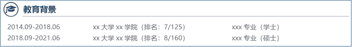
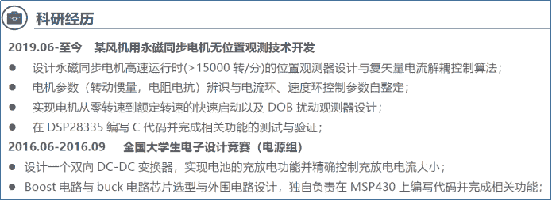

# 第三章 第 3 节 简历制作与投递

> 原文：[`www.nowcoder.com/tutorial/10059/9990540a8afa4e32be430ffa0e056051`](https://www.nowcoder.com/tutorial/10059/9990540a8afa4e32be430ffa0e056051)

# 1 制作简历

         写简历看似简单，想写好实则不易。一份好的简历能帮你在一堆简历中脱颖而出。

## **1.1 基本信息**

        个人基本信息包括姓名、学历、邮箱、电话、籍贯等，这部分正常写就好，如果你有和岗位相关的博客、GitHub、公众号等，别犹豫可以写在这里，这可以让面试官知道你有喜欢学习、总结和分享的习惯。

## **1.2 个人照片**

        虽然技术研发人员不是靠脸吃饭，但是这不妨碍它确实是一件很重要的事情！个人照片是应聘者留给面试官的第一印象，干净整洁的照片会让面试官觉得你是一个踏实、认真的人，反之邋遢的照片便会给人不好的印象。当然照片可以适度美化，最好是正装照，纸质简历彩印效果会更好。

                                     

## **1.3 教育背景**

        教育背景一般从最高学历写到本科，包括学校学院专业等信息，若成绩不错，可以把排名写出来，数字总是比文字性描述更有说服力。反之则不建议将成绩写到简历中，若有面试官问起如实告知便好，如果有面试官对你的成绩排名不是很满意时，你可以说自己忙于项目或者论文等，当然最好有相应的凭证，不然可能适得其反，引起面试官的反感。

                                     

## 1.4 **如何挑选项目**  

        竞赛经历，科研项目与实习内容都可以包装成项目经历，项目经历也不是越多也好，挑选 2-4 个岗位切合度高，自己熟悉的项目即可。作为技术类简历的重点，一般项目描述可以围绕岗位描述展开，项目介绍紧扣岗位描述一方面可以增加通过简历筛选的概率；另一方面可以激起技术环节面试官对你的兴趣，毕竟对面试官而言找到一个能直接干活的员工也不容易。

*   如何介绍项目

        介绍项目时，一般按照 STAR 法则展开，具体为背景(Situation)，任务(Task)，行动(Action)和结果(Result)，这么写的作用是让面试官直截了当的知道你遇到了什么问题，做了哪些工作，有什么样的效果。从面试官的角度出发，面试沟通的很大一部分内容就是了解应聘者做过哪些工作，解决过哪一类问题，从而评估求职者是否具备胜任这个岗位的能力。若你的项目描述写得没有逻辑层次，那他将会花费大量时间去寻找你在项目中解决的问题和负责的工作，若面试官不够耐心，可能直接将你挂掉！

*   注意事项

        在介绍项目时，若涉及到描述对某个技能的掌握程度时，需要根据自身能力谨慎选取“了解”、“熟悉”、“掌握”和“精通”等四个熟练程度，具体含义如下表所示，对工作经验并不是十分丰富的应届生而言尽量少用精通，多用熟悉和掌握。

| **掌握程度** | **解释** | **备注** |
| **了解** | 指知道得清楚 | 一般重在 know-what |
| **掌握** | 指熟知并能运用 | 不仅要 know-what，还要 know-how，知道且会用 |
| **熟练** | 熟知并运用得顺手 | 在掌握的基础上，还要用得很熟悉，不生硬，想想新手开车的样子 |
| **精通** | 指透彻理解，运用自如，并能融会贯通 | 不仅要 know-what, know-how,还要 know-why，know-who，还要能够运用自如，想想高手开车的例子 |

        在进行项目介绍时要注意，若有英文缩写，首先考虑面试官是否理解这个缩写，若不是行业常见缩写最好还是写全称；其次确保缩写的格式、大小写没有问题。

                                  

## **1.5 技能获奖**

主要包括英语、计算机、编程以及办公技能等，若分数较高可以写下分数

## **1.6 自我评价**

        自我评价也一定要认真写！自我评价可以看作是对简历其他内容的补充，其他的内容都是与岗位或者技术相关的干货，但作为一个有血有肉的青年，每个人都有一些只属于自己的特征。比如

*   敏捷开发的忠实粉丝，单元测试驱动开发的实践者，会主动重构代码，有代码洁癖。（有良好的编码习惯）

*   爱好看书写作，主要喜欢历史文化类的书籍，个人公众号有 xx 粉丝，最好的作品 xxx 有超过十万的阅读量等。（有较强的文笔能力）

*   爱看技术书籍，最近在看《Python 数据分析》《人工智能》《机器学习实战》等。（爱学习，对新技术感兴趣）

## **1.7 简历填写助手**

        这里推荐提高简历填写效率的牛客网简历助手，在完成一次简历内容填写后，该助手可以在各公司简历填写界面自动闪填简历信息，让求职者在填写简历时告别复制粘贴。

牛客网简历助手：[`www.nowcoder.com/quick-fill/show-introduce`](https://www.nowcoder.com/quick-fill/show-introduce)

# **2** **如何投递简历**

## **2.1 内推**

        内推是指企业通过内部员工推荐，绕过猎头公司、招聘网站等中间步骤，直接将应聘者的简历送到招聘者手中的一种招聘方式，一般提前批和正式批都有内推。对求职者而言，内推简历能更快的得到反馈，同时，部分企业的内推岗位还有免笔试以及更快走完面试流程的优点。应届生在确定了目标企业和岗位后就可以寻找内推资源了，这里必须推荐一下牛客网，在这里你几乎可以找到所有大中小企业的内推方式，而且还很靠谱。

        这里需要注意的是，内推简历前不能通过其他渠道投递简历，否则极大可能会内推失败，同时内推也不是越多越好，一般一份简历只需要一个人内推。

## 2.2 **校园宣讲会**

        校园宣讲会是每年大型企业面向毕业生的专场宣传活动，主要介绍企业的历史、现状、用人标准、薪资待遇、社会责任等。一般校园宣讲会都在学校举办，参加人员除了企业的 HR，也会有业务主管、技术主管等，宣讲结束后会有单独提问环节，求职者可以就自己感兴趣的问题提问，因此校园宣讲会是求职者了解一个公司最直接有效的方式。

        针对电气方向学子求职，因为大多数人的就业去向都是国家电网、南方电网等大型国企央企，因此参加校园宣讲会是必须的。其中，以国网重庆电力公司 2021 年校园招聘简章为例，该简章明确提出招聘流程为宣讲-->收简历-->立即面试-->确定意向-->收三方，因此毕业生在参加电网的招聘会需要做好面试的准备，包括要求的应聘材料、简历、着装等。

        最后，并不是所有的企业都会到每一个高校展开校园宣讲会，对于有意向的企业，可以及早关注他们的招聘行程，然后去就近的高校参加宣讲。特别地，针对各省市电网招聘，一般招聘指标都是提前确定的，因此参加该电网最后几站的宣讲会可能面临应聘者多但剩余岗位较少的情况。以四川电网 2021 年提前批来看，在第一站成都和第二站重庆就已经将工作地点在成都的 offer 发完，因此面临日渐激烈的就业环境，即使是国企也需要主动出击才有更多机会。

## **2.3 网申**

        网申指通过企业官方招聘网站或者第三方招聘网站开设的专门页面投递简历的求职方式。相比线下投递简历，网申时每个公司要求可能不尽相同，但核心的内容相差较小。个人推荐使用牛客校招日程界面，它贴心的汇总了绝大多数企业的网申网址、简历投递和笔试时间节点，让求职者可以从容的安排自己的时间。

        这里有一个很小的建议，个人发现很多企业的网申系统可以上传其他附件，这时求职者可以上传一个 pdf 文档，里面可以包含可能对你面试有帮助的项目总结、成果展示等等，而且最好是以图片加简单的文字描述，让面试官一眼就能看出来你大概做了些什么。