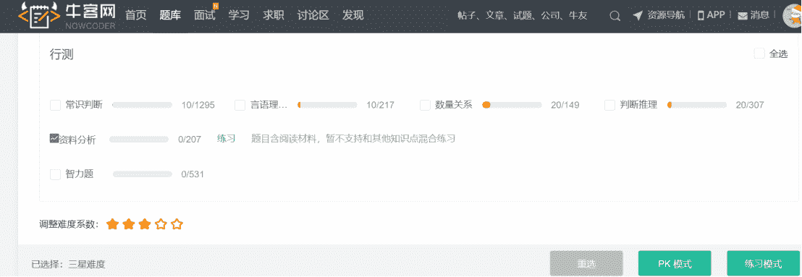
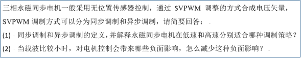
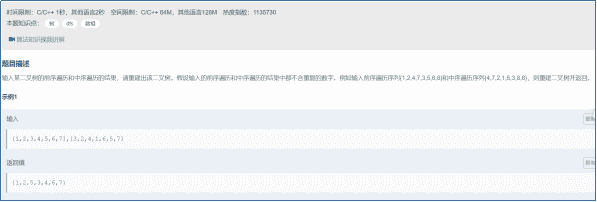

# 第三章 第 4 节 如何通关笔面试

> 原文：[`www.nowcoder.com/tutorial/10059/c7786b8c59834ef08a2f5f2042ff0d65`](https://www.nowcoder.com/tutorial/10059/c7786b8c59834ef08a2f5f2042ff0d65)

# **1 如何通过笔试**

## **1.1 性格测试**

        性格测试是为了得出精确的结果，所以大多测试题前后都有互相考证的题目。若应聘者自作聪明，自己揣测出题者的意图，则可能导致测试前后不符，容易被性格测试筛除。需要额外注意的是部分企业（大疆、华为等）也会在性格测试环节考察应聘者对该企业文化的认可程度，应聘者最好在做题前对该企业的文化做一定的了解。

## 1.2 **行测**

        行测内容包括言语理解与表达、数量关系、判断推理、资料分析、常识判断五个部分，这部分题目没有太大的技巧，做题的时候也不建议在一道题目上花太多时间。如果想要练习行测题目，可以到牛客专项练习专栏。

## **1.3 专业笔试**

        专业笔试是技术类岗位最困难的部分，也是刷人较多的环节。求职者应该及早确定自己的意向企业和岗位，然后做好相关方面的笔试准备。

        编程语言相关岗位如嵌入式 C++，笔试题目一般包括排序算法、字符串、队列、栈、链表、二分搜索、二叉树、动态规划等。这类笔试对编程能力要求较高，个人经验是多看书多刷题，在刷题过程中一定要保证每道题通过率。这里推荐一下牛客网，首先牛客是很多公司笔试的官方合作平台，其次牛客免费向用户提供了往年试题、牛客题霸、华为机试等题库，可以在线编程栏目下进行练习。这里个人也推荐牛客算法真题精讲班-[中级班](https://www.nowcoder.com/courses/cover/live/501)和[高级班](https://www.nowcoder.com/courses/cover/live/493)，通过学习这个课程再加上刷题，效果会事半功倍。

        除了编程相关的岗位，电气学子可能还会投递单板硬件开发、电控开发工程师等岗位，这部分岗位一般需要复习模拟电路基础、数字电路、电力电子技术等专业课的知识，也建议多做企业真题（牛客网可以免费获取）。

        电机控制开发岗位的笔试题目一般包括选择题、解答题和编程题，选择题包括性格测试和专业知识，性格测试选择题控制在 30 秒内完成，专业知识选择题控制在 2 分钟内完成。

        简答题的形式一般如下图所示，答案的形式最好是文字描述加上合适的图表，因此需要提前准备好纸、笔、拍照设备等，然后讲手写的答案拍照上传。同时，因为这类题目涉及到专业知识，所以最好提前过一遍相关的书籍，电机控制开发岗位主要参考的书籍包括《永磁电机》、《现代电机控制技术》、《电机学》、《电力电子技术》等。

 

        嵌入式硬件开发工程师[笔试题形式](https://www.nowcoder.com/practice/8a19cbe657394eeaac2f6ea9b0f6fcf6?tpId=188&&tqId=37364&rp=1&ru=/activity/oj&qru=/ta/job-code-high-week/question-ranking)如下图所示，一般会在牛客等在线编程平台完成，需要求职者熟悉编程环境、输入输出格式等，同时代码提交后只有通过率为 100%才能拿到该题目的满分。这部分没有太多的技巧，就是多刷题多总结。

  

# 2**如何通过面试**

## **2.1 基本常识**

        面试守时是对面试官最基本的尊敬，面试这么重要的事情你都能迟到，面试官怎么相信你？同时面试过程中保持微笑，交流时保持谦逊和学习的态度，即使在讨论问题的时候可能比较激动，或者面试官说的内容确实有错误，也要注意自己的表达方式。

        参加现场面试的时候，应聘者给面试官留下的第一印象是非常重要的，你的着装情况也一定程度反映了自己对这次面试重视程度，不一定非要正装加皮鞋，但是做到干净、整洁、得体。现场面试的时候记得多带几份简历，若你的简历数量不能满足面试官一人一份，场面便会显得有些尴尬；也有时候现场可能会有好几个部门对你感兴趣，这时候你需要多准备几份简历。

## 2.2 **自我介绍**

        自我介绍是面试的第一个环节，这个环节十分重要，最好提前练习，别自我介绍也结结巴巴，说不出重点。一般根据不同的岗位要求，可以分别准备 1 分钟、2 分钟、3 分钟等不同版本的自我介绍，同时保证吐字清晰，语速不能太快。自我介绍主要包括：

*   我是谁——应聘什么岗位，什么专业，毕业与什么学校等；
*   项目经历——根据 STAR 原则，言简意赅的介绍自己有哪些技术能力，做过哪些事情，取得了怎么样的成绩；
*   岗位契合——为什么你选择这个岗位，你具备这个岗位的哪些能力；

## 2.3 **技术交流**

        自我介绍结束后，一般面试官会对你的自我介绍或者简历进行针对性的提问。在进行这一环节时首先要明白面试官问的是什么，切忌对问题一知半解，然后解释一大堆，面试官可能会觉得你能力不够，至少回答问题没有抓住关键。若对面试官所问的关键词不太了解，你可以先询问面试官是不是想问什么或者让面试官再解释一下，然后在理解问题的基础上进行简洁而有层次的回答。

        在面试中遇到没听过的名词、技术，不能不懂装懂，这时最好“知之为知之，不知为不知”，如诚实的讲没有做过相关方面的工作，可以回去尝试一下。

## 2.4 **你有什么想问的吗**

        被问到这个问题时，有的求职者不知道问什么，就随便问，或者干脆不问，这种情况都是不太好的。面试作为双向选择，之前都是企业在了解你，你也应该借此机会问问该企业的一些情况，面试官对你回答的内容是绝对比你从网上任何渠道了解的信息都更加靠谱的。

*   不能问太大的问题——比如本人之前面试的时候就忌讳的问了一下疫情对企业的影响，还好面试官人很好，告诉我影响很小，同时也说这是企业高层应该关心的事情，新入职的员工首先要做的就是完成自己的本职工作；
*   在网上能查到的——在网上能查到的问题就不要浪费这里宝贵的时间了；
*   不要问——技术面最好不要问面试官有没有通过这轮面试这种很尴尬的问题，显得自己很没信心，除非因为个人原因必须知道结果然后赶去参加其他地方的面试；不要在技术面问具体的薪酬待遇，一般他们也不太了解；
*   建议问——从现实的角度出发，当前的面试官有很大可能是你入职以后的部门领导，你可以了解这个岗位的工作内容，对新人有什么样的培训等，既能了解这个岗位的具体情况，也能向面试官表达出你想加入他们的意愿。

## 2.5 **薪酬沟通**

*   提前了解——可以通过各个公众号、牛客等了解该岗位的大概薪资情况，做到心中有数；
*   预期薪资——一般 HR 对同一级别的岗位也会有一个薪酬区间，求职者可以将自己期望的薪资适当上浮，然后以年薪的形式报给 HR，如果是月薪的话可能会涉及到年终奖、分红等不够直接。
*   学会坚持——面对 HR 的压价，很多人可能会坚持不住，最后拿了一个白菜价，十分懊恼。这里可以思考一下自己的面试表现，若你在技术面中表现很好，甚至收到了面试官的赞许，那你应该有信心守住自己心里的价位。
*   有几个 offer——很多 HR 在薪资沟通时会询问你目前的 offer 情况，若手里没 offer 或者薪资较低，如实相告可能会使自己变得被动。这时求职者可以适当放大已有 offer 的待遇，如适当提高工资或强调有编制和工作强度等。个人经验是，在薪资沟通环节求职者一定要对自己充满信心，你已经顺利通过了前面的技术面了，就算 HR 双眼直盯着你也不要躲闪，相信自己的能力。