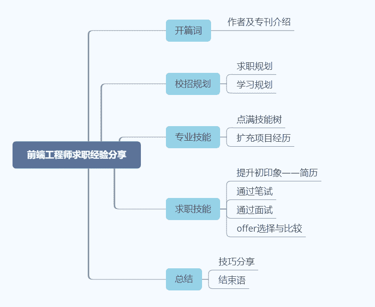

# 第一章 第 1 节 作者及专刊介绍

> 原文：[`www.nowcoder.com/tutorial/10061/c3189b96c30e47628555397b946fe1ef`](https://www.nowcoder.com/tutorial/10061/c3189b96c30e47628555397b946fe1ef)

# 1 关于作者

    大家好，我是桃白，现已是某知名大厂前端核心部门待入职员工，同样也是一名刚经历过校招这场血雨腥风"战役"的应届毕业生；从 3 月份找实习直至 10 月 29 号签三方，历经长达 8 个月秋招之路的我，逐渐从前端 0 基础小白到手握 11 个大厂 offer；这一路走来，离不开许多小伙伴的帮助，牛客网上的各类经验贴、面试分享帖、知识精讲贴等等都充满了干货，每次我从中收获颇多时，心中总是暗下 flag：“等我顺利结束秋招，我也要通过这种形式去帮助下一届、下下届的同学们！”，现在，我带着这份热腾腾的前端求职攻略来了~

## 1.1 作者背景

## 1.2 校招经历

    1.实习投递 25 家互联网公司，共收获 3 个实习 offer，分别是涂鸦智能、海康、政采云。

    2.校招投递 78 家互联网公司+银行+通讯类国企，共收获 17 个正式 offer，其中互联网公司如 shopee、滴滴、哈啰出行、有赞、酷家乐等，银行类如浙商、工商等。

# 2 关于专刊

    本专刊针对将前端开发作为校招岗位的同学们，随着互联网行业指数型发展，校招竞争愈发激烈，越来越多的同学都将其作为校招目标，经历校招时，身边同学总是存在以下疑惑：

1.  明明投了十几份简历，为什么石沉大海了呢？
2.  和别人一起投简历，为什么我的笔试邀请少得可怜？
3.  自认为技术没硬伤，但专业面通过不了？
4.  实力相同，为什么别人 offer 就是比我多？

**要想解决问题，必须看清问题的本质：**

1.  校招的核心运作机制是怎样？
2.  怎么合理地制定校招计划？
3.  前端开发岗求职需要从哪几个方面准备？

    别担心，本专刊将带你从校招的本质出发，一步步认识校招，分专业技能与求职技能两大模块对校招进行全方位准备，对前端开发岗整个校招过程全方位介绍、专业技能树全面分析、高频考点精讲，为你的校招保驾护航，收获心仪的 offer~

## 2.1 专刊定位

1.  覆盖整个校招过程，从简历制作到 offer 对比分析，全面介绍应对各求职环节技巧。

2.  适用性高，零技术要求，作为非计算机专业跨专业求职的我，更懂你的求职困惑，带你从 0 基础出发准备校招，完美逆袭 offer 满满。

3.  通俗且高效率带你准备校招，拒绝形式主义，脚踏实地从各节点出发，以成功打赢校招战为终极目标，为你讲述在每个节点都能学以致用的干货。

4.  前端小白真实经历分享成功校招逆袭经验，亲测有用的前端入门、技术提升学习攻略，无论你是技术大牛，或是入门新手，这篇专刊都会为你的校招之路助上一臂之力~

## 2.2 专刊大纲

