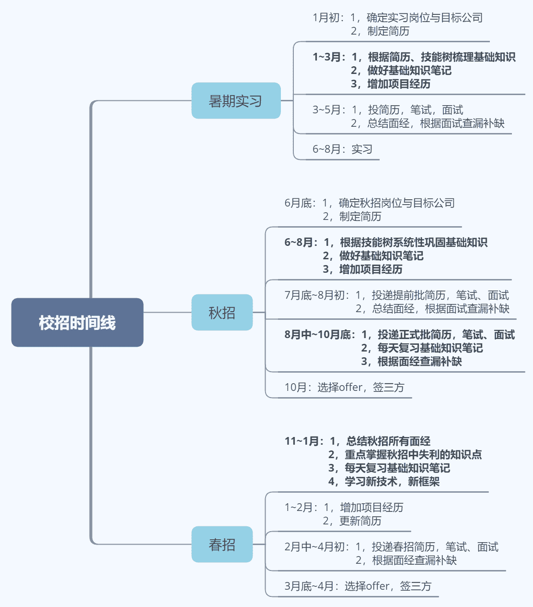
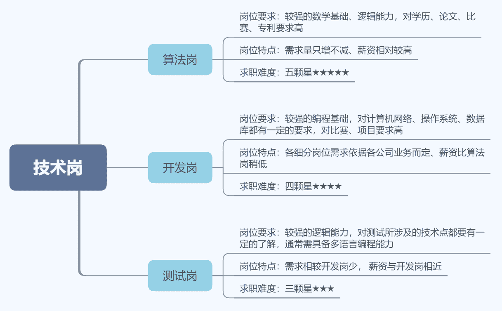

# 第二章 第 1 节 求职规划

> 原文：[`www.nowcoder.com/tutorial/10061/60d56ffa8357456181ad9935a68ec092`](https://www.nowcoder.com/tutorial/10061/60d56ffa8357456181ad9935a68ec092)

# 1 了解校招

     知己知彼才能百战百胜，在准备校招之前，我们先从“5W1H”来聊聊校招的运作机制。

*   **What：**校招是各行业较领先的公司，每年以固定时间在高校招聘符合要求的应届毕业生的活动。
*   **Where：**校招主要分为简历筛选、笔试、面试三个部分：

            **1.****简历筛选：**均采用线上模式。**            2.笔试：**大部分采用线上模式，笔试平台大都为牛客网；部分公司会在学校组织统一线下笔试。
**            3.面试：**一般分为 3~4 轮，前 2~3 轮技术面，技术面最后一轮通常为部门主管面，最后一面为 hr 面。面试地点分三种：      
                a. 线上面试，面试平台大都为牛客网；                  b. 部分公司会在学校开展统一集中面试，一般一天内走完所有面试流程；                  c. 面试时间较分散时，会直接要求去公司面试。

*   **When：**校招分为三个阶段：

            1.暑期实习：大三或研二下学期的 3 月初开始，6~8 月为实习时间。
            2.秋招：7 月初提前批开始，10 月底随着各学校三方下发陆续结束。 3.春招：第二年年初陆续开始， 经历过秋招失败之后，别松懈，总结秋招经验，寒假期间在牛客网的求职-[校招板块](https://www.nowcoder.com/school/schedule)中关注春招动态。

*   Who：  

            1.应聘人：应届毕业生。
            2.招聘人：公司 hr+部门技术员工+部门主管。

*   Why：对比社招，以应届生身份参加校招有以下几个优势：

            **1.校招更注重基础，**应届毕业生普遍缺少工作经验，但基础知识掌握较好、学习能力强。
          **  2.校招 hc 多，**多达几千，少则几百，公司会分岗位分地区预留固定数量 hc，相比社招机会多多。

*   How：至于如何充分准备校招，本专刊将带来高效且实用的前端校招求职攻略。哪怕你不是从事前端开发岗，我相信这篇攻略都能为你的校招助力一波~

# 2 时间规划

校招从每届大三或研二下学期找暑期实习开始，大四或研三下学期春招结束。以下是校招各时间节点，以及需要做的准备工作：  

# 3 岗位选择

    通常，选择比努力更重要，在制定校招计划之前，我想先聊聊选择。相信在校招时身边有不少人会对你说：技术岗工资高，做技术吧；java 今年招的人多，搞 java 吧；前端入门快，搞前端吧。校招岗位有很多，到底应该如何选择适合自己的校招岗位呢？

## 3.1 各岗位特点

    首先要对校招各岗位特点有一个基本的了解，校招岗位分为技术岗与非技术岗两大类，技术岗包括算法、开发、测试，非技术岗包括产品、运营等。岗位间没有高低之分，只是工作内容、应聘需求各有不同。

    以下针对技术岗中的算法、开发、测试三种岗位，对岗位要求、特点以及求职难度进行对比与总结： 

     **说回前端开发岗，从个人秋招经历出发，此岗位特点主要分为以下几点：**

1.  需求量大，凡是涉及到互联网的公司对前端岗都有需求，甚至多于其他开发岗。
2.  简历筛选通过率大，前端知识较为独立，不需要对操作系统、数据结构算法此类课程有很深层次的掌握(部分大厂除外），只要你学的框架或者项目经历涉及到公司需求，基本上都有笔试机会。
3.  前端开发知识分布零散，且更新速度快；小至 JavaScript 基础，大至浏览器渲染原理，在打牢基础知识的同时，需要结合实际开发场景、行业内技术更新不断地拓宽知识广度。

## 3.2 自我审视

    在选择岗位时，不应该根据所谓校招形势选择，应该通过自我审视去选择适合的岗位，而不是用排除法剔掉不适合自己的，将就地选择没有那么“可怕”的岗位。    何为自我审视？以一个客观的角度审视自己，挖掘自身优点，而不是一味的找缺点否定自己。对于校招的自我审视分为以下两个部分：**1.****“软件”方面，从自身兴趣、性格出发。**

*   要想胜任技术岗工作，一定是对技术充满热情的（非技术岗同理），对新技术充满渴望的，对 bug 充满“征服欲”的。
*   同时具备一定的耐心与细心，技术岗相较于非技术岗大部分时间都是和代码打交道，花费大量时间做项目，过程通常枯燥且无趣。
*   团队合作能力尤为重要，在学习阶段，通常自己学好就 ok 了；但在工作岗位中，每个项目都是团队合作开发，完成负责的功能点同时，组员间的工作衔接更重要，具备较好的合作能力在与组员交接沟通上更加高效。

    2.**“硬件”方面，从已有基础、准备出发。**校招并不是一个从 0 到 1 的过程，不需要硬着头皮迎难而上，而是通过有效的规划在熟悉的领域中从 0.1 到 1 的过程。     

*   技术岗通常对基础有一定的要求，不同岗位要求不同。比如算法岗对数学要求较高，开发岗对编程能力要求偏高，测试岗需要较强的逻辑思维能力，前端岗则需要较强的页面审美、设计能力。
*   根据现阶段已有的准备进行选择，无论是知识技术储备、还是对岗位信息的了解。

## 3.3 为什么选前端岗

    在研二下学期找暑期实习时，我是根据兴趣+已有准备工作两方面进行岗位选择的，虽说属于跨专业校招，编程能力比不上计算机专业，但对软件开发一直有较强的兴趣，故首先将校招岗位锁定在技术岗。由于团队之前的一些比赛经历，做过一些产品界面开发，对前端岗位整体知识架构较熟悉，并有一些前端方面对口项目经验，再加上没接触过算法岗与测试岗，故将前端开发做为校招求职岗位。

# 4 心态建议

    无论你是正经历着校招，还是处于准备阶段，我都想以一个过来人的身份为你提供几点建议：

*   **以积极的心态去面对校招**

校招并不可怕，它为我们这些即将踏入社会的年轻人们提供了更多的机会。特别是在面试失利时，需要快速地将自己抽离出来，一两次面试的失败不代表什么，及时的总结面经查漏补缺，就算从这次面试中只收获了一个知识点，你也已经赚了。

*   **要自信**

 在校招面试时，我们通常会不自觉地认为自己很差，甚至不敢合理地提出自己的诉求。校招是一个双向选择过程，不仅公司有选择权，我们同样有选择权；另一方面，当你用充满自信的语气去回答面试官时，对方会更愿意相信你已经做好了充分的就职准备

*   **学会搜集信息**

        无论是简历投递，还是在面试的过程中，掌握岗位的最新信息，多与同岗位的小伙伴们交流。有些公司甚至在 7 月初就开始提前批了，我在校招时就因错过投递时间，导致连笔试的机会都没有，牛客网的求职-[校招板块](https://www.nowcoder.com/tutorial/10061/%E9%93%BE%E6%8E%A5)中有一个校招日历，建议每天抽出几分钟的时间看看更新的岗位信息。

*   **从基础和实战经验两方面准备校招**

        从书本+技能树+面经三大方面巩固基础知识，通过项目累积经验。