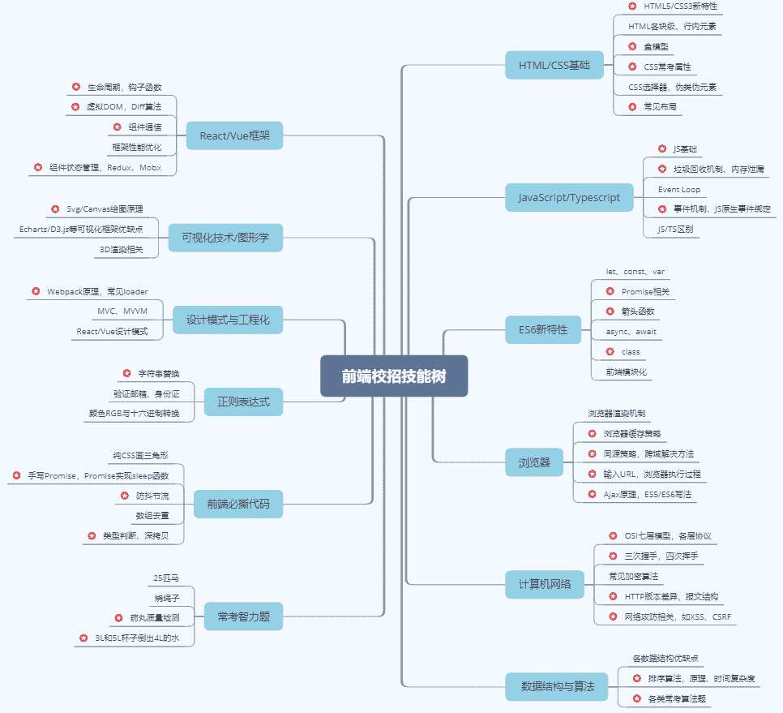
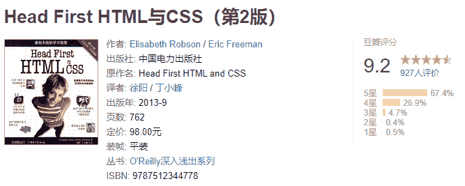
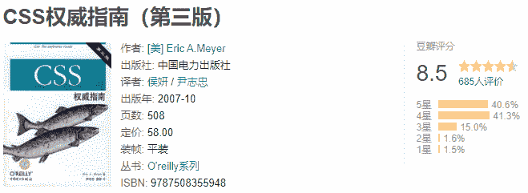
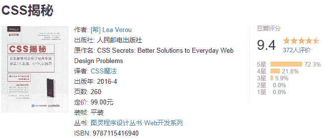
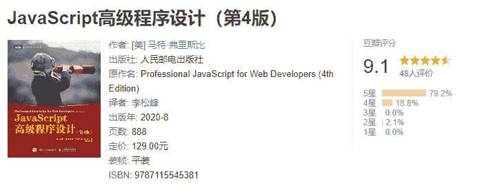
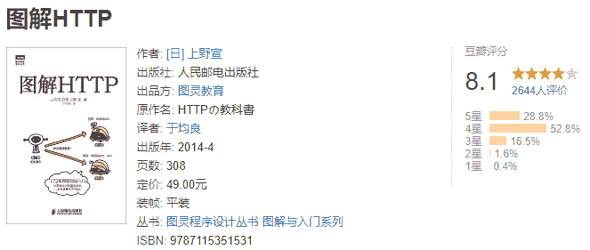
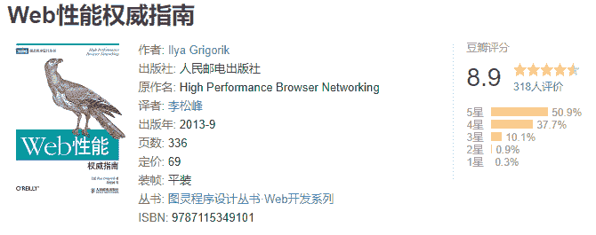

# 第二章 第 2 节 学习规划

> 原文：[`www.nowcoder.com/tutorial/10061/d4a23465eab64428b93ca52fce0a867d`](https://www.nowcoder.com/tutorial/10061/d4a23465eab64428b93ca52fce0a867d)

# 1 前端岗技能树

        以下是前端岗的校招技能树，以及部分面试高频考点列举，将在第三章专业技能提升中进行展开分析：

 

# 2 学习方法

        不同阶段对应不同学习方法，关于如何学习前端，我想分为以下几种情况具体分析：  

## **2.1 如果你是前端小白，处于 0 基础阶段，应该从培养兴趣、了解整体架构两方面出发：**

1.  兴趣是学习的开端。可多利用休息时间浏览国内外优秀网页、素材网站、设计网站，培养网页审美，提高对前端开发兴趣。

        a.优秀设计类：

*   小米商城：[`www.mi.com/`](https://www.mi.com/)（经典页面布局，很适合初学 HTML/CSS 时练手）

*   设计创意集结地：[`www.zcool.com.cn/`](https://www.zcool.com.cn/)

*   时尚潮流网站设计案例：[`reeoo.com/#1PVAp1Pd47sKFN`](http://reeoo.com/#1PVAp1Pd47sKFN)、[`woofeng.cn/#1PVAp1Pd47sKFN`](https://woofeng.cn/#1PVAp1Pd47sKFN)

        b.色彩类：

*   配色方案：[`colorhunt.co/`](https://colorhunt.co/)

*   渐变色方案：[`webgradients.com/`](https://webgradients.com/)

        c.图标类：

*   阿里巴巴旗下的图标库：[`www.iconfont.cn/plus`](https://www.iconfont.cn/plus)

*   带颜色图标库：[`www.easyicon.net/iconsearch/ios/`](https://www.easyicon.net/iconsearch/ios/)

2\. 对岗位的整体架构有清晰的认识。可将学习过程类比为“造房子”，初期一砖一瓦搭建整体架构，到后期装饰每个房间。对于前端来说，HTML 技术为砖瓦，浏览器为地基，CSS 技术为装饰器，React/Vue 技术则是提出更优化的搭建方案，以此类推；功能化的去学习每一个技术，从每个技术解决了什么问题出发，去学习技术原理、优缺点。 

## **2.2 如果你处于入门阶段，对基础知识有了一定的掌握，应该将常用框架、各项技术高级特性做为两个学习重点：**

1.  对于一个功能简单的页面，用 HTML 就能实现，但涉及到大量交互、数据传输的的多页面，仅用 HTML 将会无比繁琐，甚至有些功能无法实现，故需要学习各类框架， React 和 Vue 为两大现主流框架，也是校招高频考点。
2.  同时各项技术的高级不容忽视，掌握基础知识能了解技术原理；但对于各技术岗位，将技术灵活运用至实际项目是关键，学习技术的一些高级特性能够帮助将技术学以致用，如 Promise 技术，仅知道它是用来解决异步操作，避免回调地域是远远不够，Promise 的构造函数、异常捕获等高级特性更是学习的重点。  

## **2.3 如果你对前端整个技术体系已经有很好的了解，想寻求突破，应该从项目、校招面经下手：**

1.  一个个完整的项目不仅能累积开发经验，同时对基础知识起到很好的验收作用；在技术面时，除了对基础知识的考核以外，项目经验也占相当大的比重，面试官会给你一个实际场景，让你给出具体开发方案。
2.  根据目标公司在牛客网中搜索面经，利用面经逐一查漏补缺是最直接的校招准备方法。

### **此外，分享几点我在秋招过程中有用的学习方法：**

1.  学会整理笔记。无论是基础入门还是后期做项目时，都要养成记笔记的习惯，记笔记的方式有很多种，个人认为比较高效的方式是：利用有道云笔记/腾讯文档等在线笔记 APP，方便随时随地查看记录；笔记内容不需要十分详细，条理性强，自己能看懂即可，多列一些知识分析性的链接、具体代码块；在校招的过程中，根据面经随时更新笔记，扩大知识范围。
2.  养成每天复习笔记习惯。校招过程中会被各种笔试、面试占据大量时间，很少有较长的学习时间，可以利用零散时间将自己的笔记文档通篇复习一遍，加强对基础知识的理解与记忆。
3.  高效看网课。在初期通过网课系统地学习基础知识，如牛客网中的各类网课视频等，网课时长普遍较长；而学习基础知识都有学了后面忘了前面的通病，故可以给自己定一个短期目标，比如一周看完，缩短这门网课学习时长，快速刷完一遍，尽快运用至具体的实战项目中。
4.  挑选项目。秋招真正的准备时间并不长，打好基础之外，要想在短时间内累计项目经验，需要根据当下的学习进度，选中等偏上难度的项目做；同时注重项目的时效性，要做最新的项目，能体现出简历优势，让面试官眼前一亮的项目，而不是已经“烂大街”的项目。

# 3 学习资源

        虽说现在各类网课资源随处可见，但我还是更推荐养成看书的习惯。同时要学会高效率看书，如果你在入门阶段，选择一本七八百页基础类的书，那你有可能需要看一个月才能看完，因为你对于书中内容是未知的。故更建议当成工具书去看，在看网课、做项目或看面经的时候遇到任何不懂的，去书里找答案，带有更强的目的性会加强对知识点的记忆。下面推荐几本我在学前端时看过觉得还不错的书：

## **3.1 HTML/CSS 方面：**

****
        经典入门书籍，手把手带你从 0 开始学前端，里面包含十分丰富的实践案例。          除了 W3C 标准，这本书算是 CSS 方面最权威的一本书了，把 CSS 原理讲得十分透彻，做为 CSS 入门与理解最合适不过了。

        书中总结了 47 个 CSS 使用技巧，分析各类 CSS 实际开发问题，几乎能解决前端开发过程中各种 CSS 问题，是豆瓣中 CSS 类书籍评分最高的书，CSS 进阶必备书籍。

## **3.2 JavaScript 方面：**

         虽说是高级程序设计，但我认为它完全能做为 JS 入门书籍。深入浅出的分析了 JS 基础概念，同时随着版本的更替，增加了许多其他实际开发中需要用到的知识，如 DOM、事件流、canvas 绘图、前端开发错误调试等。这本书知识覆盖范围广，概念定义权威，建议在校招期间当工具书使用。

        该书将设计模式运用至 JavaScript 中，可以帮助你培养一个好的编程习惯，编写出结构性强、维护性高的 JavaScript 代码。在校招中设计模式也是前端岗考核点之一，可以通过这本书学习设计模式相关知识，同时增强 JavaScript 语言编程能力。

        阮一峰老师的代表作，我认为是国内最好的一本 ES6 的书，第三版增加了很多 ES7、ES8 的内容。现在前端属于框架时代，大部分框架都已经是 ES6 开发标准了，同时，ES6 是面试重点考核部分，这本书不仅对 ES6 的基础知识有一个全面的讲解，同时分析了很多代码底层原理以及实际开发过程中会遇到的问题。

## **3.3 其他：**

 关于 React 及其技术栈较为深入的一本书，同时附有源码解析，建议结合[React 官方技术文](https://react.docschina.org/docs/getting-started.html)[档](https://react.docschina.org/docs/getting-started.html)一起学习。

        在前端岗笔试面试中计算机网络方面是重点考核对象，毕竟网络是任何页面交互的桥梁。这本书对互联网的根基——HTTP 协议进行了全盘分析，严谨细致，列举了很多实际通信场景，同时分析了常见的 Web 攻防问题，最特别的是运用大量通信图例，十分形象生动。

           Web 性能优化是前端开发中的重要一环，几乎每个面试官都会问：你对前端性能优化有什么见解？同时在实际开发中，性能优化对整个项目开发有着重要意义。这本书涉及了前端开发体系中所有网络及性能优化知识，同时还涵盖了 TCP、UDP 协议工作机制等计算机网络方面知识，并附有大量实战案例，对培养 Web 优化能力有一定的帮助。