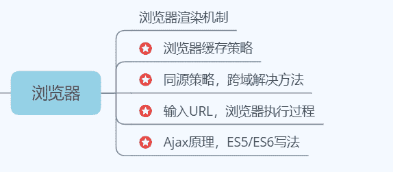

# 第三章 第 1 节 点满技能树

> 原文：[`www.nowcoder.com/tutorial/10061/e9570372163b4c02bfa07a40fb5353be`](https://www.nowcoder.com/tutorial/10061/e9570372163b4c02bfa07a40fb5353be)

        对于校招专业技能的学习与准备，建议根据技能树按知识类别逐一准备。前端岗所涉及到的知识范围主要可以分为前端相关、计算机网络、数据结构与算法三大块，下面我将针对第二章中的技能树进行逐一分析。

# 1 HTML/CSS 基础

        页面设计与开发是前端的根基，也是入门的必经之路。无论是面试还是笔试，这部分都是必考且占比较大的。  

        HTML 是页面中内容的载体，可以展示开发者想要用户浏览的任何文字、图片、音频信息。对于 HTML 的各类标签，不仅要掌握日常开发中经常碰到的，也要慢慢积累那些不常用标签，块级、行内元素的定义以及二者相互转换几乎是每场技术一面必考问题。

        可将 HTML 标签看成一个个搭起来的盒子，那 CSS 则是用来“装饰”盒子的，如颜色、字体、背景、边框等。在页面开发时，展示内容的同时用户体验也至关重要，熟练使用 CSS 技术才能产出更高大上的页面。

        在校招准备时，掌握 CSS 各类常用的属性是必要的，其中浮动、清除浮动以及定位更是必考点。CSS 盒模型在近两年是面试官必问的，其中包括盒模型的类型、切换模式、计算不同盒模型下盒子宽高。CSS 各类选择器也是面试官常考问题，各个选择器优先级顺序、多个选择器组合时优先级比重的计算都是必须要掌握的。同时 CSS 中的伪类与伪元素在实际开发中使用频率很高，比如鼠标在标签上的四种状态，利用伪元素在元素前后添加一些不在 DOM tree 的元素等。

        关于 HTML5 与 CSS3 的新特性也是高频考点，例如 HTML5 中新增的语义化标签、客户端存储方案、websocket 等等都需要掌握。

        此外，常见布局是另一个重大考核点，按考频高低可分为：盒子页面居中、两栏、三栏自适应布局、BFC 布局、Flex 布局、table 布局、grid 布局、移动端布局（rem、流式、自适应、响应式）。这些布局实现方法有很多种，比如三栏布局可用圣杯布局、双飞翼布局、Flex 布局、table 布局等多种方法实现，故学习时要掌握多种实现方法，同时要加以自己的理解灵活变通。BFC 布局可用来清除浮动、解决 margin 坍塌重叠等问题，几乎是第一轮技术面必考问题。Flex 布局原理与应用也是技术面中的高频考点，可以直接看阮一峰老师的[Flex 布局教程](http://www.ruanyifeng.com/blog/2015/07/flex-grammar.html)。

        这一部分的知识点大都偏记忆型，较为简单。虽不需要特地花时间去背，但需注重积累，建议在实战开发过程中，养成随时理解、随手记录的习惯。

# 2 JavaScript/Typescript


        JavaScript 主要是为 Web 页面添加交互行为，让页面中的盒子们“动”起来。与 C++、Java 一样也有自身的语法结构，基础知识超高频考点有数据类型以及判断方法、闭包、块级作用域、函数提升与变量提升、原型链、JS 继承、变量深浅拷贝等等，除此之外还有很多零碎知识点都是前端开发必须掌握的，建议根据《JavaScript 高级程序设计》进行系统学习。

        在学习 JS 基础之外，引申出的 JS 高级特性也不可忽略。如闭包将涉及到内存泄漏问题与垃圾回收机制，这也是面试高频考点之一。

        JS 是单线程的语言，浏览器和 Node.js 定义了各自的 Event Loop（事件循环机制）则是用来解决异步问题。将程序分为“主线程（执行栈）”与“Event Loop 线程”，“主线程”自上而下依次执行同步任务，“Event Loop 线程”将异步任务推入宏任务队列与微任务队列去执行，在下面这段代码是面试中关于这类问题的经典考题，其中包含了同步、异步任务，几个输出的先后顺序是怎样的。

```cpp
setTimeout(function(){
    console.log('1')
});
new Promise(function(resolve){
    console.log('2');
    resolve();
}).then(function(){
    console.log('3')
});
console.log('4');
// 2,4,3,1
```

 首先进行任务划分，同步任务：new  Promise()、console.log('4')；宏任务: setTimeout()；微任务：Promise().then()；Event Loop 依次将同步任务推入执行栈并执行，当遇到宏任务或微任务时，推到宏任务或微任务队列中，同步队列执行完毕，会去微队列取任务，直到微队列清空，再去宏队列取任务执行。故此段程序执行顺序为：

        new  Promise()、console.log('4')、Promise().then()、setTimeout()。

        另外，JS 事件机制也是另一高频考点，其中主要考点有原生事件绑定、事件冒泡、事件委托、事件监听、阻止默认事件触发等等，这一块在《JS 高级程序设计（第 3 版）》中的第十三章有详细的介绍。

# 3 ES6 新特性


        JS 的标准是以 ECMA 国际组织发布的 ECMAScript 为准的 。根据不停的版本更替，不断引入了很多新的语法特性，现在大多数浏览器与框架都支持 ES6 标准。

        ES6 新特性在面试中的必考点主要有：箭头函数、Promise 相关、let/const/var 这三大块，当然还设计到很多引申知识，ES6 的详细分析建议跟着阮一峰老师的《ES6 标准入门（第 3 版）》学习。

        另外，在学习的过程中应将 ES6 与 ES5 进行对比性学习，去理解这些新特性的底层实现原理，比如，如何用 ES5 来实现 ES6 中的 Class 功能？箭头函数与普通函数在原理与使用上有哪些区别呢？此外，Promise 的实现原理以及代码在面试中是考核重点，例如用 Promise 函数实现 sleep 函数是我在滴滴二面时遇到的代码题之一。

# 4 浏览器相关



        页面在浏览器中显示时，浏览器针对页面中的 HTML、CSS、JS 代码，以及各类图片、音频资源有特定的渲染机制，同时页面资源请求是通过浏览器代为执行的，出于安全考虑，浏览器制定了同源策略，当请求方与目的地不同源则需要跨域请求资源，约有 5~6 种跨域方案，实现原理不同，也有不同方面的优缺点，此类问题几乎是笔试中问答题的必考题，在面试中面试官也会考核你对跨域方案的理解。在同源情况下资源请求则是通过 Ajax 技术完成的，其请求过程以及 ES5/ES6 写法也是面试的高频考点。

        当输入一个 URL 到成功渲染页面，浏览器会执行哪些工作？这是一个结合浏览器、计算机网络知识综合性考题，也是对你前端实际开发经历的考察，从页面代码解析、DNS 解析、资源请求、TCP 三次握手四次挥手，到 DOM tree/Render tree 渲染，其中包含了多方面的知识，故在学习的时候不仅是背一背基础概念，还要进行连贯性理解。

# 5 框架相关


        原生 JS 虽能实现绝大部分功能，但要么就是过于繁琐，要么就是存在缺陷，故绝大多数开发者都会首选框架开发方案。现阶段较热门是 React、Vue 两大框架，两者工作原理上存在共通点，也存在一些不同点，对于校招来说，不需要两个框架都学得特别熟，一般面试官会针对你简历中写的框架进行提问。

        在框架方面，生命周期、钩子函数、虚拟 DOM、Diff 算法这些基本知识是必须要掌握的，在学习的过程可以结合框架的官方文档:[React](https://react.docschina.org/)、[Vue](https://v3.cn.vuejs.org/)，尤其注意版本更替，例如 React17 版本中钩子函数发生了较大变化。

        关于框架，掌握这些基础知识对校招和实际使用中肯定是远远不够的，其中不同级别组件间通信、组件状态管理、路由跳转、组件性能优化等等，都是应该达到灵活运用的程度。

# 6 可视化技术/图形学


        数据可视化算是最近一两年前端方面大热的技术，虽说校招偏基础，但当你的简历中出现一些热门技术相关开发经历时， 面试官会对你留下较好的初印象。可视化技术目前大多是基于成熟工具库实现的，如[d3.js](https://d3js.org.cn/)、[echarts](https://echarts.apache.org/zh/index.html)、[AntV](https://antv.vision/zh)、[three.js](https://threejs.docschina.org/)等。可以选择一两个相关项目直接上手，利用官方文档进行开发，通过实际练手体会各个库的优缺点。

        但对图形学的一些底层原理最好要多了解，如二维中的 canvas/svg 绘图原理、两者优缺点、3d 渲染原理等，这些问题算是这方面比较常考的。

# 7 设计模式与工程化


        在技术岗的校招中，工程化思想一直都是考核重点，能直接体现出你的开发经历是否丰富。在前端开发中，Webpack 是各类项目的“打包机”，分析项目结果，整合项目中所涉及到的各类资源，将不能直接运行的拓展语言转化为合适的格式供浏览器使用。一般面试官会考察你对 Webpack 的工作原理以及其中各类 loader 的理解，可以尝试自己上手配置 Webpack。

        一些常用的设计模式也是技术岗面试考核点之一，不同开发语言间设计模式略有区别，故应将设计思想作为学习重点，而不是一味的记代码。

# 8 计算机网络


        网络技术是前端页面数据交互的桥梁，在前端岗的校招中，除了前端方面的知识以外，计算机网络方面算是第二大重点了。可以结合相关书籍进行全面学习。其中较为常考的主要有：OSI 七层模型、各层中的传输协议、TCP/UDP 区别、TCP 三次握手四次挥手、HTTP/HTTPS 区别、HTTP 各版本、HTTP 报文结构等等。这类知识比较枯燥繁琐，在学的时候可以通过画图来加强记忆。

        浏览器的网络攻防问题千万不可忽视，常见的攻击如 CSRF、XSS、SQL 注入的攻击原理与途径，应对的防御措施都需要熟悉与理解，多看一些常见攻击案例，如经典的 CSRF 银行案例，不仅有助于理解，在面试时也能通过举例阐述得更加清楚。

# 9 数据结构与算法


        这一块在笔试、面试的代码题中考核较多，其中常考的数据结构主要有：数组、链表、队列、栈、Set、Map、哈希表等，不同数据结构有不同的方法以及储存原理，这些算是技术岗的必备知识。同时要学会利用 JS 代码实现数据结构，如 JS 实现栈、Set 等题目经常出现在笔试代码题中。

        算法部分主要分为两大块，排序算法与一些其他算法题。排序算法根据考频高低主要有：快速排序、归并排序、堆排序、冒泡排序、插入排序、选择排序、希尔排序、桶排序、基数排序、Timsort 这十种，这类考核点要么是算法的时间、空间复杂度、稳定度，要么是直接手写代码，故在理解算法原理的同时，对 JS 语言版的排序算法代码也要加强记忆。

        除了基础的排序算法以外，其他算法题也要有一定的掌握，简单级别的比如字符串、数组、链表、树，还有较难点的动态规划、贪心、回溯等。面试中出现的代码题难度偏向于排序算法与简单级别的算法题，但在笔试中，难度较高的算法题经常出现。故需要提前开始刷题，再强调一遍，算法题没有捷径，只有日复一日的刷题，练手感，不需要去攻克那些变态难度的题，把重点放在中等难度的题目。可以在牛客网-题库-[在线编程](https://www.nowcoder.com/activity/oj)中进行日常刷题，建议先老老实实把[剑指 Offer](https://www.nowcoder.com/ta/coding-interviews)全部过一遍，再去[牛客题霸](https://www.nowcoder.com/ta/job-code)中刷进阶题目。

# 10 前端必撕代码


        与 JAVA、C++不同，前端笔试面试中还多了一部分前端方面的代码题。此类题目通常结合了多方面前端知识，难易程度参差不齐，标准答案也并不唯一，在理解代码原理后，多记几种写法。高频考点主要有：深拷贝、防抖节流、手写 Promise、Promise 实现 Sleep 函数、原型链、CSS 画三角形、自适应布局、JS 继承、数组去重、Ajax 请求过程等。

        下面举两个在面试中超高频的考点：

```cpp
#纯 CSS 画三角形
.triangle{
    width: 0;
    height: 0;
    border: 10px solid transparent;
    border-top-color: #44a5fc;
    border-right-color: #44a5fc;
    transform: skew(20deg);  #用来画钝角，使元素在水平方向和垂直方向同时倾斜（X 轴和 Y 轴同时倾斜）
    position: absolute; #定位调节三角形位置
    left: 116px;
    top: 26px;
}
```

 ```cpp
//Promise 实现 Sleep 函数
function sleep(ms) {
  return new Promise(resolve => setTimeout(resolve, ms));
}
async function test() {
  console.log(new Date());
  await sleep(3000);
  console.log(new Date());
}
test();
console.log('continue execute！');
```

 # 11 常考智力题

 

        智力题是在近两年逐渐加入前端岗考核范围的，此类题目一般出现在笔试选择题、技术终面或主管面时，主要考察你的逻辑思维能力以及应变能力，我在校招时就碰到过 30 秒内给出答案的情况。比较有代表性的智力题有：25 匹马赛跑、烧绳子、药丸质量检测、3L 和 5L 杯子倒出 4L 的水等等，大多数是阿里技术面智力题的变体，可以利用休息时间，多看看题库，培养对这类题目的思维模式。