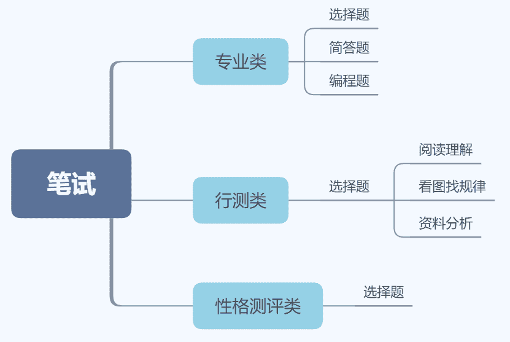
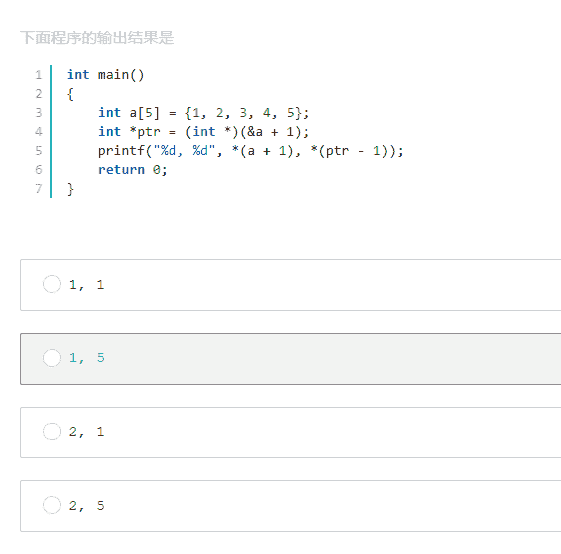
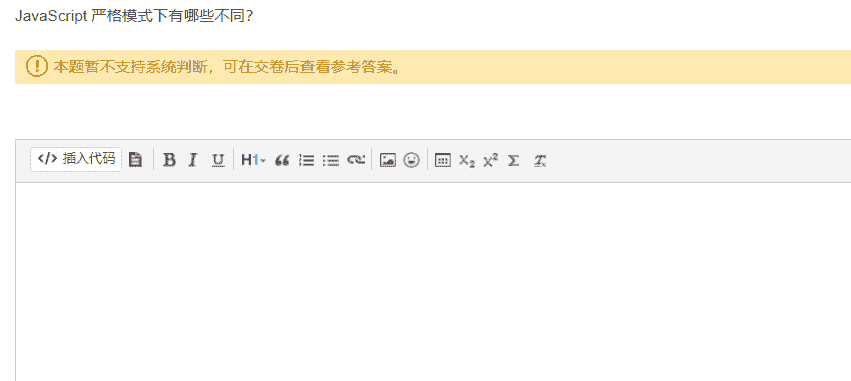
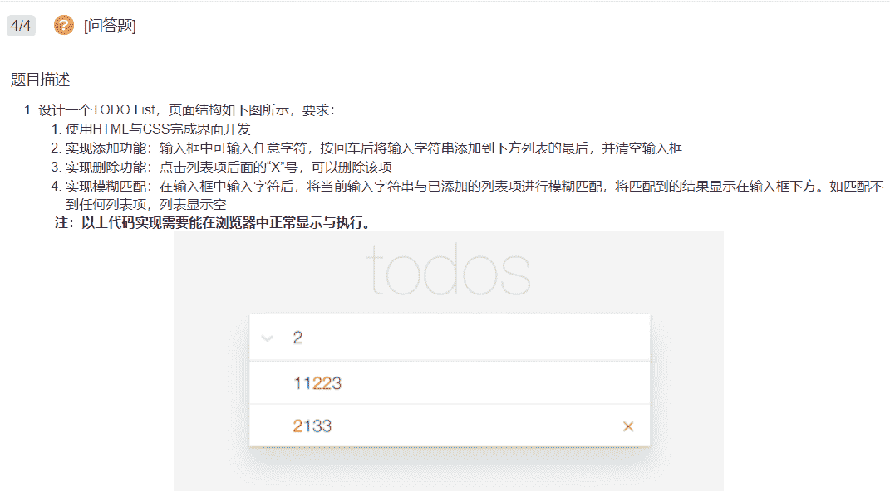
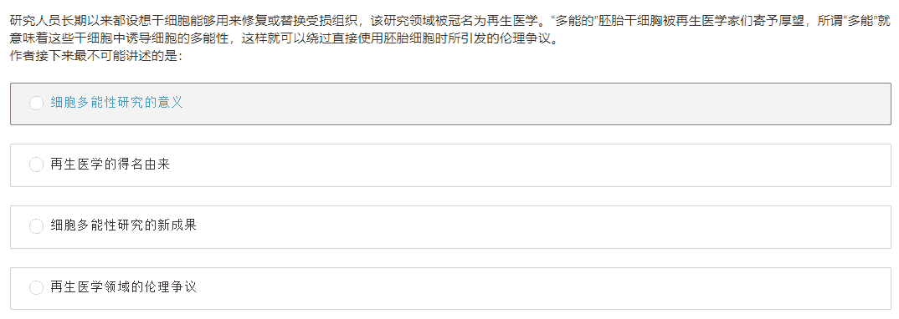
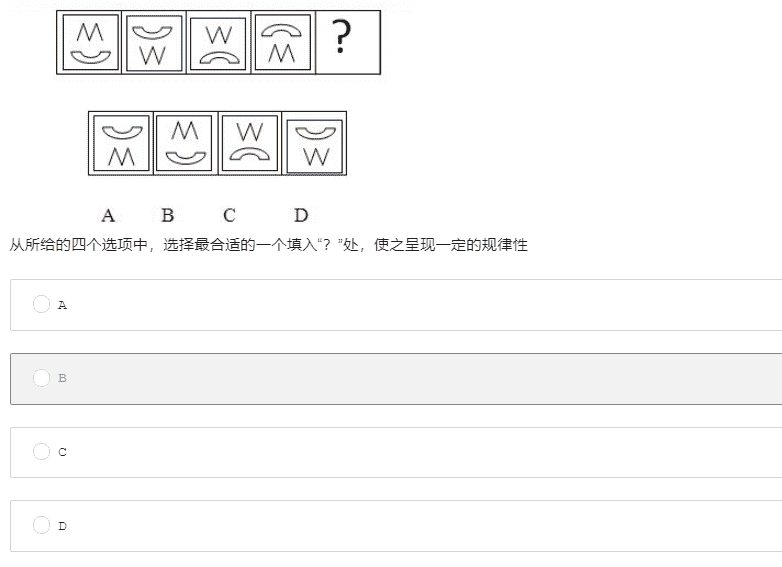
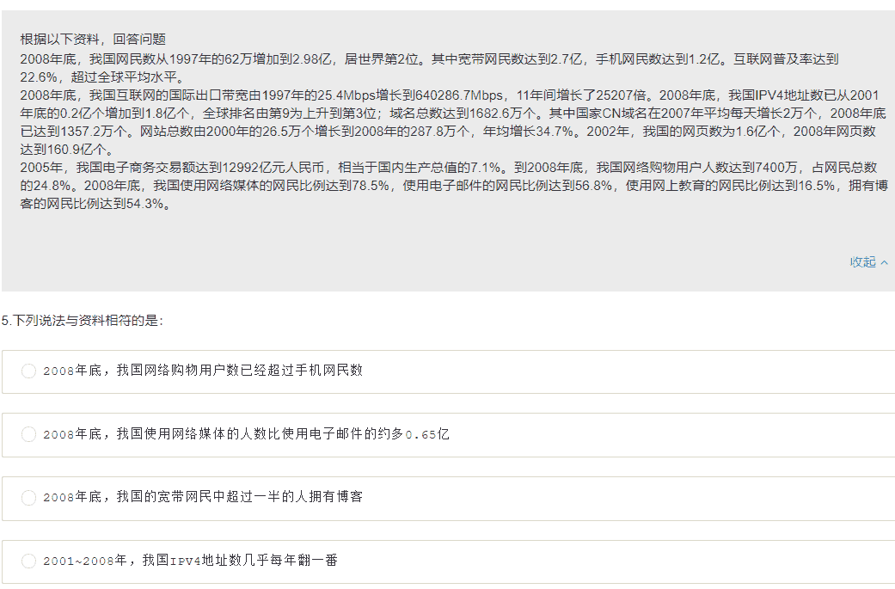

# 第四章 第 2 节 通过笔试

> 原文：[`www.nowcoder.com/tutorial/10061/fc80ac4aa3bc4e87b51c1c12ee46eb4f`](https://www.nowcoder.com/tutorial/10061/fc80ac4aa3bc4e87b51c1c12ee46eb4f)

        在准备笔试前，先了解下校招技术岗的笔试主要考什么以及考题类型，才能针对性展开准备。以下是校招中常见题型，将分专业类、行测类、性格测评三大类分别介绍。

# 1 专业类

        专业类笔试是对目标岗位相关专业知识的考核，一般分为选择题、问答题、编程题三大类。

## **1.1 选择题：**

        一般是 10~20 个单选题，0~10 个多选题。选择题所覆盖的知识范围非常广泛，一般考察一些比较琐碎的基础知识，前端岗 HTML、CSS、JS、ES6 是常考点。需要注意的是除了常规文字选择题以外，近两年“假选择题”的出现频率越来越高，“假选择题”则是伪装成选择题的代码题，如下面的例题所示，虽然是选择题，但是利用代码形式考核你对该知识的掌握情况，此类题目通常不能一眼就得出答案，需要通读代码，甚至需要经过大量的计算才能得出答案。

        由于考察范围过于广泛，且大多数公司考察随机性极大，故个人不建议进行提前针对性准备，建议采用“题海战术”，长时间坚持刷题，并对常见题型、错题进行总结，在牛客网-题库-[专项练习](https://www.nowcoder.com/intelligentTest?categories=0)-计算机专业技能中提供了各个岗位技术对应的选择题，可利用每天的零碎时间多刷、多看、多总结。

## **1.2 简答题：**

        按题目内容可分为客观题与主观题， 客观题是对一些有标准答案的知识点进行考核，如下面的例题所示，可理解为文字版的选择题，通常难度不大，得分情况完全取决你平时的知识积累程度。

        前端岗的主观题一般是设计题，没有标准答案，通常是直接给出功能需求，类似如下形式，简单程度的用 HTML+CSS+JS 就能实现，较难的则会涉及到前后端数据交互或者是各类动画效果的开发。但相较于编程题，这类题目通常是按功能点给分， 基本上写了就会给分。此类题目更多的是取决于你的实际开发经验足不足，需要具备在短时间内根据功能需求写代码的能力。

        相较于选择题，简答题的随机性过强，不适合额外花时间刷题，我建议是多积累+多记录，对于客观题，考点往往也是面试时的常考点，在平时的学习中打好基础，这类题目自然迎刃而解。对于主观题，多多增加开发经验的同时，遇到经典设计题，可记入笔记中，以供后期项目开发中使用。

## **1.3 编程题：**

        凡是技术岗笔试都会有编程题，这部分也是笔试中分数占比最大的部分，且是按通过率给分的，只有所有测试用例完全通过才会得满分，通常笔试中会从易到难有 3~5 道题目。对于开发岗的编程题，大部分考察的包括各类数据结构的实现及变换、十大排序算法、各类遍历算法、动态规划等等。值得注意的是，往往在笔试中，会用一长段文字，各种复杂语句扰乱你的解题思路，这就是为什么很多同学在笔试时，光题目就看了 10 分钟，还没看懂究竟在考什么。以动态规划为例，在笔试中有各类分糖果、爬阶梯各类形式，出法千奇百怪，但实则是相通的，能写出来的前提是你能很敏锐地察觉到考的是动态规划。考试时也不要被一长段题目吓到，除部分大厂题目难度较大以外，大部分公司的前 1、2 道题目还是偏基础程度较多。

        要想编程题拿分，除了踏踏实实的敲代码别无它法，只有持之以恒地每天刷题，才能提高代码能力，并且周期通常较长，往往今天刷的题，下周再看又不会了，所以建议养成定期复习的习惯，复习并不是又重新敲一遍，而是复盘解题思路。切记！刷题不是为了笔试中能遇到原题，而是培养敏锐地解题思路与提升编程能力。当你达到一定的题量时，你会发现拨开复杂的外壳，核心考点就那几大块。总结每类题目的异同点，在真正笔试时就能拿到较高的编程题分数。

        要想高效刷题，刷题平台很重要，牛客网-题库-[在线编程](https://www.nowcoder.com/activity/oj)里包含了校招中各类编程题，并进行详细地分区。如果你是新手，你可以从[剑指 offer](https://www.nowcoder.com/ta/coding-interviews)开始刷，其中的题目偏基础，且涵盖了大部分笔试面试常考编程题，这部分也是技术岗必须刷的题目，刷完基础题之后，可以刷一些[公司真题](https://www.nowcoder.com/activity/oj)和牛客网-[题霸原创](https://www.nowcoder.com/ta/job-code)。此外，还可以在牛客网-题库-[公司真题](https://www.nowcoder.com/contestRoom?categories=0)中刷各公司往年笔试题， 当公司真题刷得差不多时，可以定期参加[模拟笔试](https://www.nowcoder.com/mockexam/MockExam)，检验一段时间的刷题效果。

# 2 行测类

        此类题目源于国家公务员考试中的行政职业能力测试题，主要是客观性考核基本工作素质和能力。在校招笔试中一般对笔试结果影响占比较小，主要包含阅读理解、看图找规律、资料分析三种题型，每类题型约有 10~15 题，下面分别是这三类题目的经典例题。

        通常情况，公司会在题库中随机抽题，随机性极强，个人觉得不必额外花时间专门刷题，但在第一次笔试或重要公司笔试前，可以每个类型刷几道熟悉下题型，在牛客网-题库-[专项练习](https://www.nowcoder.com/intelligentTest)-通用能力中总结了大量行测真题。

        另外，结合个人校招笔试经历，总结了几点行测题小技巧：

*   做题环境很重要。行测题难度并不大，特别是阅读理解与资料分析题，往往答案就藏在题目中。相较于专业笔试，行测题和性格测评题一般考试时间不固定，故可以选一个较为安静的时间与环境，静下心来做题。

*   对于阅读理解与资料分析题，通常篇幅较长，但每题会设定 1 分钟左右时限，故更推荐先看选项，锁定选项中的关键词在题目中的位置，前后匹配该选项的其他词语。

*   资料分析题通常图表、数据类居多，选项大多是求出各类数据指定区间的变化趋势。若是图表类，同样通过选项锁定该数据在图表中的位置，可以利用其对应的颜色或斜率作对比。

*   看图找规律题大多是找不同或根据规律找下一个图形，可以利用各图中小图形的移动规律、或线面数量进行推导。

# 3 性格测评类

        通常，大多数同学都会轻视性格测评，都会觉得：“不就是选符合与不符合吗，随便选一下就好了，没什么影响”。但每年都会有同学因性格测评没做或成绩太差而失去面试机会的。

        性格测评一般有 100~150 道左右，大部分题都是选择”最符合“、”较符合“、”不符合“、”最不符合“，主要考察个人性格与处事风格。看似简单，其实每题的不同选项都是偏向于不同人物性格的，也可以理解为不同的“人设”，或许你比较诚实，或许你比较冲动，或许你比较有野心想成为领导者，或许你只想老老实实做个“打工人”，这也是公司开设性格测评类笔试的目的，提前测试你的性格类型，筛选一些极端个例。性格测评没有标准答案，基本上按自己的性格选就行，但需要注意的是，尽量不要选一头一尾，“最符合”与“最不符合”此类绝对性很强的选项，当你的大部分答案偏向性十分绝对时，就会更符对应的人格。对于公司来说，他们当然是更倾向于勤恳、老实、团结合作型个人，过于骄傲、独立性强、野心较大的员工自然不是他们想要的。